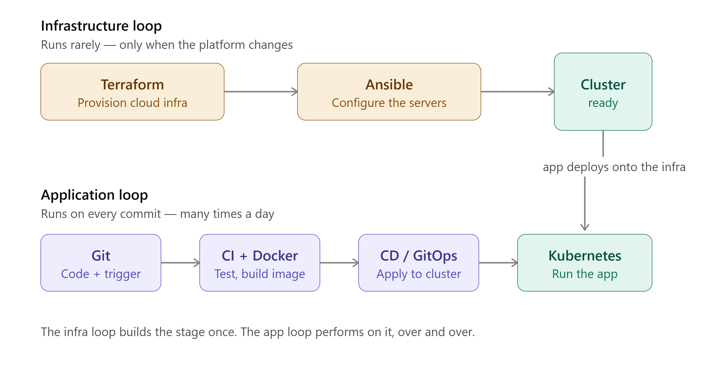

# The DevOps Engineer's Handbook

> **Learn DevOps from absolute zero to production- and interview-ready — free, self-paced, hands-on.**

---

## Ye kiske liye hai / Who this is for

This handbook is for you if:

- You are **switching careers** into DevOps, SRE, or Cloud Engineering and need a structured path, not a pile of scattered tutorials.
- You are a **developer** who deploys their own code and wants to stop being afraid of infrastructure.
- You are a **student or recent graduate** preparing for a first role that touches CI/CD, containers, or cloud.
- You have read blog posts and watched YouTube videos but still can't explain *why* the tools fit together — you want the **mental model**, not just the commands.

**Zero prior knowledge assumed.** The handbook starts from "what is a terminal, what is YAML, what is an HTTP request."

---

## Why this handbook is different

- **Systems thinking, not a tool tour.** The core insight — the "2 loops, 8 bridges, 5 golden threads" mental model — is introduced early and referenced throughout every chapter. Tools are taught as answers to specific engineering problems, not as items on a checklist.

- **Built to be remembered.** Each chapter ends with a recall gate. Quiz answers are hidden (expand to reveal). A ~190-card flashcard deck covers every key concept. A spaced-review schedule is built into the study plan.

- **Genuinely zero to one.** Part 0 starts with terminal basics, Git fundamentals, HTTP, and networking primitives before a single DevOps tool is installed.

- **Hands-on throughout.** Real labs, real configs, real production war-stories. Two full capstone projects take you from blank repo to a running, observable, production-grade system.

- **Outcome-oriented.** The handbook ends with resume bullets, a GitHub portfolio checklist, a 100+ question interview bank, and a job-ready self-audit.

- **Hinglish intuition callouts** 🇮🇳 — key concepts are reinforced with Hindi/Hinglish memory hooks (e.g. "Ansible ek dutiful peon hai — aap bolo, woh karo") so abstract ideas snap into place.

---

## The mental model — how all of DevOps fits together

*The two feedback loops (Build → Deploy → Observe → Fix) with the 8 bridges and 5 golden threads that tie every tool in the handbook to a single coherent picture.*

---

## 🆓 The free, no-credit-card path

Almost everything in this handbook runs **locally** using [`kind`](https://kind.sigs.k8s.io/) (Kubernetes-in-Docker). You do not need a cloud account to complete Parts 0–IV.

An AWS Free Tier account is only needed for the optional cloud capstone (`13-capstone-microshop.md`) — and even there, costs are negligible if you tear down resources promptly. **Nobody is blocked by cost.**

---

## Curriculum at a glance

| Part | Chapter | Topic |
|------|---------|-------|
| **0 — Pre-flight** | [00a — Terminal, YAML, Git, HTTP, Networking](DevOps-Handbook/00a-preflight.md) | Prerequisites zero |
| | [00b — Toolchain & AWS account setup](DevOps-Handbook/00b-setup-runbook.md) | Install everything once |
| **I — Core toolchain** | [01 — M0 Foundations](DevOps-Handbook/01-M0-foundations.md) | Linux, shell, SSH, bash scripting |
| | [02 — M1 Terraform](DevOps-Handbook/02-M1-terraform.md) | Infrastructure as Code |
| | [03 — M2 Ansible](DevOps-Handbook/03-M2-ansible.md) | Configuration management |
| | [04 — M3 Docker](DevOps-Handbook/04-M3-docker.md) | Containers from scratch |
| | [05 — M4 Kubernetes Core](DevOps-Handbook/05-M4-kubernetes-core.md) | Orchestration fundamentals |
| | [06 — M5 Sizing & Cost](DevOps-Handbook/06-M5-sizing-and-cost.md) | Right-sizing, FinOps basics |
| | [07 — M6 CI/CD](DevOps-Handbook/07-M6-cicd.md) | Pipelines, GitHub Actions, ArgoCD |
| | [08 — M7 GitOps](DevOps-Handbook/08-M7-gitops.md) | GitOps patterns and workflows |
| **II — Systems thinking** | [09 — The connected system](DevOps-Handbook/09-connected-system.md) | 2 loops · 8 bridges · 5 golden threads |
| **III — Operate** | [10 — M8 Observability & SRE](DevOps-Handbook/10-M8-observability-sre.md) | Metrics, logs, traces, SLOs |
| | [11 — M9 Advanced K8s internals](DevOps-Handbook/11-M9-advanced-k8s-internals.md) | Control plane deep dive |
| **IV — Capstones** | [12 — Capstone: URL Shortener](DevOps-Handbook/12-capstone-url-shortener.md) | End-to-end solo project |
| | [13 — Capstone: MicroShop](DevOps-Handbook/13-capstone-microshop.md) | Microservices on cloud |
| **V — Reference & outcome** | [14 — Interview bank](DevOps-Handbook/14-interview-bank.md) | 100+ real interview questions |
| | [15 — Roadmap M11–M18](DevOps-Handbook/15-roadmap-M11-M18.md) | What comes after this handbook |
| | [16 — Reference appendix](DevOps-Handbook/16-reference-appendix.md) | Cheat sheets, quick references |
| | [17 — Flashcards](DevOps-Handbook/17-flashcards.md) | ~190-card recall deck |
| | [18 — Career & job-ready](DevOps-Handbook/18-career-job-ready.md) | Resume, portfolio, job checklist |
| **Index** | [00-INDEX — Full spine](DevOps-Handbook/00-INDEX.md) | Chapter map and reading order |

---

## How to use it

The handbook supports three modes — use all three, in rotation:

| Mode | What you do | Where |
|------|-------------|-------|
| **Understand** | Read the chapter, follow the lab, understand the *why* | Chapter files |
| **Recall** | Hit the recall gates and quiz yourself without looking | End of each chapter |
| **Interview** | Work through the interview bank cold, then review gaps | [`14-interview-bank.md`](DevOps-Handbook/14-interview-bank.md) |

> **Spaced review matters.** After finishing each chapter, schedule a short review session 1 day later, then 1 week later. The flashcard deck in [`17-flashcards.md`](DevOps-Handbook/17-flashcards.md) is built for exactly this.

**Time estimates:**

- **~12 weeks part-time** (1–2 hours/day, working professional pace)
- **~6 weeks full-time** (dedicated study sprint)

Both schedules are laid out week by week in [`STUDY-PLAN.md`](STUDY-PLAN.md). Track your chapter completions in [`PROGRESS.md`](PROGRESS.md).

---

## ▶ Start here

**New to the terminal, Git, or cloud?**
→ Begin at [`DevOps-Handbook/00a-preflight.md`](DevOps-Handbook/00a-preflight.md) — it covers everything you need before touching any DevOps tool.

**Already comfortable with Linux, Git, and basic networking?**
→ Skim the [`DevOps-Handbook/00-INDEX.md`](DevOps-Handbook/00-INDEX.md) spine to orient yourself, then jump to [`DevOps-Handbook/01-M0-foundations.md`](DevOps-Handbook/01-M0-foundations.md).

**Just want to browse and decide?**
→ Read [`09-connected-system.md`](DevOps-Handbook/09-connected-system.md) — if that chapter's mental model resonates, you will enjoy the rest.

---

## What you'll be able to do by the end

By the time you finish this handbook you will be able to:

- **Draw the whole stack** — explain how code travels from a developer's laptop through CI, containers, Kubernetes, and into production, and where observability fits in.
- **Deploy a real application end-to-end** — from Dockerfile to Helm chart to ArgoCD GitOps pipeline to a live, observable service.
- **Debug production incidents** — use metrics, logs, and traces together; formulate an SLO; run a blameless post-mortem.
- **Answer interviews confidently** — across Terraform, Docker, Kubernetes, CI/CD, observability, and systems design.
- **Present a GitHub portfolio** — two capstone projects with real commits, real pipelines, and real README write-ups.

→ Full job-ready checklist: [`DevOps-Handbook/18-career-job-ready.md`](DevOps-Handbook/18-career-job-ready.md)

---

## Provenance & license

This handbook was consolidated from approximately 20 personal study documents, lab notes, and interview-prep notes accumulated over an extended learning journey — all preserved in [`_source-archive/`](_source-archive/) for reference.

It is published here in the hope that it saves the next learner weeks of hunting for the right mental model.

**License:** [Creative Commons Attribution 4.0 International (CC BY 4.0)](LICENSE) — free to use, share, and adapt with attribution.

**Contributions welcome.** Found a typo, a broken lab, or a concept that could be clearer? Open an issue or a PR. The handbook improves with every pair of eyes.
