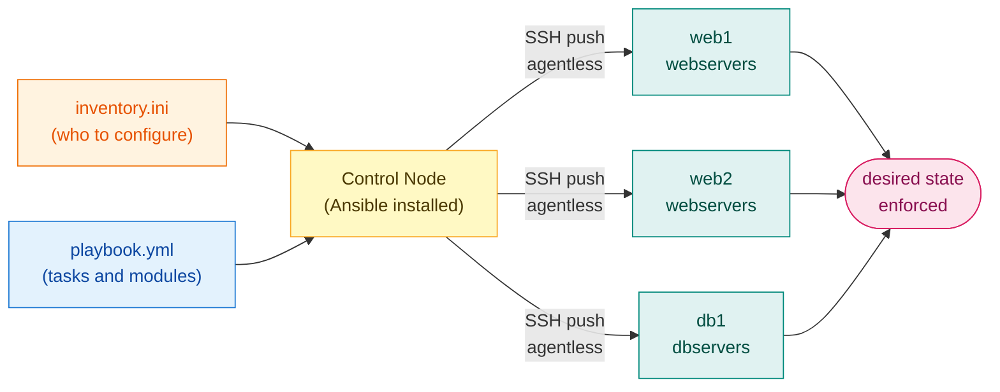
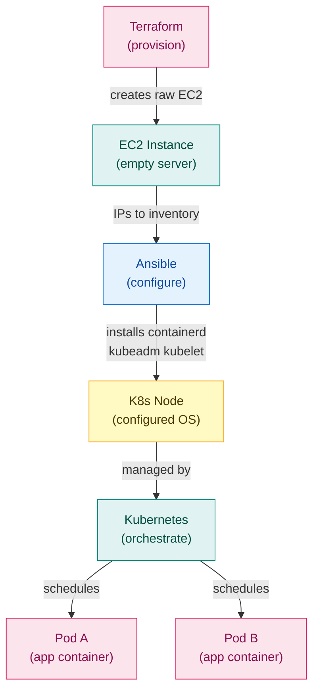
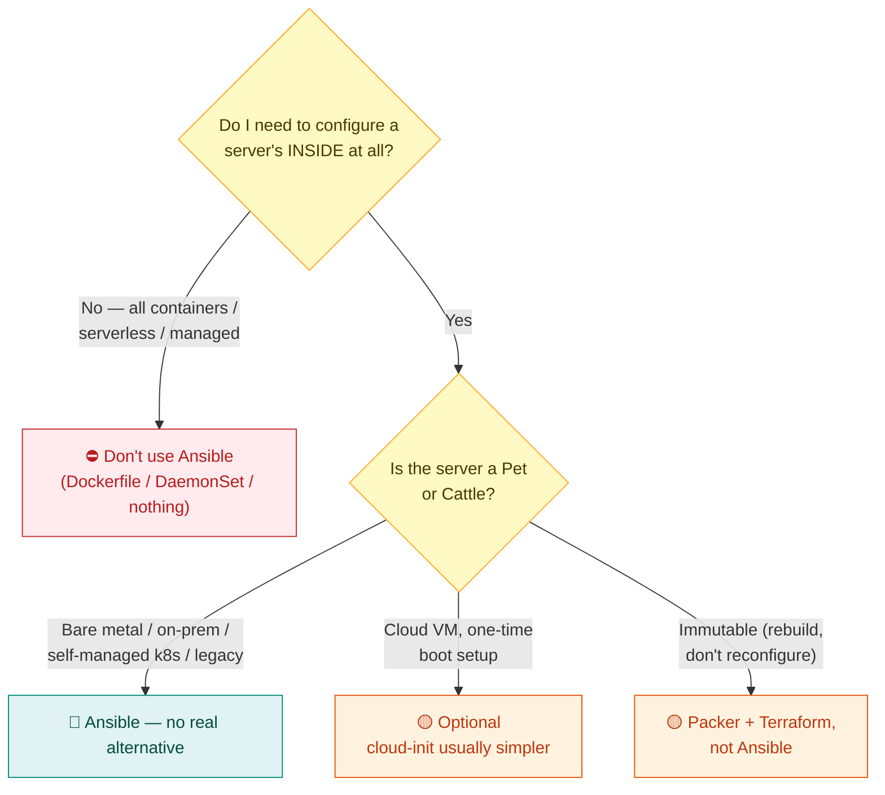

# M2 — Ansible & Configuration Management

> **Core question:** Terraform gave you empty servers — how do you turn them into identical, configured machines without touching any of them by hand?

> **⏱️ Time:** ~50 min padho + 20 min lab · **🎚️ Level:** Intermediate · **📋 Pehle chahiye:** [M0](01-M0-foundations.md), [M1](02-M1-terraform.md)
>
> **Is module ke baad tum kar paoge:**
> - Ansible inventory aur annotated playbook likhna — modules, handlers, Jinja2 templates sahi jagah lagana
> - Idempotency prove karna: pehle run mein `changed`, doosre run mein `changed=0` dikhana
> - Kubernetes cluster bootstrap karna teen ordered playbooks se (common → master → workers)

> ### ↩️ Recall gate — shuru karne se pehle
> Pichhle modules se 3 sawaal. **Pehle memory se jawab do, phir kholo.** (Yeh retrieve karna hi lifetime yaad rakhta hai — dobara padhna nahi.)
>
> 1. *(M1)* Terraform mein "idempotent apply" ka kya matlab hai? `count = 3` wala code 5 baar apply karo — kitne servers honge, aur kyun?
> 2. *(M0)* "Provisioning" aur "configuration management" alag layers kyun hain? Har ek ka ek real tool name karo.
> 3. *(M1)* `tfstate` file laptop pe kyun nahi rakhna chahiye — remote S3 mein kyun store karte hain?
>
> <details markdown="1"><summary>Jawab</summary>
>
> 1. Idempotent apply = SET operation (desired = 3), ADD nahi. 5 baar apply karo — sirf 3 servers. Terraform desired state se compare karta, duplicates kabhi nahi banata. &nbsp; 2. Provisioning = raw machine banana (Terraform EC2 spin up karta); configuration = uss machine ke andar software daalna (Ansible nginx install karta). Alag concerns, alag tools — mix mat karo. &nbsp; 3. Laptop pe sirf aapke paas — teammate ka TF andha ho jaata, zero resources sochta, duplicates banata. Plus simultaneous apply se state corrupt. S3 = shared almari; DynamoDB lock = taala, ek waqt mein ek hi likhе.
> </details>

**MODULE MAP:** [00-INDEX](00-INDEX.md) · [01-M0-foundations](01-M0-foundations.md) · [02-M1-terraform](02-M1-terraform.md) · **03-M2-ansible** · [04-M3-docker](04-M3-docker.md) · [05-M4-kubernetes-core](05-M4-kubernetes-core.md) · [06-M5-sizing-and-cost](06-M5-sizing-and-cost.md) · [07-M6-cicd](07-M6-cicd.md) · [08-M7-gitops](08-M7-gitops.md) · [09-connected-system](09-connected-system.md) · [10-M8-observability-sre](10-M8-observability-sre.md) · [11-M9-advanced-k8s-internals](11-M9-advanced-k8s-internals.md) · [12-capstone-url-shortener](12-capstone-url-shortener.md) · [13-capstone-microshop](13-capstone-microshop.md) · [14-interview-bank](14-interview-bank.md) · [15-roadmap-M11-M18](15-roadmap-M11-M18.md) · [16-reference-appendix](16-reference-appendix.md)

---

## The 60-second version

Ansible is a **configuration management** tool. You write YAML (YAML Ain't Markup Language) that describes what each server should look like — packages installed, files in place, services running. Ansible reads that YAML, SSHs into every target server, and enforces the described state. If something is already correct, it skips it. If it is wrong or missing, it fixes it. Run it a hundred times; the result is the same every time.

Three properties define it:

| Property | What it means |
|---|---|
| **Agentless** | Nothing is installed on target servers. Ansible connects over SSH (Secure Shell) using Python, which is already present on every Linux machine. |
| **Push model** | The control node pushes instructions out to managed nodes when you run a command — targets do not phone home on a schedule. |
| **Idempotent** | Describes desired end-state, not a sequence of commands. Running the same playbook twice leaves the system in the same final state. |

Handoff from M1: Terraform outputs the IP addresses of your raw EC2 instances. You put those IPs into an Ansible **inventory** file. Ansible then configures what is *inside* those servers. See [02-M1-terraform](02-M1-terraform.md) for the Terraform side.

---

## Why this exists / what it replaced

Before configuration management, the standard workflow was: SSH into each server, run commands by hand, hope you remembered the right flags, document nothing. This produced **snowflake servers** — each one slightly different from the others, because each one was configured by a different person on a different day with slightly different commands.

Problems with hand-SSHing:

- **Drift** — two servers configured a month apart diverge silently. When one breaks, nobody knows why the other works.
- **Bus factor** — the engineer who knows "the exact sequence" leaves the company, and nobody can rebuild the setup.
- **No repeatability** — spinning up a new server for disaster recovery requires days of detective work.
- **No auditability** — there is no record of what was done, when, or by whom.

Ansible solves this by making server configuration **code** — committed to Git, peer-reviewed, executed consistently, and self-documenting.

**Ansible vs Terraform — the canonical confusion:**

| Question | Terraform | Ansible |
|---|---|---|
| What does it manage? | Cloud resources (servers, networks, databases as *objects*) | What is *inside* a running server |
| Analogy | Builds the house | Furnishes and wires the house |
| Primary verb | Provision / destroy | Configure / converge |
| State file? | Yes — `tfstate` tracks resource IDs | No persistent state file; queries live system |
| When to run? | When infra topology changes | When server config changes, or to enforce drift |

They are complementary. Terraform creates the empty EC2 instance. Ansible installs containerd, kubeadm, and configures the kernel — turning raw compute into a Kubernetes node.

---

## Agentless and the push model

**Agentless** means there is no daemon running on managed nodes waiting to receive instructions. Puppet and Chef — older configuration management tools — require you to install an agent on every server before you can manage it. That agent runs continuously, consuming resources and requiring its own lifecycle management (upgrades, certificates, crashes).

Ansible's approach: connect over SSH when work needs to be done, execute Python modules, disconnect. The server retains no trace of Ansible when the playbook finishes.

🇮🇳 **Hinglish intuition:** Plumber har ghar SSH se jaata — kaam karta, nikal jaata. Har ghar mein apni copy nahi chhodta. Agent-based tools = har ghar mein permanent chowkidar (maintain, upgrade, feed karo).

**What the target server actually needs:** SSH access + Python 3 (installed by default on Ubuntu, Debian, RHEL, Amazon Linux). That is the entire prerequisite.

**Push model** (Golden Thread 4 — see [09-connected-system](09-connected-system.md)):

```
PUSH (Ansible)                    PULL (Argo CD / Puppet agent)
─────────────────────────────     ──────────────────────────────
You run:                          Target polls on its own schedule:
  ansible-playbook site.yml         "Is there new config for me?"
        │                                       │
        ▼ SSH                                   ▼ HTTPS to server/Git
  Managed nodes receive it          Config pulled and applied
  immediately                       on agent's timer
```

Push gives you on-demand execution and full control of timing. Pull gives continuous enforcement without human intervention. Ansible is push. Argo CD (M7) is pull. They are not competing — they solve different layers of the same problem.

**Bastion / jump host:** In a secure architecture, managed nodes live in private subnets with no direct internet access. A **bastion server** (also called a jump host) sits in the public subnet and acts as the single entry point. Ansible reaches private nodes by proxying through the bastion:

```ini
[all:vars]
ansible_ssh_common_args='-o ProxyJump=ubuntu@<BASTION_IP>'
```

🇮🇳 **Hinglish intuition:** Bastion = society ka main gate. Directly private flat pe nahi ja sakte — pehle gate se, phir flat.

---

## Building blocks



*Ansible pushes config via SSH from a single control node; inventory names who to configure, playbook defines the tasks and modules to run.*

```
                 ┌─────────────────────────────────────────────────────┐
                 │              CONTROL NODE                           │
                 │   (your laptop / CI runner — Ansible installed here) │
                 │                                                     │
                 │  inventory.ini  ─────► which hosts, which groups    │
                 │  site.yml       ─────► what to do on each group     │
                 │  roles/         ─────► reusable bundles of tasks    │
                 └──────────────┬──────────────────────────────────────┘
                                │ SSH (port 22) — push
              ┌─────────────────┼────────────────────┐
              ▼                 ▼                    ▼
    ┌──────────────┐  ┌──────────────┐   ┌──────────────┐
    │  web1        │  │  web2        │   │  db1         │
    │ [webservers] │  │ [webservers] │   │ [dbservers]  │
    │ SSH + Python │  │ SSH + Python │   │ SSH + Python │
    └──────────────┘  └──────────────┘   └──────────────┘
         MANAGED NODES — nothing else required
```

| Building block | What it is | One-liner |
|---|---|---|
| **Control node** | Machine running Ansible | Your laptop or CI runner |
| **Managed node** | Target server being configured | Needs only SSH + Python |
| **Inventory** | List of managed nodes, optionally grouped | "Who to configure" |
| **Playbook** | YAML file containing plays | "What to configure" |
| **Play** | Maps a host group to a list of tasks | One intent, one group |
| **Task** | A single call to one module | One unit of work |
| **Module** | Idempotent unit of work (`apt`, `copy`, `service`) | The actual tool |
| **Role** | Reusable bundle of tasks, templates, handlers, variables | Packaged playbook logic |
| **Handler** | Task that fires only when notified of a change | Conditional side-effect |
| **Jinja2 template** | `.j2` file with `{{ variable }}` placeholders | Dynamic config generation |

### Inventory (INI format)

INI stands for Initialization — a simple flat text format using `[section]` headers.

```ini
[webservers]
web1 ansible_host=10.0.1.10
web2 ansible_host=10.0.1.11

[dbservers]
db1 ansible_host=10.0.2.10

[all:vars]
ansible_user=ubuntu
ansible_ssh_private_key_file=~/.ssh/id_rsa
```

### Annotated playbook — install and configure nginx

```yaml
---
# A "play" begins here — maps hosts to tasks
- name: Configure web servers
  hosts: webservers          # targets the [webservers] group in inventory
  become: yes                # escalate privileges — equivalent to sudo

  vars:
    app_port: 3000           # Jinja2 variable; referenced as {{ app_port }} in templates

  tasks:

    - name: Install nginx
      apt:                   # MODULE: apt — manages packages on Debian/Ubuntu
        name: nginx
        state: present       # desired end-state: "nginx must be installed"
                             # Ansible checks first; skips if already present

    - name: Deploy nginx config from template
      template:              # MODULE: template — renders a .j2 file with variables
        src: nginx.conf.j2   # source on control node
        dest: /etc/nginx/nginx.conf
      notify: Restart nginx  # HANDLER trigger — fires only if this task reports 'changed'

    - name: Ensure nginx is running and enabled on boot
      service:               # MODULE: service — manages systemd/init services
        name: nginx
        state: started       # desired state: must be running
        enabled: yes         # must survive reboots

  handlers:
    # Handlers flush ONCE at the end of each PLAY (not the whole playbook), only if notified.
    # Use `meta: flush_handlers` as a task to force them to fire mid-play.
    - name: Restart nginx
      service:
        name: nginx
        state: restarted     # only reaches here if the template task changed the file
```

🇮🇳 **Hinglish intuition:** Handler = bell jo sirf `changed` pe bajti hai. Config same rahi? Notify nahi gaya, restart nahi hua, downtime nahi hua. Config badli? Bell baji, restart ek baar, done. Bina handler ke har run pe restart = needless downtime.

### `loop:` — one task, many items

Copy-pasting a task five times is the beginner tell. `loop:` runs one task once per item, and each iteration reports its own `ok`/`changed`:

```yaml
- name: Install base packages
  apt:
    name: "{{ item }}"        # `item` = the current loop value
    state: present
  loop: [git, curl, vim, htop, jq]

- name: Create app users
  user:
    name: "{{ item.name }}"
    groups: "{{ item.groups }}"
  loop:                        # list of dicts — item.name, item.groups
    - { name: deploy, groups: docker }
    - { name: monitor, groups: adm }

- name: Push config files
  template:
    src: "{{ item }}.j2"
    dest: "/etc/app/{{ item }}"
  loop: "{{ config_files }}"   # loop over a variable
  notify: Restart app
```

!!! tip "Loop vs the module's own list — a real performance trap"
    Package modules already accept a list, and that is **much** faster:

    ```yaml
    # ✅ ONE apt transaction — fast
    - apt: name={{ ['git','curl','vim'] }} state=present

    # ❌ THREE apt transactions — 3× the lock/dep-resolve work
    - apt: name={{ item }} state=present
      loop: [git, curl, vim]
    ```
    Rule: if the module takes a list, pass a list. Use `loop:` when the module takes **one** thing per call (`user`, `template`, `copy`).

> 📎 `with_items:` is the old spelling of the same idea. You will meet it in existing playbooks; write `loop:` in new ones.

### `when:` — run a task only if it applies

`when:` takes a bare Jinja expression (**no `{{ }}`**) and skips the task when it is false — the task reports `skipped`, not `changed`:

```yaml
- name: Install nginx (Debian family)
  apt: name=nginx state=present
  when: ansible_facts['os_family'] == "Debian"

- name: Install nginx (RedHat family)
  yum: name=nginx state=present
  when: ansible_facts['os_family'] == "RedHat"

- name: Open the kubelet port on workers only
  ufw: rule=allow port=10250
  when: "'workers' in group_names"      # group_names = this host's groups

- name: Drain the node before upgrading
  command: kubectl drain {{ inventory_hostname }} --ignore-daemonsets
  when:
    - upgrade_enabled | bool             # a list of conditions = AND
    - inventory_hostname != 'master-1'
```

Combine with a registered result to make decisions from the host's real state:

```yaml
- name: Check if the cluster is already initialised
  stat:
    path: /etc/kubernetes/admin.conf
  register: kubeadm_done

- name: kubeadm init
  command: kubeadm init --pod-network-cidr=10.244.0.0/16
  when: not kubeadm_done.stat.exists    # ← this is what makes it idempotent
```

That last pattern is exactly how the [kubeadm playbook](#real-production-example-building-a-kubernetes-cluster-with-ansible) below stays safe to re-run: `when:` is how you guard a `command:`/`shell:` task that has no idempotency of its own.

> 🇮🇳 **Hinglish intuition:** `loop:` = "yeh kaam har item pe karo" (ek task, kai baar). `when:` = "yeh kaam **karna bhi hai ya nahi**?" (task chalega ya skip). Dono saath: `loop` decide karta hai *kitni baar*, `when` decide karta hai *bilkul chalega ya nahi* — aur `when` ko `loop` ke andar har item pe alag se evaluate kiya jaata hai.

### Role structure (from `ansible-galaxy init myrole`)

```
myrole/
  tasks/main.yml        # the task list
  handlers/main.yml     # handlers
  templates/            # .j2 templates
  vars/main.yml         # role-scoped variables
  defaults/main.yml     # overridable defaults
  files/                # static files to copy
  meta/main.yml         # role dependencies
```

Roles are how you share and reuse Ansible logic — publish to Ansible Galaxy (the community registry) or keep internal. The capstone uses three flat playbooks instead of roles, which is fine for learning; roles become essential when you are managing dozens of services.

---

## Idempotency, the Ansible way

**Idempotency** means: running the operation multiple times produces the same result as running it once. This is not about speed — it is about safety and predictability.

> 🔮 **Predict pehle (socho, phir aage padho):** Playbook pehli baar chalao: 6 changed. Bilkul wahi playbook doosri baar chalao — kitne changed honge, aur kyun?

### ok vs changed

When Ansible runs a task, it reports one of two outcomes:

| Outcome | Meaning | What Ansible did |
|---|---|---|
| `ok` | System was already in the desired state | Checked, found correct, did nothing |
| `changed` | System was not in the desired state | Made a change to bring it to desired state |

A healthy second run looks like this:

```
PLAY RECAP ─────────────────────────────────────────────────────────
web1   : ok=5   changed=0   unreachable=0   failed=0
```

Zero `changed` on the second run is called **convergence** — the system has converged to the desired state and no further action is needed. This is the proof you want to show in an interview.

### Module vs shell — why it matters

```
MODULE (apt: state=present)        SHELL (shell: apt-get install nginx)
──────────────────────────         ────────────────────────────────────
1. Query: is nginx installed?       1. Run the command blindly
2. If yes → ok (skip)              2. apt-get runs regardless
3. If no  → install → changed       Every run = re-executed
                                    Side-effects accumulate:
                                      echo "config" >> /etc/app.conf
                                      → appends EVERY run → corruption
```

🇮🇳 **Hinglish intuition:** Module = smart check-then-act. Shell = andha — har baar chalata, side effects build up karte hain. `echo >> file` = har run pe hello aur hello aur hello. Shell ka use karo jab koi module nahi — aur tab `creates:` ya `when:` se guard karo.

### --check: Ansible's plan mode

```bash
ansible-playbook -i inventory.ini site.yml --check
```

`--check` is a dry run — Ansible evaluates what *would* change without making any actual change. It is Ansible's equivalent of `terraform plan` (see [02-M1-terraform](02-M1-terraform.md)). Add `--diff` to see line-by-line file diffs. Always run `--check` before applying a playbook to an unfamiliar environment.

### `serial:` — roll across hosts safely

By default, Ansible runs every task in a play on **all** hosts in parallel. A bad change hits every server simultaneously — the entire fleet fails at once.

```yaml
- hosts: webservers
  serial: 1          # update this many hosts at a time (also accepts "25%")
  tasks: [ ... ]
```

`serial: 1` processes one host at a time. `serial: "25%"` batches 25% of the inventory per wave. Ansible completes all tasks on the first batch, reports the result, then moves to the next batch. If a task fails on the first host, Ansible stops — the remaining hosts are untouched.

This is the same **blast-radius** thinking as Kubernetes rolling updates (see [05-M4-kubernetes-core.md](05-M4-kubernetes-core.md)): never update the entire fleet at once; limit how much is at risk at any moment. In Kubernetes, `maxUnavailable` and `maxSurge` control the rolling window; in Ansible, `serial:` does the same job at the SSH layer.

Practical pattern: use `serial: 1` for sensitive changes (config rewrites, service restarts, kernel upgrades); use `serial: "25%"` for routine package updates across a large fleet where speed matters and risk is lower.

> 🇮🇳 **Hinglish intuition:** `serial: 1` = ek ek server update karo — pehla fail hua toh baaki fleet safe hai. Sab ek saath update = ek galti se poora fleet down. Kubernetes rolling update wala same idea, Ansible mein SSH level pe.

---

## Real production example: building a Kubernetes cluster with Ansible

This is the exact sequence used in the capstone (see [12-capstone-url-shortener](12-capstone-url-shortener.md)). Terraform outputs three raw EC2 IPs; Ansible turns them into a functioning Kubernetes cluster.

```
TERRAFORM OUTPUT                  ANSIBLE EXECUTION ORDER
─────────────────────             ──────────────────────────────────────────
master_ip  = 10.0.1.10     ──►   1-common.yml  (runs on ALL nodes)
worker_ips = [10.0.1.11,          ├── swapoff -a
              10.0.1.12]   ──►   ├── kernel modules: overlay, br_netfilter
                                  ├── sysctl for pod networking
                                  ├── apt install containerd
                                  ├── containerd config (SystemdCgroup=true)
                                  └── apt install kubelet kubeadm kubectl
                                           │
                                           ▼
                                  2-master.yml  (runs on master ONLY)
                                  ├── kubeadm init (creates: /etc/kubernetes/admin.conf)
                                  ├── setup kubeconfig for ubuntu user
                                  ├── kubectl apply Calico CNI
                                  └── kubeadm token create → save join.sh locally
                                           │
                                           ▼
                                  3-workers.yml  (runs on workers ONLY)
                                  ├── copy join.sh to /tmp/join.sh
                                  └── bash /tmp/join.sh (creates: /etc/kubernetes/kubelet.conf)
                                           │
                                           ▼
                                  kubectl get nodes → 3 nodes Ready
                                  Kubernetes cluster handed to M4
```



*The four-layer DevOps stack: Terraform provisions the raw server, Ansible configures the OS and runtime, Kubernetes orchestrates the pods.*

**CNI** stands for Container Network Interface — the plugin that enables pod-to-pod networking across nodes. Calico is one popular CNI implementation.

**Key idempotency guard:** Notice `args: { creates: /etc/kubernetes/admin.conf }` on the `kubeadm init` task. This tells Ansible: if that file already exists, skip the task entirely. Without this guard, re-running the playbook would attempt a second `kubeadm init` and fail. This is the correct pattern when using `shell:` — you must give Ansible a way to detect whether the work was already done.

**Inventory fed by Terraform outputs:**

```ini
[master]
master ansible_host=<MASTER_IP>

[workers]
w0 ansible_host=<WORKER0_IP>
w1 ansible_host=<WORKER1_IP>

[all:vars]
ansible_user=ubuntu
ansible_ssh_private_key_file=~/.ssh/urlshort
ansible_ssh_common_args='-o StrictHostKeyChecking=no'
```

The three-playbook structure (common → master → workers) is not arbitrary. It reflects a real dependency chain: you cannot run `kubeadm init` until containerd is running, and workers cannot join until the master has generated a join token. Ordering the playbooks enforces these dependencies.

> 🔧 **War story:** Worker node playbook chala, `kubeadm join` hung karta raha — phir timeout. Root cause: inventory mein public IP thi, par worker nodes sirf private subnet se master ko reach kar sakte the; public IP pe koi port open hi nahi tha. Poori kahani + lesson → [Interview Bank](14-interview-bank.md).

Cross-link: the cluster this builds is what [05-M4-kubernetes-core](05-M4-kubernetes-core.md) manages and what [12-capstone-url-shortener](12-capstone-url-shortener.md) deploys onto. The full pipeline is described in [09-connected-system](09-connected-system.md).

---

## When NOT to reach for Ansible

This is where senior engineers distinguish themselves from juniors who reach for the same tool regardless of context.

**Managed services remove the host entirely:**
- EKS (Elastic Kubernetes Service) — AWS manages the control plane. There is no master EC2 to SSH into, no kubeadm to run.
- RDS (Relational Database Service) — the database server is fully managed. You do not install PostgreSQL; you just connect to an endpoint.
- Lambda — no server at all. Configuration is the function code and IAM policy.

In these environments, Ansible's job evaporates. The "configuration" is expressed through cloud API calls (Terraform) or baked into container images (Docker).

**Mutable vs immutable infrastructure:**

| Approach | Pattern | Ansible's role |
|---|---|---|
| **Mutable** | Run servers long-term; patch and reconfigure them in place | Central — Ansible applies config changes to live servers |
| **Immutable** | Config baked into AMI or container image at build time; replace rather than patch | Build-time only — Ansible runs during image bake, not at runtime |

In a fully immutable stack (Docker images deployed to EKS), Ansible survives for:
- Configuring the bastion host and jump boxes (not containerized)
- Running DB migrations before a deploy (one-off ops)
- Managing on-premises or bare-metal nodes
- Emergency one-off tasks against a fleet (`ansible all -m shell -a "..." `)

🇮🇳 **Hinglish intuition:** Jab AWS managed services use karo (EKS + RDS), Ansible ki role sihrk jaati hai. Jo kaam Ansible karta tha (containerd install, kubeadm setup), wo ya image mein bake ho jaata ya Terraform ke API calls se ho jaata. Senior engineer tab hi Ansible laata jab actual SSH-able server ho.

The honest answer in an interview: "In a self-managed Kubernetes cluster, Ansible is the critical piece that bootstraps the control plane. In a fully managed EKS environment, I would use Ansible only for bastion configuration and operational tasks — not for cluster setup."

---

## Commands, explained

```bash
# Test connectivity before running any playbook
ansible all -i inventory.ini -m ping
# Why: confirms SSH + Python work on every host; catches key/permission
# problems before wasting time on a 10-minute playbook run.

# Ad-hoc: install a package on all web servers without a playbook
ansible webservers -i inventory.ini -m apt -a "name=htop state=present" --become
# Why: useful for quick one-off commands across a fleet; modules keep it idempotent.

# Dry run — see what WOULD change without changing anything
ansible-playbook -i inventory.ini site.yml --check --diff
# Why: review before touching production; --diff shows file-level line changes.

# Run the playbook for real
ansible-playbook -i inventory.ini site.yml
# Why: this is the standard apply command.

# Limit execution to one host
ansible-playbook -i inventory.ini site.yml --limit web1
# Why: test a change on one node before rolling to the fleet.

# Run only tasks tagged 'config' — skip untagged tasks
ansible-playbook -i inventory.ini site.yml --tags "config"
# Why: large playbooks can take 10+ minutes; tags let you run one section.

# Verbose output — print SSH commands and module output
ansible-playbook -i inventory.ini site.yml -vvv
# Why: debugging connection problems, module failures, or unexpected 'ok' results.

# Scaffold a new role
ansible-galaxy init myrole
# Why: creates the standard directory structure so you do not invent it each time.

# Encrypt a secrets file with AES-256
ansible-vault encrypt secrets.yml
# Why: never store API keys or passwords in plaintext in a repo.

# Edit an encrypted file in your $EDITOR
ansible-vault edit secrets.yml

# Run a playbook that references vault-encrypted variables
ansible-playbook -i inventory.ini site.yml --ask-vault-pass
# Why: vault password is supplied at runtime, never committed.
```

---

## Beginner mistakes vs senior insights

| Topic | Beginner mistake | Senior insight |
|---|---|---|
| Module vs shell | `shell: apt-get install nginx` every time | `apt: name=nginx state=present` — Ansible checks; shell re-executes blindly |
| Second run | Expects all tasks to show `changed` | Second run should show 0 `changed` — that is the convergence proof |
| Handler placement | Puts restart logic in a regular task | Uses `notify` + handler so restart only fires on actual config change |
| Secrets | Hardcodes passwords in inventory or playbook vars | `ansible-vault encrypt secrets.yml`; never commit plaintext credentials |
| `--check` | Applies directly to production | Always runs `--check` first on any unfamiliar playbook or environment |
| shell idempotency | Writes `shell: kubeadm init` with no guard | Adds `args: { creates: /etc/kubernetes/admin.conf }` to prevent double-init |
| Ansible vs Terraform | "Can't I do software install in user_data?" | Terraform = what exists (infra); Ansible = what is inside (config). Right tool, right job |
| Ansible on EKS | Installs Ansible agent "just in case" | Recognizes managed services have no SSH-able host; omits Ansible from that layer |
| Role vs flat playbook | Ships one 800-line playbook | Extracts reusable components into roles; keeps plays readable |
| Inventory management | Hard-codes IPs in inventory | Uses `terraform output` to populate inventory, or uses dynamic inventory plugins |

---

## When do you actually *need* Ansible? (the decision guide)

This is the question that trips up almost everyone — including in interviews. Get the mental model right first, then the answer becomes obvious.

### First, kill the wrong question

!!! danger "❌ Category error: *"Do I use Ansible for stateless or stateful apps?"*"
    Ansible has **nothing to do with** whether your app is stateless or stateful. That question lives in a different layer entirely.

    ```
    Terraform  →  builds the BUILDING (VM, network, disk)     ← infra layer
    Ansible    →  wires the building's INSIDE (packages, config) ← machine-config layer
    Docker/K8s →  runs the WORK inside (your apps)            ← workload layer
                        ↑
                stateless vs stateful lives HERE, not at the Ansible layer
    ```

    Ansible configures the **machine**. It has no idea — and no reason to care — whether the app that will later run on that machine keeps state. The electrician wiring a restaurant doesn't care whether the cook is interchangeable or the cold-storage keeper is not. Ansible does the **wiring**.

> 🇮🇳 **Yaad rakho:** Ansible ka sawaal *"app stateless hai ya stateful"* **nahi** hai. Wo alag layer hai. Ansible to **machine** ko configure karta — app uske upar chalti hai.

### The *real* axis — Pets vs Cattle

Whether you need Ansible is decided by **how you treat your servers**, not by your app:

| | 🐕 **Pets** (mutable) | 🐄 **Cattle** (immutable) |
|---|---|---|
| Philosophy | you **keep and nurse** the server | you **build and throw away** the server |
| To change it | SSH in and **modify in place** | build a new one, kill the old |
| **Ansible** | ✅ **its home turf** | ❌ **not needed** |
| Examples | bare metal, on-prem VMs, self-managed k8s nodes | containers, EKS nodes, ASG + baked AMI |

**Ansible is the tool for changing a *running* server in place.** Where you never change a running server — because you replace it instead (containers, managed nodes) — Ansible has nothing to do.



### 🔴 You MUST use Ansible (no real alternative)

| Scenario | Why nothing else fits |
|---|---|
| **Bare metal / on-prem servers** | No cloud API exists — Terraform can't reach in; SSH config is the only lever |
| **Self-managed Kubernetes (kubeadm)** | Nodes need containerd + kubeadm + an ordered `init`/`join` — **this is what VANTA does** |
| **Legacy servers** | Apps that can't be containerized (old runtimes, licensing) still live on VMs |
| **Network devices** | Routers, switches, firewalls — Ansible has first-class modules; containers can't help |
| **Fleet hardening / compliance** | CIS benchmarks, audit runs across 200 hosts — **VANTA's `audit-playbook.yml`** |
| **Orchestrated OS patching** | Rolling, one-node-at-a-time patching with health gates across a fleet |

### 🟡 Ansible is OPTIONAL (it works, but there's a better tool)

| Scenario | Ansible can | Usually better |
|---|---|---|
| **Cloud node bootstrap** | ✅ | **cloud-init / `user_data`** — **this is what BillFree does** |
| **Golden image** | ✅ (Packer + Ansible) | Packer alone / Dockerfile |
| **App deployment** | ✅ | CI/CD + Kubernetes |
| **Cloud infra** | ✅ (cloud modules) | **Terraform** (real state management) |
| **One-off task on one box** | ✅ | a plain bash script |

### ⛔ You do NOT need Ansible

| Scenario | Why not | Use instead |
|---|---|---|
| **Managed K8s (EKS/GKE/AKS)** | AWS owns the nodes; you never SSH in | **DaemonSet** (if a per-node agent is needed) |
| **Everything in containers** | Container config belongs at build time | **Dockerfile** |
| **Serverless (Lambda)** | There's no server to configure | — |
| **Configuring K8s objects** | Wrong layer entirely | **Helm / Kustomize / Argo CD** |
| **Provisioning cloud infra** | Ansible's state tracking is weak | **Terraform** |
| **Immutable infra (AMI + ASG)** | You rebuild, you don't reconfigure | **Packer + Terraform** |

### 🎯 Your two projects: same job, two roads

This is the cleanest possible illustration — **both bootstrap a kubeadm cluster, one uses Ansible and one deliberately doesn't:**

| | 🅰️ **VANTA-Boutique** | 🅱️ **billfree-techops** |
|---|---|---|
| Node setup tool | **Ansible** (`ansible/playbook.yml`) | **cloud-init** (`infra/terraform/cloud-init/*.tftpl`) |
| How | 4 plays: verify → `kubeadm init` → workers join → health-check | Terraform `user_data` runs the script once at boot |
| Ansible directory | ✅ present | ❌ **none — skipped on purpose** |
| When it runs | you trigger it (push) | automatically, once, at first boot |
| Re-runnable? | ✅ yes (idempotent) | ❌ no — you build a fresh instance |
| Treats nodes as | **Pets** (nurse them, re-run, audit) | **Cattle** (disposable — rebuild to change) |

**Both are correct.** BillFree skipped Ansible *deliberately*: its nodes are cattle, so Terraform + cloud-init already covers boot-time setup with one fewer tool to maintain — no inventory, no SSH fleet, no second moving part. VANTA kept Ansible because it manages its nodes as pets **and** runs a separate compliance/audit playbook that cloud-init could never express.

> 🇮🇳 **Interview line:** *"Ansible zaroori hai ya nahi — ye app pe depend nahi karta, server pe karta. Cattle nodes (managed/immutable) pe cloud-init kaafi hai; pet nodes (bare metal, self-managed, audited) pe Ansible ka koi replacement nahi. Humne VANTA mein Ansible rakha (pets + audit), billfree mein cloud-init se kaam chalaya (cattle)."*

### The honest trend (say this and you sound senior)

Ansible's territory is **shrinking**, not dying:

| What Ansible used to own | What took it over |
|---|---|
| Installing packages on servers | **Dockerfile** |
| Deploying apps | **CI/CD + Kubernetes** |
| Provisioning cloud infra | **Terraform** |
| Bootstrapping cloud nodes | **cloud-init / managed node groups** |

**What remains firmly Ansible's:** bare metal · on-prem · legacy · network gear · fleet compliance/audit · self-managed Kubernetes bootstrap. Where servers are **cattle**, Ansible fades. Where they're **pets**, it's still unmatched.

---

## Memory shortcuts

- **Ansible's real axis** = Pets vs Cattle (not stateless vs stateful — that's a different layer)
- **Control node → Managed nodes** = SSH push from one to many
- **Inventory** = "kahan" (where) · **Playbook** = "kya" (what)
- **Module** = smart (checks first) · **Shell** = blind (runs always)
- **`ok`** = already correct · **`changed`** = Ansible fixed it
- **Convergence** = second run → 0 changed
- **Handler** = the bell that rings only on `changed`
- **Jinja2 `.j2`** = template with `{{ variable }}` — generates config per host
- **`--check`** = Ansible's `terraform plan` (preview without apply)
- **`ansible-vault`** = encrypt secrets at rest
- **`ansible-galaxy init`** = scaffold a new role

Golden Thread 3 — preview before apply — appears here as `--check`. Golden Thread 4 — push vs pull — Ansible is push; Argo CD (M7) is pull. Golden Thread 5 — idempotency — `state=present` is the clearest expression of it.

---

## Summary

Ansible sits at the second layer of the four-layer DevOps stack: Terraform provisions the raw server, Ansible configures what is inside it. Its three defining properties — agentless (SSH only, no resident software on targets), push-based (you trigger it, targets do not phone home), and idempotent (describes desired state, not steps) — make it predictable and safe to run repeatedly.

The canonical production use case is bootstrapping a Kubernetes cluster: three ordered playbooks (common → master → workers) transform three empty EC2 instances into a functioning cluster that Kubernetes then manages. The `creates:` guard on shell tasks and the `notify`/handler pattern for service restarts are the two idiomatic techniques that separate clean Ansible from brittle shell scripting.

In managed-service environments (EKS, RDS), Ansible's role shrinks to bastion configuration and operational one-off tasks. Knowing when to use it — and when to reach for Terraform, Docker, or cloud APIs instead — is what distinguishes a senior engineer from someone who applies every tool to every problem.

---

## Self-check quiz

Pehle memory se jawab do, phir neeche kholo.

1. What are Ansible's three defining properties, and what problem does each solve?

2. What is the difference between `ok` and `changed` in an Ansible run? What does a second run showing 0 `changed` indicate?

3. Why should you prefer `apt: name=nginx state=present` over `shell: apt-get install nginx`? Give a concrete scenario where the shell version causes a problem.

4. You have a task that writes an nginx config file and a handler that restarts nginx. Under what conditions does the handler actually run? Under what conditions does it not run?

5. In the kubeadm bootstrap playbook, `kubeadm init` uses `args: { creates: /etc/kubernetes/admin.conf }`. What happens if you omit that guard and re-run the playbook?

6. Explain the push model. How does Ansible's push differ from Argo CD's pull (see M7)? When is each appropriate?

7. Your team adopts Amazon EKS (Elastic Kubernetes Service) and RDS for a new project. A colleague says "we should add Ansible to configure the cluster nodes." What is your response, and what would you use Ansible for in this stack?

8. What does `ansible-playbook --check` do? When would you use it instead of a plain `ansible-playbook` run?

<details markdown="1"><summary>Jawab dekho</summary>

1. Agentless (SSH + Python only — koi agent install/maintain overhead nahi on targets); push model (aap trigger karo, targets khud phone home nahi karte — timing ka full control); idempotent (desired end-state describe karta, steps nahi — twice chalao, same result, koi side effects nahi).
2. `ok` = system already desired state mein, Ansible ne check kiya aur kuch nahi kiya. `changed` = system desired state mein nahi tha, Ansible ne fix kiya. Second run mein `changed=0` = convergence — system reached and holds desired state. Idempotency ka proof — interview mein zaroor batao.
3. `apt` module pehle check karta (nginx installed hai kya?). Hai toh `ok`, skip. Nahi toh install karta, `changed`. Shell `apt-get install` blindly chalata — har baar. Worst case: `shell: echo "config" >> /etc/app.conf` har run pe line append karta — file corrupt ho jaati.
4. Handler ONLY tab fire karta jab `copy` task `changed` report kare (config file actually different thi). `ok` aaya (config already correct) toh handler nahi chalta — unnecessary nginx restart aur downtime nahi hota. Regular task mein restart rakhte toh har playbook run pe restart — needless downtime.
5. `creates:` guard ke bina, re-run pe doosra `kubeadm init` attempt hota. Yeh fail karta ("cluster already running" error) aur existing cluster ki config corrupt kar sakta. Guard Ansible ko batata: yeh file exist karti hai toh kaam already ho chuka — skip karo.
6. Push (Ansible) = aap `ansible-playbook` chalao, Ansible turant SSHes karta targets pe; on-demand ops, ek baar provisioning, timing ka control chahiye toh. Pull (Argo CD) = agent target pe Git poling karta schedule se; continuous GitOps enforcement, human trigger ki zaroorat nahi. Provisioning/ops tasks pe push; continuous delivery pe pull.
7. EKS control plane manage karta AWS — koi master EC2 SSH karne ke liye nahi hai. RDS fully managed — koi host configure karne ke liye nahi. Ansible ka cluster-setup kaam khatam. Rakho Ansible ke liye: bastion host config, fleet pe one-off ops tasks, on-prem/bare-metal nodes. Managed service nodes pe "just in case" agents mat daalo.
8. `--check` = dry run; Ansible evaluate karta kya WOULD change bina koi actual change kiye — Ansible ka `terraform plan`. Unfamiliar ya production environment pe seedha apply karne se pehle hamesha `--check` chalao. `--diff` add karo file-level line changes dekhne ke liye.
</details>

---

## Hands-on lab

**Goal:** Configure a server from scratch with a small Ansible playbook. Prove idempotency by showing 0 changed on the second run.

**Prerequisites:** One Linux VM or EC2 instance you can SSH into. Ansible installed on your local machine (`pip install ansible` or `brew install ansible`).

### Step 1 — Inventory

Create `inventory.ini`:
```ini
[webservers]
myserver ansible_host=<YOUR_SERVER_IP>

[webservers:vars]
ansible_user=ubuntu
ansible_ssh_private_key_file=~/.ssh/your-key.pem
```

### Step 2 — Connectivity check

```bash
ansible all -i inventory.ini -m ping
# Expected: SUCCESS + "ping": "pong"
# If UNREACHABLE: check IP, key path, and security group port 22
```

### Step 3 — Write the playbook

`webserver.yml`:
```yaml
---
- name: Configure web server
  hosts: webservers
  become: yes
  tasks:
    - name: Install nginx
      apt:
        name: nginx
        state: present
        update_cache: yes

    - name: Create a custom index page
      copy:
        dest: /var/www/html/index.html
        content: "Hello from Ansible — configured {{ inventory_hostname }}\n"
      notify: Reload nginx

    - name: Ensure nginx is running and enabled
      service:
        name: nginx
        state: started
        enabled: yes

  handlers:
    - name: Reload nginx
      service:
        name: nginx
        state: reloaded
```

### Step 4 — Dry run

```bash
ansible-playbook -i inventory.ini webserver.yml --check --diff
# Review: what would change? No actual changes yet.
```

### Step 5 — First run

```bash
ansible-playbook -i inventory.ini webserver.yml
# Observe: changed=3 (install + copy + ensure running)
```

Verify:
```bash
curl http://<YOUR_SERVER_IP>
# → Hello from Ansible — configured myserver
```

### Step 6 — Second run (the idempotency proof)

```bash
ansible-playbook -i inventory.ini webserver.yml
# Observe: changed=0 — everything was already in the desired state
```

This is the output you describe in every interview when asked about idempotency. Save both run outputs.

### Step 7 — Trigger the handler

Edit `webserver.yml` — change the `content:` line to something different, then re-run. Observe: the copy task shows `changed`, the handler fires once at the end. Now run again without any change: copy task is `ok`, handler does not fire.

**✅ Sahi hua to aisa dikhega:** Step 6 (second run) mein `PLAY RECAP` shows `myserver : ok=3   changed=0   unreachable=0   failed=0` — yahi convergence proof hai, interview mein exactly yahi output dikhao. Step 7 mein content change ke baad ek run pe `changed=1` aur handler fire hogi; fir bina change ke doosra run karo toh wapas `changed=0` aur handler silent.

---

## Interview questions

**Q: What is Ansible? What makes it different from Chef or Puppet?**

Ansible is an agentless, push-based configuration management tool. Unlike Chef and Puppet — which require a resident agent installed on every managed node — Ansible connects over SSH and requires only Python on the target. This reduces the operational overhead of managing the management tool itself.

**Q: Explain idempotency in Ansible with a concrete example.**

Idempotency means the playbook produces the same final state regardless of how many times you run it. For example, `apt: name=nginx state=present` first checks whether nginx is installed. If it is, the task reports `ok` and does nothing. If not, it installs and reports `changed`. A Bash script with `apt-get install nginx` re-runs the command every time, producing output and potential side effects even when there is nothing to do.

**Q: What is a handler? Why not just put the restart in a regular task?**

A handler is a task that fires only when notified by a change in another task. If a config file task reports `ok` (the file was already correct), the handler never runs — no unnecessary service restart, no brief downtime. A regular restart task would restart the service on every playbook run regardless of whether the config changed.

**Q: Walk me through how you bootstrapped a Kubernetes cluster with Ansible.**

I used three ordered playbooks: `common.yml` ran on all nodes to disable swap, load kernel modules (`overlay` and `br_netfilter`), configure sysctl for pod networking, install containerd with SystemdCgroup enabled, and install kubeadm, kubelet, and kubectl with version holds. Then `master.yml` ran `kubeadm init` with a `creates:` guard (so it is idempotent), set up kubeconfig, applied the Calico CNI, and saved the join command to a local file. Finally `workers.yml` copied that join script to each worker and ran it with the same `creates:` guard. After all three ran, `kubectl get nodes` showed three Ready nodes.

**Q: Ansible or Terraform — which one installs software on a server?**

Ansible. Terraform provisions the server into existence (creates the EC2 instance, the VPC, the security groups). Ansible configures what is inside that server (installs packages, writes config files, manages services). Using Terraform's `user_data` for software installation is possible but wrong for anything more than simple bootstrapping — Terraform does not check current state or handle drift, and it runs only once on first boot.

**Q: How do you handle secrets in Ansible?**

With `ansible-vault`. Sensitive files or variable files are encrypted with AES-256 before committing to Git. The vault password is supplied at runtime via `--ask-vault-pass` or a vault password file referenced in `ansible.cfg`. Credentials are never stored in plaintext in inventory files, variable files, or playbooks.

---

## Production challenge

You are on-call. A team member ran `apt upgrade` directly on one of your three application servers, which upgraded nginx from 1.18 to 1.24. The other two servers are still on 1.18. Your Ansible playbook specifies `state: present` (install if absent, but do not enforce a specific version).

**Tasks:**

1. What command would you run first to check actual nginx versions across all three servers without using a playbook?
2. How would you modify the playbook task to pin nginx to a specific version and prevent unintended upgrades?
3. After pinning the version, what does your first playbook run show on the drifted server? What does the second run show?
4. How would you add an `apt-mark hold nginx` step to prevent manual `apt upgrade` from overriding the pinned version, and how would you make that step idempotent?
5. If this environment were EKS with a containerized nginx (nginx as a sidecar or ingress controller), would Ansible be involved at all? Explain your reasoning.
