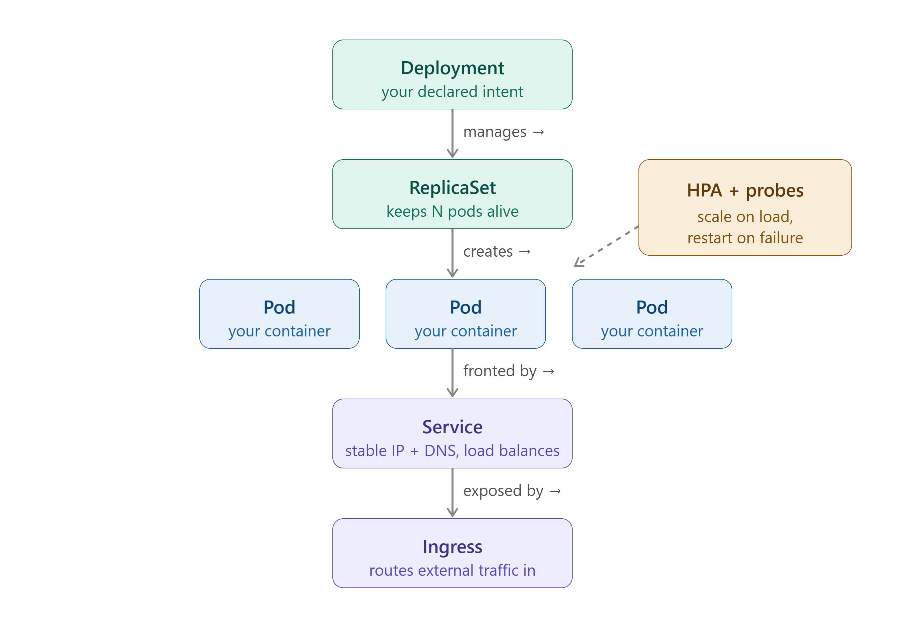

# M4 — Kubernetes Core

> **Core question: You have a Docker image in a registry. How do you run it reliably across many machines, keep it alive when it crashes, and reach it via a stable address — without babysitting it?**

> **⏱️ Time:** ~75 min padho + 40 min lab · **🎚️ Level:** Intermediate · **📋 Pehle chahiye:** [M0](01-M0-foundations.md), [M3](04-M3-docker.md)
>
> **Is module ke baad tum kar paoge:**
> - Deployment, Service, aur readiness probe YAML likhna aur `kubectl apply` se cluster pe deploy karna
> - Self-healing demonstrate karna: `kubectl delete pod` ke baad automatic replacement dekhna
> - `CrashLoopBackOff`, `Pending`, aur `ImagePullBackOff` debug karna — `kubectl describe` se exact cause nikalna

---

**MODULE MAP**
`00-INDEX` · `01-M0-foundations` · `02-M1-terraform` · `03-M2-ansible` · `04-M3-docker` · **`05-M4-kubernetes-core`** · `06-M5-sizing-and-cost` · `07-M6-cicd` · `08-M7-gitops` · `09-connected-system` · `10-M8-observability-sre` · `11-M9-advanced-k8s-internals` · `12-capstone-url-shortener` · `13-capstone-microshop` · `14-interview-bank` · `15-roadmap` · `16-reference-appendix`

---

> ### ↩️ Recall gate — shuru karne se pehle
> Pichhle modules se 3 sawaal. **Pehle memory se jawab do, phir kholo.** (Yeh retrieve karna hi lifetime yaad rakhta hai — dobara padhna nahi.)
>
> 1. *(M3)* Docker image mein `:latest` tag production mein kyun dangerous hai, aur uski jagah kya use karna chahiye?
> 2. *(M1)* Terraform `plan` command kya karta hai, aur `apply` se pehle kyun zaruri hai?
> 3. *(M0)* "Pets vs cattle" ka infrastructure mein kya matlab hai? Kubernetes pods kahan fit hote hain?
>
> <details markdown="1"><summary>Jawab</summary>
>
> 1. `:latest` mutable hai — alag time pe pull karo to alag image mil sakti; rollback impossible. SHA digest pin karo — immutable, traceable. &nbsp; 2. `plan` = dry run — batata hai kya badlega bina kuch badlaye; unexpected changes pakdo apply se pehle. &nbsp; 3. Pets = unique hand-crafted servers (toot jaaye to rona). Cattle = interchangeable units (koi bhi maare, naya la do). Kubernetes pods = pure cattle — ek crash kare, K8s naya banata hai.
> </details>

## The 60-second version

Kubernetes (K8s — the 8 letters between K and s) is a cluster manager that keeps containers running across many machines. You write a YAML file that says "I want 3 copies of this container." Kubernetes reads it, creates those containers on worker nodes, and then watches 24/7. One crashes? It starts a new one automatically. You never typed "start container" — you declared **desired state**, and K8s drives **current state** toward it forever.

That one idea — declare desired state, let the system reconcile — is the entire mental model. Everything else is detail.

---

## Why this exists / what it replaced

Before orchestrators, the typical approach was:

- SSH into a server, run `docker run myapp`.
- If it crashes, it stays dead until someone notices and restarts it manually.
- To run 10 copies, SSH into 10 servers and run 10 commands.
- Rolling update? Log into each server one by one.
- "The server that must never reboot" — a pet machine nobody dares touch because everything depends on it running.

This produced the **pet server anti-pattern**: a unique, hand-crafted machine with undocumented state accumulated over months. When it dies, the team scrambles.

K8s replaces this with **cattle pods** — disposable units. If a pod (container wrapper) dies, K8s immediately spins up a replacement. Servers are interchangeable workers, not irreplaceable pets.

What K8s adds over raw Docker:

| What you get | Docker alone | Kubernetes |
|---|---|---|
| Self-healing (restart on crash) | No | Yes |
| Run across many machines | No | Yes |
| Rolling updates with zero downtime | Manual | Built-in |
| Horizontal scaling (more copies) | Manual | One command / auto |
| Stable network address for pods | No | Service object |
| Health-check gating (no traffic to broken pods) | No | Probes |

---

## The one big idea: reconciliation

This is **Golden Thread 1** — the same idea runs through every tool in this handbook:

- Terraform: you declare infra, it drives reality toward it (see `02-M1-terraform`).
- Ansible: you declare machine state, it converges there (see `03-M2-ansible`).
- Argo CD: you declare cluster state in Git, it applies it (see `08-M7-gitops`).
- **Kubernetes: you declare pod count and configuration, it maintains them 24/7 without you.**

> See `09-connected-system` for a full map of how reconciliation threads every tool together.

> 🔮 **Predict pehle (socho, phir aage padho):** Ek Deployment me `replicas: 3` hai. Tum ek pod ko `kubectl delete` kar do — ab kitne pods honge, aur kaun banata hai unhe?

### How it works

K8s runs a **control loop** — a tight loop that never stops:

```
loop:
  desired = read from etcd ("replicas: 3")
  current = count running pods
  if current < desired:  start new pods
  if current > desired:  delete excess pods
  sleep(a few seconds)
  repeat forever
```

🇮🇳 **Hinglish intuition:** Ye ek chowkidar hai jo 24/7 ginta rehta — "teen chahiye the, do hain, chalo ek aur banao." Raat 2 baje bhi, Sunday ko bhi, woh nahi ruka. Docker mein yeh chowkidar tha hi nahi — container chala ke bhool jaata.

**Desired state** = what you wrote in YAML (`replicas: 3`).
**Current state** = what is actually running right now.
**Reconciliation** = the loop that closes the gap between them.

The critical consequence: you do not tell K8s **how** to fix things. You tell it **what you want**. It figures out the how. This is declarative, not imperative — same philosophy as Terraform.

---

## The object chain

Every workload in K8s follows this four-layer chain:

```
┌─────────────────────────────────────────────────────────┐
│  DEPLOYMENT 👔                                          │
│  "Keep 3 replicas of this pod spec always running"      │
│  Owns rolling updates, rollbacks, desired replica count │
│         │                                               │
│         ▼                                               │
│  REPLICA SET                                            │
│  "Count pods, start/stop to hit the number"             │
│  One ReplicaSet per version (rolling update = new RS)   │
│         │                                               │
│         ▼                                               │
│  POD 🍱  (smallest deployable unit)                     │
│  Shared network namespace + shared storage volumes      │
│  One or more containers that must live together         │
│  IP address — changes every time pod is replaced        │
│         │                                               │
│         ▼                                               │
│  CONTAINER 🍛                                           │
│  Your actual application process                        │
└─────────────────────────────────────────────────────────┘
```

🇮🇳 **Hinglish intuition:** Pod = tiffin dabba 🍱. Tiffin ke andar dish (container) hoti. Tiffin ka address (IP) bahar likha hota — par jab naya tiffin aata to address badal jaata. Isliye upar Service chahiye (agle section mein).



*Figure: the controller chain rendered. Each controller watches its slice of desired state and creates/heals the layer below — the reconciliation loop in action.*

### What each layer's job is

**Deployment** — the object you create and interact with. You scale it, roll it back, update its image. You never touch ReplicaSets or Pods directly in production.

**ReplicaSet** — created automatically by the Deployment. Its sole job is counting: "there should be N pods; if there are fewer, create; if more, delete." When you do a rolling update, the Deployment creates a new ReplicaSet with the new image while slowly scaling down the old one. The deep mechanics of this are covered in `11-M9-advanced-k8s-internals`.

**Pod** — the fundamental unit K8s schedules, starts, and stops. Key properties:
- Contains one or more containers that share a network namespace (same IP, same localhost, same ports).
- Contains one or more containers that share mounted storage volumes.
- Has an IP address — but it changes every time the pod is replaced.
- Never create a bare pod without a Deployment. A bare pod that crashes does not get recreated — there is no desired state watching it.

**Container** — the actual Docker (or OCI) container pulled from your registry.

### Two small-but-important Pod fields: `imagePullPolicy` & `restartPolicy`

Beginners skip these two Pod-spec fields; both bite in production.

**`imagePullPolicy`** — decides *when* the kubelet re-pulls an image onto a node:

| Value | Behaviour | Default when |
|-------|-----------|--------------|
| `IfNotPresent` | If the tag is already cached on the node, do **not** pull again | tag is **not** `:latest` (e.g. `:abc1234`) |
| `Always` | Check the registry on every pod start | tag is `:latest` (or set explicitly) |
| `Never` | Never pull; use only a locally-present image | air-gapped / testing |

> ⚠️ **The trap that ties back to [M3](04-M3-docker.md).** If you use a *mutable* tag (`:latest`, `:prod`) **with** `imagePullPolicy: IfNotPresent`, a node that already cached that tag keeps running the **old** image — you "deployed" but the pod never changed. This is exactly why M3 insists on immutable SHA/version tags: a new version = a new name, so the cache is never stale and `IfNotPresent` is both safe *and* fast.

**`restartPolicy`** — what K8s does when a container exits:

| Value | Behaviour | Who uses it |
|-------|-----------|-------------|
| `Always` | Restart on any exit (success or crash) | **Deployment / StatefulSet (default)** — long-running services |
| `OnFailure` | Restart only on non-zero exit | **Job / CronJob** — retry work, but stop on success |
| `Never` | Never restart | one-shot tasks you inspect yourself |

> 🇮🇳 **Hinglish intuition:** Deployment = *"hamesha chalti rehni chahiye"* (Always). Job = *"kaam khatam to ruk jao"* (OnFailure/Never). Isliye ek crashed web pod wapas aata hai, par ek complete-ho-chuka Job ka pod nahi. Yahi wajah hai `CrashLoopBackOff` sirf `Always`/`OnFailure` pods pe dikhta hai.

### The sidecar pattern

A pod with two containers: one main application, one helper that must share the same network or filesystem.

```
┌─────────────────────────────────┐
│  POD                            │
│  ┌───────────┐ ┌─────────────┐  │
│  │ Main app  │ │  Sidecar    │  │
│  │ :8080     │ │  (logs/     │  │
│  │           │ │   proxy/    │  │
│  │           │ │   metrics)  │  │
│  └───────────┘ └─────────────┘  │
│  shared network (localhost)     │
│  shared volume (log files)      │
└─────────────────────────────────┘
```

🇮🇳 **Hinglish intuition:** Motorcycle aur sidecar — dono ek saath chalte, ek steering wheel se. Sidecar ko apna engine nahi chahiye; main ke saath ride karta.

Common sidecar uses: log shipping (Fluentd), service mesh proxy (Envoy), metrics exporter. The sidecar shares the pod's network so it can scrape `localhost:8080` without any extra routing.

---

## Services, labels and selectors

### Init containers — run *before* the main app

An **initContainer** runs to completion *before* the pod's main container(s) start — same pod, but strictly sequential: init runs → exits `0` → main starts. Common uses:

- **Wait for a dependency** — block until the database (or in [MicroShop](13-capstone-microshop.md), `catalog-api`) is reachable, so the app doesn't crash-loop on a missing backend.
- **One-time setup** — run a DB migration, fetch config/secrets, or fix file permissions before the app boots.

If an initContainer fails, K8s restarts it and the main app **never starts** until it succeeds — you'll see the pod stuck in status `Init:0/1`. That status is your signal to check the initContainer's logs.

> 🇮🇳 **Hinglish intuition:** initContainer = *"dukaan kholने se pehle safai/setup"* — jab tak setup pura nahi, main app chalu nahi hoti. Sidecar (upar wala) iska ulta hai: woh main app ke *saath-saath* chalta rehta hai; initContainer main se *pehle* chal ke *khatam* ho jaata hai.

### The pod IP problem

Pods come and go. Every time K8s replaces a pod — crash, rolling update, node failure — the new pod gets a new IP. You cannot hardcode pod IPs in your application.

**Service** solves this: a stable virtual IP address (ClusterIP) and DNS name that never change, in front of a set of pods. Traffic arrives at the Service; the Service routes it to a healthy pod.

```
┌──────────────────────────────────────────────────────────┐
│                                                          │
│   CLIENT                                                 │
│     │                                                    │
│     ▼                                                    │
│  SERVICE (stable ClusterIP: 10.96.14.5, DNS: my-svc)    │
│     │           │           │                            │
│     ▼           ▼           ▼                            │
│  Pod A       Pod B       Pod C                           │
│ (10.0.1.2) (10.0.1.7) (10.0.2.3)                        │
│  [healthy]  [healthy]  [healthy]                         │
│                                                          │
│  Pod D — readiness probe failing → NOT in Service        │
│                                                          │
└──────────────────────────────────────────────────────────┘
```

🇮🇳 **Hinglish intuition:** Fixed phone number — delivery boys (pods) badalte rehte, number (Service IP) same rehta. Tu number pe call karta, jo bhi available delivery boy ho, woh aata.

The Service watches for pod readiness and only routes to pods that are ready. EndpointSlice is the internal mechanism that tracks the list of ready pod IPs — internals are covered in `11-M9-advanced-k8s-internals`.

### Service types — what you need now

**ClusterIP** (default): Service is reachable only inside the cluster. Used for internal service-to-service communication. Example: your API pod talks to your database pod via a ClusterIP Service.

**NodePort**: Opens a port (30000–32767) on every node's external IP. External traffic can reach `<node-IP>:<NodePort>`. Used for self-managed clusters where you don't have a cloud load balancer. This is what you will use in the hands-on lab.

LoadBalancer and Ingress (HTTP routing, TLS termination, path-based routing) are covered in `11-M9-advanced-k8s-internals` and `12-capstone-url-shortener`.

### The four port fields — the #1 Service confusion

A Pod and its Service have up to **four** "port" fields, and beginners mix them up constantly. Here is the chain, from the outside world down to your app:

```
   (external)          (Service)          (Service)          (Pod / container)
   nodePort    ──▶       port      ──▶     targetPort   ──▶    containerPort
   30080                80                8000                8000
   "bahar ka gate"      "reception          "kis pod-port       "app actually
   (NodePort only)       counter"            pe bhejo"            listens here"
```

| Field | Lives on | What it means | Example |
|-------|----------|---------------|---------|
| `containerPort` | Pod (container) | The port your app actually listens on inside the container | `8000` |
| `targetPort` | Service | Which pod port the Service forwards to — **must equal `containerPort`** | `8000` |
| `port` | Service | The port the Service itself exposes; how other pods call it (`my-svc:80`) | `80` |
| `nodePort` | Service (**NodePort type only**) | The external port opened on every node (`30000–32767`) | `30080` |

**Traffic flow (NodePort):** `client → <node-IP>:30080 (nodePort) → Service:80 (port) → pod:8000 (targetPort = containerPort)`.

> 🇮🇳 **Hinglish intuition:** Ek building socho — **nodePort** = street ka gate number, **port** = reception counter, **targetPort/containerPort** = asli kamre ka number jahan app baitha hai. Bahar se andar: gate → reception → kamra.

> ⚠️ **Beginner trap:** `targetPort` ≠ `containerPort` is the #1 cause of "the Service exists but returns nothing / connection refused" — the Service is forwarding to a port no container is listening on. Ye check karo pehle.

### Labels and selectors — two distinct uses

A **label** is a key-value pair attached to any K8s object: `app: myapp`, `env: prod`, `disktype: ssd`.

A **selector** is a filter that says "give me objects whose labels match this."

Labels have two completely different uses in K8s. Conflating them is a common source of bugs.

| Use | Who uses the selector | Whose label is read | What it decides |
|---|---|---|---|
| **Traffic routing** | Service | Pod's label | Which pods receive traffic |
| **Pod placement** | Pod spec | Node's label | Which node the pod runs on |

```yaml
# USE 1: Service → Pod (traffic routing)
# Pod carries the label:
metadata:
  labels:
    app: myapp          # <── label on the POD

# Service selects by that label:
spec:
  selector:
    app: myapp          # <── "send traffic to pods with this label"

---

# USE 2: Pod → Node (placement / scheduling)
# Node carries the label:
# (set by admin: kubectl label node worker-1 disktype=ssd)

# Pod requests that node label:
spec:
  nodeSelector:
    disktype: ssd       # <── "schedule me onto nodes with this label"
```

🇮🇳 **Hinglish intuition:** Service label use karti — "traffic kahan jaaye?" Pod nodeSelector use karta — "main kahan baithunga?" Same sticker (label), bilkul alag sawaal.

If your Service is not sending traffic to your pods, 90% of the time the label in the Service selector does not match the label on the pod. Check both.

---

## Probes: readiness vs liveness

A container can be **running** (the process started) without being **ready** (the application is actually serving requests). K8s distinguishes these with probes.

### Running vs Ready

`Running` means the container process is alive. `Ready` means the pod has passed its readiness probe and is eligible to receive traffic.

`READY 0/1` in `kubectl get pods` output means: 1 container in the pod, 0 are ready. The pod is running but not receiving traffic.

🇮🇳 **Hinglish intuition:** Running = dukaan ki batti jali. Ready = galla set hai, customer le sakte ho. Dono alag hain.

### Readiness probe

**Question it answers:** "Is this pod ready to serve traffic right now?"

**What happens on failure:** The pod is removed from the Service's endpoint list. Traffic stops going to it. The pod is NOT killed or restarted. When the probe passes again, the pod is re-added to the Service.

**When you need it:** App takes 20 seconds to start, connects to a database, pre-warms a cache. Without a readiness probe, K8s would send traffic to the pod immediately on start — before the app is ready.

### Liveness probe

**Question it answers:** "Is this pod still alive and functional? Or is it stuck / deadlocked?"

**What happens on failure:** The pod is killed and restarted.

**When you need it:** App enters an infinite loop, deadlocks, or hangs with the process still running. Without a liveness probe, K8s would leave it running forever even though it is not doing any work.

| | Readiness probe | Liveness probe |
|---|---|---|
| Question | Ready for traffic? | Still alive and functional? |
| Failure action | Remove from Service (no kill) | Kill and restart pod |
| Protects against | Sending traffic too early | Stuck / deadlocked processes |
| Pod killed? | No | Yes |
| Emoji | 🚦 | 💓 |

Both probes use the same mechanism: HTTP GET to a health endpoint, TCP socket check, or exec a command inside the container. The difference is only in what K8s does when the probe fails.

> Startup probe and the liveness-probe footgun (setting `initialDelaySeconds` too short causing restart loops) are covered in `11-M9-advanced-k8s-internals`.

**Debug reflex:** Pod `Running` but users see errors and `READY 0/1`:
1. Check `kubectl describe pod <name>` for readiness probe failures.
2. Check that the Service selector label matches the pod label.

---

## Nodes, taints and scheduling

### Master vs worker

A K8s cluster has two kinds of machines:

```
┌─────────────────────────────────────────────────────────────────┐
│  CLUSTER                                                        │
│                                                                 │
│  ┌──────────────────────────────┐                               │
│  │  MASTER / CONTROL PLANE 🧠   │   <── cluster's brain        │
│  │  API server, scheduler,      │   <── you never run app      │
│  │  controller-manager, etcd    │       pods here              │
│  └──────────────────────────────┘                               │
│                                                                 │
│  ┌──────────────┐ ┌──────────────┐ ┌──────────────┐            │
│  │  WORKER 💪   │ │  WORKER 💪   │ │  WORKER 💪   │            │
│  │  Your pods   │ │  Your pods   │ │  Your pods   │            │
│  │  run here    │ │  run here    │ │  run here    │            │
│  └──────────────┘ └──────────────┘ └──────────────┘            │
└─────────────────────────────────────────────────────────────────┘
```

| Master / Control Plane | Worker |
|---|---|
| Cluster brain — makes all scheduling decisions | Runs your application pods |
| Runs API server, scheduler, controller-manager, etcd | Runs kubelet (talks to master), containerd (runs containers) |
| You interact with it via `kubectl` | You never SSH here in production |
| Cannot tolerate disruption | Can come and go (cattle) |

### Taint and toleration

The master node carries a **taint** by default:

```
node-role.kubernetes.io/control-plane:NoSchedule
```

A taint is a repellent on a node. `NoSchedule` means: "do not schedule any pod here unless that pod explicitly tolerates this taint."

🇮🇳 **Hinglish intuition:** Taint = "No Entry" board 🚷. Sab pods baahar raho. Toleration = VIP pass — "main allowed hoon". Master pe "No Entry" board kyun? Kyunki agar teri app pods master pe chalne lage aur woh overloaded ho gaya, poora cluster ka brain down. Control plane crash = cluster mute.

A system pod (like CoreDNS) that needs to run on the master carries a matching toleration. Your application pods do not carry that toleration, so the scheduler never places them on the master — by design.

### Pods per node — what limits it

A node can run a maximum of approximately **110 pods** (hard cap in default K8s). But the limit that bites in practice is usually reached before that:

1. **CPU**: no more schedulable CPU left on the node.
2. **RAM**: no more memory left.
3. **IP pool**: each pod needs an IP from the node's CIDR block. When the pool is exhausted, no more pods, even if CPU and RAM are free. This surprises most beginners.
4. **~110 pod hard cap**: hits before the above on very small nodes.

Debug reflex: pod stuck in `Pending` with CPU and RAM appearing free? Run `kubectl describe pod <name>` and read the Events section. The scheduler writes the exact reason there — IP exhaustion, affinity mismatch, taint rejection.

---

## Namespaces and kubectl basics

### Namespaces

A namespace is a logical boundary inside one cluster. Objects in different namespaces are isolated from each other by default.

> ⚠️ **Same word, two completely different meanings — don't confuse them.** A *Kubernetes namespace* (here) is a **virtual folder** that groups objects inside a cluster (dev/staging/prod, or per-team). A *Linux namespace* (from [M3 — Docker](04-M3-docker.md)) is a low-level **kernel feature that isolates a single container's view** of processes/network/filesystem. Unrelated ideas, identical word. (Also in the [00a Pre-flight glossary](00a-preflight.md#the-10-words-the-book-uses-before-defining-them).)

Default namespaces:
- `default` — where your objects go if you do not specify a namespace.
- `kube-system` — K8s internal components (CoreDNS, kube-proxy, metrics-server). Never delete objects here.

Namespaces are used to separate environments (dev/staging/prod) within a cluster, or to separate teams. RBAC (Role-Based Access Control — covered in `11-M9-advanced-k8s-internals`) enforces who can touch which namespace.

### kubectl — your remote control

`kubectl` is the CLI that talks to the K8s API server. Every command is a REST call under the hood.

Key commands — each explained in the Commands section below.

**The `-A` flag trick**: `kubectl get pods` shows pods in the default namespace only. Add `-A` (all namespaces) to see everything — including system pods in `kube-system` that are always running.

```bash
kubectl get pods         # only default namespace
kubectl get pods -A      # ALL namespaces — use this when something is "missing"
```

---

## Stateful vs stateless: Deployment vs StatefulSet, and why the DB lives in RDS

### Stateless pods (the normal case)

A web API pod holds no data. Every request is self-contained. If the pod dies, K8s starts a fresh one from the same image and nothing is lost — state never lived in the pod.

Use a **Deployment** for stateless pods:
- Pods are interchangeable.
- Any replica can handle any request.
- Roll out, roll back, scale freely.
- Golden Thread 2: *state outside → compute disposable.*

🇮🇳 **Hinglish intuition:** Cattle 🐄 — ek bimaar gaay aayi, naya la do. App pod = kiraye ka waiter (tu badal sakta, kuch nahi khota).

### Stateful pods (the rare case)

A database pod holds data. If the pod dies and a new one starts, you need it to re-attach to the same disk. Pod identity matters.

Use a **StatefulSet** for this case:
- Pods get stable, ordered names (`mysql-0`, `mysql-1`, not random hashes).
- Each pod gets its own **PersistentVolume (PV)** — a disk that lives outside the pod.
- Pod dies → new pod starts with the same name and mounts the same disk → data is intact.

🇮🇳 **Hinglish intuition:** Pod = almari (toot sakti). PV = bahar ka locker 🔒 (pod maari to locker bacha, naya pod same locker se jud gaya). PV = pod ke bahar ki disk; pod se zyada zindagi hai uski.

> 🔧 **War story:** `postgres-0` pod ghanton tak `Pending` raha — CPU aur RAM dono free the. `kubectl describe pod postgres-0` ne bataya: `no persistent volumes available for this claim and no storage class is set`. Default StorageClass install hi nahi thi; local-path provisioner add kiya toh pod 10 second mein `Running`. Poori kahani + lesson → [Interview Bank](14-interview-bank.md).

The deep StatefulSet lifecycle (ordered start/stop, headless Services, PVC binding) is covered in `11-M9-advanced-k8s-internals`.

### Deployment vs StatefulSet — quick reference

| | Deployment (stateless) | StatefulSet (stateful) |
|---|---|---|
| Pod identity | Random names, interchangeable | Stable ordered names (`pod-0`, `pod-1`) |
| Storage | None (or ephemeral) | PersistentVolume per pod (survives pod death) |
| Restart | Any node, fresh start | Same volume re-attached |
| Scaling | Scale freely, any order | Ordered startup/shutdown |
| Use case | Web API, worker, proxy | Database, message broker, distributed cache |
| K8s object | `Deployment` | `StatefulSet` + `PersistentVolumeClaim` |

### Why the database usually lives outside the cluster (RDS)

Running a database as a StatefulSet in K8s is possible, but it puts the operational burden on you: backups, failover, storage durability, replication, patch management.

In most production setups — and in the capstone project — the database runs on a **managed service** like AWS RDS, completely outside the K8s cluster. App pods connect to RDS over the network on port 5432 (Postgres) or 3306 (MySQL).

| | DB inside K8s (StatefulSet + PV) | Managed RDS (outside cluster) |
|---|---|---|
| Who manages backups | You | AWS (automated snapshots) |
| Who handles failover | You | AWS (Multi-AZ automatic) |
| Who patches the DB engine | You | AWS |
| Complexity | High | Low |
| Cost | Node cost only | RDS instance cost |
| Data durability | Your EBS + your backup setup | AWS-guaranteed durability |
| Best for | Learning / cost-sensitive | Production |

🇮🇳 **Hinglish intuition:** App pod = kiraye ka waiter (tera restaurant). RDS = bank locker (bank ki building, bank sambhaalta). Keemti cheez (data) bank mein rakho, apni dukaan mein nahi.

The app pod reads its DB connection string from an environment variable (`DB_HOST`). The password comes from a Kubernetes Secret (never hardcoded). The pod itself is stateless and disposable. This is the full expression of Golden Thread 2.

> `12-capstone-url-shortener` walks through the exact pod-to-RDS connection, Security Group rules, and Secret wiring.

---

## Cluster flavors: kubeadm vs EKS vs k3s

### Three ways to get a cluster

| | kubeadm | EKS (AWS) | k3s |
|---|---|---|---|
| What it is | Tool to bootstrap a full K8s cluster on your own VMs | AWS-managed K8s (control plane hosted by AWS) | Lightweight K8s distribution (single binary) |
| Who manages control plane | You | AWS | You (but it's tiny) |
| RAM requirement | 2 GB minimum per node | N/A (AWS manages it) | 512 MB workable |
| Install complexity | Medium (3 playbooks — Ansible in M2) | Low (one `eksctl` command or Terraform) | Very low (one `curl | sh`) |
| Cost | EC2 cost only | EC2 + $0.10/hr per cluster (control plane) | Minimal — fits AWS free-tier t3.micro |
| Best for | Learning the full stack, capstone | Production on AWS | Free-tier learners, edge, Raspberry Pi |
| API compatibility | Full K8s | Full K8s | Full K8s (minus some alpha features) |
| Self-healing control plane | You fix it | AWS fixes it | You fix it (but rarely breaks) |

**For this module's lab:** Use k3s on a single VM or minikube on your laptop. Both expose the full K8s API. Concepts transfer 100% to EKS in production.

**For the capstone:** kubeadm on three EC2 nodes built by Terraform and configured by Ansible — the full M0→M7 chain.

🇮🇳 **Hinglish intuition:** kubeadm = ghar khud banao (seekhne best). EKS = flat kiraye pe le lo (ready, managed). k3s = studio apartment (chota, sasta, same kaam karta free-tier pe).

---

## Real production example

A URL shortener (the capstone in `12-capstone-url-shortener`) running on K8s:

```
┌────────────────────────────────────────────────────────────┐
│  K8s Cluster (3 nodes — 1 master + 2 workers)              │
│                                                            │
│  Namespace: url-shortener                                  │
│                                                            │
│  ┌──────────────────────────────────────────────────────┐  │
│  │  Deployment: api (replicas: 3)                       │  │
│  │  ┌──────────┐  ┌──────────┐  ┌──────────┐           │  │
│  │  │ api-pod  │  │ api-pod  │  │ api-pod  │           │  │
│  │  │ :8000    │  │ :8000    │  │ :8000    │           │  │
│  │  └────┬─────┘  └────┬─────┘  └────┬─────┘           │  │
│  │       │             │             │                  │  │
│  │  ┌────┴─────────────┴─────────────┴─────┐            │  │
│  │  │  Service: api-svc (NodePort :30080)  │            │  │
│  │  │  selector: app=api                   │            │  │
│  │  └──────────────────────────────────────┘            │  │
│  └──────────────────────────────────────────────────────┘  │
│                                                            │
│                     │  :5432                              │
└─────────────────────┼──────────────────────────────────────┘
                      ▼
              AWS RDS (Postgres)
              outside cluster,
              managed by AWS
```

What happens when a pod crashes at 3 AM:
1. kubelet on the worker node detects the container has exited.
2. Reports to the control plane.
3. Deployment controller sees: desired=3, current=2.
4. Creates a new pod spec.
5. Scheduler picks a worker node.
6. kubelet on that node pulls the image from ECR and starts the container.
7. Readiness probe passes after ~5 seconds.
8. Service adds the new pod to its endpoint list.
9. Total time: 10–30 seconds. Zero human intervention.

---

## Commands, explained

Every command below includes a one-line reason for running it.

```bash
# Show all pods in all namespaces (include kube-system to see control-plane pods)
kubectl get pods -A

# Show pods in the current namespace with more detail (node, IP, age)
kubectl get pods -o wide

# Show all your objects at once (Deployments, ReplicaSets, Pods, Services)
kubectl get all

# Apply a YAML file — create or update the object described in it
kubectl apply -f deployment.yaml

# Describe a pod — shows Events, which is where scheduling failures and probe failures appear
kubectl describe pod <pod-name>

# Stream live logs from a pod (add -f to follow, -c to pick a container in multi-container pods)
kubectl logs <pod-name> -f

# Scale a Deployment to 5 replicas without touching the YAML
kubectl scale deployment myapp --replicas=5

# Trigger a rolling restart of all pods in a Deployment (e.g., to pick up a new Secret)
kubectl rollout restart deployment/myapp

# Check the rollout status — shows whether the rolling update completed or stalled
kubectl rollout status deployment/myapp

# Roll back to the previous version
kubectl rollout undo deployment/myapp

# Delete a pod — Deployment will immediately create a replacement (self-healing demo)
kubectl delete pod <pod-name>

# Run a temporary debug container in the cluster (useful for DNS / network testing)
kubectl run debug --image=busybox --rm -it --restart=Never -- sh

# Port-forward a pod's port to your localhost (quick access without a Service)
kubectl port-forward pod/<pod-name> 8080:8000

# Show resource usage across pods (requires metrics-server installed)
kubectl top pods
```

---

## Beginner mistakes vs senior insights

| Beginner does | Senior knows |
|---|---|
| Creates bare pods directly | Always uses a Deployment — bare pods have no desired state, no self-heal |
| Wonders why pod IP changed | Pod IPs are ephemeral by design; always reach pods via a Service |
| Confused why `kubectl get pods` shows nothing | Default namespace only; use `-A` to see all namespaces |
| Tries to put two microservices in one pod | Each microservice gets its own Deployment and Pod; sidecar = helper for the same service, not a different service |
| Skips readiness probe | Pods receive traffic before app is ready → errors during startup; always configure readiness |
| Uses `latest` image tag in Deployment | `latest` is mutable; pin to a git-sha tag so rollbacks are predictable (same principle as M3) |
| `kubectl edit` in production with GitOps | With Argo CD selfHeal=true, manual kubectl changes are undone within minutes; always change via Git |
| Runs DB as a Deployment | DB needs stable identity and persistent disk; use StatefulSet or, better, RDS |
| Wonders why pod is Pending with free RAM | IP pool exhaustion or 110-pod cap; check `kubectl describe pod` Events |
| Treats master as a worker node | Master carries NoSchedule taint; adding app pods there risks destabilizing the control plane |

---

## Memory shortcuts

| Concept | One-line hook |
|---|---|
| Reconciliation | Chowkidar jo 24/7 ginta — "teen chahiye, do hain, ek aur banao" |
| Pod | Tiffin 🍱 — ek ya zyada container ek dabba mein, same network |
| Service | Fixed phone number ☎️ — delivery boys (pods) badalte, number same |
| Taint | No-Entry board 🚷 — master pe aam pods rok |
| Toleration | VIP pass — taint ke bawajood andar |
| Readiness probe | Traffic signal 🚦 — fail = rok, maar nahi |
| Liveness probe | Pulse check 💓 — fail = maar ke restart |
| Running vs Ready | Dukaan khuli vs galla set (grahak le sakte ho?) |
| PersistentVolume | Bahar ka locker 🔒 — pod toot jaaye to locker bacha |
| Deployment | Stateless cattle 🐄 — disposable, koi bhi pod same kaam |
| StatefulSet | Stateful pet 🐶 — stable naam, apna locker |
| nodeSelector / affinity | "Main yahan baithunga" — pod khud node chunta (label se) |
| k3s vs kubeadm vs EKS | Studio / khud-banaya-ghar / managed flat |

---

## Summary

Kubernetes solves the problem of running many containers across many machines reliably. Its core idea — declare desired state, let a reconciliation loop maintain it — is the same philosophy as Terraform, Ansible, and Argo CD. You are building a vocabulary, not memorizing separate tools.

The object chain you create: **Deployment → ReplicaSet → Pod → Container**. You interact with Deployments; K8s manages the rest.

A **Service** gives pods a stable address. It uses **labels and selectors** to find pods. Those same labels serve a second purpose: placement via `nodeSelector`. Know which use you are reading.

**Probes** separate "running" from "ready." Readiness gates traffic. Liveness restarts stuck processes.

**Nodes** divide into master (brain, no app pods) and workers (run your pods). Taints enforce this boundary.

For **stateful workloads**, prefer managed RDS over a StatefulSet in the cluster. Golden Thread 2: state outside → compute disposable.

**Cluster flavors**: k3s for learning on free-tier, kubeadm for the full self-managed experience, EKS for production AWS.

What is explicitly deferred to `11-M9-advanced-k8s-internals`:
- Control-plane internals (API server, scheduler, controller-manager, etcd)
- `kubectl apply` 7-step journey
- EndpointSlice internals
- Rolling update mechanics at the ReplicaSet level
- QoS classes (Guaranteed, Burstable, BestEffort)
- CoreDNS and cluster DNS
- Graceful shutdown and `terminationGracePeriodSeconds`
- HPA formula and scaling behavior
- RBAC
- Ingress and IngressController
- CNI and networking internals

---

## Self-check quiz

Pehle memory se jawab do, phir neeche kholo.

1. A pod crashes at 3 AM. No one is awake. What happens, and why?

2. You have a Service with `selector: app: api`. Your pod has `labels: app: API` (capital A). Pods are running. Why is the Service sending no traffic to them?

3. What is the difference between `Running` and `Ready` in `kubectl get pods` output? Give a concrete scenario where a pod is Running but not Ready.

4. A teammate ran `kubectl scale deployment myapp --replicas=10` directly. You are using Argo CD with `selfHeal: true`. What happens next?

5. Your pod is stuck in `Pending`. CPU and RAM on your nodes appear available. Name three other reasons a pod can stay Pending.

6. Why does the master node carry a `NoSchedule` taint? What breaks if you remove it and schedule app pods on the master?

7. You need to run a Postgres database in K8s. What is wrong with using a Deployment? What should you use instead, and why?

8. A developer asks why they cannot ping `pod-ip:8080` from their laptop. The Service is working fine. Explain what ClusterIP means and what they should do instead.

<details markdown="1"><summary>Jawab dekho</summary>

1. Deployment controller sees desired=3, current=2 and immediately creates a replacement pod. The reconciliation loop (chowkidar) runs 24/7 — zero human intervention needed.
2. Labels are case-sensitive. `app: API` ≠ `app: api`. The Service selector finds no matching pods, so no endpoints are added — traffic goes nowhere.
3. Running = container process is alive. Ready = readiness probe has passed and the pod is eligible for traffic. Scenario: app takes 20 s to connect to the database — pod shows `Running` but `READY 0/1` until the probe passes.
4. Argo CD's selfHeal=true detects the cluster (10 replicas) diverges from Git. Within minutes it reverts the Deployment to match the Git manifest, overriding the manual scale.
5. Three reasons: (a) IP pool exhaustion — each pod needs its own IP from the node's CIDR block; (b) 110-pod hard cap hit; (c) nodeSelector/affinity with no matching node label, or a taint with no matching toleration. Check `kubectl describe pod` Events for the exact message.
6. Master runs the control plane (API server, etcd, scheduler). If app pods overload it, the control plane crashes — the whole cluster goes dark. NoSchedule taint keeps app pods off the master by design.
7. Deployment pods are interchangeable and stateless — a new pod starts fresh with no prior disk. Postgres needs stable identity and a PersistentVolume that survives pod death. Use StatefulSet+PVC, or better: RDS outside the cluster.
8. ClusterIP is only routable inside the cluster network — not from a laptop. Use `kubectl port-forward pod/<name> 8080:8080`, expose via NodePort, or use a LoadBalancer.
</details>

---

## Hands-on lab

**Goal:** Deploy an app, scale it, watch self-healing, explore system pods.

**Prerequisites:** k3s, minikube, or kind installed locally. `kubectl` configured.

### Step 1 — Write the Deployment

```yaml
# deployment.yaml
apiVersion: apps/v1
kind: Deployment
metadata:
  name: hello
  labels:
    app: hello
spec:
  replicas: 2
  selector:
    matchLabels:
      app: hello
  template:
    metadata:
      labels:
        app: hello
    spec:
      containers:
      - name: hello
        image: hashicorp/http-echo:latest
        args: ["-text=Hello from K8s"]
        ports:
        - containerPort: 5678
        readinessProbe:
          httpGet:
            path: /
            port: 5678
          initialDelaySeconds: 2
          periodSeconds: 5
```

```yaml
# service.yaml
apiVersion: v1
kind: Service
metadata:
  name: hello-svc
spec:
  type: NodePort
  selector:
    app: hello           # matches the pod's label
  ports:
  - port: 80
    targetPort: 5678
    nodePort: 30080      # access via <node-IP>:30080
```

### Step 2 — Apply and verify

```bash
# Apply both objects
kubectl apply -f deployment.yaml
kubectl apply -f service.yaml

# Watch pods come up (Ctrl+C to stop)
kubectl get pods -w

# Verify Service selector matches pod label
kubectl describe service hello-svc
kubectl get pods --show-labels
```

### Step 3 — Confirm the app is reachable

```bash
# For minikube:
minikube service hello-svc --url

# For k3s on localhost:
curl http://localhost:30080
# Expected: Hello from K8s
```

### Step 4 — Demonstrate self-healing

```bash
# List running pods and note the names
kubectl get pods

# Delete one pod — K8s will immediately create a replacement
kubectl delete pod <pod-name-from-above>

# Watch the replacement appear (within seconds)
kubectl get pods -w
# You should see the deleted pod Terminating and a new one ContainerCreating → Running → Ready
```

### Step 5 — Scale the Deployment

```bash
# Scale to 4 replicas
kubectl scale deployment hello --replicas=4

# Verify 4 pods are running
kubectl get pods

# Scale back to 2
kubectl scale deployment hello --replicas=2

# Verify 2 pods remain (K8s chose 2 to kill)
kubectl get pods
```

### Step 6 — Explore system pods

```bash
# See ALL pods including K8s internals
kubectl get pods -A

# You will see kube-system namespace pods:
# - coredns         (cluster DNS)
# - kube-proxy or kube-router  (network routing)
# - metrics-server  (if installed)
# These are why 'kubectl get pods' (no -A) seems to show nothing on a fresh cluster
```

### Step 7 — Inspect the object chain

```bash
# See the Deployment, ReplicaSet, and Pods together
kubectl get all

# Describe the Deployment — shows ReplicaSet name, events, rollout history
kubectl describe deployment hello

# Check the ReplicaSet — shows the exact pod template it manages
kubectl get replicaset
kubectl describe replicaset <rs-name>
```

### Step 8 — Trigger a label mismatch (intentional break)

```bash
# Update the Deployment selector to a wrong label to see what happens
kubectl patch deployment hello -p '{"spec":{"selector":{"matchLabels":{"app":"wrong"}}}}'
# This will error: selector is immutable after creation. Good — K8s protects you.

# Instead, edit the Service selector to a wrong value:
kubectl patch service hello-svc -p '{"spec":{"selector":{"app":"wrong"}}}'

# Now try curl — it will hang (no endpoints match)
curl http://localhost:30080

# Check the endpoints to confirm 0 pods are selected
kubectl get endpoints hello-svc

# Fix it:
kubectl patch service hello-svc -p '{"spec":{"selector":{"app":"hello"}}}'
curl http://localhost:30080  # works again
```

### Clean up

```bash
kubectl delete -f deployment.yaml
kubectl delete -f service.yaml
```

**✅ Sahi hua to aisa dikhega:** `kubectl delete pod <name>` ke baad `kubectl get pods -w` mein woh pod turant `Terminating` dikhta hai aur ek naya pod `ContainerCreating → Running → Ready` ho jaata hai — poore seconds mein, bina kisi manual command ke; Step 8 mein `kubectl patch service hello-svc` ke baad `kubectl get endpoints hello-svc` ek baar `<none>` dikhata hai (label mismatch), phir patch fix karne par `curl http://localhost:30080` wapas "Hello from K8s" return karta hai — yeh Service selector bug live mein pakda.

---

## Interview questions

1. **"What is the difference between a Pod and a Deployment? When would you ever create a bare Pod?"**
   Expected: Deployment owns desired state and self-healing via ReplicaSet. Bare pods are for debugging only — they do not self-heal. In production, always use a Deployment.

2. **"A Service is not sending traffic to my pods. Walk me through your debugging steps."**
   Expected: (1) Check `kubectl get pods` — are pods Running AND Ready? (2) Check `kubectl get endpoints <svc>` — are there any endpoints? (3) Check Service selector vs pod labels — do they match exactly, including case? (4) Check readiness probe — is it failing?

3. **"What does the reconciliation loop do? How is it different from Terraform's behavior?"**
   Expected: K8s reconciliation runs continuously and automatically (thermostat). Terraform is idempotent but only reconciles when you run `apply` (switch). K8s watches and self-corrects 24/7; Terraform corrects drift only on-demand.

4. **"Why can't you run a database as a Deployment in production?"**
   Expected: Deployment pods are interchangeable and ephemeral. A DB needs stable identity (pod-0, pod-1) and a persistent disk that survives pod death. That requires StatefulSet + PersistentVolume. Better: managed RDS — AWS handles backup, failover, patching.

5. **"You have 10 nodes with 80% CPU free. A pod is stuck in Pending. What could cause this?"**
   Expected: IP pool exhaustion, 110-pod cap hit, nodeSelector/affinity with no matching node, node taint with no matching toleration, pod requests exceeding what any single node can provide (fragmentation). Check `kubectl describe pod` Events for the exact reason.

6. **"What is the difference between a readiness probe and a liveness probe? If you had to pick only one, which would you pick and why?"**
   Expected: Readiness gates traffic (fail = remove from Service, no kill). Liveness restarts stuck processes (fail = kill and restart). If forced to pick one: readiness — it prevents sending requests to unhealthy pods without the risk of a misconfigured liveness probe causing restart loops.

7. **"Your Argo CD deployment shows Synced but Degraded. What does that mean?"**
   Expected: Synced means cluster matches Git (the deployment YAML was applied). Degraded means the pods are not healthy (CrashLoopBackOff, OOMKilled, readiness failing). The deployment happened successfully; the application itself is broken. Check `kubectl logs` and `kubectl describe pod`.

---

## Production challenge

**Scenario:** Your team is deploying a 3-tier web application: a React frontend, a Python API, and a Postgres database. You have a 3-node K8s cluster (1 master, 2 workers).

Design the K8s objects you would create. For each service, specify:
- Which K8s object type (Deployment or StatefulSet)?
- How many replicas and why?
- What Service type and why (ClusterIP vs NodePort)?
- What probes would you configure?
- Where does the database data live?

Then answer: a developer wants to update the API image. What is the exact sequence of events from `git push` to traffic hitting the new pods? (Assume Argo CD is running with selfHeal enabled.)

Refer to `09-connected-system` for the full chain, and `12-capstone-url-shortener` for the worked solution.
