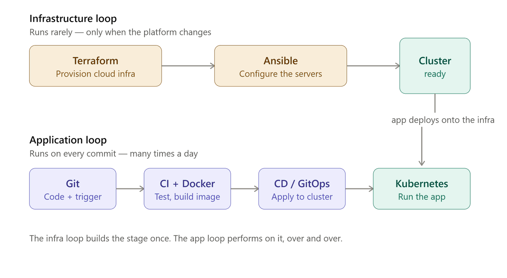
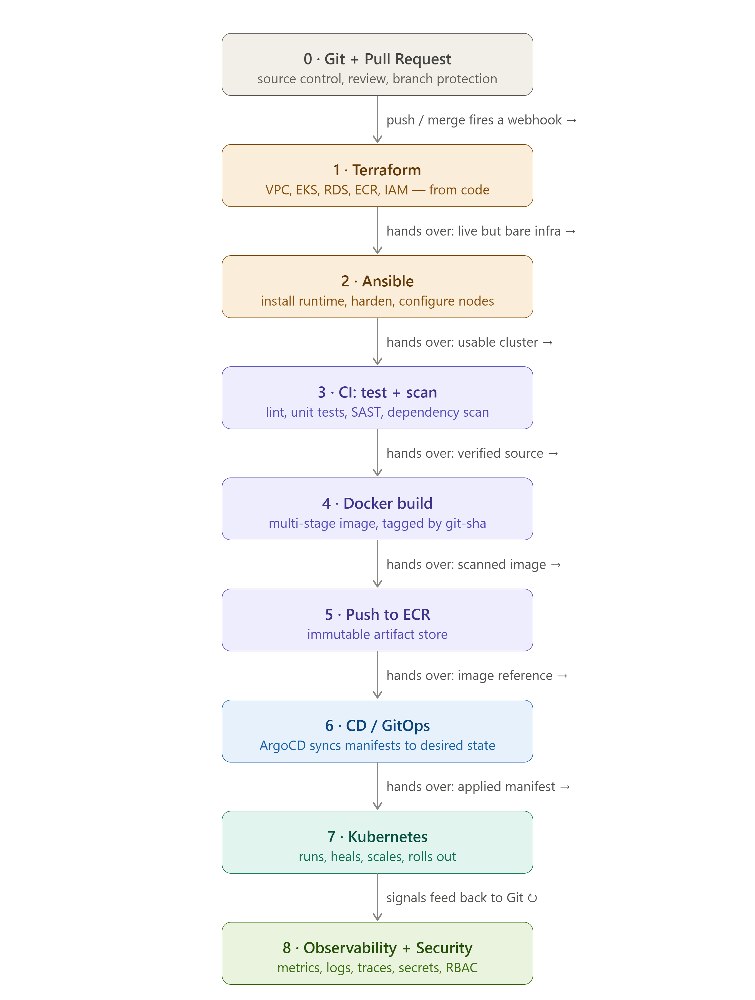

# The Connected System
### How all seven tools hand off to each other, end to end

> **Core question:** You've learned the tools one at a time. But production is not seven islands — it's one machine with seven moving parts. *Where exactly does each tool stop, and the next one begin?*

> **⏱️ Time:** ~40 min padho · **🎚️ Level:** Intermediate (synthesis) · **📋 Pehle chahiye:** [M0](01-M0-foundations.md)–[M7](08-M7-gitops.md)
>
> **Is module ke baad tum kar paoge:**
> - 2 loops, 8 bridges, 5 threads whiteboard pe draw karo — bina notes ke
> - Kisi bhi production failure ka diagnosis shuru karo: which bridge broke?
> - Ek `git push` se user ke browser tak ka poora path ek sentence mein sunaao — 30-minute interview answer ki tarah

> ### ↩️ Recall gate — shuru karne se pehle
> Pichhle modules se 3 sawaal. **Pehle memory se jawab do, phir kholo.** (Yeh retrieve karna hi lifetime yaad rakhta hai — dobara padhna nahi.)
>
> 1. *(M7)* Argo CD "pull model" hai — push model (CI direct deploy) ke mukable mein iska ek concrete security fayda kya hai?
> 2. *(M6)* CI pipeline ne image ECR pe push kar di. Cluster mein naya version pohunchane ke liye CI seedha `kubectl apply` karta hai — sahi ya galat? Agar galat, toh kya karta hai?
> 3. *(M4)* K8s reconciliation loop kya compare karta hai, aur agar koi pod manually delete kar do, toh kya hota hai?
>
> <details markdown="1"><summary>Jawab</summary>
>
> 1. Pull mein Argo cluster ke andar se Git read karta hai — cluster credentials kabhi bahar nahi jaate; CI ko kubeconfig ki zaroorat nahi. &nbsp; 2. Galat — CI sirf k8s manifest mein image tag update karta hai aur Git commit karta hai (Bridge 5); Argo baad mein Git se pull karta hai. &nbsp; 3. Desired state (spec replicas:3) vs current state (live pods:2) — controller loop missing pod wapas banata hai desired poora karne ke liye.
> </details>

This is the chapter that turns a pile of tools into a mental model. Read it after M0–M7. Everything here is **synthesis** — no new tools, just the joints between the ones you know. Master this and a whiteboard interview becomes a story you can tell for 30 minutes without pausing.

---

## The 60-second version

The whole stack is **two reconciliation loops sharing one Git repo**. The **outer loop** (Terraform → Ansible) builds the place things run — rarely, carefully; its servers are **Pets**. The **inner loop** (Git → CI → Registry → GitOps → Kubernetes → Users) ships the app — constantly, automatically; its pods are **Cattle**. Between every pair of tools is a **handoff** — a specific output one tool produces that the next consumes. There are **8 of these bridges**. And under all of it run **5 golden threads** — ideas (reconciliation, state-outside, preview-before-apply, push-vs-pull, idempotency) that repeat in every single tool.

> 🧠 **Memory hook:** *2 loops, 8 bridges, 5 threads.* If you can draw those three things, you understand DevOps.

---

## 1. The two loops (the map)

```
                        ┌───────────────────────────────────────────┐
                        │            GIT  — single source of truth    │
                        │   (infra code + app code + K8s manifests)   │
                        └───────┬──────────────────────────┬─────────┘
                                │                          │
   ═══════ OUTER LOOP ═════════▼══════╗       ╔═══════════▼═══════ INNER LOOP ═══════════
   ║  INFRASTRUCTURE  ("build the      ║       ║  DELIVERY  ("ship the app")             ║
   ║  house") — runs RARELY, Pets      ║       ║  runs EVERY PUSH, Cattle                ║
   ║                                   ║       ║                                         ║
   ║  Terraform ─▶ Cloud (VPC, EC2,    ║       ║  Code ─▶ CI (test+build) ─▶ image ─▶    ║
   ║  RDS, ECR, S3/DynamoDB)           ║       ║  Registry (ECR) ─▶ manifest-update in   ║
   ║      │                            ║       ║  Git ─▶ Argo CD (pull) ─▶ Kubernetes ─▶ ║
   ║      ▼                            ║       ║  Service ─▶ Ingress ─▶ LB ─▶ DNS ─▶     ║
   ║  Ansible (configure hosts,        ║       ║  Users                                  ║
   ║  kubeadm, Calico) ─▶ live cluster ║       ║                                         ║
   ╚═══════════════════════════════════╝       ╚═════════════════════════════════════════
```

The two loops meet in exactly one place: **the Kubernetes cluster**. The outer loop *produces* it; the inner loop *deploys into* it. Git is the shared brain both loops read from.

> 🇮🇳 **Hinglish intuition:** Outer loop = *neev aur ghar banao* (ek baar, mazbooti se). Inner loop = *rozana khana banao aur serve karo* (baar-baar, machine se). Dono ki common cheez ek hi: *recipe book* (Git).



*Figure 1: the two loops — outer (infra/Pets) and inner (delivery/Cattle) — meeting at the Kubernetes cluster, Git as the shared source of truth.*



*Figure 2: the same system unrolled left-to-right — every handoff (the 8 bridges below) shown as an arrow from one tool to the next.*

Full-resolution renders (and extra views) live in the repo root: `devops_two_loops_mental_model.png`, `two_loops_infra_vs_app.png`, `devops_full_pipeline_handoffs.png`, `full_production_flow_end_to_end.png`, `complete_production_pipeline_flow.png`, `kubernetes_controller_chain.png`.

---

## 2. The 8 Bridges

A **bridge** is a handoff: the concrete artifact tool A produces that tool B consumes. Learn the artifact and the *failure mode when the bridge breaks*, and you can debug any seam.

```
[Terraform]─①─▶[Ansible]─②─▶[Kubernetes cluster]        ← outer loop bridges
     │                                    ▲
     │(builds ECR, RDS)                   │③ (image pulled from ECR into a Pod)
     ▼                                    │
[Docker image]─③─▶[Registry/ECR]───────────┘
[git push]─④─▶[CI/Actions]─⑤─▶[Git manifest]─⑥─▶[Argo CD]─▶[Kubernetes]
[Pod]─⑦─▶[Service]─▶[Ingress]─▶[User]        [Pod]─⑧─▶[RDS]
```

| # | Bridge | The artifact that crosses | Failure mode when it breaks |
|---|--------|---------------------------|------------------------------|
| **1** | Terraform → Ansible | `terraform output` server **public IPs** → written into Ansible's `inventory.ini` | Wrong/empty IP → Ansible `UNREACHABLE` |
| **2** | Ansible → Kubernetes | 3 playbooks (common → `kubeadm init` on master → `kubeadm join` on workers) produce a **live cluster** | Missing containerd/swap-on → `kubeadm` fails; wrong join token → worker never joins |
| **3** | Docker → Pod | image **pushed to ECR**, then **pulled by kubelet** onto a node | Bad tag / no ECR auth → `ImagePullBackOff` |
| **4** | Push → CI | a `git push` to `main` matches `on: push:` → runs the workflow | Wrong branch filter → pipeline never triggers |
| **5** ⭐ | CI → Git manifest | CI **updates the image tag** inside the K8s manifest (via `sed`) and **commits** — it does **not** apply to the cluster | Forgot to update the manifest → cluster keeps the old image forever |
| **6** | Git → Argo → Kubernetes | Argo **pulls** the changed manifest and **applies** it → rolling update | Argo `OutOfSync` never syncs → new version never lands |
| **7** | Pod → Service → User | Service (stable IP) fronts ready pods via **EndpointSlice**; NodePort/Ingress exposes it | No ready pods in the slice → `Connection refused` / 503 |
| **8** | Pod → RDS | app connects `psycopg2 → rds-endpoint:5432` using an env-var host + a secret password | Wrong SG / password → connection timeout or auth error |

**Bridge 5 is the one interviewers probe.** Say it precisely: *"CI never touches the cluster. It only changes the desired state in Git — updates the image tag and commits. Argo CD, running inside the cluster, notices Git changed and pulls it. That separation is why the pipeline needs no cluster credentials sitting in GitHub."*

> 🇮🇳 **Hinglish intuition (Bridge 5):** CI *menu update karta hai* (Git me naya tag likhta), *khud khana serve nahi karta*. Serve karna Argo ka kaam hai. Isliye CI ke paas cluster ki chaabi rakhne ki zaroorat nahi.

---

## 3. The 5 Golden Threads

If the 8 bridges are the *joints*, the 5 threads are the *DNA* — the same idea wearing a different costume in each tool. Spot them and 9 tools collapse into 1 idea.

### Thread 1 — Reconciliation
> A control loop constantly compares **desired state** to **current state** and drives current → desired. It never stops.

| Tool | Desired state | Who reconciles |
|------|---------------|----------------|
| Terraform | `.tf` files + tfstate | you, when you run `apply` |
| Ansible | playbook `state=present` | you, when you run the playbook |
| **Kubernetes** | Deployment `replicas: 3` | the controller loop, **continuously** |
| **Argo CD** | the manifest in Git | Argo, **continuously (~3 min)** |

The leap: Terraform/Ansible reconcile *when you ask*; Kubernetes/Argo reconcile *forever, on their own*. That's why a deleted pod comes back and a hand-edited object gets reverted. **Learn reconciliation once in M4, and Argo's selfHeal is free.**

> 🇮🇳 **Hinglish intuition:** *Chowkidar jo 24/7 ginta hai* — "3 hone chahiye, 2 hain, ek aur banao." Yehi loop har jagah hai.

### Thread 2 — State outside, compute disposable
> Keep durable state (database, `tfstate`) *outside* the throwaway compute. Then servers and pods become **cattle** — kill and replace freely.

- `tfstate` → S3 (not your laptop) → any machine can run Terraform.
- App is stateless → pod dies → identical replacement, no data lost.
- DB is stateful → lives in **RDS outside the cluster**, backed up, never a casual pod.
- Because compute is disposable, you can run it on **Spot instances** (M5) and save 70%.

> 🇮🇳 **Hinglish intuition:** *State bahar nikaalo → server/pod disposable ban jaata hai.* Yehi cattle-not-pets ka asli mechanism hai.

### Thread 3 — Preview before apply
> Never change reality blind. Every tool has a dry-run.

| Tool | Preview command | It shows |
|------|-----------------|----------|
| Terraform | `terraform plan` | the diff before it touches AWS |
| Ansible | `ansible-playbook --check` | what *would* change |
| Kubernetes | `kubectl apply --dry-run=server` | validation without applying |
| CI/CD | the **test gate** | "does it even build & pass?" before shipping |

> 🇮🇳 **Hinglish intuition:** *Bill dekho, phir payment karo.* `plan` = bill, `apply` = payment.

### Thread 4 — Push vs Pull
> Who initiates the change — the doer reaching in, or the target reaching out?

| Model | Tools | Security consequence |
|-------|-------|----------------------|
| **Push** | Ansible, GitHub Actions | The initiator holds the target's credentials (SSH keys, cluster creds) |
| **Pull** | **Argo CD** | The agent lives *inside* the target and pulls — **no external creds leave the cluster** |
| The middle | **Git** | Neither pushes nor pulls; it just holds the truth both sides agree on |

This is *why* GitOps is considered more secure than CI-driven `kubectl apply`: with pull, GitHub never needs your cluster's admin credentials.

### Thread 5 — Idempotent
> Run it again, nothing new happens. The operation is `SET`, not `+=`.

`terraform apply` twice → no duplicate VPC. Ansible playbook twice → second run is all `ok`, zero `changed`. `kubectl apply` twice → same object. This is what makes automation *safe to retry* — the single most important property for a tool a machine runs unattended.

> 🇮🇳 **Hinglish intuition:** Switch (idempotent: "ON" dabao 10 baar, bulb ON hi rahega) vs Counter (`+=`: har dabane pe badhta). DevOps tools switch jaise hain.

---

## 4. The full end-to-end walkthrough

Now watch a single feature travel the entire system, crossing every bridge in order.

### Day 0 — Setup (outer loop, done once)
```
1. terraform apply        → VPC, 3× EC2, RDS, ECR, S3+DynamoDB lock created   [state → S3, Thread 2]
2. terraform output       → 3 server IPs                                       [Bridge 1]
3. edit inventory.ini      → paste the IPs                                     [Bridge 1]
4. ansible-playbook 1-common.yml   → containerd, swapoff, sysctl on all 3     [Thread 5: idempotent]
5. ansible-playbook 2-master.yml   → kubeadm init + Calico CNI                 [Bridge 2]
6. ansible-playbook 3-workers.yml  → kubeadm join × 2                          [Bridge 2]
   ▶ Result: a live Kubernetes cluster. The two loops now share this cluster.
```

### Day 1+ — Delivery (inner loop, every push)
```
7.  git push origin main            → matches on: push: [main]                 [Bridge 4]
8.  CI: pytest                       → test gate; fail = nothing ships          [Thread 3]
9.  CI: docker build + push to ECR   → image tagged with ${{ github.sha }}      [Bridge 3, immutable tag]
10. CI: sed image tag in k8s/deploy.yaml → git commit + push                    [Bridge 5 ⭐: change Git, NOT cluster]
11. Argo CD notices Git changed      → 3-way diff → OutOfSync → apply           [Bridge 6, Thread 1]
12. Kubernetes rolling update        → new ReplicaSet, readiness-gated          [Thread 1]
13. Service EndpointSlice updates     → traffic shifts to new pods              [Bridge 7]
14. Pod → RDS:5432                    → serves the request                      [Bridge 8]
15. User hits Ingress → Service → Pod → 200 OK
```

### When something goes wrong
```
Bug in prod?      → git revert <bad commit> → Argo pulls the old manifest → rollback.  [Thread 1 + Git = time machine]
Someone kubectl-edited a live pod?  → Argo selfHeal reverts it to match Git.           [Thread 1 + Thread 4]
tfstate deleted?  → Terraform thinks NOTHING exists → would try to rebuild everything.  [Thread 2: guard your state]
```

> 🇮🇳 **Hinglish intuition (rollback):** *Time machine ↩️* — galti hui to Git me peeche jao, Argo cluster ko wapas us waqt pe le aayega. Rollback = sirf Git history.

---

## 5. The connection web (one glance)

```
                         ┌──────────── TERRAFORM ────────────┐
                         │  builds: VPC, EC2, RDS, ECR, S3    │
                         └───────┬─────────────────┬─────────┘
                    IPs (Bridge1)│                 │creates ECR & RDS
                                 ▼                 │
                            ANSIBLE                 │
                    (kubeadm → cluster, Bridge2)    │
                                 │                 │
              ┌──────────────────▼─────────────────▼────────────────┐
              │                 KUBERNETES  CLUSTER                   │
              │   Deployment→ReplicaSet→Pod   •   Service→Ingress     │
              │        ▲ pulls image (Bridge3)   │ serves users       │
              └────────│──────────────▲──────────┼────────────────────┘
                       │              │Bridge6    │ Bridge7→ USERS
                  ECR  │         ARGO CD (pull)   │
                       │              ▲           │ Bridge8
              ┌────────┴──────┐       │Bridge5    ▼
              │ DOCKER image  │◀── CI/ACTIONS ── GIT ──▶ RDS (state, outside)
              │  (Bridge4: git push triggers CI)   │
              └─────────────────────────────────────┘

  Threads woven through ALL boxes:  ① reconcile  ② state-outside  ③ preview  ④ push/pull  ⑤ idempotent
```

---

## 6. Who owns what, in a real org

Systems thinking includes *people*. On a real team these boxes have different owners — knowing this is what separates a junior from someone who's shipped in production.

| Layer | Typical owner | What they're paged for |
|-------|---------------|------------------------|
| Terraform / cloud infra | Platform / Infra / Cloud team | VPC, IAM, account limits, cost |
| Ansible / host config | Platform / SRE | drift, patching, cluster bootstrap |
| Docker image / app code | Product / app developers | the app builds and runs |
| CI/CD pipeline | Platform provides, devs consume | broken builds, flaky tests |
| Kubernetes cluster | Platform / SRE | node health, capacity, upgrades |
| GitOps / Argo | Platform / SRE | sync failures, prod drift |
| Observability & on-call | SRE + the owning dev team | SLO burn, incidents (see [M8](10-M8-observability-sre.md)) |
| The database (RDS) | DBA / data platform | backups, failover, slow queries |

> **Senior insight:** the boundaries above are also *blast-radius* boundaries. When you design a change, ask "which of these owners do I need to tell, and what breaks if this box fails?" That question is 80% of an architecture review.

---

## 7. Who does what — the tool recall drill

Section 6 was about *people*. This one is about *tools*: **which tool owns which job.** Interviewers probe this constantly ("who deploys to the cluster?", "who runs the container?") — so drill it until the answer is instant. Cover the right column and quiz yourself.

**The layer stack (memorize this ONE picture):**
```
 App → Pods / Containers          ← KUBERNETES  (schedules, restarts, scales)
 Node OS: containerd, kubeadm      ← ANSIBLE     (installs & configures the node)
 The server: VM, VPC, subnet, disk ← TERRAFORM   (creates the infrastructure)
```
> 🇮🇳 **Hinglish intuition:** *"Terraform building banata, Ansible kitchen set karta (stove/utensils = containerd/kubeadm), Kubernetes chef hai jo dishes (pods) pakata."* Teen tools, teen layers, isi order me. Ansible cook nahi karta; K8s plumbing nahi bichata.

**Task → owner (the master table):**

| The task | Who does it | Layer |
|----------|-------------|-------|
| Create the VM / VPC / disk | **Terraform** | infra |
| Install runtime + kubeadm, disable swap, kernel tuning | **Ansible** | node OS |
| Form the cluster (init/join) | **kubeadm** (run by Ansible) | node OS |
| Build the container image | **Docker** (on the CI runner) | build |
| Store the image | **Registry** (ECR / GHCR / Hub) | build |
| Actually run a container | **containerd** (under kubelet) | node |
| Decide which node a pod runs on | **kube-scheduler** | control plane |
| Keep N replicas alive (self-heal) | **Deployment → ReplicaSet** | cluster |
| Route traffic to the right pods | **Service** (+ kube-proxy) / **Ingress** | cluster |
| Persist data beyond a pod | **PVC → PV** (→ EBS) | storage |
| Hold config / secrets | **ConfigMap / Secret** | cluster |
| Test → build → scan the code | **CI** (Jenkins / GitHub Actions) | pipeline |
| **Deploy to the cluster** | **ArgoCD** (GitOps) — **not CI!** | delivery |
| Observe (metrics/logs/alerts) | **Prometheus / Grafana / Loki** | observability |

> ⚠️ **The trap most people fall into:** thinking *CI deploys*. It doesn't — **CI writes to Git; ArgoCD reads from Git and deploys.** That separation (Bridge 5) is the whole point of GitOps.

**Where does each tool RUN?** (another recall-killer)

| Laptop / CI runner (clients) | Master node | Worker nodes |
|---|---|---|
| `terraform` (calls cloud API) | api-server + etcd | kubelet |
| `ansible` (SSH push) | scheduler, controllers | kube-proxy |
| `kubectl` (calls API) | ArgoCD (pods) | **containerd ← your pods run here** |
| `docker build`, `git push` | Prometheus / Grafana (pods) | |

> **Golden rule:** **clients** (Terraform, Ansible, kubectl, docker-build) run *from* your laptop/CI and command remote things; **servers** (containerd, kubelet, ArgoCD) run *on* the cluster. ArgoCD lives **inside** the cluster — that's what makes GitOps pull-based.

**Rapid-fire (cover the answers, drill until instant):**

<details markdown="1"><summary>Who does X? — jawab dekho</summary>

- Creates the EC2 instance? → **Terraform**
- Installs containerd + kubeadm? → **Ansible**
- Forms the cluster? → **kubeadm**
- Builds the Docker image? → **CI** (Docker on the runner)
- Stores the image? → **Registry**
- Runs the container on a node? → **containerd** (under kubelet)
- Decides which node? → **scheduler**
- Recreates a dead pod? → **ReplicaSet** (via the Deployment)
- Load-balances to pods? → **Service**
- Routes external HTTP by path? → **Ingress**
- Gives a pod persistent storage? → **PVC → PV** (EBS)
- Deploys the new image to the cluster? → **ArgoCD** (from Git) — *not CI*
- Watches Git for changes? → **ArgoCD**
- Collects metrics? → **Prometheus** · Shows dashboards? → **Grafana**
</details>

> 📎 The actual **commands** for each tool live in [Command Cheat-Sheets & Labs](22-command-cheatsheets.md) — this drill is *who*, that chapter is *how*.

---

## Summary

- The stack is **2 loops** (infra/outer/Pets + delivery/inner/Cattle) sharing **1 Git repo**; they meet at the **Kubernetes cluster**.
- **8 bridges** are the handoffs; each has a concrete artifact and a signature failure mode. **Bridge 5 (CI changes Git, not the cluster)** is the one to nail.
- **5 golden threads** — reconciliation, state-outside, preview-before-apply, push-vs-pull, idempotent — recur in every tool. Learn each once, reuse everywhere.
- A feature travels: `push → test → build → ECR → manifest-update → Argo → rolling update → Service → RDS → user`. Rollback is just `git revert`.
- Real orgs split these layers across **owners**; the boundaries double as **blast-radius** boundaries.

## Self-check quiz

Pehle memory se jawab do, phir neeche kholo.

1. Name the 8 bridges and one failure mode for each.
2. Which bridge is the CI→CD seam, and why does CI *not* touch the cluster?
3. Give the same golden thread (reconciliation) as it appears in four different tools.
4. tfstate is deleted. What does the next `terraform plan` think, and why is that dangerous?
5. Why is Argo's **pull** model considered more secure than CI-driven `kubectl apply` (**push**)?
6. Someone runs `kubectl edit` on a live Deployment. Walk through what Argo does and which thread explains it.
7. Where does durable state live in this system, and what does that let you do with compute?

<details markdown="1"><summary>Jawab dekho</summary>

1. B1 TF→Ansible: IPs→inventory; UNREACHABLE. B2 Ansible→K8s: 3 playbooks live cluster banate hain; kubeadm fail / wrong join token. B3 Docker→Pod: ECR image kubelet pull karta hai; ImagePullBackOff. B4 push→CI: git push workflow trigger karta hai; wrong branch filter. B5⭐ CI→Git manifest: image tag update+commit, cluster seedha nahi; manifest update bhool gaye → old image chalta rehta. B6 Git→Argo→K8s: Argo pull+apply karta hai; OutOfSync sync nahi hua. B7 Pod→Service→User: EndpointSlice ready pods route karta hai; koi ready pods nahi → 503. B8 Pod→RDS: psycopg2 se RDS:5432 connect; wrong SG ya bad password → timeout.
2. Bridge 5. CI cluster ko seedha nahi chhuta — sirf Git mein manifest update karta hai. Argo (cluster ke andar) Git se pull karke apply karta hai. Isliye CI ke paas cluster credentials nahi chahiye.
3. Terraform: `apply` .tf files vs tfstate/live AWS compare karta hai. Ansible: playbook `state=present` vs host reality. Kubernetes: Deployment spec vs live ReplicaSet/Pod count, continuously. Argo CD: Git manifest vs live cluster, har ~3 min.
4. Terraform koi state nahi dekhta → sochta hai kuch bhi provisioned nahi → `plan` "sab kuch create karo" kehta hai → apply karo toh duplicate VPC/EC2/RDS banane ki koshish — name conflicts ya costly duplicates. State file = Terraform ki yaadaasht.
5. Pull (Argo): creds cluster ke andar hain, Argo Git ko outbound read karta hai — CI ke paas kuch nahi. Push (CI kubectl): CI ke paas kubeconfig — CI hack = cluster gaya.
6. Argo OutOfSync detect karta hai (Cause B — cluster drifted). selfHeal:true hai toh Git manifest wapas apply karta hai, manual edit revert. Thread 1 (reconciliation) — current state ko desired state tak drive karo, hamesha.
7. Durable state: tfstate → S3; DB → RDS (cluster ke bahar). Yeh compute ko disposable banata hai — pods aur servers Cattle hain, kill and replace freely, koi data loss nahi.
</details>

## Hands-on lab
On paper (no cloud spend), from memory:
1. Draw the two loops and label which tools live in each.
2. Draw all 8 bridges as arrows; annotate each arrow with its artifact and failure mode.
3. Pick one golden thread and write the one line proving it appears in Terraform, Ansible, Kubernetes, and Argo.
4. Trace a single `git push` all the way to a user's browser, naming every bridge it crosses.
5. Now trace a **rollback** and a **selfHeal** event. Compare — which threads does each use?

**✅ Sahi hua to aisa dikhega:** If you can do all five from memory, you're ready for a systems-design interview.

## Interview questions
1. *"Walk me through what happens from `git push` to the change being live for users."* (This chapter, section 4 — the whole answer.)
2. *"CI or Argo — who applies to the cluster? Why is that separation valuable?"*
3. *"What's the difference between drift and lost state, and how does each get fixed?"* (Thread 1 + Thread 2; see [M1](02-M1-terraform.md).)
4. *"Your Terraform state file is gone. What's your recovery plan and what's the blast radius?"*
5. *"Why do we keep the database in RDS instead of a Kubernetes pod?"* (Thread 2 — state outside; see [M4](05-M4-kubernetes-core.md).)
6. *"Explain push vs pull deployment models and their security tradeoff."* (Thread 4.)

## Production challenge
A deploy went out 20 minutes ago. Users report 502s. You have: green CI, Argo showing **Synced/Healthy**, pods **Running**. Using the bridges as a checklist, write the ordered sequence of checks you'd run — from Bridge 7 (Service→Pod, is anything in the EndpointSlice?) back through Bridge 6 (did Argo actually apply the intended image?) to Bridge 8 (can the pod reach RDS?). Name the single command you'd run at each bridge. (Cross-reference the per-hop debug commands in [M9 §The full instrumented request lifecycle](11-M9-advanced-k8s-internals.md).)

---

*Next → [M8 — Observability & SRE](10-M8-observability-sre.md): now that you can draw the system, learn to see inside it while it's running.*
