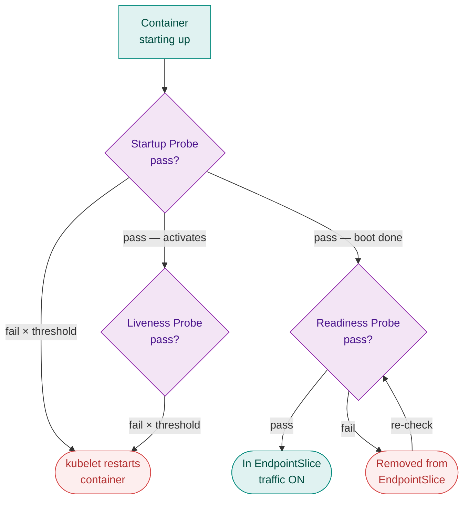
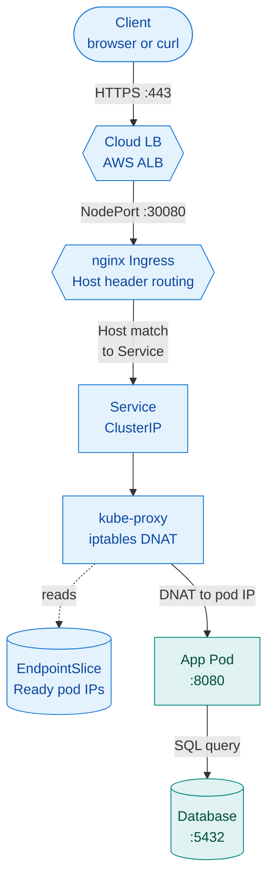

# M9 — Advanced Kubernetes Internals & Production Patterns

> **Core question: Probes, QoS, DNS, graceful shutdown, HPA, RBAC, Ingress — what really happens inside, and how do I debug it?**

> **⏱️ Time:** ~75 min padho + 40 min lab · **🎚️ Level:** Advanced · **📋 Pehle chahiye:** [M4](05-M4-kubernetes-core.md), [M5](06-M5-sizing-and-cost.md)
>
> **Is module ke baad tum kar paoge:**
> - `kubectl apply` ke saaton steps trace karo — apiserver se etcd, scheduler, kubelet tak
> - Liveness, readiness, aur startup probe ke alag fail-actions explain karo aur liveness footgun se bacho
> - Ingress Host-header routing debug karo, HPA formula apply karo, aur RBAC four-object model implement karo

**MODULE MAP**
`00-INDEX` · `01-M0-foundations` · `02-M1-terraform` · `03-M2-ansible` · `04-M3-docker` · `05-M4-kubernetes-core` · `06-M5-sizing-and-cost` · `07-M6-cicd` · `08-M7-gitops` · `09-connected-system` · `10-M8-observability-sre` · **`11-M9-advanced-k8s-internals`** · `12-capstone-url-shortener` · `13-capstone-microshop` · `14-interview-bank` · `15-roadmap` · `16-reference-appendix`

M4 (`05-M4-kubernetes-core`) taught you the vocabulary: pods, Deployments, Services, ReplicaSets. This chapter goes under the hood — the internal machinery every senior engineer and every technical interviewer expects you to own. Concepts are production-grade; debug commands are real; Hinglish intuition anchors are for the brain, not the exam.

---

> ### ↩️ Recall gate — shuru karne se pehle
> Pichhle modules se 3 sawaal. **Pehle memory se jawab do, phir kholo.** (Yeh retrieve karna hi lifetime yaad rakhta hai — dobara padhna nahi.)
>
> 1. *(M4)* Kubernetes mein Service ka kya role hai — pod delete hone ke baad bhi traffic kyun nahi rukti?
> 2. *(M5)* Ek pod ka `requests.memory: 128Mi` aur `limits.memory: 256Mi` set hai — yeh pod kaunsi QoS class mein aayega aur memory pressure pe kaunse pod ke baad evict hoga?
> 3. *(M8)* "p99 latency = 2s" aur "average latency = 200ms" — dono mein se interviewer ko kaun sa metric zyada batata hai, aur kyun?
>
> <details markdown="1"><summary>Jawab</summary>
>
> 1. Service = fixed ClusterIP + DNS name; selector se Ready pods ko traffic route hota hai. Pod IP change ho ya pod delete ho — Service name same rehta, kube-proxy new pod ko EndpointSlice mein add karta hai. &nbsp; 2. Burstable (requests < limits). Guaranteed ke baad, BestEffort se pehle evict hoga. &nbsp; 3. p99 — average mein outliers chhup jaate hain; p99 batata hai worst 1% users ki experience jo sabse zyada feel karte hain.
> </details>

## The 60-second version

Six machines (apiserver, etcd, scheduler, controller-manager, kubelet, kube-proxy) run independent reconciliation loops watching the same shared source of truth (etcd). None waits for a boss — each checks desired vs actual and acts. `kubectl apply` is just you writing a new "desired" into that truth. Every component responds within milliseconds.

Traffic reaches a pod only when it passes a readiness probe. When you pull the plug on a pod, Kubernetes removes it from the load-balancer slice *and* sends it SIGTERM — but these two events race, so a `preStop: sleep` is the production-grade fix. QoS classes decide which pod dies first when RAM runs out. HPA adds replicas using a ceiling-division formula, but refuses to remove them for five minutes to avoid flapping. RBAC constrains what each identity *inside* the cluster can touch. Ingress translates Host headers to backend Services. StatefulSets give each replica a persistent disk that survives pod restarts.

That is the full surface. Read on for the internals.

---

## A. Control Plane & the `kubectl apply` Journey

### The five actors (plus two)

| Actor | Node | Responsibility | Port |
|---|---|---|---|
| **kube-apiserver** | Control-plane | Every request gateway — kubectl, components, kubelet all talk *only* to this | 6443 |
| **etcd** | Control-plane | Distributed key-value store; cluster's only persistent truth | 2379 (client), 2380 (peer) |
| **kube-scheduler** | Control-plane | Assigns unscheduled pods to nodes (resources, taints, affinity) | — |
| **kube-controller-manager** | Control-plane | Runs all reconciliation loops (Deployment, ReplicaSet, Node, EndpointSlice, …) | — |
| **kubelet** | Every node | Reads pod specs; tells containerd to start/stop containers; reports status back | 10250 |
| **kube-proxy** | Every node | Programs iptables / IPVS rules so Service IPs route to real pod IPs | — |
| **containerd** | Every node | The actual container runtime (pulls images, runs Linux namespaces/cgroups) | — |

> **Rule:** Only apiserver touches etcd directly. All other components talk to apiserver, which reads/writes etcd. Break this rule mentally and you will misdiagnose cluster failures.

🇮🇳 **Hinglish intuition:** Office analogy — apiserver = reception desk (sab isse baat karte), etcd = company ki register (sach yahaan likha hai), scheduler = seating manager (kaun kahan baithega), controller-manager = chowkidar (har cheez check karta), kubelet = floor worker (actual kaam karta), kube-proxy = trafficwala (call forward karta).

### The seven-step `kubectl apply` journey

```
You                Control Plane                        Worker Node
─────────────────────────────────────────────────────────────────────
1. kubectl apply ──► apiserver validates YAML
                         │
                    2. apiserver writes Deployment → etcd
                         │
                    3. Deployment controller watches etcd
                       sees "need ReplicaSet" → creates it → etcd
                         │
                    4. ReplicaSet controller watches
                       sees "need 2 pods, have 0" → creates Pod objects → etcd
                         │
                    5. Scheduler watches etcd
                       sees 2 unscheduled pods → assigns each to a worker node
                       writes nodeName onto Pod object → etcd
                         │
                                          6. kubelet (worker) watches apiserver
                                             sees pod assigned to it
                                             calls containerd → pulls image → starts container
                                          │
                                          7. kubelet writes status (Running/Ready) → apiserver → etcd
```

Each arrow is a **watch** (long-poll/gRPC stream from etcd), not a cron poll. Events are pushed; response is sub-second end-to-end on healthy clusters.

### etcd internals: Raft quorum, SPOF, backup

**Raft consensus** requires a quorum: majority of nodes must agree before a write commits. With 3 etcd nodes, 2 must be alive (survives 1 failure). With 5, survives 2. The rule: always deploy odd numbers (1/3/5) — even numbers buy zero extra fault tolerance.

```
3-node etcd (port :2380 peer, :2379 client)

  [etcd-1]  ◄──── Raft ────►  [etcd-2]
      └──────── Raft ─────────►  [etcd-3]

Write: leader gets request → replicates to follower → majority ACK → commit
Read (linearizable): always goes to leader
```

> **Single control-plane = SPOF.** The capstone runs one control-plane node. Production clusters run 3 or 5. etcd backup: `etcdctl snapshot save /backup/snap.db` — treat it like Terraform state (lose it = cluster amnesia).

**Debug commands — control plane:**
```bash
# Are control-plane components alive? (static pods in /etc/kubernetes/manifests)
kubectl get pods -n kube-system

# Node-level: is kubelet running?
systemctl status kubelet

# Node-level: what containers is containerd running (bypasses apiserver)?
crictl ps

# etcd health
etcdctl endpoint health --endpoints=https://127.0.0.1:2379 \
  --cacert=/etc/kubernetes/pki/etcd/ca.crt \
  --cert=/etc/kubernetes/pki/etcd/peer.crt \
  --key=/etc/kubernetes/pki/etcd/peer.key
```

---

## B. Networking Internals

### CNI (Container Network Interface) — cross-node pod routing

**Problem:** Pod-A is on worker-1 (10.0.1.10). Pod-B is on worker-2 (10.0.1.11). Their pod IPs (192.168.x.x) are inside the same flat /16 CIDR — but those IPs do not exist on the physical network between nodes. How does a packet from Pod-A reach Pod-B?

**Answer:** The CNI plugin (Calico is common) installs kernel routes on each node so that each node knows "packets for pod-CIDR of worker-2 go out eth0 toward 10.0.1.11". Three main modes:

| Mode | Mechanism | Tradeoff |
|---|---|---|
| **BGP** (Calico native) | Real kernel routes via BGP advertisements — no encapsulation | Fastest; requires L2/L3 reachability between nodes |
| **Overlay (IPIP / VXLAN)** | Wraps pod packet inside a host packet — works on any underlay | ~5–10% throughput overhead; universal compatibility |
| **eBPF dataplane** (Calico/Cilium) | Replaces kube-proxy entirely; kernel programs via eBPF hooks | Lowest latency; best observability; newer, needs kernel ≥5.3 |

> **Without CNI:** `kubeadm init` completes but CoreDNS pods stay `Pending` and nodes stay `NotReady`. Fix: `kubectl apply -f calico.yaml` immediately after init.

🇮🇳 **Hinglish intuition:** CNI = inter-city highway. Har pod ek ghar hai. Bina highway ke sirf apne mohalle (node) mein jaa sakte ho. CNI highways banata hai node se node tak — har ghar se har ghar seedha.

### Service → EndpointSlice → pod (with kube-proxy)

```
kubectl apply Service (selector: app=api)
        │
        ▼
EndpointSlice controller watches:
  "which pods match selector AND are Ready?"
        │
        ▼
EndpointSlice object: [ pod-A:8080, pod-C:8080 ]
  (pod-B excluded: readiness probe failing)
        │
        ▼
kube-proxy on every node reads EndpointSlice
  programs iptables/IPVS rules:
  "ClusterIP:80 → DNAT → one of [pod-A:8080, pod-C:8080]"
        │
        ▼
Traffic from any pod/node → ClusterIP:80 → real pod
```

**EndpointSlice vs legacy Endpoints:**

| Feature | Endpoints (legacy) | EndpointSlice (default since K8s 1.21) |
|---|---|---|
| Max entries per object | unbounded (performance cliff) | ~100 per slice |
| Scale | O(n) updates on any pod change | Only affected slice updated |
| Protocol support | TCP/UDP | TCP/UDP/SCTP |
| Topology hints | No | Yes (zone-aware routing) |
| Debug command | `kubectl get endpoints` | `kubectl get endpointslices` |

🇮🇳 **Hinglish intuition:** EndpointSlice = abhi kaun apne desk pe ready hai ki live list. Service clerk hai — woh list dekh ke call forward karta hai sirf ready logon ko.

**iptables vs IPVS:**

| | iptables | IPVS (IP Virtual Server) |
|---|---|---|
| Data structure | Linked list of rules | Hash table |
| Lookup time | O(n) — slows with cluster size | O(1) hash lookup |
| 1,000-service cluster | Noticeable latency | Negligible |
| Load-balancing algos | Round-robin only | RR, least-conn, source-hash |
| Default | Yes (most clusters) | Opt-in via kube-proxy `--proxy-mode=ipvs` |

> For >500 Services, switch to IPVS. iptables with 10,000+ rules adds measurable per-packet overhead.

### CoreDNS — Service DNS

Every Service gets a DNS name: `<service>.<namespace>.svc.cluster.local`

```
# From a pod, same namespace:
curl http://api-service/endpoint         # short name, same namespace

# Cross-namespace:
curl http://api-service.payments.svc.cluster.local/endpoint

# CoreDNS lives at:
kubectl get svc -n kube-system kube-dns  # typically 10.96.0.10

# Pod's /etc/resolv.conf (set by kubelet):
nameserver 10.96.0.10
search default.svc.cluster.local svc.cluster.local cluster.local
```

**Debug DNS failures:**
```bash
# From inside a running pod:
kubectl exec -it <pod> -- nslookup api-service
kubectl exec -it <pod> -- nslookup api-service.default.svc.cluster.local

# Is CoreDNS itself healthy?
kubectl get pods -n kube-system -l k8s-app=kube-dns
kubectl logs -n kube-system -l k8s-app=kube-dns
```

🇮🇳 **Hinglish intuition:** Phone contact list. Number (IP) yaad nahi rakhte — naam se call karte. CoreDNS = cluster ka contacts app. Naam likho, IP automatically milta.

### Ingress + TLS — production HTTP routing

**Why not NodePort for production?**
NodePort (`30000–32767`) exposes a raw TCP port on every node. No TLS termination. No host-based routing. No path-based routing. You get one port per Service. For production HTTP/HTTPS with multiple services, you need Ingress.

```
Internet
   │ :443 (HTTPS)
   ▼
[ Load Balancer / NodePort ]
   │
   ▼
[ Ingress Controller — nginx pod(s) ]
   │  reads all Ingress objects in cluster
   │  programs nginx.conf dynamically
   │
   ├── Host: api.example.com   → Service: api-svc:80
   ├── Host: app.example.com   → Service: frontend-svc:80
   └── Host: api.example.com/admin → Service: admin-svc:80
```

**Ingress resource YAML (example):**
```yaml
apiVersion: networking.k8s.io/v1
kind: Ingress
metadata:
  name: api-ingress
  annotations:
    cert-manager.io/cluster-issuer: "letsencrypt-prod"
spec:
  ingressClassName: nginx
  tls:
  - hosts:
    - api.example.com
    secretName: api-tls-secret      # cert-manager writes cert here
  rules:
  - host: api.example.com
    http:
      paths:
      - path: /
        pathType: Prefix
        backend:
          service:
            name: api-svc
            port:
              number: 80
```

**cert-manager + Let's Encrypt flow:**
```
cert-manager watches Ingress objects
   │ sees annotation: cert-manager.io/cluster-issuer
   │
   ▼
Creates CertificateRequest → ACME challenge
   │ Let's Encrypt validates domain (HTTP-01 or DNS-01)
   │
   ▼
TLS certificate stored in Kubernetes Secret (api-tls-secret)
   │
   ▼
nginx Ingress Controller reads Secret → terminates TLS → forwards HTTP internally
```

> **Production gotcha "404 from nginx / Host header not matched":** If you `curl http://<node-ip>:30080/` but your Ingress rule says `host: api.example.com`, nginx cannot match the request — it returns 404 or the nginx default page. Fix: send the correct Host header (`curl -H 'Host: api.example.com' ...`) or set up real DNS. The Ingress controller routes on the HTTP `Host:` header, not the IP.

> 🔧 **War story:** `curl http://<node-ip>:30080/api/` pe nginx ka default page aa raha tha — backend pods bilkul theek the; culprit tha `Host:` header jo request mein absent tha, Ingress rule se match nahi kiya. `curl -H 'Host: api.example.com' ...` se 200 mila, phir samjha. Poori kahani + lesson → [Interview Bank](14-interview-bank.md).

**Debug Ingress:**
```bash
kubectl get ingress                        # shows ADDRESS (load balancer IP)
kubectl describe ingress api-ingress       # shows rules + backend status
kubectl logs -n ingress-nginx deploy/ingress-nginx-controller  # nginx error logs
kubectl get certificate                    # cert-manager certificate status
kubectl describe certificate api-tls-secret  # see ACME challenge progress
```

### NetworkPolicy — pod-to-pod firewall inside the cluster

By default, every pod can talk to every other pod in the cluster — a flat allow-all network. NetworkPolicy lets you add firewall rules *inside* K8s.

> NetworkPolicy complements AWS Security Groups: SGs operate at the *node* (EC2 instance) level. NetworkPolicy operates at the *pod* level — same node, different pods can be isolated.

```yaml
# Default-deny all ingress to namespace
apiVersion: networking.k8s.io/v1
kind: NetworkPolicy
metadata:
  name: default-deny-ingress
  namespace: payments
spec:
  podSelector: {}          # matches ALL pods in namespace
  policyTypes:
  - Ingress                # deny all inbound; no ingress rules = deny all

---
# Allow only api pods to reach db pods on :5432
apiVersion: networking.k8s.io/v1
kind: NetworkPolicy
metadata:
  name: allow-api-to-db
  namespace: payments
spec:
  podSelector:
    matchLabels:
      role: db
  policyTypes:
  - Ingress
  ingress:
  - from:
    - podSelector:
        matchLabels:
          role: api
    ports:
    - protocol: TCP
      port: 5432
```

**Pattern: default-deny first, then allow-list.** Create `default-deny-ingress` for every namespace, then add explicit allow policies. NetworkPolicy requires a CNI that supports it (Calico, Cilium — not all do).

---

## C. Pod Lifecycle & Health

### The three probes — distinct actions, distinct timing

| Probe | Question it answers | Fail action | When it runs |
|---|---|---|---|
| **Startup** | "Has the application finished booting?" | Restarts container (but holds readiness/liveness until it passes) | Only during initial startup |
| **Readiness** | "Is the pod ready to receive traffic right now?" | Removes pod from EndpointSlice — traffic stops, pod stays alive | Entire pod lifetime |
| **Liveness** | "Is the process stuck / deadlocked?" | Restarts container (kills it) | Entire pod lifetime |



*Probe lifecycle: startup probe gates liveness + readiness during slow boot; readiness failure pulls the pod from traffic without killing it; liveness failure restarts the container.*

**Key interaction:** Startup probe blocks liveness and readiness probes until it passes. Without it, a slow-starting app (30-second JVM warmup) gets killed by liveness before it finishes booting → `CrashLoopBackOff` despite correct code.

```yaml
livenessProbe:
  httpGet:
    path: /healthz
    port: 8080
  initialDelaySeconds: 0       # startup probe handles the delay
  periodSeconds: 10
  failureThreshold: 3
  timeoutSeconds: 5

readinessProbe:
  httpGet:
    path: /ready
    port: 8080
  periodSeconds: 10
  failureThreshold: 3

startupProbe:
  httpGet:
    path: /healthz
    port: 8080
  failureThreshold: 30         # 30 × 10s = 300s max boot time allowed
  periodSeconds: 10
```

**Debug probes:**
```bash
kubectl describe pod <name>    # Events section: "Liveness probe failed", "Readiness probe failed"
kubectl get events --field-selector involvedObject.name=<pod>
```

🇮🇳 **Hinglish intuition:** Naya employee analogy. Startup = "training poori hui?" (sirf joining ke waqt). Readiness = "abhi kaam ke liye available ho?" (poori zindagi). Liveness = "behosh to nahi?" (poori zindagi). Teen alag sawaal, teen alag consequences.

> 🔮 **Predict pehle (socho, phir aage padho):** Tum liveness probe ke andar database ka health check daal dete ho. DB thodi slow ho jaati hai. Saare pods ka kya hota hai?

### The liveness footgun — cascading restarts

This is one of the most common production disasters. Do not put external dependency checks in the liveness probe.

```
WRONG: liveness hits /healthz-deep which checks DB connection
   │
   DB hits load spike → response slows to 3s
   │ liveness timeoutSeconds:1 → FAIL
   │
   kubelet restarts ALL pods (liveness failed)
   │
   Restarted pods ALL try to reconnect to DB simultaneously
   │ DB load spikes further
   │ Liveness fails again → ALL pods restart again
   │
   ☠️ Cascading restart loop. DB glitch became full outage.
```

**Rule:**
- **Liveness** = only checks whether *this process itself* is alive/not-deadlocked. An in-process health flag is enough. Never check DB, cache, or external APIs.
- **Readiness** = checks whether the pod is ready to serve traffic, including dependency availability. Readiness failure removes the pod from load balancing (traffic stops) without killing it — the correct response to a slow DB.

🇮🇳 **Hinglish intuition:** Liveness = smoke detector. Chhoti dhuaan pe poori building khali kara di — rescue ke bajaye aur bada haadsa. External dependency ko liveness mein daalna = building-level panic trigger for a neighbour's cigarette.

### QoS classes — who dies first when RAM runs out

K8s derives a QoS (Quality of Service) class from the `requests` and `limits` you set. When node memory pressure occurs, the kubelet evicts in QoS order.

| QoS Class | How to get it | OOM eviction order |
|---|---|---|
| **Guaranteed** | `requests.cpu == limits.cpu` AND `requests.memory == limits.memory` (both set, both equal) | Last to be evicted |
| **Burstable** | `requests < limits`, or only one of cpu/memory set | Middle |
| **BestEffort** | No requests, no limits at all | **First to die** |

```bash
kubectl describe pod <name> | grep "QoS Class"  # shows assigned class
```

> **Critical workloads:** always set `requests == limits` (Guaranteed class). A monitoring pod accidentally left as BestEffort will be the first victim when the node runs hot.

🇮🇳 **Hinglish intuition:** Titanic lifeboat priority. Guaranteed = first class (pehle life-jacket). BestEffort = ticket nahi tha (paani mein pehle). requests/limits hi teri ticket class decide karte hain.

### Graceful shutdown — the other half of zero-downtime

Zero-downtime has two halves: the new pod becoming ready (readiness) and the old pod draining cleanly (graceful shutdown). Both are required.

```
Pod termination sequence:
──────────────────────────────────────────────────────
t=0   kubelet sends SIGTERM to container
      AND
      endpoint controller removes pod from EndpointSlice

Problem: these two events are async.
  SIGTERM may arrive before kube-proxy has propagated
  the slice update to all nodes.
  → New requests still arrive while app is shutting down.
  → App gets SIGTERM and closes → connection reset → 502.

Fix: preStop hook adds a sleep buffer
──────────────────────────────────────────────────────
lifecycle:
  preStop:
    exec:
      command: ["sleep", "5"]   # wait for slice propagation before SIGTERM

Then:
  t=0   preStop hook starts (sleep 5)
  t=5   SIGTERM sent (slice already removed → no new traffic)
  t=5   App drains in-flight requests
  t=30  terminationGracePeriodSeconds → SIGKILL if still alive
```

```bash
# Check if graceful shutdown is configured:
kubectl get pod <name> -o yaml | grep -A5 lifecycle
kubectl get pod <name> -o yaml | grep terminationGracePeriodSeconds
```

🇮🇳 **Hinglish intuition:** Dukaan band karna. "Closed" sign lagao (slice se hato) — naye customer mat aao. Andar jo hain unhe finish karne do (in-flight requests). Phir shutter girao (SIGKILL). SIGTERM = "andar walon ko niklne do" signal.

### Pod lifecycle phases, conditions, and container states

**Pod phases (top-level status):**

| Phase | Meaning | First debug command |
|---|---|---|
| `Pending` | Not yet scheduled, or image pulling | `kubectl describe pod` (Events) |
| `Running` | At least one container running (may not be Ready) | `kubectl describe pod`, `kubectl logs` |
| `Succeeded` | All containers exited with code 0 (Jobs) | `kubectl logs` |
| `Failed` | Container exited non-zero | `kubectl logs --previous` |
| `Unknown` | kubelet unreachable | `kubectl describe node` |

**Container states (under each container):**

| State | Common reason | Fix direction |
|---|---|---|
| `Waiting: ContainerCreating` | Image pulling | Check image tag, registry auth |
| `Waiting: ImagePullBackOff` | Image not found / registry auth failure | `kubectl describe pod` → check image name, `imagePullSecrets` |
| `Waiting: CrashLoopBackOff` | Container starts then exits | `kubectl logs --previous` |
| `Terminated: OOMKilled (137)` | RAM limit exceeded | Raise limits or fix memory leak |

**READY 0/1:** Container is Running but readiness probe fails. Pod is alive but receiving zero traffic. Check `kubectl describe pod` for readiness probe events.

**CrashLoopBackOff backoff:** 10s → 20s → 40s → 80s → 160s → capped at **300s**. The doubling delay is why a recently-crashed pod seems "fine" but was restarting minutes ago.

---

## D. Autoscaling Internals (HPA)

HPA (Horizontal Pod Autoscaler) scales the *number of pods*. It does not scale nodes (that is Cluster Autoscaler — different component, see `06-M5-sizing-and-cost`).

### The formula

```
desiredReplicas = ceil( currentReplicas × (currentMetricValue / targetMetricValue) )

Example:
  currentReplicas = 3
  currentCPU = 90%
  targetCPU = 50%
  desiredReplicas = ceil(3 × 90/50) = ceil(5.4) = 6
```

### What HPA needs to function

1. **metrics-server** installed in the cluster — it scrapes kubelet for pod CPU/memory every 15s. Without it, `kubectl get hpa` shows `<unknown>/50%` and never scales.
2. **`requests` set on pods** — the percentage is computed as `currentUsage / requests`. Without a request baseline, the percentage cannot be calculated.

```bash
kubectl get hpa                     # shows current metrics and target
kubectl top pods                    # if this works, metrics-server is up
kubectl describe hpa <name>         # full event log of scale decisions
```

### Scale-up fast, scale-down slow

| Direction | Default behavior | Why |
|---|---|---|
| **Scale up** | Immediate (next check cycle, ~15s) | Under-provisioning hurts users now |
| **Scale down** | Waits 300s stabilization window | Prevents "flapping" — remove pods, load comes back, add pods, remove again |

```yaml
spec:
  behavior:
    scaleDown:
      stabilizationWindowSeconds: 300   # wait 5 min before removing pods
    scaleUp:
      stabilizationWindowSeconds: 0     # scale up immediately
```

🇮🇳 **Hinglish intuition:** Cruise control. Target speed set karo (CPU 50%). Load badha — system accelerate karta (fast). Load ghata — brakes dheere-dheere lagata (slow, taaki bump par baar-baar accelerate/brake na karna pade = flapping).

---

## E. State & Security

### StatefulSet / PV / PVC lifecycle

**Use StatefulSets when each replica needs its own stable identity and its own persistent disk** — databases, message brokers, distributed stores. Deployments are wrong for these: they share identity and have no persistent disk association.

```
StatefulSet "postgres" (replicas: 3)
  │
  ├── postgres-0  ←── PVC: data-postgres-0  ←── PV (10Gi disk)
  ├── postgres-1  ←── PVC: data-postgres-1  ←── PV (10Gi disk)
  └── postgres-2  ←── PVC: data-postgres-2  ←── PV (10Gi disk)

Ordered startup: 0 starts first, becomes Ready, then 1, then 2.
Ordered delete: 2 first, then 1, then 0.
```

**Stable identity:**
- DNS hostname: `postgres-0.postgres-headless.default.svc.cluster.local`
- This hostname is stable across restarts — if postgres-0 restarts, it comes back as postgres-0 on the same disk.

**PV (Persistent Volume) and PVC (Persistent Volume Claim) lifecycle:**

| Concept | What it is |
|---|---|
| **PV** | A piece of storage in the cluster (provisioned by admin or dynamically) |
| **PVC** | A request for storage by a pod/StatefulSet — binds to a matching PV |
| **StorageClass** | Defines how PVs are dynamically provisioned (e.g., `local-path` on bare clusters, `gp3` on EKS) |

**Critical behavior — deleting a StatefulSet does NOT delete PVCs.** The PVCs (and thus the PVs and the data) survive. This is intentional: data outlives the controller. You must explicitly delete PVCs to free storage.

```bash
kubectl get pvc                        # see all claims and their bound PVs
kubectl describe pvc data-postgres-0   # see binding status and capacity
kubectl get pv                         # see all PVs in cluster

# Dynamic provisioning (StorageClass local-path on bare-metal):
kubectl get storageclass
```

> **Bare cluster gotcha:** Without a StorageClass + provisioner (e.g., `rancher/local-path-provisioner`), PVCs stay in `Pending` forever — no PV is created. Install a provisioner before deploying StatefulSets.

### RBAC — Role-Based Access Control

RBAC (Role-Based Access Control) controls what identities (users, service accounts) can do inside the K8s API. It is additive — by default, a ServiceAccount can do nothing. You grant permissions explicitly.

**Four objects:**

| Object | Scope | What it does |
|---|---|---|
| **Role** | Namespace | Grants permissions within one namespace |
| **ClusterRole** | Cluster-wide | Grants permissions across all namespaces (or non-namespaced resources like nodes) |
| **RoleBinding** | Namespace | Binds a Role or ClusterRole to a subject (user, group, ServiceAccount) in one namespace |
| **ClusterRoleBinding** | Cluster-wide | Binds a ClusterRole to a subject across the whole cluster |

**ServiceAccount (SA):** Every pod runs as a ServiceAccount. Default SA exists in every namespace. Tokens are auto-mounted at `/var/run/secrets/kubernetes.io/serviceaccount/token`.

```yaml
# Minimal: read pods in the "monitoring" namespace only
apiVersion: rbac.authorization.k8s.io/v1
kind: Role
metadata:
  namespace: monitoring
  name: pod-reader
rules:
- apiGroups: [""]
  resources: ["pods"]
  verbs: ["get", "list", "watch"]
---
apiVersion: rbac.authorization.k8s.io/v1
kind: RoleBinding
metadata:
  name: read-pods
  namespace: monitoring
subjects:
- kind: ServiceAccount
  name: metrics-collector
  namespace: monitoring
roleRef:
  kind: Role
  name: pod-reader
  apiGroup: rbac.authorization.k8s.io
```

**Least-privilege principle:** Pods should run as a dedicated ServiceAccount with only the permissions they need. Running as `cluster-admin` (a ClusterRole that allows everything on every resource) from a pod means that if the pod is compromised, the attacker has full cluster control — including reading Secrets, creating privileged pods, and deleting workloads.

```bash
# Test what a ServiceAccount can do:
kubectl auth can-i list pods --namespace=default --as=system:serviceaccount:monitoring:metrics-collector
# → yes / no

kubectl auth can-i delete deployments --namespace=production \
  --as=system:serviceaccount:ci:deployer
# Use this to verify before granting or before troubleshooting "Forbidden" errors

kubectl get rolebindings,clusterrolebindings -A | grep <serviceaccount>
```

> **Interview answer alert:** "Why shouldn't pods run as cluster-admin?" — blast radius. Compromised pod = attacker reads all Secrets (API keys, DB passwords), creates new privileged pods, exfiltrates data. RBAC limits blast radius to what that specific pod legitimately needs.

### Hardening a pod: `securityContext`

RBAC controls what the pod's *identity* can do via the K8s API. `securityContext` controls what the running *process* can do at the Linux level — two complementary layers. Both are required for defence-in-depth.

```yaml
spec:
  automountServiceAccountToken: false   # don't mount the SA token unless the app calls the K8s API
  securityContext:
    runAsNonRoot: true                  # refuse to start if the image runs as root (UID 0)
    runAsUser: 1000
    fsGroup: 2000                       # files created in mounted volumes are owned by this GID
  containers:
    - name: app
      securityContext:
        allowPrivilegeEscalation: false # process can't gain more privileges than it started with
        readOnlyRootFilesystem: true    # filesystem is read-only (mount an emptyDir for /tmp if needed)
        capabilities:
          drop: ["ALL"]                 # drop all Linux capabilities; add back only what's needed
```

**Field-by-field:**

| Field | What it does |
|---|---|
| `runAsNonRoot: true` | K8s refuses to start the pod if the image's `USER` is root. Pairs with the non-root image from [M3](04-M3-docker.md) — the image must actually be non-root or this rejects it at admission. |
| `allowPrivilegeEscalation: false` | Prevents `setuid`/`sudo` tricks from gaining more permissions than the process started with. |
| `readOnlyRootFilesystem: true` | Stops an attacker writing a payload (reverse-shell, crypto miner) to the container filesystem. Mount `emptyDir` volumes for any path that genuinely needs writes (e.g., `/tmp`). |
| `capabilities: drop: ["ALL"]` | Strips all Linux capabilities (raw sockets, binding ports < 1024, etc.) — least privilege at the kernel level. Add back only what the app truly needs, e.g. `add: ["NET_BIND_SERVICE"]` to listen on port 443. |
| `automountServiceAccountToken: false` | Prevents a compromised pod from calling the K8s API with the SA token auto-mounted at `/var/run/secrets/kubernetes.io/serviceaccount/token`. Set `true` only for pods that legitimately need to call the K8s API (operators, admission webhooks). |

> 🇮🇳 **Hinglish intuition:** RBAC = office ID card (kaun sa door khulta hai). securityContext = job description (andar jaake kya *kar* sakta hai). Dono chahiye — card bhi, rules bhi.

```bash
# Verify the effective security settings on a running pod:
kubectl get pod <name> -o yaml | grep -A20 securityContext
```

### Spreading replicas for HA: anti-affinity & topology spread

**WHY:** By default the K8s scheduler may place all three replicas of a Deployment on the same node or in the same Availability Zone. That node crashes or that AZ goes down → total outage despite having three "replicas."

**The modern fix — `topologySpreadConstraints`:**

```yaml
spec:
  topologySpreadConstraints:
    - maxSkew: 1
      topologyKey: topology.kubernetes.io/zone   # spread evenly across AZs
      whenUnsatisfiable: DoNotSchedule           # hard constraint — never violate the skew
      labelSelector:
        matchLabels:
          app: myapp
```

`maxSkew: 1` means the replica count difference between the most-loaded and least-loaded zone must not exceed 1. With 3 replicas across 3 AZs: 1-1-1. `DoNotSchedule` makes this a hard constraint — the scheduler will not place a pod that would violate the skew. (`ScheduleAnyway` is the soft-preference alternative.)

**The older approach — `podAntiAffinity`:**

```yaml
      affinity:
        podAntiAffinity:
          requiredDuringSchedulingIgnoredDuringExecution:
            - labelSelector:
                matchLabels:
                  app: myapp
              topologyKey: kubernetes.io/hostname   # no two replicas on the same node
```

`podAntiAffinity` says "don't co-locate two replicas on the same node." It is simpler but operates at a single topology level. `topologySpreadConstraints` works at any topology level (node, zone, region, rack) and can balance across multiple dimensions simultaneously. Use `topologySpreadConstraints` for new workloads; `podAntiAffinity` remains valid for strict "never two on the same node" rules.

> 🇮🇳 **Hinglish intuition:** Teen employees — teen alag office branches mein bhejo. Ek branch band ho jaaye toh baaki kaam karte rahein. `topologySpreadConstraints` = HR policy "equal distribution across cities." `podAntiAffinity` = "same cabin mein do log nahi" — useful, par sirf ek level pe kaam karta.

> Cross-link: HA replica count and multi-AZ sizing decisions → [M5 sizing and cost](06-M5-sizing-and-cost.md).

### Helm — templated, versioned K8s packages

Helm is the Kubernetes package manager. Instead of maintaining 10 YAML files per application and copying them between environments, you write a **chart** with templates and inject environment-specific values.

**Three core concepts:**

| Term | What it is |
|---|---|
| **Chart** | A directory of YAML templates + `Chart.yaml` metadata |
| **Values** | A `values.yaml` file (or `--set` flags) that fills in template variables |
| **Release** | A named, versioned deployment of a chart into a cluster (`helm install my-api ./chart`) |

```bash
# Install a chart (creates a Release named "my-api")
helm install my-api ./chart -f values-prod.yaml

# Upgrade (creates new release revision)
helm upgrade my-api ./chart -f values-prod.yaml

# Rollback to previous revision
helm rollback my-api 1

# See all releases
helm list

# View rendered YAML before applying (dry run)
helm template my-api ./chart -f values-prod.yaml
```

**Helm vs Kustomize vs raw YAML:**

| Approach | When to use |
|---|---|
| **Raw YAML** | Simple, single-environment apps; learning; capstone projects |
| **Kustomize** | Multi-environment overlays (base + prod-patch); built into kubectl; no templating language |
| **Helm** | Third-party software installs (`helm install cert-manager`, `helm install prometheus`); team-shared charts with complex parameterization |

> Reach for Helm when you are consuming community charts (cert-manager, nginx ingress, Prometheus/Grafana) — they all ship as Helm charts. For your own app in small teams, Kustomize often suffices. See `12-capstone-url-shortener` and `13-capstone-microshop` for practical examples.

---

## F. The Full Instrumented Request Lifecycle

This traces a single HTTP request from the internet to the database and back, with per-hop latency and the debug command that isolates each hop.



*Instrumented request lifecycle: Client → cloud LB → nginx Ingress (TLS + Host-header routing) → Service ClusterIP → kube-proxy reads EndpointSlice (DNAT) → App Pod → Database. DB round-trip dominates latency; cluster overhead is ~1–3 ms.*

??? note "Text version (ASCII)"
    ```
    INTERNET
       │
       │ ①  TCP :443 (HTTPS)
       ▼  latency: network RTT (ms)
    ┌─────────────────────────┐
    │  Load Balancer / DNS    │  debug: curl -v https://api.example.com
    │  (AWS ALB / NodePort)   │  latency: ~1ms LB routing
    └─────────────┬───────────┘
                  │ ② NodePort :30080 or Ingress controller pod
                  ▼  latency: ~0.1ms kernel
    ┌─────────────────────────┐
    │  nginx Ingress Pod      │  debug: kubectl logs -n ingress-nginx deploy/...
    │  Host: api.example.com  │  common fail: 404 = host header not matched
    │  TLS termination        │  debug: kubectl describe ingress
    └─────────────┬───────────┘
                  │ ③  Service ClusterIP → kube-proxy (iptables/IPVS)
                  ▼  latency: ~0.1ms iptables DNAT
    ┌─────────────────────────┐
    │  kube-proxy             │  debug: kubectl get endpointslices
    │  ClusterIP → pod IP     │  common fail: empty slice = readiness failed
    └─────────────┬───────────┘
                  │ ④  Pod network (CNI: Calico)
                  ▼  latency: ~0.1–0.5ms cross-node
    ┌─────────────────────────┐
    │  App Pod :8080          │  debug: kubectl exec pod -- curl localhost:8080/health
    │  FastAPI / Express      │  debug: kubectl logs <pod>
    │  Handles request logic  │  common fail: CrashLoopBackOff / OOMKilled
    └─────────────┬───────────┘
                  │ ⑤  CoreDNS lookup → DB Service DNS
                  ▼  latency: ~0.5ms DNS
    ┌─────────────────────────┐
    │  Database               │  debug: kubectl exec pod -- nc -zv <db-host> 5432
    │  RDS :5432 / ClusterIP  │  debug: kubectl exec pod -- nslookup db-service
    │  Persistent data layer  │  common fail: SG :5432 blocked / DNS fail
    └─────────────────────────┘

    Dominant latency: DB round-trip (①+⑤) >> network (②③④) in µs–ms
    Total per-request overhead vs bare metal: ~1–3ms on healthy cluster
    ```

**Systematic debug ladder (hop-by-hop, never guess):**
```bash
# ① Can the load balancer reach the node?
curl -v http://<node-ip>:30080/

# ② Is the Ingress controller routing correctly?
kubectl describe ingress <name>
kubectl logs -n ingress-nginx deploy/ingress-nginx-controller --tail=50
curl -H 'Host: api.example.com' http://<node-ip>:30080/   # test host header

# ③ Does the Service have endpoints?
kubectl get endpointslices -l kubernetes.io/service-name=api-svc
kubectl describe svc api-svc    # check selector matches pod labels

# ④ Is the pod healthy?
kubectl get pods -l app=api     # check READY column and STATUS
kubectl describe pod <name>     # check probe events
kubectl logs <name> --previous  # logs from last crash

# ⑤ Can the pod reach the database?
kubectl exec -it <pod> -- nc -zv <db-host> 5432
kubectl exec -it <pod> -- nslookup db-service
```

---

## Beginner Mistakes vs Senior Insights

| Topic | Beginner says | Senior knows |
|---|---|---|
| Liveness probe | "Check DB in liveness to verify health" | DB check in liveness → cascading restarts. DB checks belong in readiness. |
| Probes | "Readiness and liveness are the same" | Readiness: removes from traffic. Liveness: restarts. Startup: holds the other two during boot. |
| QoS | "Pod with highest memory usage gets killed" | QoS class is primary: BestEffort dies first regardless of usage |
| Graceful shutdown | "Rolling update is always zero-downtime" | Only if app handles SIGTERM and preStop sleep covers slice propagation race |
| HPA | "HPA scales nodes automatically" | HPA scales pods. Cluster Autoscaler scales nodes. Different components. |
| HPA debug | "HPA not working" | First check: metrics-server running? pods have `requests` set? |
| DNS | "Use pod IP in config" | Pod IPs are ephemeral. Use Service DNS name — it survives pod restarts. |
| Ingress | "404 from nginx = app is down" | 404 from nginx often means Host header not matched in Ingress rules |
| RBAC | "Pods need cluster-admin to do anything" | Least-privilege SA with targeted Role. cluster-admin = full blast radius if compromised |
| StatefulSet | "Delete StatefulSet = delete data" | PVCs survive StatefulSet deletion by design. Explicit `kubectl delete pvc` needed. |
| etcd | "etcd is like a cache" | etcd is the source of truth. Lose etcd without backup = lose cluster state entirely. |
| EndpointSlice | "Service routes traffic directly" | Service is virtual. kube-proxy reads EndpointSlice → programs iptables rules → routes packets. |
| iptables | "iptables and IPVS are equivalent" | iptables is O(n); at scale (>500 svcs) IPVS is measurably faster (O(1) hash). |
| NetworkPolicy | "AWS SG protects pod traffic" | SGs protect at node level. NetworkPolicy protects at pod level (same node, different pods). |

### NOT to say in interviews

- "Readiness and liveness are the same thing" — they have opposite fail actions.
- "Liveness probe should check database connectivity" — this is the cascading restart footgun.
- "The pod with the most memory usage gets evicted first" — QoS class is the primary factor.
- "Rolling update is always zero-downtime" — requires readiness probe + graceful SIGTERM handling.
- "HPA adds more nodes when CPU is high" — HPA adds pods; Cluster Autoscaler adds nodes.
- "Pod IP is stable, I can use it in config" — pod IPs change on restart; use Service DNS names.
- "404 from nginx means the backend service is broken" — check Ingress host/path rules and Host header first.
- "Just give the pod cluster-admin, it's simpler" — maximum blast radius if the pod is compromised.
- "Delete the StatefulSet and the data is gone" — PVCs survive; must be explicitly deleted.
- "etcd is just a cache" — etcd is the cluster's only persistent truth; treat it like production database with backups.

---

## Memory Shortcuts

| Concept | One-liner |
|---|---|
| apiserver | Only component that touches etcd directly |
| etcd | Cluster's **hard drive** (persistent, WAL + snapshots) — lose it without backup = amnesia |
| Raft quorum | ≥3 control-plane nodes (odd); majority must agree to write |
| CNI/Calico | Cross-node pod routing (BGP / overlay / eBPF) |
| EndpointSlice | Live list of Ready pod IPs; kube-proxy reads this |
| iptables vs IPVS | O(n) vs O(1) — switch to IPVS above ~500 Services |
| Startup probe | Holds liveness/readiness during slow boot |
| Readiness fail | Traffic removed, pod alive |
| Liveness fail | Container restarted (kill signal) |
| Liveness footgun | External check in liveness → cascading restarts |
| QoS Guaranteed | requests == limits (both); safest from eviction |
| QoS BestEffort | No requests/limits; first to die on memory pressure |
| SIGTERM + preStop | Graceful shutdown: slice removed → sleep 5 → SIGTERM → drain → SIGKILL |
| HPA formula | ceil(current × currentMetric / targetMetric) |
| HPA needs | metrics-server + pod requests |
| Scale-down slow | 300s stabilization window — prevents flapping |
| CoreDNS FQDN | `<svc>.<ns>.svc.cluster.local` → ClusterIP |
| Ingress | Host-header routing at nginx layer → Service |
| 404 from nginx | Host header not matched in Ingress rules |
| NetworkPolicy | Pod-to-pod firewall (SGs are node-level, this is pod-level) |
| StatefulSet identity | pod-0/1/2, stable hostname, own PVC per replica |
| PVC survival | PVCs outlive StatefulSet deletion — explicit delete needed |
| RBAC least privilege | SA + Role + RoleBinding (scoped); never cluster-admin for app pods |
| Helm | Chart + Values + Release (templated versioned K8s packages) |

---

## Summary

This chapter completed the K8s picture that M4 deferred:

- **Control plane** (six actors) and the seven-step `kubectl apply` journey through etcd → scheduler → kubelet.
- **Networking** — CNI for cross-node routing, EndpointSlice (not legacy Endpoints) for service discovery, iptables O(n) vs IPVS O(1) at scale, CoreDNS for stable service names, Ingress + cert-manager for production HTTPS, NetworkPolicy for pod-level firewall.
- **Pod lifecycle** — the three probes (startup / readiness / liveness) with distinct fail actions, the liveness footgun, QoS classes determining OOM eviction order, graceful shutdown race and the preStop sleep fix.
- **HPA** — ceiling-division formula, metrics-server dependency, asymmetric scale-up/down timing.
- **State and security** — StatefulSet stable identity with per-replica PVCs that outlive the controller, RBAC four-object model with least-privilege ServiceAccounts, Helm for templated packaging.
- **Full request lifecycle** with per-hop latency and the debug command that isolates each hop.

The capstone (`12-capstone-url-shortener`, `13-capstone-microshop`) exercises all of this live. The interview bank (`14-interview-bank`) covers the full rapid-fire set.

---

## Self-Check Quiz

Pehle memory se jawab do, phir neeche kholo.

1. You run `kubectl apply` on a Deployment. Trace the exact sequence: which component acts in which order, and what does each write/read?

2. A pod shows `READY 0/1`. The pod phase is `Running`. What is the most likely cause, and what two commands confirm it?

3. Your liveness probe points to `/healthz` which internally calls the database. Load spikes. What happens, step by step? What is the correct fix?

4. You have three pods. Node runs out of RAM. Pod A has no requests/limits. Pod B has `requests: cpu 100m` and `limits: cpu 200m`. Pod C has `requests: cpu 100m, memory: 128Mi` and `limits: cpu 100m, memory: 128Mi`. Which pod is evicted first? Why?

5. An HPA shows `<unknown>/50%` and never changes replica count. Name two root causes and the commands to confirm each.

6. Users get 404 from your nginx Ingress controller but the backend Service and pods are healthy. What is the most likely cause, and how do you test it with one `curl` command?

7. You delete a StatefulSet with 3 replicas. The PVCs are still present. Is this a bug? What must you do to actually free the storage?

8. A new microservice pod needs to call the Kubernetes API (to list ConfigMaps). It returns `403 Forbidden`. Trace the RBAC objects you need to create, and give the `kubectl auth can-i` command to verify before deploying.

<details markdown="1"><summary>Jawab dekho</summary>

1. kubectl → apiserver (YAML validate) → writes Deployment to etcd → Deployment controller creates ReplicaSet → etcd → ReplicaSet controller creates Pod objects → etcd → Scheduler assigns nodes → writes nodeName to Pod → etcd → kubelet starts containers via containerd → writes Running/Ready status back to apiserver/etcd.
2. Readiness probe failing. Pod alive, zero traffic. `kubectl describe pod <name>` (Events: "Readiness probe failed") aur `kubectl get endpointslices` (pod IP absent from slice).
3. DB spike → liveness timeoutSeconds exceeded → FAIL → kubelet restarts ALL pods → reconnect storm on DB → further spike → cascading restart loop. Fix: DB check sirf readiness mein; liveness = in-process health flag only (never external dep).
4. Pod A (no requests/limits) = BestEffort → FIRST to die. Pod B (cpu requests < limits, memory nahi) = Burstable. Pod C (requests == limits for both) = Guaranteed → LAST. Eviction order: A → B → C.
5. (a) metrics-server install nahi — confirm: `kubectl top pods` fails. (b) pods mein `requests` set nahi — confirm: `kubectl describe hpa <name>` shows "unable to get metrics for".
6. nginx 404 with healthy backend = Host header mismatch in Ingress rules. Test: `curl -H 'Host: api.example.com' http://<node-ip>:30080/` — 200 aaye to Host header hi missing tha.
7. Intentional, not a bug — PVCs survive StatefulSet deletion by design; data outlives the controller. Free storage: `kubectl delete pvc data-postgres-0 data-postgres-1 data-postgres-2` explicitly.
8. Create: ServiceAccount → Role (verbs: `get,list,watch` on `configmaps`, scoped to namespace) → RoleBinding (SA → Role). Verify: `kubectl auth can-i list configmaps -n <ns> --as=system:serviceaccount:<ns>:config-reader` → must return `yes`.
</details>

---

## Hands-On Lab

**✅ Sahi hua to aisa dikhega:** `kubectl describe pod guaranteed | grep "QoS Class"` returns `Guaranteed`; Lab 2 mein `kubectl get pods -w` pe `RESTARTS` counter dheere-dheere badhta dikhta hai; Lab 3 ka naya pod `kubectl get endpointslices` mein Ready hone ke 10s ke andar appear karta hai; Lab 4 mein `curl -H 'Host: myapp.example.com' http://<node-ip>:80/` returns HTTP 200 (nginx default 404 nahi); Lab 5 mein `kubectl auth can-i list secrets -n default --as=system:serviceaccount:default:limited-reader` returns `no`.

**Goal:** experience each major concept by breaking and fixing it.

### Lab 1: Hit each QoS class and trigger OOM

```bash
# BestEffort (no requests/limits)
kubectl run besteffort --image=nginx
kubectl describe pod besteffort | grep "QoS Class"   # → BestEffort

# Burstable (request < limit)
kubectl run burstable --image=nginx \
  --requests='cpu=100m,memory=64Mi' --limits='cpu=500m,memory=256Mi'
kubectl describe pod burstable | grep "QoS Class"    # → Burstable

# Guaranteed (request == limit)
kubectl run guaranteed --image=nginx \
  --requests='cpu=100m,memory=128Mi' --limits='cpu=100m,memory=128Mi'
kubectl describe pod guaranteed | grep "QoS Class"   # → Guaranteed
```

### Lab 2: Break liveness, watch the restart

```yaml
# Deploy with an liveness probe that will fail after 30s
livenessProbe:
  exec:
    command: ["sh", "-c", "test $(date +%s) -lt $(($(cat /tmp/start) + 30))"]
  periodSeconds: 5
```
```bash
kubectl get pods -w                   # watch RESTARTS counter climb
kubectl describe pod <name>           # see "Liveness probe failed" events
kubectl logs <name> --previous        # logs from last run
```

### Lab 3: Add probes + resources to an existing Deployment

Start from a minimal Deployment (no probes, no resources). Add startup + readiness + liveness probes and `requests == limits`. Verify:
```bash
kubectl rollout status deploy/<name>
kubectl describe pod <new-pod>        # verify probe configuration
kubectl get endpointslices            # pod should appear within ~10s of Ready
```

### Lab 4: Add an Ingress

```bash
# Install nginx ingress controller
kubectl apply -f https://raw.githubusercontent.com/kubernetes/ingress-nginx/main/deploy/static/provider/cloud/deploy.yaml

# Create Ingress for your Service
kubectl apply -f ingress.yaml

# Test with Host header (before DNS is configured)
curl -H 'Host: myapp.example.com' http://<node-ip>:80/

# Debug if 404:
kubectl describe ingress <name>       # check rules
kubectl logs -n ingress-nginx deploy/ingress-nginx-controller
```

### Lab 5: RBAC — kubectl auth can-i with a limited ServiceAccount

```bash
# Create a ServiceAccount
kubectl create serviceaccount limited-reader -n default

# Create Role (pods only, no secrets)
kubectl create role pod-reader --verb=get,list,watch --resource=pods -n default

# Bind SA to Role
kubectl create rolebinding pod-reader-binding \
  --role=pod-reader --serviceaccount=default:limited-reader -n default

# Verify permissions
kubectl auth can-i list pods -n default \
  --as=system:serviceaccount:default:limited-reader   # → yes
kubectl auth can-i list secrets -n default \
  --as=system:serviceaccount:default:limited-reader   # → no
kubectl auth can-i list pods -n kube-system \
  --as=system:serviceaccount:default:limited-reader   # → no (scoped to default only)
```

---

## Interview Rapid-Fire (~15 Qs)

Pehle memory se jawab do, phir neeche kholo.

Full bank in `14-interview-bank.md`. These are the highest-signal M9 questions:

<details markdown="1"><summary>Jawab dekho</summary>

| # | Question | One-line answer |
|---|---|---|
| 1 | Which K8s component is the only one that touches etcd? | kube-apiserver |
| 2 | etcd Raft quorum — minimum nodes for 1-failure tolerance? | 3 nodes (majority = 2) |
| 3 | What is the difference between readiness and liveness probe on failure? | Readiness: removes from traffic (pod lives). Liveness: restarts container. |
| 4 | What does the startup probe do that the other two can't? | Holds liveness + readiness until app finishes booting — prevents crash-loop on slow start |
| 5 | Liveness probe calls the database — what happens during a DB spike? | Cascading restart loop. Fix: DB checks go in readiness, not liveness. |
| 6 | Node RAM full. Which pod dies first — BestEffort or Guaranteed? | BestEffort first. QoS class is the eviction order determinant. |
| 7 | How do you make a pod Guaranteed QoS? | Set requests == limits for both CPU and memory |
| 8 | Why does HPA show `<unknown>/50%`? | metrics-server not installed, or pods missing `requests` |
| 9 | HPA scales up immediately but down slowly — why? | 300s stabilization window prevents flapping on transient load drops |
| 10 | Pod is Running but EndpointSlice is empty — two possible causes? | Readiness probe failing, or Service selector doesn't match pod labels |
| 11 | iptables vs IPVS for large clusters — key difference? | iptables O(n) rule scan; IPVS O(1) hash lookup — measurably faster above ~500 Services |
| 12 | nginx Ingress returns 404 but the Service is healthy — first thing to check? | Host header in the request must match the Ingress `host:` rule exactly |
| 13 | Delete a StatefulSet — what happens to the PVCs? | PVCs survive by design. Must `kubectl delete pvc` explicitly to free storage. |
| 14 | Why shouldn't an app pod run as cluster-admin? | Compromised pod = full cluster access. Blast radius includes all Secrets, all namespaces. |
| 15 | What does `kubectl auth can-i list secrets --as=system:serviceaccount:ns:name` do? | Tests what a specific ServiceAccount is permitted to do — use before deploying or debugging 403s |

</details>

---

## Production Challenge

### Challenge 1: "Pod is Running but zero traffic"

You deployed a new version. `kubectl get pods` shows `Running`. Users report zero responses. Traffic dropped to zero.

**Walkthrough:**
```bash
# Step 1: Is the pod in the EndpointSlice?
kubectl get endpointslices -l kubernetes.io/service-name=<svc>
# → Empty? Pod is not receiving traffic. Investigate why.

# Step 2: Is readiness probe passing?
kubectl describe pod <name>
# → Look for: "Readiness probe failed" in Events

# Step 3: Does the Service selector match pod labels?
kubectl describe svc <name>         # shows Selector
kubectl get pod <name> --show-labels  # shows actual labels
# → Mismatch? Fix the selector or the pod labels.

# Step 4: Can the probe endpoint respond?
kubectl exec <pod> -- curl -s localhost:8080/ready
# → Non-200? Fix the /ready endpoint in the application.

# Root causes in order of frequency:
# 1. Readiness probe endpoint returns non-200 (app bug / not ready yet)
# 2. Service selector label typo
# 3. Startup probe failing (slow-start app — add startupProbe)
# 4. Pod has no requests set and readiness path wasn't fixed (OOMKilled on boot)
```

### Challenge 2: "502 Bad Gateway walkthrough"

Users report intermittent 502 errors during deployments. No errors between deployments.

**Walkthrough — graceful shutdown diagnosis:**
```bash
# Confirm 502s correlate with rollout events:
kubectl rollout history deploy/<name>
# Check error-rate spike in Prometheus/Grafana during each rollout (→ 10-M8)

# Check if preStop hook exists:
kubectl get pod <name> -o yaml | grep -A10 lifecycle
# → Missing preStop? That's your problem.

# Check terminationGracePeriodSeconds:
kubectl get pod <name> -o yaml | grep terminationGracePeriodSeconds
# → Default 30s. Should be > your max request duration + preStop sleep.

# Fix: add preStop sleep and verify SIGTERM handling in app code
lifecycle:
  preStop:
    exec:
      command: ["sleep", "5"]
# Then redeploy. Monitor error rate during next rollout — should drop to zero.

# If still 502 after fix: app is not handling SIGTERM gracefully.
# Check: does the app server (gunicorn/express/spring) have graceful shutdown configured?
# Python gunicorn: --graceful-timeout 30
# Node.js: process.on('SIGTERM', () => server.close(...))
```

---

*Next: `12-capstone-url-shortener` — apply every concept in this chapter to a real production-grade URL shortener built from scratch. See `14-interview-bank` for the full 30+ rapid-fire question set across all modules.*
