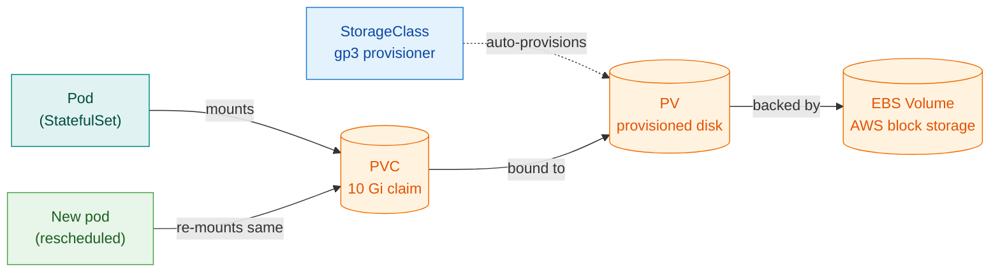
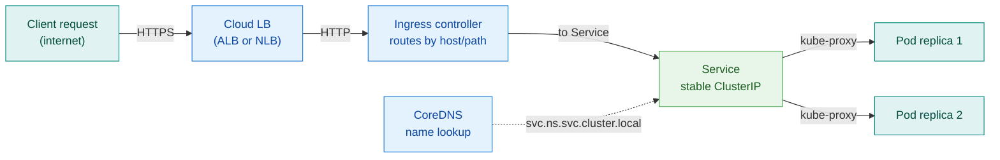
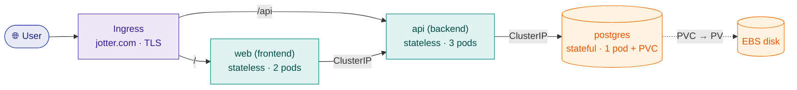
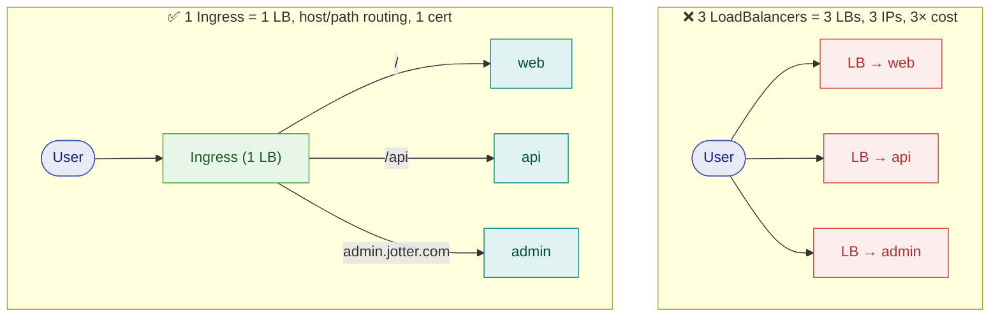

# 20 — Confusions & Trade-offs (the X-vs-Y reference)

> **What this is:** Every entry is a place practitioners get stuck or interviewers probe. Read the **bold one-liner** as the anchor — it is designed to stick in memory. Where a topic has deep treatment elsewhere in the handbook, the anchor links you there; this chapter gives you the comparison frame so you know *what* to look up and *why it matters*. Pairs with the [Interview Bank](14-interview-bank.md) and the [Reference Appendix](16-reference-appendix.md).

---

## Foundational mental models

### Container = isolated Linux process, not a mini-VM

**A container is a normal Linux process wrapped in two kernel primitives: namespaces (what it sees) and cgroups (what it can use).**
Namespaces give the process its own view of PIDs, the network stack, the filesystem mount table, and hostname — it cannot see anything outside those walls. cgroups enforce hard resource limits (CPU, memory). There is no guest OS, no hypervisor, no separate kernel — just isolation. This is why containers are so light and start in milliseconds.

> 🇮🇳 **Hinglish intuition:** Container ek room ke andar band banda hai — bahar nahi dekh sakta, zyada khana nahi kha sakta. VM ek alag ghar hai, apna kitchen, apni electricity meter sab.

### Image vs Container

**Image = frozen read-only blueprint; Container = a running instance of that image.**
An image is built once, stored in a registry, and never changes. When you run it, the container engine adds a thin writable layer on top — that layer dies with the container. One image can spawn dozens of parallel containers. Think class vs object, or a cookie-cutter vs the actual cookie.

### The runtime stack: runc → containerd → Docker

**runc creates the container; containerd manages images + runc; Docker = containerd + CLI + build tools + networking (the full product).**

| Layer | What it does | Who uses it |
|---|---|---|
| **runc** | OCI-compliant process spawner — calls the kernel | containerd calls it automatically |
| **containerd** | Image store, layer cache, runc lifecycle | Kubernetes nodes (CRI) |
| **Docker Engine** | Wraps containerd + adds `docker build`, `docker push`, CLI | Developers, CI pipelines |

Kubernetes speaks the CRI (Container Runtime Interface); it only needs containerd on nodes — Docker is for building images. That is why Kubernetes dropped the dockershim in 1.24: it was a translation layer that added complexity with no benefit for the cluster. _"Docker to build, containerd to run."_ → Full containers treatment in [M3](04-M3-docker.md).

### VM vs Container

**VM virtualizes hardware (full guest OS, GBs, strong isolation); container virtualizes the OS (shares host kernel, MBs, starts in seconds).**

| | VM | Container |
|---|---|---|
| Isolation | Hardware-level, separate kernel | OS-level, shared kernel |
| Size | Gigabytes (guest OS included) | Megabytes (just the app + libs) |
| Boot time | Minutes | Sub-second |
| Security boundary | Stronger (hypervisor) | Weaker (shared kernel) |
| Typical role | The *node* | The *workload on the node* |

In production: pods run inside VMs (EC2 nodes). Containers are what you deploy; VMs are the fleet those containers run on.

### localhost vs 0.0.0.0

**localhost / 127.0.0.1 = "only this machine"; 0.0.0.0 = "all interfaces, reachable from outside".**
A web server bound to 127.0.0.1 inside a container is invisible to anything outside that container — even if you port-map it. The fix is always: bind the server to `0.0.0.0`. This trips up every developer the first time they run a service in a container and can't reach it from the host.

> 🇮🇳 **Hinglish intuition:** `127.0.0.1` = ghar ke andar baat karna. `0.0.0.0` = darwaza khol ke sabko sunna.

### Port mapping

**`-p 8080:80` = "host port 8080 → container port 80". Left = outside, right = inside.**
The container's internal port is private by default — nothing can reach it without a mapping. The same mental model applies in Kubernetes: a Service's `port` is what clients use, `targetPort` is what the container listens on. NodePort is the node-level equivalent of `-p`.

---

## Where does it run? Client vs server

### The core rule

**Client tools run from your laptop/CI and send commands to a remote; server-side tools run continuously on machines.**
Mixing these up is the single most common newcomer confusion. Terraform does not live on the cluster. kubelet does not live on your laptop.

### Install location cheat-map

| Tool | Installs on | Role |
|---|---|---|
| Terraform | Laptop / CI runner | Client — calls cloud APIs |
| Ansible | Laptop / control node | Client — SSH-pushes to servers, agentless |
| kubectl | Laptop / CI runner | Client — calls K8s API server |
| Docker (build) | Laptop / CI runner | Build tool |
| containerd + kubelet + kube-proxy | Every K8s node | Server — runs pods |
| Control plane (API server, etcd, scheduler, CM) | Master / control-plane node | Server — the cluster brain |
| ArgoCD | Inside the cluster (pods) | Server — watches Git, syncs |
| Prometheus / Grafana | Inside cluster or dedicated server | Server — scrapes and stores metrics |

Terraform and Ansible are never "installed on the cluster." They run from outside and control remote infra.

### The kube- trio: kubeadm vs kubelet vs kubectl

**kubeadm builds the cluster (one-time); kubelet runs pods (always-on, per node); kubectl is your laptop CLI.**
They are three completely different binaries with different jobs. kubeadm is used once at cluster creation; you rarely touch it after. kubelet is a daemon that never stops; it watches the API server for pod assignments and ensures containers stay running. kubectl is stateless — install it anywhere you want to issue commands.

### Where does the CI runner execute?

**The CI controller schedules jobs; the runner/agent is the separate machine where `docker build` actually runs.**
In GitHub Actions: Actions service = controller, the GitHub-hosted (or self-hosted) runner = the worker. The runner is not your laptop and not the K8s cluster. In GitOps, the CI runner never touches the cluster directly — it only commits changed manifests to Git; ArgoCD inside the cluster does the actual apply. → Full pipeline treatment in [M6](07-M6-cicd.md) and [M7](08-M7-gitops.md).

---

## Kubernetes objects

### Pod vs Deployment vs StatefulSet vs DaemonSet vs Job

| Object | Use for | Key trait |
|---|---|---|
| **Pod** | Never directly (always via a controller) | Smallest unit — ephemeral, no self-healing |
| **ReplicaSet** | Managed by Deployment — don't use alone | Keeps N identical pods |
| **Deployment** | Stateless apps (web, API) | Rolling updates, random pod names |
| **StatefulSet** | Databases, Kafka, anything needing stable identity | Ordered names (db-0, db-1), own PVC per pod |
| **DaemonSet** | Node-level agents (log shippers, metrics collectors) | Exactly one pod per (matching) node |
| **Job / CronJob** | Batch tasks / scheduled tasks | Runs to completion / on a schedule |

→ Deep treatment: [M4](05-M4-kubernetes-core.md) and [M9](11-M9-advanced-k8s-internals.md).

### Ephemeral pods

**Pods die and get recreated with a new name and new IP anytime — never store data or identity inside a pod.**
The scheduler can evict a pod for node pressure, a rolling update replaces pods one by one, a node failure kills every pod on it. IPs change with every restart. This is intentional — it is why Services (stable virtual IP) and PersistentVolumeClaims (stable storage) exist as separate abstractions.

> 🇮🇳 **Hinglish intuition:** Pod ek temp worker hai — kal naya aayega, same naam nahi, same IP nahi. Service uska permanent address hai.

### Service types + Ingress

**ClusterIP = internal only (default); NodePort = node-level port (dev); LoadBalancer = cloud LB per service (prod); Ingress = one HTTP router for many services (prod front door).**

| Type | Reachable from | Use case |
|---|---|---|
| ClusterIP | Inside the cluster only | Microservice-to-microservice |
| NodePort | Node IP + high port (30000–32767) | Local dev, quick testing |
| LoadBalancer | Internet (via cloud LB) | Single service exposed at scale |
| Ingress | Internet → one IP, routes by host/path | Multi-service HTTP front door |

Ingress is not a Service type — it is a separate resource that routes HTTP/HTTPS traffic to Services. It requires an Ingress controller (ingress-nginx, Traefik, etc.) to be installed. → [M4](05-M4-kubernetes-core.md).

### ConfigMap vs Secret

**ConfigMap = non-sensitive config (URLs, feature flags); Secret = sensitive values (passwords, tokens) — stored as base64, not encrypted by default.**
Base64 is encoding, not encryption — anyone with `kubectl get secret` access can decode it. For real security: enable Kubernetes encryption-at-rest, or use an external secret manager (HashiCorp Vault, AWS Secrets Manager, Sealed Secrets). Neither ConfigMap nor Secret should ever be baked into the image.

### requests vs limits (and OOMKilled)

**request = the scheduler's placement guarantee; limit = the hard ceiling — exceed CPU → throttled, exceed memory → pod killed (OOMKilled).**
The scheduler uses `requests` to decide which node has enough capacity. At runtime, a pod that exceeds its CPU limit is throttled (slowed down); one that exceeds its memory limit is sent SIGKILL by the kernel (`exit 137`, status `OOMKilled`). Setting both accurately is a production skill — too low and you get kills; too high and you waste money. → Sizing deep-dive in [M5](06-M5-sizing-and-cost.md).

### Labels vs Annotations

**Labels = identifying key/values you select/filter on; Annotations = non-identifying metadata you don't query on.**
Services find pods by matching label selectors — `app: frontend` in the Service selector must match `app: frontend` on the pod. Annotations hold out-of-band metadata: build timestamps, tool configs, links to runbooks. You can't do `kubectl get pods -l` on an annotation.

### Autoscaling: HPA vs VPA vs Cluster Autoscaler

**HPA = more pods when load rises; VPA = bigger pods; Cluster Autoscaler = more nodes when pods can't fit.**
These solve different layers of the same problem. HPA reacts to metrics (CPU, custom). VPA resizes requests/limits of existing pods (requires a restart). Cluster Autoscaler watches for `Pending` pods and adds nodes from the cloud provider's node group. All three can run together: HPA handles load spikes, CA handles node capacity, VPA helps you right-size over time. → [M5](06-M5-sizing-and-cost.md).

### kubectl apply vs create

**`create` = imperative "make this now" (errors if it already exists); `apply` = declarative "make reality match this file" (creates or updates, idempotent).**
`apply` works by comparing the manifest you submit against the last-applied configuration stored as an annotation — it computes a patch. This makes it safe to run repeatedly. Production always uses `apply`, and ideally GitOps (ArgoCD) does the applying. → [M7](08-M7-gitops.md).

### Namespace

**A namespace is a virtual cluster inside the cluster — logical isolation for teams or environments, not a security boundary by itself.**
Resources in different namespaces can still reach each other unless you add NetworkPolicy. Pair namespaces with RBAC (who can do what in this namespace) and NetworkPolicy (which pods can talk to which) for real isolation. Default, kube-system, and kube-public are built-in namespaces; leave kube-system alone.

---

## Storage

### PV vs PVC vs StorageClass

**PVC = the claim ("give me 10 Gi"); PV = the actual disk; StorageClass = the class that auto-creates the disk on demand.**
Think of it as: StorageClass is the catalogue, PVC is the order form, PV is the physical disk that arrives. In cloud environments, you usually define a StorageClass (backed by EBS, GCE PD, etc.) and create PVCs — the PV is provisioned automatically (dynamic provisioning). You rarely create PVs manually in cloud. → [M4](05-M4-kubernetes-core.md).



*Pod → PVC → PV → EBS; pod dies and restarts, but the PVC binding (and the data) survive.*

### Why data survives pod death

**The EBS volume is independent of the pod — pod dies, volume and its data survive, new pod re-mounts the same volume.**
A StatefulSet (say a Postgres pod) has its own PVC. When the pod is restarted or rescheduled, Kubernetes re-attaches the same PVC to the new pod. The data was never in the pod — it was always on the external volume. This is the fundamental reason databases in Kubernetes use StatefulSets with PVCs, not Deployments with ephemeral storage.

### EBS vs EFS vs S3

| | EBS | EFS | S3 |
|---|---|---|---|
| **Type** | Block storage | Shared file system (NFS) | Object storage |
| **Access** | One EC2/node at a time (RWO) | Many pods simultaneously (RWX) | HTTP API (not mounted) |
| **Best for** | Databases, single-writer workloads | Shared config files, home dirs | Backups, images, static assets |
| **In K8s** | Default PV for most StatefulSets | When multiple pods need the same volume | Not a PV — accessed via SDK/CLI |
| **Cost** | Per GB provisioned | Per GB used | Very cheap per GB |

EBS is the default choice for databases; EFS for anything that needs shared access across pods; S3 for anything that doesn't need to be mounted as a filesystem.

### emptyDir vs PVC

**emptyDir = scratch space that dies with the pod; PVC = persistent storage that survives pod death.**
Use `emptyDir` for temporary data within a single pod's lifetime (caches, build artifacts, inter-container scratch). Use a PVC for anything you must keep across restarts — databases, uploads, configuration files that aren't in a ConfigMap. Never store session state or user data in emptyDir.

---

## Networking

### How a request reaches a pod

**Client → cloud LB → Ingress controller → Service (ClusterIP + kube-proxy routing) → Pod.**
Each layer serves a role: the cloud LB terminates external TCP; the Ingress controller inspects HTTP and routes by host/path to a Service; the Service is a stable virtual IP whose iptables rules (managed by kube-proxy) distribute traffic across healthy pod IPs. DNS lets pods reference Services by name — not by IP. → [M4](05-M4-kubernetes-core.md), [M9](11-M9-advanced-k8s-internals.md).



*Client → LB → Ingress → Service → Pods; CoreDNS resolves Service names so pods never need to hard-code each other's IPs.*

### Service discovery via DNS

**Pods find each other by Service name, not by IP — pod IPs change with every restart.**
CoreDNS (the cluster DNS) resolves `http://cartservice` to the ClusterIP of the `cartservice` Service. Full DNS name is `<service>.<namespace>.svc.cluster.local`, but within the same namespace the short name works. Hardcoding a pod IP is a bug — it breaks on the next restart.

### CNI — what it is and why you need it

**Kubernetes does not do pod networking — a CNI plugin does: it assigns pod IPs and enforces NetworkPolicy.**
Popular options: Calico (NetworkPolicy-capable, widely used in production), Flannel (simple overlay, no NetworkPolicy), Cilium (eBPF-based, high performance). When you bootstrap a cluster (`kubeadm init`), you must install a CNI plugin before any pods will become Ready. The choice of CNI affects which NetworkPolicy features you can use.

### L4 vs L7 load balancing

**L4 = routes by TCP/IP (fast, protocol-agnostic); L7 = routes by HTTP content (host, path, headers, cookies).**

| | L4 | L7 |
|---|---|---|
| Operates at | Transport (TCP/UDP) | Application (HTTP/HTTPS) |
| Can route by | IP + port | Host, path, headers, cookies |
| TLS termination | No (pass-through) | Yes |
| AWS example | NLB | ALB |
| K8s example | Service type LoadBalancer | Ingress + Ingress controller |
| Speed | Faster (no HTTP parsing) | Slightly slower |

Ingress is always L7. Use L4 (NLB) when you need raw TCP, static IPs, or ultra-low latency (e.g. gaming, financial trading).

### Reverse proxy vs Load balancer vs Forward proxy

**Reverse proxy sits in front of servers (terminates TLS, routes, caches — Nginx/ingress-nginx). Load balancer spreads traffic across healthy backends. Forward proxy sits in front of clients (outbound/egress control).**

| | Sits in front of | Controls | Example |
|---|---|---|---|
| Reverse proxy | Servers | Inbound traffic to backend pool | Nginx, HAProxy, ingress-nginx |
| Load balancer | Backend pool | Traffic distribution + health checks | ALB, NLB, K8s Service |
| Forward proxy | Clients | Outbound/egress — what clients can reach | Squid, enterprise web filter |

In practice a reverse proxy often *is* the load balancer — Nginx both proxies and load-balances. The distinction matters for security: forward proxies control egress; reverse proxies control ingress. In K8s, the Ingress controller is a reverse proxy (nginx) behind a cloud load balancer.

### NodePort vs kubectl port-forward

**NodePort = a permanent port on every cluster node (accessible from outside); port-forward = a temporary tunnel from your local machine to a pod/service (dev only).**
NodePort survives pod restarts (the Service is stable) but requires knowing a node IP and firewall access. `kubectl port-forward` is better for quick local debugging — it proxies through the API server, requires no firewall changes, and is destroyed when you Ctrl-C. Never use `port-forward` in production or CI; never use NodePort as a production ingress strategy.

---

## Building blocks in a real app — what you NEED vs what you can SKIP

Most tutorials show every Kubernetes object as if you always need all of them. **You don't.** The senior skill is knowing *when each block is required, and when you can happily skip it.* Let's build **one real app** and walk every block through it.

### The example app: "Jotter" (a notes app)

Three components, deployed for a small team on a cloud cluster:



*`web` and `api` are **stateless**; `postgres` is **stateful**. That single distinction decides most of what follows.*

### Now every block — used where, and when you can skip it

**🏷️ Labels & Selectors** — *the glue, never optional*
- **In Jotter:** the `api` Service says `selector: app=api` → finds the 3 api pods by their `app=api` label. The Deployment manages those pods the same way. Everything wires through labels.
- **Kab zaroori / kab skip:** you **cannot skip** them — a Service or controller literally *has* no way to find pods except by label. The only time you don't hand-write them is a throwaway `kubectl run test` pod.
- > 🇮🇳 **Bina label ke Service pods dhoondh hi nahi sakti** — traffic dead. Selector aur pod-label match na kiye = #1 galti.

**🔌 ClusterIP** — *default; required for internal talk*
- **In Jotter:** `api` and `postgres` are **ClusterIP** — internal only. `web` calls `http://api`, `api` calls `postgres:5432`. Neither is exposed to the internet.
- **Kab zaroori / kab skip:** required whenever one pod must reach another by a stable name (almost always). You *technically* could skip a Service and use raw pod IPs — but pod IPs change, so in practice **every internal service needs a ClusterIP**. (`clusterIP: None` = *headless*, for StatefulSets needing direct per-pod DNS like `postgres-0`.)
- > 🇮🇳 **ClusterIP = ghar ke andar ka private number.** Internal microservices ke liye default aur free — 99% Services yahi.

**🚪 NodePort** — *usually SKIP in cloud*
- **In Jotter (cloud):** **not used at all.** We expose the frontend via Ingress, not a raw node port.
- **Kab zaroori:** only on **bare-metal / on-prem without a cloud load balancer**, or a quick dev exposure (`minikube service`). **Kab skip:** any cloud production app — ugly high ports (30000+) and node-IP coupling.
- > 🇮🇳 **NodePort = gate pe ek number-wala side-door.** Dev/on-prem ke liye theek, cloud prod me nahi.

**☁️ LoadBalancer** — *only for internet-facing; often replaced by Ingress*
- **In Jotter:** `postgres` and `api` = internal = **no LoadBalancer**. Only the *entry point* faces the internet — and even that we do via **Ingress** (which uses one shared LB), not a per-service LoadBalancer.
- **Kab zaroori:** a service that must have its **own public IP** — a single non-HTTP service (raw TCP / gRPC / a database you deliberately expose), or where you need an **NLB** for raw performance. **Kab skip:** internal services (never), and HTTP services that can share one Ingress.
- > 🇮🇳 **Har LoadBalancer service = ek naya cloud LB = alag IP + paisa.** 5 services = 5 LB = 💸. Isliye HTTP ke liye **Ingress** (ek LB, many services).

### 🎯 Ingress vs LoadBalancer — the clarity you asked for

Both get outside traffic in — but they operate at different layers and cost very differently:

| | **LoadBalancer (Service)** | **Ingress** |
|---|---|---|
| Layer | **L4** (TCP/IP) | **L7** (HTTP/HTTPS) |
| Routing | dumb — forwards a port to pods | smart — by **host & path** (`/api`, `shop.com` vs `blog.com`) |
| Cost | **one cloud LB per service** (each = an IP + $) | **one LB total**, shared by many services |
| TLS | you handle it | **terminates TLS** centrally (one cert, cert-manager) |
| Needs | nothing extra | an **Ingress controller** (nginx pod) running in the cluster |
| Best for | a single non-HTTP service, or a dedicated IP | **many HTTP services behind one domain** (the norm) |



> 🇮🇳 **Instantly click:** *LoadBalancer = ek service ke liye ek poora cloud LB (L4, dumb, mehnga). Ingress = **ek LB + ek smart receptionist** jo host/path se kai HTTP services ko route karta, TLS bhi ek jagah. Isliye production me many-services = **Ingress**, single raw-TCP service = **LoadBalancer**.* Note: Ingress **khud** ek LoadBalancer service ke peeche chalta hai (ingress-controller ka) — woh contradict nahi karta, woh **usko efficient** banata.

**🏠 Namespace** — *optional for small, required for scale*
- **In Jotter:** we put everything in a `jotter` namespace (clean), but a tiny solo project would work fine in `default`.
- **Kab zaroori:** multiple teams/environments (dev/staging/prod), **ResourceQuota**, or **RBAC** boundaries. **Kab skip:** a single small app — `default` is genuinely fine.
- > 🇮🇳 **Chhoti single app? `default` chalega.** Multi-team / dev-staging-prod / quota chahiye? Tab namespace. Aur yaad: **security ke liye NetworkPolicy** — namespace akela deewaar nahi.

**💾 HostPath vs PersistentVolume** — *skip storage entirely for stateless apps*
- **In Jotter:** `web` and `api` are **stateless → NO storage at all** (no PV, no hostPath). Only `postgres` needs a **PersistentVolume** (EBS) so its data survives pod restarts and reschedules.
- **Kab zaroori:** a **PV** whenever data must persist (databases, uploads). **Kab skip PV:** any stateless service (most microservices) — they need nothing. **HostPath:** basically always skip in production (only node-agents like a log collector, or single-node dev) — it ties the pod to one node, so a node failure loses the data.
- > 🇮🇳 **Stateless app (web/api)? Storage ki zaroorat NAHI.** Sirf database ko **PV (bank locker)** chahiye. **HostPath = node ki local almari** — node mara to data gaya, production me nahi.

**📦 Helm & Charts** — *optional for tiny, essential at scale*
- **In Jotter:** ~10 manifests × 3 envs. For a *tiny* app, plain `kubectl apply -f ./k8s/` is genuinely fine. But with 3 environments and versioning, a **Helm chart + `values.yaml`** (image tag, replicas per env) removes the copy-paste. And we install postgres + the ingress-controller from **community Helm charts** in one command each.
- **Kab zaroori:** many manifests, **multi-environment**, installing **third-party apps**, or wanting **versioned install/rollback**. **Kab skip:** one or two manifests, one environment — raw `kubectl apply` (or Kustomize) is simpler.
- > 🇮🇳 **1-2 YAML, ek environment? Helm ki zaroorat nahi — `kubectl apply` bas.** Bahut manifests / multi-env / third-party install / rollback chahiye? **Helm.** (Alternative: **Kustomize** — templating nahi, overlays se per-env patch.)

### The required-vs-optional cheat table

| Block | Always needed? | Need it when… | Safe to SKIP when… |
|---|---|---|---|
| **Labels/Selectors** | ✅ effectively yes | wiring any Service/controller | never (it's the glue) |
| **ClusterIP** | ✅ for internal talk | one pod calls another by name | a truly standalone one-off pod |
| **NodePort** | ❌ | bare-metal/on-prem, quick dev | any cloud app (use Ingress/LB) |
| **LoadBalancer** | ❌ | a single non-HTTP public service / dedicated IP | internal services; HTTP → use Ingress |
| **Ingress** | ❌ (but usual) | many HTTP services / TLS / one domain | a single service or non-HTTP |
| **Namespace** | ❌ | multi-team/env, quota, RBAC | a small single app (`default` is fine) |
| **PersistentVolume** | ❌ | stateful apps (databases, uploads) | **stateless** apps (most microservices) |
| **HostPath** | ❌ | node-agents / single-node dev only | **almost always** in production |
| **Helm** | ❌ | many manifests / multi-env / 3rd-party / rollback | 1–2 manifests, one env (`kubectl apply`) |

> 🇮🇳 **Golden takeaway:** *Stateless app chahiye? → Deployment + ClusterIP + Ingress, bas — **koi PV nahi, koi hostPath nahi.** Database add hui? → PV. Kai services + ek domain? → Ingress (na ki har ek pe LoadBalancer). Kai environments? → Helm. Har object tabhi lo jab uska **kaam** ho — warna simplicity behtar.*

---

## CI/CD & GitOps

### CI vs Continuous Delivery vs Continuous Deployment

**CI = auto build+test on every commit. Continuous Delivery = every passing change is ready to ship (manual gate to prod). Continuous Deployment = passing changes auto-ship to prod.**
The difference between the two "CDs" is exactly one gate: a human approval before prod. Continuous Delivery is common in regulated industries; Continuous Deployment is common in tech companies with strong test coverage and canary deployments. Both require CI as their foundation. → [M6](07-M6-cicd.md).

### Push-based vs Pull-based deploy (GitOps)

**Push = CI has cluster credentials and runs kubectl apply from outside. Pull (GitOps) = CI commits desired state to Git; ArgoCD inside the cluster pulls and applies.**

| | Push-based | Pull-based (GitOps) |
|---|---|---|
| Who applies | CI runner (external) | ArgoCD / Flux (inside cluster) |
| Cluster creds in CI | Yes (security risk) | No |
| Drift detection | None | Automatic (ArgoCD alerts) |
| Audit trail | CI logs | Git history |
| Rollback | Rerun pipeline | `git revert` + auto-sync |

Pull is safer and more auditable. Push is simpler for small teams. → [M7](08-M7-gitops.md).

### Artifact vs Image

**Artifact = any build output (jar, binary, zip); Image = a container image (an artifact, but the deployable unit for K8s).**
CI produces artifacts first; those artifacts are then packaged into an image and pushed to a registry. They are distinct steps — a Java service produces a `.jar` (artifact), which is then `COPY`-ed into a container image. Understanding the two-step process helps you debug build failures precisely.

### Pipeline stages

**Checkout → Test → Build image → Security scan → Push (SHA-tagged) → Deploy (via GitOps).**
Tagging with the commit SHA (`docker build -t myapp:${GITHUB_SHA}`) makes every running image traceable to an exact commit — this is the foundation of reliable rollbacks and audit. The security scan (Trivy, Grype) runs before push so vulnerable images never reach the registry. → [M6](07-M6-cicd.md), [19](19-cicd-hands-on-flow.md).

### Registry

**A registry is where images live — CI pushes, nodes pull. Never use `latest` as a production image tag.**
`latest` is a mutable pointer — "latest" today can be a completely different image tomorrow. If you roll back using `latest` you may not know what you are rolling back to. Use immutable tags: `myapp:a3f2c91` (commit SHA) or `myapp:1.4.2` (semver). This applies to base images in your Dockerfile too — pin them. → [M3](04-M3-docker.md).

---

## IaC & configuration

### Terraform vs Ansible

**Terraform = provisioning (create/manage infra, tracks state, declarative); Ansible = configuration (install/configure an existing machine, procedural, agentless over SSH).**

| | Terraform | Ansible |
|---|---|---|
| Purpose | Build the infra | Configure what's already built |
| State | Yes — tracks what exists | No state file |
| Language | Declarative HCL | Imperative YAML tasks |
| Transport | Cloud APIs | SSH / WinRM |
| Idempotent | Yes (plan+apply) | Yes (most modules) |
| Typical use | VPCs, subnets, EKS clusters | Install nginx, configure users, deploy config |

Real-world combo: Terraform builds the EC2 fleet; Ansible configures Nginx and deploys the app. → [M1](02-M1-terraform.md), [M2](03-M2-ansible.md).

### Terraform state

**State is the map between your HCL code and real infrastructure — without it Terraform is blind.**
State is stored as JSON (`terraform.tfstate`). For teams: keep state in a remote backend (S3 bucket) with a DynamoDB table for locking — this prevents two engineers from running `apply` simultaneously and corrupting state. Always run `terraform plan` and review the diff before `apply`. Lost state = Terraform will try to create everything again and collide with what already exists.

### Declarative vs Imperative

**Declarative = "here is the desired end state" (Terraform, K8s YAML); Imperative = "do these steps" (a bash script).**
Declarative is reproducible and reviewable — the code IS the documentation. Imperative breaks idempotency (run it twice, get two of everything). Production DevOps is declarative wherever possible. A bash script that creates a server is not IaC; a Terraform resource that manages a server is.

### Idempotency

**Running the same operation N times gives the same result — no duplicates, no damage.**
`terraform apply` computes a diff against state and only changes what needs changing. `kubectl apply` patches only what differs. `ansible-playbook` checks current state before acting. This property is what makes automation safe to run in CI on every merge. A non-idempotent script (e.g. `echo "line" >> file` with no dedup check) is a production liability.

---

## Git

### Merge vs Rebase

**Merge keeps full history + a merge commit (safe on shared branches); Rebase rewrites your commits onto latest main (clean linear history, only on private branches).**

| | Merge | Rebase |
|---|---|---|
| History | Preserves branch topology | Linear (no merge commits) |
| Safe to use on | Any branch, including shared | Your own local branch only |
| Conflict resolution | Once, at merge time | Once per commit being rebased |
| Rollback | Revert the merge commit | Harder — commits are rewritten |
| Best for | Integrating completed feature branches | Cleaning up before opening a PR |

The rule: **rebase local, merge shared.** Never force-push a rebased branch to main or any branch others are working on — it rewrites history and breaks their local copies.

> 🇮🇳 **Hinglish intuition:** Rebase = apni naukri ke papers dobara date se likhna (clean dikh ta hai). Merge = official rubber stamp ke saath original history rakhna.

### origin vs upstream vs HEAD

**origin = your remote (fork or own repo); upstream = the original you forked from; HEAD = where you are right now.**
`git push origin feature/x` pushes to your fork. `git fetch upstream main` pulls the original repo's latest. `HEAD` is a pointer — `main...HEAD` means "every commit on this branch since it diverged from main." Understanding this trio untangles 90 % of git confusion in open-source contribution workflows.

### Branching strategy

**Short-lived feature branches off a stable main, PR + review before merge. Simple and safe beats complex for most teams.**
Trunk-based development (commit to main frequently, use feature flags for incomplete work) scales better than long-lived branches. GitFlow adds complexity that slows down CI/CD. Unless you have a genuine need for long-lived release branches (packaged software with multiple maintained versions), trunk-based with short feature branches and mandatory PRs is the default good practice.

---

## AWS fundamentals

### RDS vs self-managed database

**RDS = managed SQL — AWS handles backups, patching, Multi-AZ failover. Self-hosted (Postgres on K8s) = full control but you own all operations.**
RDS is almost always the right choice for production: automated backups, automated minor version patching, one-click Multi-AZ, monitoring built-in. Running Postgres inside Kubernetes (StatefulSet + EBS PVC) gives you flexibility and potentially cost savings at very high scale, but you own operator complexity, backup scripts, failover logic, and storage management. Default to managed.

### RDS vs DynamoDB

**RDS = managed relational SQL (joins, transactions, structured schema); DynamoDB = managed NoSQL (key-value / document, massive scale, no joins).**

| | RDS (Postgres/MySQL) | DynamoDB |
|---|---|---|
| Data model | Relational tables | Key-value / document |
| Joins | Yes | No |
| Transactions | ACID | Limited (per-item, or transactional API) |
| Scale strategy | Vertical + read replicas | Horizontal, auto-scaling |
| Query flexibility | Full SQL | Access by partition key primarily |
| Best for | E-commerce, ERP, most apps | Session stores, gaming leaderboards, IoT |

If your access patterns are "give me item by ID at massive scale," DynamoDB. If your access patterns require aggregation, reporting, or multi-table joins, RDS.

### Security Group vs NACL

**Security Group = stateful firewall on the instance (return traffic auto-allowed, allow-only rules). NACL = stateless firewall on the subnet (both directions explicit, can deny).**

| | Security Group | NACL |
|---|---|---|
| Level | Instance / ENI | Subnet |
| State | Stateful (connection tracked) | Stateless (each packet evaluated) |
| Rules | Allow only | Allow and Deny |
| Default | All outbound allowed | All traffic allowed |
| Evaluation | All rules evaluated together | Rules evaluated in number order, first match wins |

Use Security Groups as your primary firewall (almost always). Use NACLs for subnet-wide blanket blocks (e.g. block an entire IP range from the subnet). Because NACLs are stateless, if you allow inbound on port 443 you must also explicitly allow outbound ephemeral ports (1024–65535) for the return traffic.

> 🇮🇳 **Hinglish intuition:** SG = doorman jo aane-jaane wale ko yaad rakhta hai. NACL = building gate jo har baar ID check karta hai — return ticket alag chahiye.

### IAM Role vs User vs Policy

**User = a person/long-lived credentials; Role = temporary credentials a service/entity assumes (no stored keys); Policy = the JSON that defines permissions, attached to either.**

| | IAM User | IAM Role | IAM Policy |
|---|---|---|---|
| What it is | A principal with permanent credentials | A principal with temporary credentials (STS) | A permission document (JSON) |
| Credentials | Access key + secret (long-lived) | Temporary token (15 min–12 hr) | Not credentials — attached to principal |
| Best for | CI/CD pipelines that can't use roles | EC2, EKS pods, Lambda, cross-account | Everything — always attach policies to roles |
| Risk | Key leak = permanent access | Token expires automatically | N/A |

Best practice: **roles over long-lived keys everywhere.** EC2 instances assume an instance profile (role). EKS pods use IRSA (IAM Roles for Service Accounts). Never embed access keys in code or environment variables you commit.

### Region vs Availability Zone (AZ)

**Region = a geographic area (e.g. `ap-south-1` Mumbai); AZ = an isolated datacenter within a region (`ap-south-1a`, `1b`, `1c`).**
AZs within a region are connected by low-latency private links. Multi-AZ deployments spread resources across AZs so a single datacenter failure (power, cooling, network) doesn't take down the service. Multi-region is for surviving an entire region failure — much rarer, much more expensive. RDS Multi-AZ = automatic failover to a standby in a different AZ, not a different region.

### Public vs private subnet

**Public subnet = has a route to an Internet Gateway (web-facing resources); Private subnet = no direct internet in, outbound via NAT Gateway (databases, internal services).**

| | Public Subnet | Private Subnet |
|---|---|---|
| Internet access | Inbound + outbound via IGW | Outbound only via NAT Gateway |
| Resources | Load balancers, bastion hosts | Databases, internal services, K8s nodes |
| Requires | Route to Internet Gateway | NAT Gateway in a public subnet |

Databases should always be in private subnets — no inbound internet path exists. Only your load balancer needs a public subnet; app servers can be private too (traffic comes from the LB).

### ALB vs NLB vs CLB

**ALB = L7 HTTP/HTTPS routing (most web apps); NLB = L4 TCP ultra-fast (raw TCP, static IP); CLB = legacy, avoid.**

| | ALB | NLB | CLB |
|---|---|---|---|
| Layer | 7 (HTTP/HTTPS) | 4 (TCP/UDP) | 4+7 (limited) |
| Routing | Host, path, headers | IP + port | Port only |
| TLS termination | Yes | Yes (pass-through or termination) | Limited |
| Static IP | No (DNS-based) | Yes (Elastic IP) | No |
| Use for | Web apps, microservices, APIs | TCP workloads, high perf, static IPs | Legacy — migrate away |

Default choice for Kubernetes Ingress + AWS: ALB via the AWS Load Balancer Controller.

### AWS → Azure conceptual map

**Fundamentals transfer across clouds; only the names change.**

| AWS | Azure | What it is |
|---|---|---|
| EC2 | Virtual Machine (VM) | Compute instance |
| VPC | VNet | Virtual private network |
| IAM | Entra ID (AAD) | Identity & access management |
| S3 | Blob Storage | Object storage |
| RDS | Azure SQL / Flexible Server | Managed relational database |
| DynamoDB | Cosmos DB | Managed NoSQL |
| EKS | AKS | Managed Kubernetes |
| Lambda | Azure Functions | Serverless compute |
| CloudWatch | Azure Monitor | Observability platform |
| ALB / NLB | Application Gateway / Load Balancer | L7 / L4 load balancing |
| ECR | Azure Container Registry | Container image registry |

---

## Docker build-side depth

### CMD vs ENTRYPOINT

**ENTRYPOINT = the fixed command that always runs; CMD = default arguments you can override at `docker run`.**
Pattern: `ENTRYPOINT ["/app/server"]` + `CMD ["--port", "8080"]`. `docker run myimage --port 9090` overrides CMD but keeps ENTRYPOINT — the binary always runs, only arguments change. If you set only CMD, the entire CMD can be replaced by the user. Use ENTRYPOINT for the executable, CMD for its default flags. → [M3](04-M3-docker.md).

### COPY vs ADD

**Use COPY for copying files; ADD does that plus auto-extracts tarballs and fetches remote URLs — surprising side effects.**
The rule: use `COPY` unless you specifically need tar extraction. `ADD` fetching a URL bypasses layer caching in unpredictable ways. If you need to fetch something, use `RUN curl` or a multi-stage build so the intent is explicit.

### Layers and build cache

**Each Dockerfile instruction creates a cached layer. Order matters: put slow/stable steps early so cache is reused.**
```dockerfile
# Good: deps installed before source copy — cache is reused when only source changes
COPY requirements.txt .
RUN pip install -r requirements.txt
COPY src/ .          # only this layer re-runs on source changes

# Bad: source copied first → any source change invalidates pip install cache
COPY . .
RUN pip install -r requirements.txt
```
Ordering instructions by change frequency (least → most) can cut CI build times from minutes to seconds.

### Multi-stage build

**Build stage = compilers + tools; final stage = only the compiled artifact on a minimal base image.**
```dockerfile
FROM golang:1.22 AS builder
WORKDIR /app
COPY . .
RUN go build -o server .

FROM gcr.io/distroless/static:nonroot
COPY --from=builder /app/server /server
ENTRYPOINT ["/server"]
```
Result: a ~10 MB image with no Go toolchain, no shell, no package manager. Smaller attack surface, faster pulls. → [M3](04-M3-docker.md).

### The `latest` tag trap

**`latest` is a mutable pointer — "latest" today is a different image than "latest" next week.**
If you deploy with `latest` and something breaks, you cannot roll back to the previous `latest` because it has already been overwritten. In production always use immutable tags: commit SHA (`a3f2c91`) or semantic version (`1.4.2`). This makes rollbacks exact and auditable.

### Root vs non-root images

**Containers running as root are a security risk — if the container escapes, the attacker has root on the node.**
Use non-root users in your Dockerfile (`USER nonroot`), or use distroless / scratch base images that have no root shell. In Kubernetes, enforce this with a Pod Security Standard (`restricted` profile) or PodSecurityContext `runAsNonRoot: true`. Production hardening baseline.

---

## Observability

### Metrics vs Logs vs Traces

**Metrics = numbers over time (fast, cheap, alertable); Logs = discrete events (rich detail, for debugging); Traces = a request's journey across services (for finding latency bottlenecks).**

| | Metrics | Logs | Traces |
|---|---|---|---|
| What it is | Time-series numbers | Timestamped text events | Linked spans across services |
| Answers | "How much? How often?" | "What exactly happened?" | "Where did the latency come from?" |
| Cost | Low (aggregated) | Medium–high (volume) | High (instrumentation + storage) |
| Tool examples | Prometheus, CloudWatch | Loki, ELK, CloudWatch Logs | Jaeger, Tempo, AWS X-Ray |
| Alert on | Yes (thresholds) | Sometimes (log-based alerts) | Rarely (trace-based SLOs possible) |

Start with metrics and logs. Add distributed tracing once you have microservices and need to find which service is adding latency. → [M8](10-M8-observability-sre.md).

### Prometheus pull model

**Prometheus scrapes (pulls) metrics from apps' `/metrics` endpoints on a schedule — apps do not push.**
This means Prometheus controls the scrape rate, and an unresponsive target simply shows as `up=0`. Apps expose metrics as a plain-text HTTP endpoint (`/metrics`). PromQL queries the time-series data. Alertmanager routes firing alerts to Slack/PagerDuty/email. Grafana builds dashboards from PromQL queries. The pipeline: `app /metrics → Prometheus scrape → PromQL → Grafana / Alertmanager`. → [M8](10-M8-observability-sre.md).

### RED vs USE

**RED (for services): Rate, Errors, Duration. USE (for resources): Utilization, Saturation, Errors.**

| Framework | For | Dimensions | Example |
|---|---|---|---|
| **RED** | Services / APIs | **R**ate (req/s), **E**rror rate (%), **D**uration (latency) | "API getting 500 rps, 2% errors, p99 = 800 ms" |
| **USE** | Infrastructure resources | **U**tilization (%), **S**aturation (queue depth), **E**rrors | "CPU at 80%, run queue depth 4, 0 errors" |

Build your dashboards around RED for every service and USE for every critical resource. If RED is healthy, users are happy. If USE is red, capacity is the constraint. → [M8](10-M8-observability-sre.md).

### Liveness vs Readiness vs Startup probe

**Readiness = "ready to receive traffic?" (fail → removed from Service, not restarted); Liveness = "still alive?" (fail → restarted); Startup = "done starting?" (protects slow-boot apps from premature liveness kills).**

| Probe | On fail | Typical use |
|---|---|---|
| Readiness | Remove from Service endpoints — traffic stops | App not ready (DB not connected, cache warming) |
| Liveness | Restart the container | App deadlocked, hung, unresponsive |
| Startup | Delay liveness checks | Slow-starting app (JVM warmup, migrations) |

Configure all three. Without readiness, rolling updates send traffic to pods before they are ready. Without liveness, a deadlocked pod sits in `Running` state forever serving errors. → [M4](05-M4-kubernetes-core.md).

---

## Deployment strategies & reliability

### Rolling vs Recreate vs Blue-Green vs Canary

| Strategy | Mechanism | Downtime | Rollback speed | Resources | When to use |
|---|---|---|---|---|---|
| **Rolling** (K8s default) | Replace pods gradually, N at a time | Zero (with probes) | `rollout undo` (fast) | 1x | Most production deploys |
| **Recreate** | Kill all old pods, then start new | Yes — brief gap | Redeploy old version | 1x | When old + new can't coexist |
| **Blue-Green** | Two full environments; flip traffic at LB | Zero | Instant (flip back) | 2x | Major changes, need instant rollback |
| **Canary** | Route small % to new version first, ramp up | Zero | Instant (route 0%) | 1x+ | Safest — validate before full rollout |

> 🇮🇳 **Hinglish intuition:** Rolling = dheere dheere guard badlna. Blue-Green = ek puri team standby pe; ek click mein swap. Canary = ek banda pehle bhejo, dekho kuch hota hai toh wapas.

→ Full deployment treatment in [M6](07-M6-cicd.md) and [M9](11-M9-advanced-k8s-internals.md).

### Rollback

**GitOps rollback = revert the Git commit (ArgoCD re-syncs automatically). Imperative rollback = `kubectl rollout undo deployment/<name>`.**
GitOps rollback is auditable and reproducible — it is just another commit. `kubectl rollout undo` is faster in an emergency but bypasses Git. Best practice: practice rollbacks before you need them in a real incident. → [M7](08-M7-gitops.md).

### Zero-downtime = readiness probes + rolling update + graceful shutdown

**All three must be configured correctly together — any one missing breaks the contract.**
1. **Readiness probe**: new pod not added to Service until it passes → no traffic before ready.
2. **Rolling update** (`maxUnavailable: 0`, `maxSurge: 1`): old pods stay until new ones are ready.
3. **Graceful shutdown**: on `SIGTERM`, stop accepting new requests, finish in-flight requests, then exit — avoid dropping connections.

A pod that exits immediately on `SIGTERM` drops all in-flight requests. A missing readiness probe sends traffic to a pod that hasn't finished starting. The combination of all three is the minimum for truly zero-downtime deploys.

### Failed production deploy — the right instinct

**Stabilize first, root-cause second: roll back to restore service, then calmly investigate, fix, retest, redeploy, post-mortem.**
The wrong instinct is to debug the broken version under pressure while users are experiencing the outage. Roll back first — restore service in minutes. Then with the pressure off, examine pod status, events, logs, what changed in the last commit. Fix → retest in staging → redeploy → post-mortem with a guardrail so it cannot repeat. "Restore service first, root-cause second" is a senior engineer's reflex.

---

## Production judgment (senior signals)

- **Managed over self-hosted by default.** Use RDS, EKS, MSK, ElastiCache unless there is a concrete reason (cost at extreme scale, regulatory, special configuration). Self-hosting means you own backup, failover, patching, and the 3 a.m. pages.
- **Secrets maturity ladder.** Hardcoded (bad) → environment variables → Kubernetes Secrets (base64) → Vault / Sealed Secrets / AWS Secrets Manager (good). Know where your team is on this ladder and push it higher.
- **Everything as code.** Infra (Terraform), deploys (GitOps), config (versioned YAML). If it's clicked in a console, it's not reproducible, not reviewable, and will drift.
- **Least privilege everywhere.** IAM roles not access keys. Non-root containers. NetworkPolicy between namespaces. RBAC on namespaces. Grant the minimum required, review quarterly.
- **Observability before incidents.** Set up dashboards and alerts before you need them. Discovering you have no metrics when the incident starts is the worst time to instrument.
- **Cost awareness.** Rightsize pods (requests/limits match actual usage). Kill idle resources. Use Spot for fault-tolerant batch. Tag everything. DevOps owns the bill as much as the product team.
- **Blast radius thinking.** Canary over big-bang releases. Multi-AZ for stateful components. Quotas and limits on namespaces. Always ask: "If this breaks, what is the maximum blast radius? Can I scope it?"
- **Stabilize before root-cause.** Roll back, restore service, then investigate. Never debug under fire when a rollback is available.
- **Reproducibility as a property.** If you cannot recreate the exact state — the exact image, the exact config, the exact infra — you cannot trust your rollbacks or your staging environment.

---

## 30-second skim — the anchors

- **Container** = isolated Linux process (namespaces + cgroups), not a VM
- **Image** = frozen blueprint; container = a running instance; registry = where images live
- **Runtime stack**: runc creates → containerd manages → Docker builds; K8s only needs containerd
- **VM** = separate kernel + OS (GBs); **container** = shared kernel (MBs, seconds to start)
- **localhost** = only this machine; **0.0.0.0** = all interfaces, reachable from outside; bind servers to 0.0.0.0
- **Client tools** (Terraform/Ansible/kubectl) run from laptop/CI; **server tools** (kubelet/containerd) run on nodes; ArgoCD lives inside the cluster
- **kubeadm** builds · **kubelet** runs pods · **kubectl** commands
- **Pod** ephemeral · **Deployment** stateless · **StatefulSet** stateful + own PVC · **DaemonSet** one per node
- **PVC** = claim, **PV** = real disk (EBS), pod mounts PVC → data survives pod death
- **EBS** = one pod (RWO) · **EFS** = many pods (RWX) · **S3** = object via API (not mounted)
- **emptyDir** dies with pod · **PVC** survives pod death
- **Service** = stable internal IP; **Ingress** = HTTP front door; find pods by **DNS name**, never by IP
- **L4** = TCP/IP routing (NLB); **L7** = HTTP routing by host/path (ALB, Ingress)
- **Reverse proxy** = in front of servers; **forward proxy** = in front of clients
- **CI** = build+test; **Continuous Delivery** = manual gate to prod; **Continuous Deployment** = auto to prod
- **Push deploy** = CI has cluster creds; **Pull (GitOps)** = no cluster creds in CI, ArgoCD syncs
- **Terraform** provisions (state, declarative) · **Ansible** configures (agentless, procedural)
- **Merge** = safe on shared branches; **Rebase** = clean history, local branches only
- **SG** = stateful firewall on instance (allow-only) · **NACL** = stateless on subnet (allow + deny)
- **IAM Role** = temporary creds (preferred) · **IAM User** = long-lived keys (minimize)
- **Multi-AZ** = survive one datacenter failing · **Multi-region** = survive a whole region failing
- **Public subnet** = internet in via IGW · **Private subnet** = outbound only via NAT
- **ALB** = L7 web apps · **NLB** = L4 raw TCP/static IP · **CLB** = legacy, avoid
- **Metrics/Logs/Traces** = the three pillars; Prometheus **pulls** (never pushed to)
- **RED** (services) = Rate, Errors, Duration · **USE** (resources) = Utilization, Saturation, Errors
- **Readiness** = traffic gate (fail → removed from LB) · **Liveness** = restart gate · **Startup** = slow-boot guard
- **Rolling** = default · **Blue-Green** = instant rollback, 2× resources · **Canary** = safest, validate with small %
- **Stabilize first, root-cause second** · **least privilege everywhere** · **managed by default**
- **latest tag** = mutable trap; use immutable tags (SHA / semver) in production
