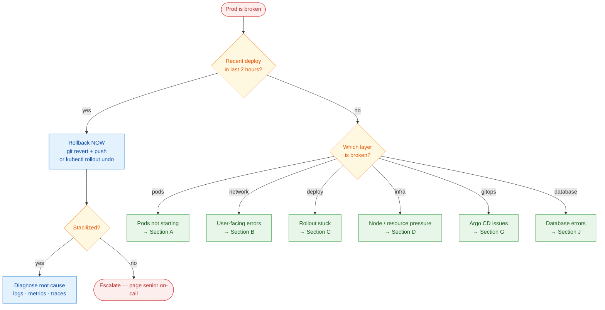

# 23 — The Production Incident Playbook

> **Core question:** It's on fire in prod — what do I actually run, in what order, to fix it?

> **⏱️ Time:** Reference chapter — keep it open during incidents · **🎚️ Level:** Intermediate→Senior · **📋 Pairs with:** [M8 Observability](10-M8-observability-sre.md) · [M9 Advanced K8s](11-M9-advanced-k8s-internals.md) · [Linux Toolkit](21-linux-toolkit.md) · [Reference Appendix error-reflex table](16-reference-appendix.md)

This chapter is **not a tutorial** — it is the reference you open when something is broken. Each scenario follows the same shape: Symptom → Likely causes → Diagnose (exact commands) → Fix → Prevent. Jump to your symptom in the index below. Read the incident mindset section once; you will be glad you did at 2 a.m.

---

## The incident mindset (read this first)

**Rule 1: Stabilize first, root-cause second.**

The ordered reflex, every time:



*60-second triage: check for a recent deploy first — if yes, roll back immediately; if no, pick the failing layer and jump to the matching section.*

```
1. ACKNOWLEDGE  →  alert the team, open an incident channel
2. ASSESS       →  blast radius — how many users? which services? which regions?
3. RESTORE      →  rollback / failover / scale-up — make it stop hurting NOW
4. DIAGNOSE     →  ONLY NOW dig into root cause with full logs and metrics
5. FIX          →  the targeted change that addresses the root cause
6. VERIFY       →  confirm the fix works, watch dashboards for 10 min
7. POSTMORTEM   →  blameless, written, action items with owners
```

Skipping step 3 to jump to step 4 is the single most common incident mistake. A five-minute rollback beats two hours of live debugging.

**The RED / USE lens** — before you open logs, two mental frames:

| Frame | Applies to | Ask |
|---|---|---|
| **RED** (Rate / Errors / Duration) | Services, APIs | Is the request rate dropping? Error rate rising? Latency climbing? |
| **USE** (Utilization / Saturation / Errors) | Infrastructure (CPU, memory, disk, network) | Is a resource near 100%? Are requests queuing? Are hardware errors firing? |

> 🇮🇳 **Hinglish intuition:** Incident mein pehle aag bujhao (rollback), phir sochte hain kyun lagi (root cause). Agar pehle root cause dhundho to tab tak aadha customer chala gaya.

Cross-link: [ch14 "deploy failed in prod" scenario](14-interview-bank.md) has war-story STAR answers that complement this chapter.

---

## 🔎 Symptom → jump-to index

| What you see | Likely area | Jump to |
|---|---|---|
| Pod stuck `CrashLoopBackOff` | Bad image, config, crash, OOM | [A1 — CrashLoopBackOff](#a1--crashloopbackoff) |
| Pod stuck `ImagePullBackOff` | Registry auth, bad tag | [A2 — ImagePullBackOff](#a2--imagepullbackoff--errimagepull) |
| Pod stuck `Pending` / `Unschedulable` | Resources, taints, PVC | [A3 — Pod Pending](#a3--pod-pending--unschedulable) |
| Pod shows `OOMKilled` | Memory limit too low or leak | [A4 — OOMKilled](#a4--oomkilled) |
| Pod stuck `Terminating` | Finalizers, graceful shutdown | [A5 — Pod stuck Terminating](#a5--pod-stuck-terminating) |
| Users get 502 / 503 / 504 | LB → Ingress → Service → Pod | [B1 — 502/503/504 errors](#b1--502--503--504-gateway-errors) |
| Service has no endpoints | Label mismatch, readiness failing | [B2 — No endpoints](#b2--service-has-no-endpoints) |
| DNS not resolving inside cluster | CoreDNS, wrong name/namespace | [B3 — DNS resolution failing](#b3--dns-resolution-failing) |
| Connection refused between services | Wrong port, NetworkPolicy, SG | [B4 — Connection refused / timeout](#b4--connection-refused--timeout-between-services) |
| Ingress returns 404 or TLS error | Host/path mismatch, cert expired | [B5 — Ingress 404 / TLS error](#b5--ingress-404--tls-errors) |
| Rollout stuck, not progressing | New pods failing readiness | [C1 — Rollout stuck](#c1--rollout-stuck--not-progressing) |
| Bad deploy is live, users affected | Need rollback now | [C2 — Bad deploy rollback](#c2--bad-deploy-live--rollback-drill) |
| Config/Secret change not visible | Pod not restarted | [C3 — Config change not applied](#c3--configsecret-change-not-applied) |
| Node `NotReady` | kubelet down, disk/memory pressure | [D1 — Node NotReady](#d1--node-notready) |
| Disk full on node or PVC | Log growth, big files, inodes | [D2 — Disk full](#d2--disk-full) |
| High CPU / high latency | CPU throttling, missing HPA | [D3 — High CPU / latency](#d3--high-cpu--high-latency) |
| Unexpected cloud cost spike | Idle resources, orphaned LBs | [D4 — Cost spike](#d4--cost-spike) |
| PVC stuck `Pending` | No StorageClass, zone mismatch | [E1 — PVC stuck Pending](#e1--pvc-stuck-pending) |
| Volume won't attach / Multi-Attach | EBS + pod rescheduled to other AZ | [E2 — Volume attach / Multi-Attach error](#e2--volume-wont-attach--multi-attach-error) |
| Accidental data loss / PVC deleted | `reclaimPolicy: Delete` | [E3 — Accidental data loss](#e3--accidental-data-loss) |
| PVC stuck `Terminating` / namespace won't delete | `pvc-protection` finalizer — a pod still mounts it | [E4 — PVC stuck Terminating](#e4--pvc-stuck-terminating) |
| CI build fails / flaky tests | Non-determinism, cache, resources | [F1 — Build fails / flaky tests](#f1--build-fails--flaky-tests) |
| Image push denied in CI | Registry auth, expired token | [F2 — Image push denied](#f2--image-push-denied) |
| Trivy blocks build on CVE | Vulnerable base image or dep | [F3 — Trivy CVE block](#f3--trivy-blocks-the-build-on-a-cve) |
| Wrong image running in cluster | `latest` + stale cache | [F4 — Wrong image running](#f4--wrong-image-running) |
| Argo CD app stuck `OutOfSync` | Immutable field, hook failure | [G1 — Argo OutOfSync stuck](#g1--argo-cd-app-outsync-stuck) |
| Argo CD reverting manual changes | Self-heal is working as designed | [G2 — SelfHeal reverting changes](#g2--selfheal-reverting-a-legitimate-change) |
| Terraform state lock stuck | DynamoDB lock left by killed run | [H1 — State lock stuck](#h1--state-lock-stuck) |
| Terraform plan shows unexpected drift | Console click changed reality | [H2 — Drift](#h2--drift) |
| Terraform `destroy` blocked | `prevent_destroy` lifecycle rule | [H3 — Blocked destroy](#h3--accidentalblocked-destroy) |
| Terraform state lost / corrupted | Backend issue, manual edit | [H4 — State lost / corrupted](#h4--state-lost--corrupted) |
| AWS connection times out | Security Group not opened | [I1 — Connection timeout (AWS)](#i1--connection-times-out-aws) |
| AWS `AccessDenied` error | Missing IAM policy, wrong role | [I2 — IAM AccessDenied](#i2--iam-accessdenied) |
| TLS certificate expired | Let's Encrypt not renewing | [I3 — TLS cert expired](#i3--tls-certificate-expired) |
| LB targets unhealthy | Health-check mismatch, SG | [I4 — LB targets unhealthy](#i4--lb-targets-unhealthy) |
| "Too many connections" / pool exhausted | No connection pooling, leaks | [J1 — Too many connections](#j1--too-many-connections) |
| Slow queries / high DB CPU | Missing index, N+1 queries | [J2 — Slow queries](#j2--slow-queries--high-db-cpu) |
| DB failover / replica lag | Multi-AZ RDS failover, replication | [J3 — Failover / replica lag](#j3--failover--replica-lag) |

---

## A · Kubernetes workloads won't start

### A1 — CrashLoopBackOff

> 🔴 **Symptom:** `kubectl get pods` shows `STATUS = CrashLoopBackOff`. The pod starts, immediately exits, and Kubernetes keeps retrying with exponential backoff.

**Likely causes:**

| Cause | Tell-tale sign |
|---|---|
| App crashes at startup (unhandled panic, wrong args) | `logs --previous` shows stack trace or error |
| Missing env var or Secret | App logs: "config not found", `KeyError`, nil pointer |
| Bad image tag / corrupt image | `kubectl describe` shows `OCI error` or pull succeeded but container exits immediately |
| Liveness probe too aggressive | Events: `Liveness probe failed` → container killed |
| OOM at startup (too low limit) | `Reason: OOMKilled` in describe — see [A4](#a4--oomkilled) |

> 🔍 **Diagnose:**

```bash
# 1. Quick status
kubectl get pods -n <namespace>

# 2. Events — always read these first
kubectl describe pod <pod-name> -n <namespace>

# 3. Current logs (if container is briefly alive)
kubectl logs <pod-name> -n <namespace>

# 4. PREVIOUS container logs — the crash output
kubectl logs <pod-name> -n <namespace> --previous

# 5. Check the Deployment's env / volume mounts
kubectl get deployment <name> -n <namespace> -o yaml | grep -A20 env:

# 6. Verify the referenced Secret / ConfigMap actually exists
kubectl get secret <secret-name> -n <namespace>
kubectl get configmap <cm-name> -n <namespace>
```

> 🛠️ **Fix:**
> - **App crash:** fix the bug, rebuild, push a new image tag, update the manifest.
> - **Missing Secret/ConfigMap:** create the missing resource (`kubectl create secret generic ...`), then `kubectl rollout restart deployment/<name>`.
> - **Liveness probe too aggressive:** increase `initialDelaySeconds` or `failureThreshold` in the manifest to give the app time to start.
> - **OOM at startup:** raise `resources.limits.memory` — see [A4](#a4--oomkilled).

> 🛡️ **Prevent:**
> - Use `startupProbe` for slow-starting apps so the liveness probe doesn't fire too early.
> - Always mount Secrets/ConfigMaps as `optional: false` so a missing resource surfaces at deploy time, not runtime.
> - Run `kubectl apply --dry-run=client` in CI to catch missing references before they hit the cluster.

> 🇮🇳 **Hinglish intuition:** CrashLoopBackOff = container baar baar girta hai — jaise ek banda job mein pehle din hi quit kar de. `--previous` logs woh last resignation letter hai. Pehle woh padho.

---

### A2 — ImagePullBackOff / ErrImagePull

> 🔴 **Symptom:** Pod stays in `ImagePullBackOff` or `ErrImagePull`. The container never even starts.

**Likely causes:**

| Cause | Tell-tale sign |
|---|---|
| Typo in image tag | `repository does not exist` or `manifest unknown` |
| Private registry, no `imagePullSecrets` | `401 Unauthorized` or `authentication required` |
| Wrong or expired pull-secret credentials | `403 Forbidden` |
| Docker Hub rate limit (anonymous pulls) | `429 Too Many Requests` |
| Image deleted from registry | `manifest unknown` |

> 🔍 **Diagnose:**

```bash
# Events section is the key — read the exact error message
kubectl describe pod <pod-name> -n <namespace>

# Check what imagePullSecrets the pod has (or doesn't)
kubectl get pod <pod-name> -n <namespace> -o jsonpath='{.spec.imagePullSecrets}'

# Verify the pull secret exists and is of the right type
kubectl get secret <pull-secret-name> -n <namespace>
kubectl get secret <pull-secret-name> -n <namespace> -o jsonpath='{.type}'
# should be: kubernetes.io/dockerconfigjson

# Manually test the pull from a debug pod (confirms registry reachability)
kubectl run test-pull --image=<exact-image:tag> --restart=Never -n <namespace>
kubectl describe pod test-pull -n <namespace>
kubectl delete pod test-pull -n <namespace>
```

> 🛠️ **Fix:**
> - **Wrong tag:** fix the image tag in the Deployment/manifest and redeploy.
> - **Missing pull secret:** `kubectl create secret docker-registry regcred --docker-server=<registry> --docker-username=<user> --docker-password=<token> -n <namespace>`, then add `imagePullSecrets: [{name: regcred}]` to the pod spec.
> - **Rate limited (Docker Hub):** switch to an authenticated pull, use a mirror (ECR public mirror), or add credentials.

> 🛡️ **Prevent:** Pin image tags to immutable digests (`image@sha256:...`) in production. Never rely on `latest`. Store pull secrets in your secret manager and sync them to the cluster via External Secrets Operator.

---

### A3 — Pod Pending / Unschedulable

> 🔴 **Symptom:** Pod stays in `Pending` forever. `READY` column shows `0/1`. No container has started.

**Likely causes:**

| Cause | Tell-tale sign |
|---|---|
| Insufficient CPU or memory on all nodes | Events: `Insufficient cpu` / `Insufficient memory` |
| Node selector / affinity mismatch | Events: `didn't match node selector` |
| Taint on all nodes, no toleration | Events: `had taint ... that the pod didn't tolerate` |
| PVC not bound (see [E1](#e1--pvc-stuck-pending)) | Events: `persistentvolumeclaim not found` |
| No nodes at all / cluster autoscaler not provisioned | `kubectl get nodes` shows nothing |

> 🔍 **Diagnose:**

```bash
# Step 1: pod events — always has the reason
kubectl describe pod <pod-name> -n <namespace>
# Look for the Events section at the bottom

# Step 2: what is available on nodes?
kubectl get nodes
kubectl top nodes   # requires metrics-server

# Step 3: describe a node to see allocatable vs requested
kubectl describe node <node-name>
# Look for "Allocated resources" table

# Step 4: cluster-level events (catches autoscaler messages too)
kubectl get events -n <namespace> --sort-by='.lastTimestamp'

# Step 5: check for taints blocking placement
kubectl get nodes -o custom-columns=NAME:.metadata.name,TAINTS:.spec.taints
```

> 🛠️ **Fix:**
> - **Insufficient resources:** scale the cluster (add nodes / let the cluster autoscaler fire), or lower pod `requests`.
> - **Taint/toleration mismatch:** add the correct `tolerations` to the pod spec, or remove the taint from the node with `kubectl taint node <node> <key>-`.
> - **Affinity mismatch:** fix `nodeSelector` / `nodeAffinity` labels to match actual node labels.

> 🛡️ **Prevent:** Set Cluster Autoscaler or Karpenter. Use `PodDisruptionBudgets` to prevent eviction-induced pending. Define node labels and taints in IaC so they are predictable.

---

### A4 — OOMKilled

> 🔴 **Symptom:** Pod restarts repeatedly. `kubectl describe pod` shows `Reason: OOMKilled` and exit code `137`.

> 🔍 **Diagnose:**

```bash
kubectl describe pod <pod-name> -n <namespace>
# Look for:
#   Last State: Terminated
#     Reason: OOMKilled
#     Exit Code: 137

# Compare limit vs actual usage
kubectl top pod <pod-name> -n <namespace>

# Historical memory usage — check your Grafana / Prometheus
# Query: container_memory_working_set_bytes{pod="<pod-name>"}
```

> 🛠️ **Fix (two very different root causes):**

| Root cause | Fix |
|---|---|
| **Limit set too low** (app is healthy, just needs more RAM) | Raise `resources.limits.memory` in the manifest |
| **Memory leak** (app consumes RAM without bound) | Fix the leak in code; as a temporary measure, add a liveness probe that restarts on OOM faster |

!!! warning "Don't just raise limits blindly"
    If memory grows without bound even after raising limits, you have a leak — raising the limit only delays the next OOMKill. Profile the app: Java heap dumps, Go `pprof`, Node.js `--heap-prof`.

> 🛡️ **Prevent:** Set both `requests` and `limits` for every container. Configure a Prometheus alert on `container_memory_working_set_bytes / limits > 0.85`. Use VPA (Vertical Pod Autoscaler) in recommendation mode to right-size limits over time.

---

### A5 — Pod stuck Terminating

> 🔴 **Symptom:** `kubectl delete pod <name>` was run. The pod shows `STATUS = Terminating` and never disappears.

> 🔍 **Diagnose:**

```bash
kubectl describe pod <pod-name> -n <namespace>
# Look for: Finalizers section (non-empty = something must clean up first)
# Also look for: preStop hook output in events

# Check if the node itself is gone
kubectl get node <node-name>
```

**Common causes:** a finalizer registered by a controller that is no longer running; a `preStop` hook that hangs; the node is already dead (pod can't be reaped).

> 🛠️ **Fix:**

```bash
# Safe approach: wait for the finalizer to be resolved
# (find and fix the controller that registered the finalizer)

# Force delete — use ONLY when the node is already gone or the pod is truly stuck
# and you understand a finalizer won't clean up
kubectl delete pod <pod-name> -n <namespace> --grace-period=0 --force
```

!!! danger "Force-delete is a last resort"
    `--force --grace-period=0` bypasses graceful shutdown. If the pod holds a lock (distributed lock, leader-election lease, Persistent Volume claim), force-deleting without the finalizer completing can leave orphaned state. Investigate the finalizer source before using this.

> 🛡️ **Prevent:** Ensure controllers that register finalizers have their own liveness/readiness handling. Test pod termination in staging. Set `terminationGracePeriodSeconds` appropriately (default 30s — increase for apps with long drain).

---

## B · App is up but users get errors (networking & routing)

### B1 — 502 / 503 / 504 Gateway errors

> 🔴 **Symptom:** Users see `502 Bad Gateway`, `503 Service Unavailable`, or `504 Gateway Timeout`. The cluster appears running.

**The layered walk — always go outside-in:**

```
Internet → Load Balancer → Ingress Controller → Service → Endpoints → Pod
```

**Likely causes at each layer:**

| Layer | Symptom | Cause |
|---|---|---|
| Load Balancer | 503 from LB, no traffic reaching cluster | LB targets unhealthy — see [I4](#i4--lb-targets-unhealthy) |
| Ingress Controller | 502 from Ingress | Ingress pod itself is crashing or OOM |
| Service→Pod routing | 502, endpoints empty | Label selector mismatch — see [B2](#b2--service-has-no-endpoints) |
| Pod readiness | 503, pod running but `0/1 READY` | Readiness probe failing — app not ready |
| Pod too slow | 504 Gateway Timeout | App latency > upstream timeout; resource starvation |

> 🔍 **Diagnose:**

```bash
# 1. Are pods running and READY?
kubectl get pods -n <namespace>

# 2. Does the Service have endpoints?
kubectl get endpoints <service-name> -n <namespace>
# Empty endpoints = problem found → go to B2

# 3. What is the readiness probe doing?
kubectl describe pod <pod-name> -n <namespace>
# Look for: Readiness probe failed in Events

# 4. Can you reach the pod directly (bypassing the Service)?
kubectl exec -it <debug-pod> -n <namespace> -- curl http://<pod-ip>:<port>/health

# 5. Check Ingress controller logs
kubectl logs -n ingress-nginx -l app.kubernetes.io/name=ingress-nginx --tail=100

# 6. Describe the Ingress resource
kubectl describe ingress <name> -n <namespace>
```

> 🛠️ **Fix:** Follow the layer where the diagnosis pointed. Most 502s in Kubernetes resolve at the Endpoints layer (B2) or readiness probe (fix the probe or the app).

> 🛡️ **Prevent:** Always configure meaningful readiness probes on HTTP endpoints (`/health` or `/readyz`). Set LB health-check timeouts generously for slow-starting apps. Alert on `kube_endpoint_address_not_ready > 0`.

> 🇮🇳 **Hinglish intuition:** 502 matlab "darwaza toh hai par andar koi nahi mila." Layer by layer chalte jao — bahar se andar. Jahan khaali mila, wahi problem hai.

---

### B2 — Service has no endpoints

> 🔴 **Symptom:** `kubectl get endpoints <service>` shows `<none>` or an empty list. All traffic to this Service gets dropped.

> 🔍 **Diagnose:**

```bash
# Get the Service's selector
kubectl get service <service-name> -n <namespace> -o yaml | grep -A5 selector:

# Get the labels actually on the pods
kubectl get pods -n <namespace> --show-labels

# They must match exactly — compare carefully
# Common culprit: Service selector has "app: my-service" but pods have "app: myservice" (hyphen vs no hyphen)

# Also check: are pods READY? (Unready pods are excluded from endpoints)
kubectl get pods -n <namespace>
# READY column must show 1/1 (or N/N), not 0/1
```

> 🛠️ **Fix:**
> - **Label mismatch:** edit the Service selector (`kubectl edit service <name>`) or add/fix the label on the Deployment template (`kubectl edit deployment <name>` → `spec.template.metadata.labels`).
> - **Readiness probe failing:** investigate why the probe fails (app not healthy, wrong path/port — see [B1](#b1--502--503--504-gateway-errors)).

> 🛡️ **Prevent:** Use a linting tool (e.g., `kube-linter`) in CI that catches Service selector / Pod label mismatches before deployment.

---

### B3 — DNS resolution failing

> 🔴 **Symptom:** A pod can't reach another service by its DNS name (e.g., `http://payments-service.payments.svc.cluster.local`). `curl` hangs or returns `Could not resolve host`.

> 🔍 **Diagnose:**

```bash
# Run a DNS debug pod
kubectl run dns-debug --image=busybox:1.35 --restart=Never -it --rm -- /bin/sh

# Inside the debug pod:
nslookup kubernetes.default.svc.cluster.local
nslookup <service-name>.<namespace>.svc.cluster.local
# If first fails: CoreDNS itself is down
# If second fails: service name or namespace is wrong

# Check CoreDNS pods
kubectl get pods -n kube-system -l k8s-app=kube-dns
kubectl logs -n kube-system -l k8s-app=kube-dns --tail=50

# Check CoreDNS ConfigMap for custom rewrites / forwarders
kubectl get configmap coredns -n kube-system -o yaml
```

**Full Kubernetes DNS name format:** `<service>.<namespace>.svc.cluster.local`

Common mistakes: using `localhost` instead of the service DNS name; wrong namespace in the name; looking up a pod IP directly (use the Service, not pod IPs — they change).

> 🛠️ **Fix:**
> - CoreDNS pods crashing → `kubectl rollout restart deployment/coredns -n kube-system`.
> - Wrong DNS name → correct the URL in the app config or environment variable.
> - CoreDNS resource-starved → raise its CPU/memory limits.

> 🛡️ **Prevent:** Use full DNS names in service-to-service config (not short names that depend on search domain order). Test DNS resolution in integration tests.

---

### B4 — Connection refused / timeout between services

> 🔴 **Symptom:** Service A can resolve Service B's name but gets `Connection refused` or times out.

> 🔍 **Diagnose:**

```bash
# 1. Is the target pod actually listening on the expected port?
kubectl exec -it <pod-name> -n <namespace> -- ss -tlnp
# or:
kubectl exec -it <pod-name> -n <namespace> -- netstat -tlnp

# 2. Does the Service port map to the right targetPort?
kubectl get service <service-name> -n <namespace> -o yaml
# spec.ports[].port      = what clients call
# spec.ports[].targetPort = what the container listens on

# 3. Test connectivity directly from a debug pod
kubectl exec -it <source-pod> -n <namespace> -- curl -v http://<service-name>.<ns>.svc.cluster.local:<port>/health
kubectl exec -it <source-pod> -n <namespace> -- nc -zv <service-name>.<ns>.svc.cluster.local <port>

# 4. Check NetworkPolicy — are there policies that block ingress/egress?
kubectl get networkpolicy -n <namespace>
kubectl describe networkpolicy <policy-name> -n <namespace>
```

> 🛠️ **Fix:**
> - **Wrong port:** correct `targetPort` in the Service definition.
> - **NetworkPolicy blocking:** add a rule allowing the traffic (source pod namespace/label → destination pod port).
> - **App not binding to `0.0.0.0`:** if the app binds to `127.0.0.1`, traffic from other pods can't reach it — fix the app's bind address. See [ch20 localhost vs 0.0.0.0](20-confusions-and-tradeoffs.md).

> 🛡️ **Prevent:** Default-deny NetworkPolicy with explicit allow rules (zero-trust posture). Test inter-service connectivity in integration tests.

---

### B5 — Ingress 404 / TLS errors

> 🔴 **Symptom:** Hitting the Ingress host returns 404, TLS handshake fails, or browser shows "certificate expired."

> 🔍 **Diagnose:**

```bash
# Check Ingress rules
kubectl describe ingress <name> -n <namespace>
# Look for: rules → host → paths → backend

# Does the TLS secret exist?
kubectl get secret <tls-secret-name> -n <namespace>

# Check cert expiry
kubectl get secret <tls-secret-name> -n <namespace> \
  -o jsonpath='{.data.tls\.crt}' | base64 -d | openssl x509 -noout -dates

# Check IngressClass
kubectl get ingressclass
kubectl describe ingress <name> -n <namespace> | grep IngressClass

# Ingress controller logs for routing errors
kubectl logs -n ingress-nginx -l app.kubernetes.io/name=ingress-nginx --tail=100 | grep 404
```

**Common 404 causes:** host header in request doesn't match `spec.rules[].host`; path doesn't match; Ingress in a different namespace than the Service; wrong `ingressClassName`.

> 🛠️ **Fix:**
> - **404:** fix the `host` or `path` in the Ingress spec. Ensure `spec.ingressClassName` matches your controller.
> - **Cert expired:** if using cert-manager, `kubectl describe certificate <name>` to see renewal status. Manual certs: recreate the TLS Secret with new cert/key.
> - **TLS mismatch:** verify the secret name in `spec.tls[].secretName` matches an existing secret.

> 🛡️ **Prevent:** Use cert-manager with Let's Encrypt for automatic renewal. Alert on cert expiry > 14 days out. Use Helm values or Kustomize overlays so host names come from config, not manual edits.

---

## C · Deploy & rollout problems

### C1 — Rollout stuck / not progressing

> 🔴 **Symptom:** `kubectl rollout status deployment/<name>` hangs or returns `Waiting for deployment "<name>" rollout to finish: 0 of 3 updated replicas are available`. After `progressDeadlineSeconds` (default 600s), the Deployment shows `ProgressDeadlineExceeded`.

> 🔍 **Diagnose:**

```bash
# Watch rollout status
kubectl rollout status deployment/<name> -n <namespace>

# Check new pod status — are they starting?
kubectl get pods -n <namespace> -l app=<name>

# The new pods are probably in CrashLoopBackOff or Pending — diagnose those
kubectl describe pod <new-pod-name> -n <namespace>
kubectl logs <new-pod-name> -n <namespace> --previous

# Check the Deployment conditions
kubectl describe deployment <name> -n <namespace>
# Look for: Progressing condition, reason: ProgressDeadlineExceeded
```

The rollout is stuck because **new pods are not passing their readiness probe**. The old pods are still running (Kubernetes protects you), but the rollout cannot complete.

> 🛠️ **Fix:**
> - If new pods are crashing (CrashLoopBackOff): rollback immediately — see [C2](#c2--bad-deploy-live--rollback-drill), then fix the underlying issue.
> - If pods are Pending (resources): free resources or scale the cluster first, then retry the rollout.
> - If the readiness probe path changed: fix the probe in the manifest and reapply.

> 🛡️ **Prevent:** Set `progressDeadlineSeconds` to a value that matches your worst-case startup time. Use Argo Rollouts or Flagger for canary/blue-green deploys so a bad version never reaches 100% before validation.

---

### C2 — Bad deploy live — rollback drill

> 🔴 **Symptom:** A recent deploy broke production. Users are affected NOW. This is the one to memorize.

**The 30-second rollback:**

```bash
# See the revision history
kubectl rollout history deployment/<name> -n <namespace>

# Rollback to the previous revision (fastest path)
kubectl rollout undo deployment/<name> -n <namespace>

# OR rollback to a specific revision
kubectl rollout undo deployment/<name> -n <namespace> --to-revision=<N>

# Watch it roll back
kubectl rollout status deployment/<name> -n <namespace>

# Confirm old image is running
kubectl get pods -n <namespace> -o wide
```

**GitOps rollback (Argo CD):** rolling back in the cluster is only a temporary fix — Argo CD will reconcile it back to Git. Do this:

```bash
# Revert the bad commit in Git
git revert <bad-commit-sha>
git push origin main
# Argo CD will now sync to the reverted state
```

!!! danger "GitOps: cluster rollback is temporary"
    `kubectl rollout undo` in an Argo CD managed cluster will be overwritten at the next sync. Always fix Git first. The `kubectl rollout undo` is only for the 30-second immediate stop-bleeding step while you do the git revert.

> 🛡️ **Prevent:** Every Deployment should have at least `revisionHistoryLimit: 5`. Pin image tags to commit SHAs — never `latest`. Require a staging deploy before production. Use deployment gates (Argo Rollouts analysis, smoke tests).

> 🇮🇳 **Hinglish intuition:** Rollback matlab "pehle wali gaadi mein wapas baithna." Git revert woh permanent U-turn hai. `kubectl rollout undo` sirf traffic divert karta hai — raasta Git se hi badlega.

---

### C3 — Config/Secret change not applied

> 🔴 **Symptom:** You updated a ConfigMap or Secret. The pods are still showing old values. The change seems to have no effect.

**Root cause:** Kubernetes does not automatically restart pods when a ConfigMap or Secret changes. Existing pods keep the old values in memory or in mounted files (mounted files do get updated eventually, but env vars never do without a restart).

> 🔍 **Diagnose:**

```bash
# Confirm the ConfigMap/Secret was actually updated
kubectl get configmap <name> -n <namespace> -o yaml
# Decode ONE key (jsonpath must point at a key — '{.data}' returns the whole
# JSON map, and piping that to base64 -d just errors out):
kubectl get secret <name> -n <namespace> -o jsonpath='{.data.DB_PASSWORD}' | base64 -d; echo

# List the keys first if you don't know them:
kubectl get secret <name> -n <namespace> -o jsonpath='{.data}' | jq -r 'keys[]'

# Or decode every key at once:
kubectl get secret <name> -n <namespace> -o json | jq -r '.data | to_entries[] | "\(.key)=\(.value|@base64d)"'

# Check what the running pod sees
kubectl exec -it <pod-name> -n <namespace> -- env | grep <VAR_NAME>
kubectl exec -it <pod-name> -n <namespace> -- cat /path/to/mounted/config
```

> 🛠️ **Fix:**

```bash
# Trigger a rolling restart (zero downtime)
kubectl rollout restart deployment/<name> -n <namespace>
```

> 🛡️ **Prevent:** Use Reloader (Stakater Reloader) — an operator that watches ConfigMaps/Secrets and automatically rolls the Deployment when they change. Annotate deployments with `reloader.stakater.com/auto: "true"`.

---

## D · Resource, performance & node health

### D1 — Node NotReady

> 🔴 **Symptom:** `kubectl get nodes` shows a node with `STATUS = NotReady`. Pods on that node may be evicted or stuck Terminating.

> 🔍 **Diagnose:**

```bash
# See all node conditions
kubectl describe node <node-name>
# Look for: Conditions section
# Ready = False or Unknown
# MemoryPressure / DiskPressure / PIDPressure = True = the specific problem

# SSH to the node (if possible)
ssh <node-ip>

# On the node:
systemctl status kubelet         # Is kubelet running?
journalctl -u kubelet -n 100     # Last 100 log lines
df -h                            # Disk usage — is a partition full?
free -h                          # Memory pressure?
```

**Common causes:** kubelet crashed (restart it); disk full on the node (see [D2](#d2--disk-full)); node ran out of memory; network partition between node and control plane.

> 🛠️ **Fix:**
> - **kubelet down:** `systemctl restart kubelet`.
> - **Disk pressure:** clean up container images on the node: `crictl rmi --prune`; clear old logs.
> - **Memory pressure:** evict non-critical pods or add memory to the node.
> - **Persistent issue:** cordon the node (`kubectl cordon <node>`), drain it (`kubectl drain <node> --ignore-daemonsets --delete-emptydir-data`), then investigate or replace it.

> 🛡️ **Prevent:** Monitor node conditions with Prometheus `kube_node_status_condition`. Set node-problem-detector. Reserve resources for system daemons with `--system-reserved` and `--kube-reserved` kubelet flags.

---

### D2 — Disk full

> 🔴 **Symptom:** Pods are being evicted. Node is `NotReady` with `DiskPressure = True`. Or a PVC hits its capacity limit and the app throws "no space left on device."

> 🔍 **Diagnose:**

```bash
# On the affected node:

# 1. Which filesystems are full?
df -h
# Look for any filesystem at or near 100%

# 2. Inode exhaustion (just as bad as byte exhaustion, often missed)
df -i
# %iuse near 100% = no more files can be created even if bytes are free

# 3. Find the biggest files
find / -xdev -size +500M 2>/dev/null

# 4. Container logs often blow up — check the Docker/containerd log driver location
du -sh /var/log/containers/*  2>/dev/null | sort -rh | head -20
du -sh /var/lib/docker/       2>/dev/null

# 5. For PVC disk full — check usage inside the pod
kubectl exec -it <pod-name> -n <namespace> -- df -h
```

> 🛠️ **Fix (node disk):**

```bash
# Remove unused container images
crictl rmi --prune

# Remove stopped containers (Docker nodes)
docker system prune -f

# Truncate a specific bloated log (do NOT delete — the process has it open)
truncate -s 0 /var/log/containers/<bloated-log>.log

# If a large application file: identify owner, coordinate deletion
```

> 🛠️ **Fix (PVC full):** Resize the PVC (if StorageClass supports `allowVolumeExpansion: true`):

```bash
kubectl patch pvc <pvc-name> -n <namespace> -p '{"spec":{"resources":{"requests":{"storage":"50Gi"}}}}'
# Then restart the pod so the filesystem inside picks up the expansion
```

> 🛡️ **Prevent:** Set `log rotation` on nodes (logrotate or containerd's log rotation settings). Alert on `node_filesystem_avail_bytes / node_filesystem_size_bytes < 0.15`. Set PVC usage alerts in Grafana. Cross-link: [Linux toolkit](21-linux-toolkit.md) for `df`, `du`, `find` usage.

> 🇮🇳 **Hinglish intuition:** Disk full = ghar ka almari full. Pehle dekho kya chhod sakte ho (unused images, old logs). Phir badao (PVC resize). Inode full alag problem hai — files ki count limit hit ho gayi, bytes nahi. `df -i` zaroor chalao.

---

### D3 — High CPU / high latency

> 🔴 **Symptom:** App latency increased. Users see slow responses. Dashboards show high CPU. Or CPU is not high but latency is — which means CPU throttling.

> 🔍 **Diagnose:**

```bash
# What is using CPU right now?
kubectl top pods -n <namespace> --sort-by=cpu
kubectl top nodes

# Check for CPU throttling (the silent killer)
# In Grafana: container_cpu_cfs_throttled_seconds_total
# High throttling = limit is too low even if utilization looks "fine"

# Is there an HPA? What is its state?
kubectl get hpa -n <namespace>
kubectl describe hpa <name> -n <namespace>
# Look for: current replicas vs desired, and why it's not scaling

# Check resource requests vs limits
kubectl get pod <pod-name> -n <namespace> -o jsonpath='{.spec.containers[*].resources}'
```

**CPU throttling vs high CPU — different causes, different fixes:**

| Observation | Meaning | Fix |
|---|---|---|
| CPU usage near 100% of limit | App needs more CPU | Raise `limits.cpu` or scale horizontally |
| CPU usage looks "normal" but latency is high | CPU throttling: cgroup is enforcing the limit in short bursts | Raise `limits.cpu` or remove CPU limit (use only `requests`) |
| CPU fine, memory fine, latency still high | Downstream dependency slow (DB, external API) | Check DB metrics, add timeouts, trace the slow call |

> 🛠️ **Fix:**
> - Raise `resources.limits.cpu` — or for latency-sensitive apps, consider removing the CPU limit and using only `requests` (throttling goes away, but noisy-neighbor risk increases).
> - Configure HPA to scale before saturation: `targetCPUUtilizationPercentage: 60` not `90`.

> 🛡️ **Prevent:** Use VPA in recommendation mode to tune requests/limits. Configure HPA. Alert on `container_cpu_cfs_throttled_seconds_total`. Cross-link: [M5 sizing and cost](06-M5-sizing-and-cost.md).

---

### D4 — Cost spike

> 🔴 **Symptom:** Cloud bill spikes unexpectedly. Finance alerts. A service or environment costs far more than expected.

> 🔍 **Diagnose (AWS):**

```bash
# AWS Cost Explorer: group by Service and by Tag
# Look for: EC2, EBS, Data Transfer, NAT Gateway, Load Balancers

# Orphaned Load Balancers (most common spike cause)
aws elb describe-load-balancers --query 'LoadBalancerDescriptions[].LoadBalancerName'
aws elbv2 describe-load-balancers --query 'LoadBalancers[].LoadBalancerArn'
# Cross-reference: do these have targets? Do they correspond to a live Service?

# Orphaned EBS volumes
aws ec2 describe-volumes --filters Name=status,Values=available \
  --query 'Volumes[*].[VolumeId,Size,CreateTime]'

# Large NAT Gateway data transfer
# Check: are pods routing all egress through NAT? Can you use VPC endpoints instead?

# Idle EC2 (low CPU for days)
aws cloudwatch get-metric-statistics --namespace AWS/EC2 \
  --metric-name CPUUtilization --statistics Average --period 86400 \
  --start-time $(date -u -d '7 days ago' +%Y-%m-%dT%H:%M:%SZ) \
  --end-time $(date -u +%Y-%m-%dT%H:%M:%SZ)
```

> 🛠️ **Fix:** Delete orphaned LBs and EBS volumes. Enable cluster autoscaler scale-down. Set up AWS Budgets + alerts. Tag everything so you can attribute costs.

> 🛡️ **Prevent:** Use `prevent_destroy` for intentional resources; automate cleanup of staging environments. Cross-link: [M5 sizing and cost](06-M5-sizing-and-cost.md).

---

## E · Storage

### E1 — PVC stuck Pending

> 🔴 **Symptom:** `kubectl get pvc -n <namespace>` shows `STATUS = Pending`. Pod that needs it is also stuck Pending.

> 🔍 **Diagnose:**

```bash
kubectl describe pvc <pvc-name> -n <namespace>
# Look at Events — common messages:
# "no persistent volumes available for this claim"  → no PV matches
# "waiting for first consumer to be scheduled"       → volumeBindingMode: WaitForFirstConsumer (normal)
# "storageclass not found"                           → StorageClass name typo

kubectl get storageclass
# Is the StorageClass you referenced present?
# Is there a default StorageClass? (marked with (default))
```

**Common causes:**

| Cause | Events message | Fix |
|---|---|---|
| Wrong StorageClass name | `storageclass not found` | Fix the `storageClassName` in the PVC |
| No default StorageClass | `no storage class` | Set a default: `kubectl patch storageclass <name> -p '{"metadata":{"annotations":{"storageclass.kubernetes.io/is-default-class":"true"}}}'` |
| Zone mismatch (EBS) | `no nodes are available in zone` | Create PVC in the same zone as the node, or use EFS for multi-AZ |
| Storage provisioner not installed | Events silent, no provisioner | Install the CSI driver (e.g., `aws-ebs-csi-driver`) |

> 🛡️ **Prevent:** Use infrastructure-as-code to define StorageClasses. Use EFS-backed StorageClasses for multi-AZ workloads. Cross-link: [ch20 EBS vs EFS vs S3](20-confusions-and-tradeoffs.md).

---

### E2 — Volume won't attach / Multi-Attach error

> 🔴 **Symptom:** Pod is stuck in `ContainerCreating` with event `Multi-Attach error for volume "pvc-xxx": volume is already exclusively attached to one node and can't be attached to another`.

**Root cause:** EBS volumes are block devices — they can be attached to **only one EC2 node at a time**. When a pod is rescheduled to a new node (node failure, autoscaling event), the volume is stuck on the old node.

> 🔍 **Diagnose:**

```bash
kubectl describe pod <pod-name> -n <namespace>
# Events will show: Multi-Attach error

# Find which node has the volume
kubectl describe pv <pv-name>
# Look for: nodeAffinity section
```

> 🛠️ **Fix:**

```bash
# Option 1: Force-detach the old attachment (if old node is gone)
aws ec2 describe-volumes --volume-ids <vol-id> \
  --query 'Volumes[*].Attachments'

aws ec2 detach-volume --volume-id <vol-id> --force

# Wait a minute, then watch the pod
kubectl get pods -n <namespace> -w

# Option 2: If old node is still running, drain and cordon it first
kubectl cordon <old-node>
kubectl drain <old-node> --ignore-daemonsets --delete-emptydir-data
```

!!! warning "EBS is single-AZ, single-node"
    Stateful workloads on EBS are tied to one AZ. If your nodes span multiple AZs, your StatefulSet pods must have `nodeAffinity` pinning them to the same AZ as their volumes — or switch to EFS/NFS for multi-AZ shared storage.

> 🛡️ **Prevent:** Use EFS (NFS) for shared or multi-AZ workloads. Use `StatefulSet` with `volumeClaimTemplates` (each pod gets its own PVC — no sharing, no Multi-Attach). Pin EBS-backed StatefulSets to a single AZ with `nodeAffinity`.

---

### E3 — Accidental data loss

> 🔴 **Symptom:** A PVC was deleted (or a pod/StatefulSet was deleted) and the underlying volume — and all its data — was also deleted.

**Root cause:** `PersistentVolume.spec.persistentVolumeReclaimPolicy = Delete` means when the PVC is deleted, the PV and the underlying cloud volume are also deleted automatically.

!!! danger "reclaimPolicy: Delete is the default for dynamic provisioning"
    Most StorageClasses default to `reclaimPolicy: Delete`. This is correct for ephemeral data but catastrophic for databases. Always check before deploying stateful workloads.

> 🔍 **Diagnose (post-incident):**

```bash
# Can the cloud volume be recovered? (EBS snapshot or automatic backup?)
aws ec2 describe-snapshots --owner-ids self \
  --filters Name=volume-id,Values=<lost-vol-id>

# Check if RDS / managed DB has automated backups — often the real fix
```

> 🛠️ **Fix:** Restore from the most recent snapshot or backup. If no backup exists — this is a data loss event. Postmortem required.

> 🛡️ **Prevent:**
>
> 1. Set `reclaimPolicy: Retain` on StorageClasses used for databases.
> 2. Enable automated snapshots (EBS snapshots, RDS automated backups).
> 3. Use `kubectl delete --dry-run=client` before deleting StatefulSets.
> 4. Use `kubectl annotate pv <name> "helm.sh/resource-policy=keep"` for Helm-managed volumes.

Cross-link: [ch20 EBS / EFS / S3 trade-offs](20-confusions-and-tradeoffs.md).

---

### E4 — PVC stuck `Terminating`

**Symptom:** `kubectl delete pvc data-postgres-0` hangs, or returns and the PVC sits in `Terminating` forever. Namespace deletion also hangs (a namespace cannot finish deleting while a PVC in it will not go).

> ⚠️ Different from [E1 (Pending)](#e1--pvc-stuck-pending) — that one never bound. This one is bound, in use, and refusing to die.

**Diagnose:**

```bash
# 1. Confirm state and look at the finalizer
kubectl get pvc data-postgres-0 -n billfree
# STATUS: Terminating

kubectl describe pvc data-postgres-0 -n billfree | grep -A3 Finalizers
# Finalizers:  [kubernetes.io/pvc-protection]   ← this is holding it

# 2. The real question: WHO is still mounting it?
kubectl describe pvc data-postgres-0 -n billfree | grep -A3 "Used By"
# Used By:  postgres-0                          ← there's your answer

# 3. If "Used By: <none>" but it still hangs, hunt for the pod yourself:
kubectl get pods -n billfree -o json \
  | jq -r '.items[] | select(.spec.volumes[]?.persistentVolumeClaim.claimName=="data-postgres-0") | .metadata.name'
```

**Root cause:** `pvc-protection` is a **finalizer**, not a bug. Kubernetes added it deliberately in 1.10 so you cannot yank a volume out from under a running pod. The rule is simple: **a PVC will not delete while any pod still references it.** The delete request is recorded (`deletionTimestamp` set), then blocked until the last consumer is gone — at which point the finalizer clears itself and the PVC disappears on its own.

**Fix:**

```bash
# The correct fix — remove the consumer, not the finalizer
kubectl delete pod postgres-0 -n billfree
# → last consumer gone → pvc-protection clears itself → PVC deletes automatically

# If it's a StatefulSet, the controller will just recreate the pod.
# Scale the controller down first:
kubectl scale statefulset postgres --replicas=0 -n billfree
kubectl delete pvc data-postgres-0 -n billfree        # now it goes

# Pod already gone but PVC still stuck? The pod is a zombie on a dead node:
kubectl get pods -n billfree -o wide | grep Terminating
kubectl delete pod <zombie> -n billfree --grace-period=0 --force
```

!!! danger "Do NOT patch the finalizer away"
    Google will hand you this in ten seconds:
    ```bash
    kubectl patch pvc data-postgres-0 -n billfree -p '{"metadata":{"finalizers":null}}'
    ```
    It "works" instantly — and that is the trap. You have removed the guard, **not** the reason for the guard. The PVC object vanishes from the API while a pod still has the volume mounted, so you get: the PV orphaned in `Released`, the underlying EBS volume still attached to a node and still billing, a `VolumeAttachment` that no controller will ever clean up, and — if the pod was still writing — a filesystem torn away mid-write.

    A PVC in `Terminating` is Kubernetes **doing its job**. Ask *"which pod still holds it?"*, never *"how do I force this?"*

> 🛡️ **Prevent:**
>
> 1. Delete in dependency order — workload first, then its claims. For StatefulSets: `scale --replicas=0`, *then* delete PVCs.
> 2. Remember StatefulSet PVCs **outlive** the StatefulSet by design (that is the whole point) — deleting the StatefulSet does not delete `data-postgres-0`. Cleanup is a separate, deliberate step.
> 3. Before deleting a namespace, check for bound PVCs — one stuck PVC hangs the whole namespace deletion.
> 4. Confirm `reclaimPolicy` before any of this: with `Delete`, a successful PVC deletion also **destroys the EBS volume and its data** (see [E3](#e3--accidental-data-loss)).

Cross-link: [E1 — PVC stuck Pending](#e1--pvc-stuck-pending) · [E3 — Accidental data loss](#e3--accidental-data-loss) · [A5 — Pod stuck Terminating](#a5--pod-stuck-terminating)

---

## F · CI/CD pipeline

### F1 — Build fails / flaky tests

> 🔴 **Symptom:** CI pipeline fails on build or tests. The failure is sometimes non-deterministic (passes locally, fails in CI; or fails on retry without code change).

**Common causes:**

| Type | Symptom | Fix |
|---|---|---|
| Dependency version not pinned | Works locally, fails in CI | Pin all deps with a lockfile (`package-lock.json`, `poetry.lock`, `go.sum`) |
| Stale build cache | Passes after clean rebuild | Clear CI cache for this job |
| Test depends on external service | Flaky — times out intermittently | Mock the external call; add retry with timeout |
| Test timing dependency | Flaky on slow CI machines | Replace `sleep(N)` with polling/retry logic |
| Insufficient CI runner resources | OOM in build step | Increase runner memory; use multi-stage Docker builds |
| Non-deterministic test order | Passes alone, fails with others | Fix test isolation; use `--randomize-seed` to reproduce |

> 🔍 **Diagnose:**

```bash
# Run the specific failing test in isolation
# (exact command depends on language / test runner)
go test ./... -run TestFlakyFunctionName -v -count=3
pytest tests/test_flaky.py::test_name -v
npm test -- --testNamePattern="flaky test" --verbose

# Check if it's always the same test or random
# In CI: look at the failure pattern across 10 builds in the history
```

> 🛡️ **Prevent:** Require lockfiles. Fail CI on lockfile divergence. Mock all external calls in unit tests. Cross-link: [ch19 CI pipeline](19-cicd-hands-on-flow.md).

---

### F2 — Image push denied

> 🔴 **Symptom:** CI pipeline fails at the `docker push` step with `denied: requested access to the resource is denied` or `unauthorized`.

> 🔍 **Diagnose:**

```bash
# In the CI log — look for the exact error:
# "denied" = authn succeeded but authz failed (wrong repo, wrong permissions)
# "unauthorized" = no valid credentials presented

# Verify the CI service account / role has push permission to the registry
# (AWS ECR example)
aws iam simulate-principal-policy \
  --policy-source-arn <role-arn> \
  --action-names ecr:BatchCheckLayerAvailability ecr:PutImage ecr:InitiateLayerUpload ecr:UploadLayerPart ecr:CompleteLayerUpload \
  --resource-arns <ecr-repo-arn>

# Check if the ECR token is expired (ECR tokens last 12 hours)
# Ensure the CI step runs `aws ecr get-login-password | docker login` before push
```

> 🛠️ **Fix:**
> - Add a login step before every push: `aws ecr get-login-password --region <region> | docker login --username AWS --password-stdin <account>.dkr.ecr.<region>.amazonaws.com`.
> - For GitHub Actions: verify the OIDC role trust policy allows the repo/branch.
> - Verify the IAM policy has all required ECR actions.

> 🛡️ **Prevent:** Use OIDC federation (GitHub Actions OIDC → AWS role) instead of long-lived access keys. Keys expire and rotate; OIDC tokens are short-lived by design.

---

### F3 — Trivy blocks the build on a CVE

> 🔴 **Symptom:** CI fails at the security scan step. Trivy found a `CRITICAL` or `HIGH` CVE in the image.

> 🔍 **Diagnose:**

```bash
# Run Trivy locally to see the full report
trivy image <image:tag>

# Filter to only CRITICAL and HIGH
trivy image --severity CRITICAL,HIGH <image:tag>

# Identify: is the CVE in the BASE IMAGE or a direct dependency?
trivy image --format json <image:tag> | jq '.Results[] | select(.Vulnerabilities) | {Target, Vulns: [.Vulnerabilities[] | select(.Severity == "CRITICAL") | {PkgName, VulnerabilityID, FixedVersion}]}'
```

**Decision tree:**

```
CVE found
├── Has a FixedVersion? 
│   ├── In base image → Update base image (FROM node:20-alpine → FROM node:20.x.y-alpine)
│   └── In direct dep → Upgrade the dep in package file
├── No fix available yet?
│   ├── Risk-accept with documented justification → add to .trivyignore with expiry date
│   └── Mitigate at runtime (WAF, network isolation)
└── False positive?
    └── Open Trivy issue or add to .trivyignore with comment explaining why
```

> 🛠️ **Fix:**
> - Update the base image tag to a patched version.
> - Upgrade the vulnerable dependency.
> - `.trivyignore` for accepted risks (use sparingly, with justification and an expiry date comment).

> 🛡️ **Prevent:** Scan weekly with a scheduled pipeline job even when no code changed (base image CVEs appear without you doing anything). Cross-link: [ch19 Trivy in pipeline](19-cicd-hands-on-flow.md).

---

### F4 — Wrong image running

> 🔴 **Symptom:** A deploy succeeded. But the running pods are still on the old code. The new feature is not live.

**Root cause:** A **mutable tag** (`:latest`, `:dev`, `:v1`) combined with `imagePullPolicy: IfNotPresent`. If the node already has that tag cached, Kubernetes will not pull again — it assumes the tag still means what it meant last time.

> ⚠️ **Know the default, it is a classic interview trap:** when you omit `imagePullPolicy`, Kubernetes infers it from the tag — `:latest` (or no tag) → **`Always`**; any other tag → **`IfNotPresent`**. So plain `image: my-app:latest` actually pulls every time. This bug bites when someone *explicitly* sets `IfNotPresent` alongside `:latest`, or uses a mutable non-latest tag like `:dev` where `IfNotPresent` is the silent default.

> 🔍 **Diagnose:**

```bash
# What image SHA is actually running?
kubectl get pod <pod-name> -n <namespace> -o jsonpath='{.status.containerStatuses[*].imageID}'

# What SHA was pushed?
docker inspect --format='{{index .RepoDigests 0}}' <image:tag>
# Or from ECR:
aws ecr describe-images --repository-name <name> --image-ids imageTag=latest \
  --query 'imageDetails[0].imageDigest'
```

> 🛠️ **Fix (immediate):**

```bash
# Force a pull by using a unique tag (commit SHA is the standard)
# In CI: docker build -t my-app:${GITHUB_SHA} .
#         docker push my-app:${GITHUB_SHA}
# In manifest: image: my-app:<GITHUB_SHA>

# For an immediate fix on a running cluster (without changing the tag):
kubectl rollout restart deployment/<name> -n <namespace>
# This forces new pods → they will re-evaluate imagePullPolicy
```

> 🛡️ **Prevent:** **Never use `latest` in production.** Tag every image with the Git commit SHA. Set `imagePullPolicy: Always` only if you must use a mutable tag (adds latency). The immutable-tag pattern: `image: registry/my-app:abc1234` — if that SHA changes, the tag changes, Kubernetes must pull.

> 🇮🇳 **Hinglish intuition:** `latest` tag ek jhooth hai — "latest" ka matlab sirf "jo bhi last time pull hua tha." Commit SHA use karo — woh kabhi badalta nahi, aur kabhi confuse nahi karta.

---

## G · GitOps / Argo CD

### G1 — Argo CD app OutOfSync stuck

> 🔴 **Symptom:** Argo CD shows an app as `OutOfSync` but sync fails repeatedly. Or the app shows `Sync Failed` with an error.

> 🔍 **Diagnose:**

```bash
# See the diff between Git (desired) and cluster (actual)
argocd app diff <app-name>

# See detailed sync operation status and error
argocd app get <app-name>

# Check the Application object in the cluster
kubectl describe application <app-name> -n argocd

# Check repo-server logs (it fetches and renders Git content)
kubectl logs -n argocd -l app.kubernetes.io/name=argocd-repo-server --tail=100

# Check application-controller logs (it does the sync)
kubectl logs -n argocd -l app.kubernetes.io/name=argocd-application-controller --tail=100
```

**Common failure causes:**

| Error | Cause | Fix |
|---|---|---|
| `ComparisonError: ... immutable field` | Trying to change an immutable field (e.g., Service `clusterIP`) | Delete and recreate the resource: `argocd app sync --replace` — or fix the manifest |
| `Hook failed` | A pre-sync/post-sync Job failed | Check the hook Job logs: `kubectl logs -n <ns> -l app.kubernetes.io/instance=<app>` |
| `authentication required` | Argo can't read the Git repo | Check repository credentials in Argo CD Settings → Repositories |
| `Unable to resolve ... to a commit SHA` | Branch/tag doesn't exist | Fix `spec.source.targetRevision` in the Application |

> 🛠️ **Fix for immutable field:**

```bash
# Tell Argo to delete and recreate (not patch) the resource
argocd app sync <app-name> --replace

# Or: annotate the resource to be replaced on sync
# In the manifest:
# metadata:
#   annotations:
#     argocd.argoproj.io/sync-options: Replace=true
```

> 🛡️ **Prevent:** Never mutate immutable fields. Plan resource deletions through the GitOps pipeline (delete the manifest from Git). Use `argocd app diff` before every sync in CI. Cross-link: [M7 GitOps](08-M7-gitops.md).

---

### G2 — SelfHeal reverting a legitimate change

> 🔴 **Symptom:** You made a manual change to a resource in the cluster (e.g., scaled a Deployment up for an emergency). Argo CD reverted it back to the Git value.

**This is Argo CD working correctly, not a bug.**

Git is the source of truth. `selfHeal: true` means Argo will always enforce what Git says. A manual cluster change that isn't in Git will be reverted.

> 🛠️ **Fix:** Update Git to reflect what you want. Do not fight the reconciler — work with it.

```bash
# Temporary workaround if you need the manual change to survive briefly:
# Disable self-heal (use sparingly, re-enable immediately after)
argocd app set <app-name> --self-heal=false

# Make the change
kubectl scale deployment <name> --replicas=5 -n <namespace>

# Then: commit the change to Git
# spec.replicas: 5  in the manifest
git add . && git commit -m "scale: raise replicas to 5 for traffic spike"
git push

# Re-enable self-heal
argocd app set <app-name> --self-heal=true
```

> 🇮🇳 **Hinglish intuition:** Argo CD ek strict teacher hai — jo Git mein likha hai wahi chalega. Manual change matlab cheating — teacher usse erase kar dega. Sahi kaam: Git mein likho, phir submit karo.

---

## H · Terraform & infrastructure

### H1 — State lock stuck

> 🔴 **Symptom:** `terraform plan` or `terraform apply` fails with `Error acquiring the state lock`. A previous run was killed mid-operation and left the lock.

> 🔍 **Diagnose:**

```bash
# The error message includes the lock ID — capture it
# Example:
# Lock Info:
#   ID:        f4e5a3b2-...
#   Operation: OperationTypeApply
#   Who:       user@host
#   Created:   2025-07-10 14:23:01

# Verify the lock exists in DynamoDB
aws dynamodb get-item \
  --table-name <terraform-lock-table> \
  --key '{"LockID": {"S": "<state-path>"}}'
```

> 🛠️ **Fix:**

```bash
terraform force-unlock <lock-id>
```

!!! danger "Verify no other run is active before force-unlock"
    If another `terraform apply` is genuinely in progress (parallel CI runs, a colleague's terminal), force-unlocking will cause **two applies to modify state simultaneously** — this corrupts state. Check CI pipelines and team communication before running this command.

> 🛡️ **Prevent:** Serialize Terraform runs in CI — use a single CI job with a `concurrency` group that cancels pending runs. Never kill a `terraform apply` mid-run (use `Ctrl+C` gracefully — it waits for the in-progress operation to complete).

---

### H2 — Drift

> 🔴 **Symptom:** `terraform plan` shows unexpected changes — resources being modified or destroyed — even though no Terraform code changed. Someone made a manual change in the console.

> 🔍 **Diagnose:**

```bash
terraform plan -out=tfplan
# Read the output carefully:
# ~ resource "aws_security_group_rule" "web" → this will be CHANGED
# - resource "aws_instance" "old_manual_box"  → this will be DESTROYED (was not in state!)

# To understand what drifted:
terraform show -json tfplan | jq '.resource_changes[] | select(.change.actions != ["no-op"]) | {address: .address, actions: .change.actions}'
```

**Two strategies:**

| Strategy | When to use | Action |
|---|---|---|
| **Reconcile to code** (standard) | Code is the true desired state | Apply the plan — Terraform fixes the drift |
| **Import manual change into state** | The manual change was intentional and correct | `terraform import <resource.name> <cloud-id>`, then add matching HCL |

> 🛠️ **Fix:**

```bash
# Option A: fix the drift by applying
terraform apply tfplan

# Option B: import a manually created resource
terraform import aws_security_group.manual sg-0abc1234
# Then add matching `resource "aws_security_group" "manual" { ... }` to your HCL
```

> 🛡️ **Prevent:** Break-glass access only via IaC. Use AWS Config + CloudTrail to alert on manual console changes. Cross-link: [M1 Terraform](02-M1-terraform.md).

---

### H3 — Accidental/blocked destroy

> 🔴 **Symptom:** `terraform destroy` or a plan with resource removal is blocked by `Error: Instance cannot be destroyed`.

This is `prevent_destroy = true` in a `lifecycle` block — Terraform's guardrail.

> 🔍 **Diagnose:**

```bash
# Identify which resource has prevent_destroy
grep -r "prevent_destroy" .

# Run a targeted plan to see exactly what would be destroyed
terraform plan -destroy -target=<resource.name>
```

> 🛠️ **Fix:**
> - To **intentionally** destroy a protected resource: remove `prevent_destroy = true` from the lifecycle block, commit the change, then apply.
> - To destroy only specific resources without touching the protected one: use `-target`: `terraform destroy -target=<resource>`.

!!! warning "Always review the destroy plan before confirming"
    `terraform destroy` without `-target` will destroy ALL managed resources. In production, always run `terraform plan -destroy` first, pipe to a file, and have a second engineer review before applying.

> 🛡️ **Prevent:** Add `prevent_destroy = true` to **every** stateful resource (RDS, S3, ElasticSearch, DynamoDB) as a standard template. Cross-link: [M1 Terraform](02-M1-terraform.md).

---

### H4 — State lost / corrupted

> 🔴 **Symptom:** `terraform plan` throws `Failed to read state: ...` or shows all resources as "to be created" even though they exist in AWS.

> 🔍 **Diagnose:**

```bash
# Check the backend (S3) for the state file
aws s3 ls s3://<state-bucket>/<path>/

# Check S3 versioning — can you retrieve a previous version?
aws s3api list-object-versions \
  --bucket <state-bucket> \
  --prefix <path>/terraform.tfstate

# Restore a previous version
aws s3api get-object \
  --bucket <state-bucket> \
  --key <path>/terraform.tfstate \
  --version-id <version-id> \
  terraform.tfstate.backup
```

> 🛠️ **Fix:**
> - Restore from S3 versioned backup (copy the backup over the current state file).
> - If no backup: use `terraform import` to re-link each existing resource into a new state file — tedious but recoverable.

> 🛡️ **Prevent:** **Always enable S3 versioning and DynamoDB lock on your Terraform backend.** This is non-negotiable for production state. Also: never edit the `.tfstate` file manually.

---

## I · Cloud / AWS

### I1 — Connection times out (AWS)

> 🔴 **Symptom:** `curl`, `ssh`, or the app can't reach a service running on an EC2 instance, RDS, or other AWS resource. The connection just hangs until timeout — no reset, no error message.

**Timeout (no reply) is almost always a Security Group or NACL blocking the traffic.** A "Connection refused" (TCP RST) means the host is reachable but nothing is listening on that port — different problem.

> 🔍 **Diagnose:**

```bash
# 1. Test TCP connectivity
nc -zv <hostname-or-ip> <port>
curl -v --max-time 5 http://<hostname-or-ip>:<port>/

# 2. Check the Security Group on the TARGET resource
# In AWS Console: EC2/RDS → Security Groups → Inbound rules
# Or CLI:
aws ec2 describe-security-groups --group-ids <sg-id> \
  --query 'SecurityGroups[*].IpPermissions'

# 3. Check the Security Group on the SOURCE (does it allow outbound?)
# (Most default SGs allow all outbound — check if a custom SG restricts this)

# 4. Check the NACL on the subnet (stateless — need both inbound AND outbound rules)
aws ec2 describe-network-acls \
  --filters Name=association.subnet-id,Values=<subnet-id>
```

**SG vs NACL — the key difference:**

| | Security Group | NACL |
|---|---|---|
| State | Stateful (return traffic auto-allowed) | Stateless (must explicitly allow both directions) |
| Scope | Instance / ENI level | Subnet level |
| Default | Deny all inbound | Allow all |
| Rule evaluation | All rules evaluated | Rules evaluated in order (lowest number wins) |

> 🛠️ **Fix:** Add the required inbound rule to the Security Group:

```bash
aws ec2 authorize-security-group-ingress \
  --group-id <target-sg-id> \
  --protocol tcp \
  --port <port> \
  --source-group <source-sg-id>
# OR for a specific CIDR:
  --cidr <source-cidr>
```

> 🛡️ **Prevent:** Use SG-to-SG rules (reference source SG, not IP ranges) — they are more maintainable and auto-update when instances change. Cross-link: [ch20 SG vs NACL](20-confusions-and-tradeoffs.md).

> 🇮🇳 **Hinglish intuition:** Connection timeout = darwaza closed, knock ki awaaz nahi aayi. Connection refused = darwaza khula, par andar koi nahi. Timeout = almost always Security Group. Refused = app nahi chal rahi ya wrong port.

---

### I2 — IAM AccessDenied

> 🔴 **Symptom:** AWS CLI or SDK throws `AccessDenied` or `is not authorized to perform: <action> on resource: <arn>`.

> 🔍 **Diagnose:**

```bash
# Step 1: Read the error message carefully — it tells you EXACTLY what was denied
# Example:
# User: arn:aws:iam::123456789012:user/deploy-bot
# is not authorized to perform: s3:PutObject
# on resource: arn:aws:s3:::my-prod-bucket/artifacts/

# Step 2: Who is the caller?
aws sts get-caller-identity

# Step 3: What policies does this principal have?
aws iam list-attached-user-policies --user-name <username>
aws iam list-attached-role-policies --role-name <role-name>

# Step 4: Simulate the policy (does it allow the action?)
aws iam simulate-principal-policy \
  --policy-source-arn <user-or-role-arn> \
  --action-names <denied-action> \
  --resource-arns <resource-arn>

# Step 5: Is there a resource-based policy blocking it? (S3 bucket policy, SQS policy)
aws s3api get-bucket-policy --bucket <bucket-name>
```

> 🛠️ **Fix:** Add the missing permission to the IAM policy. Prefer attaching to a role (not a user). For cross-account access, check the trust policy of the assumed role.

> 🛡️ **Prevent:** Use least-privilege IAM. Use IAM Access Analyzer to identify overly-permissive policies. Use OIDC federation for CI/CD roles — no long-lived credentials.

---

### I3 — TLS certificate expired

> 🔴 **Symptom:** Browser shows "Your connection is not private" / `NET::ERR_CERT_DATE_INVALID`. `curl` returns `SSL certificate problem: certificate has expired`.

> 🔍 **Diagnose:**

```bash
# Check expiry of the live cert
echo | openssl s_client -connect <hostname>:443 2>/dev/null | openssl x509 -noout -dates

# If using cert-manager in Kubernetes:
kubectl get certificate -n <namespace>
kubectl describe certificate <cert-name> -n <namespace>
# Look for: Conditions → Ready = False, reason = Expired or NotYetRenewed

# Check cert-manager controller logs
kubectl logs -n cert-manager -l app=cert-manager --tail=100
```

> 🛠️ **Fix (manual cert):**

```bash
# Get a new certificate (Let's Encrypt via certbot)
certbot renew --cert-name <name>

# For Kubernetes: update the TLS secret
kubectl create secret tls <secret-name> -n <namespace> \
  --cert=path/to/new.crt --key=path/to/new.key \
  --dry-run=client -o yaml | kubectl apply -f -
```

> 🛠️ **Fix (cert-manager):**

```bash
# Trigger a manual renewal
kubectl annotate certificate <cert-name> -n <namespace> \
  cert-manager.io/issuer-kind=ClusterIssuer \
  cert-manager.io/issue-temporary-certificate="true" --overwrite

# Or delete the Certificate object — cert-manager will recreate and renew it
kubectl delete certificate <cert-name> -n <namespace>
```

> 🛡️ **Prevent:** Install cert-manager with Let's Encrypt ClusterIssuer. Automate: it renews 30 days before expiry. Alert on `certmanager_certificate_expiration_timestamp_seconds - time() < 14 days`.

---

### I4 — LB targets unhealthy

> 🔴 **Symptom:** AWS ALB/NLB shows targets as `unhealthy`. HTTP requests to the LB return 502 or 503. The EC2 instances or pods behind the LB appear to be running.

> 🔍 **Diagnose:**

```bash
# Check target health in the AWS Console: EC2 → Load Balancers → Target Groups → Targets
# Or CLI:
aws elbv2 describe-target-health \
  --target-group-arn <tg-arn> \
  --query 'TargetHealthDescriptions[*].[Target.Id,TargetHealth.State,TargetHealth.Reason,TargetHealth.Description]'

# Common reasons:
# "Target.FailedHealthChecks" → health check returns non-200 or times out
# "Target.NotInUse"           → target group not attached to LB
# "Elb.InternalError"         → LB can't reach the target (SG blocking)

# Test the health check path directly from a machine inside the VPC
curl -v http://<target-ip>:<health-check-port><health-check-path>

# Verify the target's Security Group allows inbound from the LB's SG
aws ec2 describe-security-groups --group-ids <target-sg-id> \
  --query 'SecurityGroups[*].IpPermissions'
```

> 🛠️ **Fix:**
> - **Wrong health check path/port:** update the Target Group health check settings to match the actual health endpoint.
> - **Security Group:** add an inbound rule on the target SG allowing traffic from the LB SG on the health check port.
> - **App not responding:** the app may be unhealthy — investigate pod/instance health separately.

> 🛡️ **Prevent:** Use infrastructure-as-code for Target Group health check configuration. Alert on `HealthyHostCount < 1` CloudWatch metric.

---

## J · Database

### J1 — Too many connections

> 🔴 **Symptom:** App throws `FATAL: too many connections for role` (PostgreSQL) or `too many connections` (MySQL). The database is refusing new connections even though queries are not slow.

> 🔍 **Diagnose:**

```sql
-- PostgreSQL: how many connections right now?
SELECT count(*), state, wait_event_type, wait_event
FROM pg_stat_activity
GROUP BY state, wait_event_type, wait_event
ORDER BY count DESC;

-- What is the max?
SHOW max_connections;

-- Are there idle connections leaking?
SELECT count(*), application_name
FROM pg_stat_activity
WHERE state = 'idle'
GROUP BY application_name
ORDER BY count DESC;
```

```bash
# AWS RDS: check DatabaseConnections CloudWatch metric over time
aws cloudwatch get-metric-statistics \
  --namespace AWS/RDS \
  --metric-name DatabaseConnections \
  --dimensions Name=DBInstanceIdentifier,Value=<db-id> \
  --statistics Maximum --period 300 \
  --start-time $(date -u -d '1 hour ago' +%Y-%m-%dT%H:%M:%SZ) \
  --end-time $(date -u +%Y-%m-%dT%H:%M:%SZ)
```

> 🛠️ **Fix:**

| Cause | Fix |
|---|---|
| No connection pooler (app opens a new connection per request) | Deploy PgBouncer (transaction pooling mode) in front of PostgreSQL |
| Connection leak (app opens connections, never closes) | Fix the application code; add connection pool max-size + timeout |
| Too many app instances (N pods × pool_size > max_connections) | Reduce `pool_size` per pod, or increase `max_connections` (+ add RAM to RDS) |

> 🛡️ **Prevent:** Always deploy PgBouncer for PostgreSQL. Set connection pool `max_size` as a function of RDS `max_connections` divided by number of app replicas. Alert on `DatabaseConnections > 0.8 * max_connections`.

---

### J2 — Slow queries / high DB CPU

> 🔴 **Symptom:** DB CPU is near 100%. App latency spiked. Specific pages or API calls are very slow. No spike in traffic.

> 🔍 **Diagnose:**

```sql
-- PostgreSQL: find queries currently running long
SELECT pid, now() - pg_stat_activity.query_start AS duration, query, state
FROM pg_stat_activity
WHERE state != 'idle'
  AND now() - pg_stat_activity.query_start > interval '5 seconds'
ORDER BY duration DESC;

-- Find the slowest queries historically (requires pg_stat_statements extension)
SELECT query, calls, mean_exec_time, total_exec_time
FROM pg_stat_statements
ORDER BY mean_exec_time DESC
LIMIT 20;

-- Is a query doing a sequential scan (no index)?
EXPLAIN (ANALYZE, BUFFERS) SELECT ... ;
-- Look for: "Seq Scan" on a large table = missing index
```

```bash
# Enable and check slow query log (MySQL / PostgreSQL)
# PostgreSQL: set log_min_duration_statement = 1000  (log queries > 1s)
# MySQL: SHOW VARIABLES LIKE 'slow_query_log';
#         SET GLOBAL slow_query_log = 'ON';
#         SET GLOBAL long_query_time = 1;
```

> 🛠️ **Fix:**
> - **Missing index:** `CREATE INDEX CONCURRENTLY idx_table_column ON table(column);` (`CONCURRENTLY` avoids a table lock in PostgreSQL).
> - **N+1 queries:** fix in the ORM — use eager loading (`JOIN`) instead of lazy loading in a loop.
> - **Lock contention:** identify blocking queries with `pg_blocking_pids(pid)`, and either kill or optimize the locking transaction.

> 🛡️ **Prevent:** Enable slow query logging in production. Review EXPLAIN plans in code review for any query touching large tables. Use query performance insights (AWS RDS Performance Insights) — it surfaces the top SQL automatically.

---

### J3 — Failover / replica lag

> 🔴 **Symptom:** Application briefly throws database errors after an RDS Multi-AZ failover event. Reads from a read replica return stale data. DNS still points to the old endpoint.

> 🔍 **Diagnose:**

```bash
# How long does the failover take? (AWS RDS Multi-AZ: typically 60–120 seconds)
# Check RDS Events in Console or CLI:
aws rds describe-events \
  --source-identifier <db-instance-id> \
  --source-type db-instance \
  --duration 60

# Check replica lag
aws cloudwatch get-metric-statistics \
  --namespace AWS/RDS \
  --metric-name ReplicaLag \
  --dimensions Name=DBInstanceIdentifier,Value=<replica-id> \
  --statistics Maximum --period 60 \
  --start-time $(date -u -d '30 minutes ago' +%Y-%m-%dT%H:%M:%SZ) \
  --end-time $(date -u +%Y-%m-%dT%H:%M:%SZ)
```

**RDS Multi-AZ failover process:**
1. Primary fails health check → AWS promotes standby (new primary)
2. DNS CNAME (`<cluster>.cluster-<id>.rds.amazonaws.com`) is updated to point to new primary
3. Apps must reconnect — apps that cache DNS will see errors until the DNS TTL expires

> 🛠️ **Fix:**
> - **Failover errors:** ensure the application connection retry logic handles transient DB errors with exponential backoff.
> - **DNS caching:** set the RDS connection endpoint DNS TTL in your connection pool to ≤ 5 seconds (or use `jdbc:aws-wrapper:postgresql://` Aurora-aware driver).
> - **Replica lag on critical reads:** route those reads to the primary (not the replica) until lag < threshold.
> - **Stale reads:** implement read-after-write consistency by routing a user's reads to the primary for N seconds after their write.

> 🛡️ **Prevent:** Enable Multi-AZ for all production RDS. Use Aurora (automatic failover < 30s). Test failover annually. Implement retry logic with exponential backoff in all DB clients.

---

## The blameless postmortem (close every incident)

Every significant incident — anything that caused customer impact or required manual intervention — deserves a written postmortem. The goal is to fix the **system**, not the person.

**Template:**

```markdown
## Incident Postmortem — <service> — <date>

### Summary
One sentence: what broke, for how long, and what the customer impact was.

### Timeline (UTC)
| Time  | Event |
|-------|-------|
| HH:MM | First alert fired |
| HH:MM | On-call acknowledged |
| HH:MM | Identified affected service |
| HH:MM | Rollback initiated |
| HH:MM | Service restored |
| HH:MM | Root cause confirmed |
| HH:MM | Incident closed |

### Impact
- Affected users / % of traffic
- Error rate during incident
- Duration of impact

### Root Cause
A factual, non-blaming description of what failed and why.
"The deploy at HH:MM introduced a config key that was absent from the production Secret.
The readiness probe failed, the rollout stopped, but a partial set of pods had already
received traffic — those pods crashed on the first request that read the missing key."

### Contributing factors
- No staging environment parity (secret missing in staging too but not exercised)
- No automated check that all required env vars exist before deploy

### What went well
- Alert fired within 2 minutes
- Rollback took < 5 minutes
- Team communication was fast and clear

### What to improve
- Secret parity between environments was not verified

### Action items
| Action | Owner | Due |
|--------|-------|-----|
| Add required-env-var check to CI pipeline | Platform team | 2025-07-18 |
| Add secret parity check between staging and prod | DevOps | 2025-07-25 |
| Document rollback procedure in runbook | On-call | 2025-07-15 |

### Guardrail added
"A CI step now validates that every env var referenced in the deployment manifest
exists in the target environment's Secret before the deploy proceeds."
```

!!! tip "The five postmortem anti-patterns"
    1. **Blaming a person** — always frame as "the system allowed this to happen."
    2. **No action items** — a postmortem without owners and dates is a wish.
    3. **Skipping for "small" incidents** — the small ones teach the most.
    4. **Generic actions** ("improve monitoring") — every action must be specific and measurable.
    5. **Never reading old postmortems** — rotate them in the on-call reading list.

> 🇮🇳 **Hinglish intuition:** Postmortem matlab "kya hua, kyun hua, aur aage nahi hoga" — banda nahi, system fix karo. Action items bina deadline ke bina kaam ke hain.

---

## ⚡ The 60-second triage flow

Run this decision tree when you first get an alert. **Stabilize first.**

```
PROD IS BROKEN — start here
│
├─ Was a deploy done in the last 30 minutes?
│   ├─ YES ──────────────────────────────────────────────────────────────────┐
│   │                                                                         │
│   │  ROLLBACK FIRST (before diagnosing)                                    │
│   │  kubectl rollout undo deployment/<name> -n <ns>                        │
│   │  (GitOps: git revert <sha> && git push)                                │
│   │  Watch: kubectl rollout status deployment/<name> -n <ns>               │
│   │  → Rollback fixed it? → open postmortem, diagnose calmly               │
│   │  → Still broken after rollback? → continue tree ──────────────────────┘
│   │
│   └─ NO (or rollback didn't fix it)
│
├─ Are pods running and READY?
│   ├─ NO  → kubectl get pods -n <ns>
│   │         - CrashLoopBackOff  → Section A1
│   │         - ImagePullBackOff  → Section A2
│   │         - Pending           → Section A3
│   │         - OOMKilled         → Section A4
│   │
│   └─ YES (pods look fine)
│
├─ Is the Service reachable? Do endpoints exist?
│   ├─ NO  → kubectl get endpoints <svc> -n <ns>
│   │         - Empty endpoints   → Section B2 (label mismatch / readiness)
│   │         - 502/503/504       → Section B1 (layered walk)
│   │         - DNS failing       → Section B3
│   │
│   └─ YES (Service routes correctly)
│
├─ Is a node unhealthy?
│   ├─ YES → kubectl get nodes
│   │         - NotReady          → Section D1
│   │         - DiskPressure      → Section D2
│   │
│   └─ NO
│
├─ Is it a storage issue?
│   ├─ YES → PVC Pending          → Section E1
│   │         Multi-Attach error  → Section E2
│   │
│   └─ NO
│
├─ Is it a cloud / infra issue?
│   ├─ YES → Connection timeout   → Section I1 (Security Group)
│   │         AccessDenied        → Section I2
│   │         LB unhealthy        → Section I4
│   │
│   └─ NO
│
└─ Is it the database?
    ├─ Too many connections       → Section J1
    ├─ Slow queries               → Section J2
    └─ Failover                   → Section J3
```

**Parallel track — always running:**
- Post in the incident channel with current status every 10–15 minutes
- Assign one person to "comms" (stakeholder updates) and one to "hands" (fixing)
- Document every command you run and its output in the incident thread

---

## Interview gold

### Q1: "Walk me through debugging a 502 Bad Gateway."

**Model answer:**

"First I check if it's load balancer, Ingress, or Service level. `kubectl get pods` — are pods running and READY? If `READY 0/1`, the readiness probe is failing — I describe the pod and look at probe events. If pods are READY, I check `kubectl get endpoints <service>` — if empty, it's a label selector mismatch between the Service and pods. I compare `kubectl get service -o yaml` selector with `kubectl get pods --show-labels`. If endpoints exist, I check Ingress: `kubectl describe ingress` for host/path match, then `kubectl logs -n ingress-nginx` for backend errors. I go outside-in: LB → Ingress → Service → Endpoints → Pod — and stop at the layer that breaks."

---

### Q2: "A deploy just broke production. What do you do?"

**Model answer:**

"Rollback first, diagnose second. I run `kubectl rollout undo deployment/<name>` immediately to stop user impact — that takes 30 seconds. While it rolls back I open an incident channel. If it's GitOps with Argo CD, the cluster rollback is temporary — I simultaneously do `git revert <sha>` and push so Argo doesn't re-apply the bad version. Once users are no longer impacted, I go back to the logs and events to find the root cause calmly. Never debug a live incident if you can roll back first."

---

### Q3: "A pod is CrashLoopBackOff. How do you debug it?"

**Model answer:**

"Three-step flow: `kubectl get pods` confirms the state. `kubectl describe pod` gives me the Events section — this usually tells me what's wrong (OOMKilled, failed probe, image pull issue). Then `kubectl logs <pod> --previous` gives me the last run's output — the actual crash message. The most common causes I've seen: missing Secret or env var (app panics on startup), liveness probe that fires before the app is ready, or an OOM kill at startup. I fix the specific cause, push a new image or fix the manifest, and watch the rollout."

---

### Q4: "The Terraform state is locked. What do you do?"

**Model answer:**

"First I verify nothing is genuinely running — check CI pipelines, ask the team, look at the lock's `Who` and `Created` fields from the error message. The lock was probably left by a killed apply. Once I'm sure no other operation is active, I run `terraform force-unlock <lock-id>`. I never do this speculatively — two simultaneous applies will corrupt state. After unlocking I immediately run `terraform plan` to verify state integrity before doing anything else."

---

### Q5: "Users report timeouts connecting to a new service you just deployed. How do you debug?"

**Model answer:**

"'Timeout' with no TCP reset usually means a firewall — Security Group on AWS. I first verify the pods are up and READY, and that the Service has endpoints. Then I test from inside the cluster: `kubectl exec` into a debug pod and `curl` the service by DNS name — if that works, the problem is between the LB/Ingress and the cluster (Security Group on the node SG or LB SG). If curl from inside the cluster also fails, the problem is within the cluster — I check NetworkPolicy. I narrow the blast radius layer by layer, test at each layer, and stop when I find where connectivity breaks."

---

### Q6: "A PVC won't bind. How do you investigate?"

**Model answer:**

"`kubectl describe pvc <name>` — the Events section will tell me exactly why. The common failures: the StorageClass name in the PVC doesn't match any existing StorageClass (typo), or the provisioner isn't installed (no EBS CSI driver). On AWS with EBS, a zone mismatch is common — EBS is zone-specific, and if the PVC asks for a zone where no node is available, it won't bind. For multi-AZ workloads I'd switch to EFS. I also check `kubectl get storageclass` to confirm the named class exists and has a provisioner."

---

*This playbook pairs with the [Linux toolkit](21-linux-toolkit.md) for node-level commands, [M8 Observability](10-M8-observability-sre.md) for the metrics and alerting context that tells you an incident started, and the [Appendix error-reflex table](16-reference-appendix.md) for quick one-liner lookups.*
