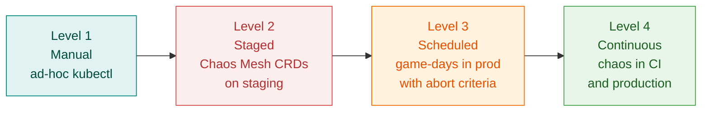
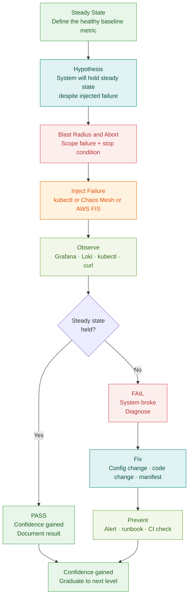
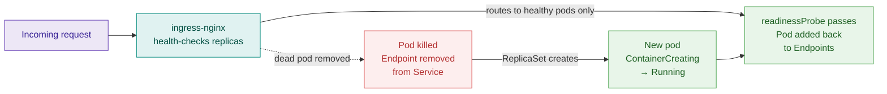
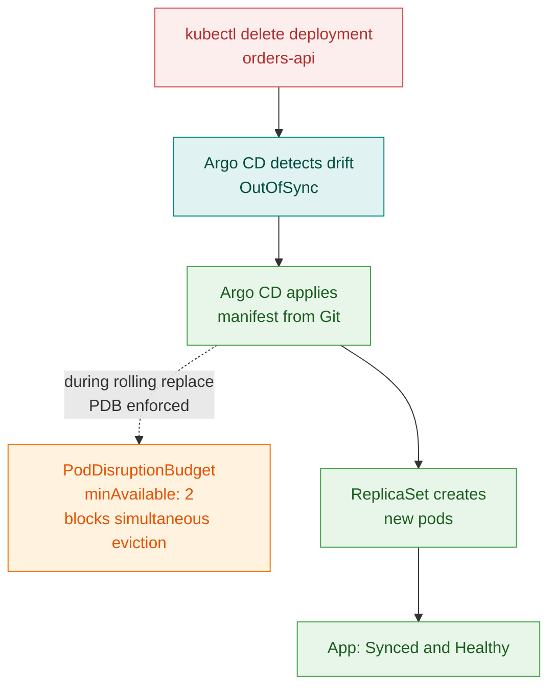
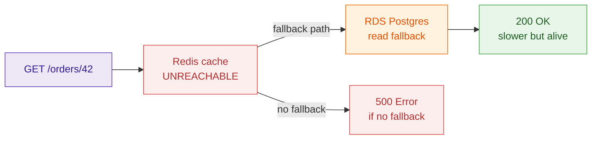
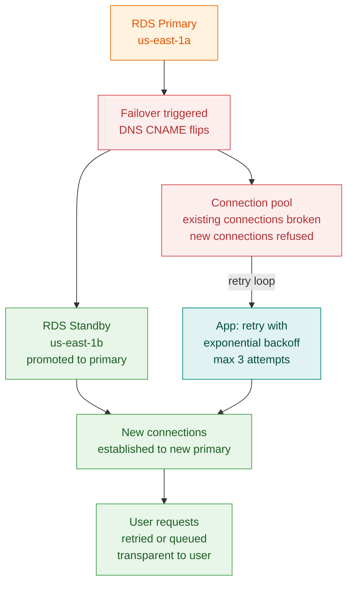
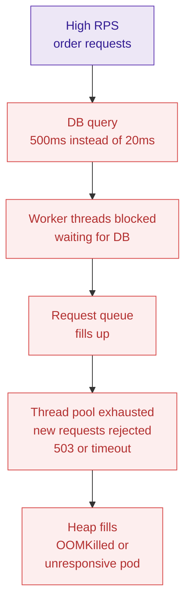
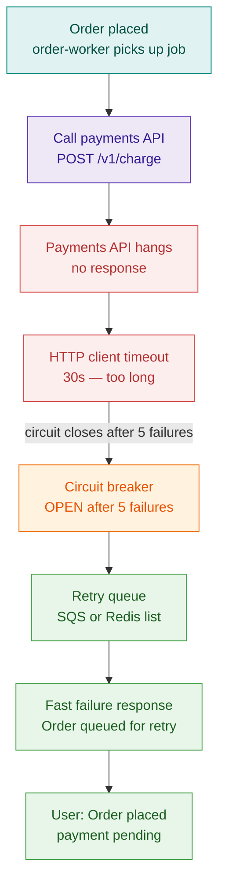

# 25 — The Production Gauntlet · Part II: Chaos Engineering

> **"Would you rather find the failure at 2 pm on a game-day, or 2 am in a real outage?"**

> **⏱️ Time:** 5–7 hours · **🎚️ Level:** Advanced · **📋 Pehle chahiye:** [Ch24 – Build ShopFast](24-production-gauntlet-build.md) · [M8 Observability](10-M8-observability-sre.md) · [Ch23 Incident Playbook](23-production-incident-playbook.md)

---

**Three things you will be able to do when this chapter ends:**

1. Design and safely run a structured chaos experiment on a live Kubernetes workload.
2. Diagnose the blast radius of infrastructure failures using real commands, metrics, and logs.
3. Harden ShopFast — and any future system — against the twelve failure modes that most often cause real production outages.

---

## What chaos engineering actually is (and isn't)

### Origin

In 2010, Netflix moved to AWS and immediately discovered that distributed systems fail in ways that nobody predicted from reading the architecture diagram. Their answer was **Chaos Monkey**: a bot that randomly terminated EC2 instances in production *during business hours*. The logic was ruthless and correct — if you can't tolerate one random instance dying, you don't deserve to call yourself highly available.

Over the next decade, Netflix evolved this into a full discipline: the **Chaos Engineering** practice, formalized in the *Principles of Chaos Engineering* document (principlesofchaos.org).

**The canonical definition:**

> Chaos Engineering is the discipline of experimenting on a system in order to build **confidence** in the system's capability to withstand turbulent conditions in production.

Note the word *confidence*. Not excitement. Not destruction. **Confidence** — the kind that lets an on-call engineer sleep, because they have *verified* the system's behavior under failure, not just assumed it.

### What it is NOT

!!! danger "Common misunderstanding"
    Chaos engineering is **not** "randomly breaking production to see what happens."
    It is a **scientific method** applied to distributed systems: you form a hypothesis, you design a controlled experiment with a defined blast radius and abort condition, you measure, and you learn.
    
    Random destruction is vandalism. Chaos engineering is engineering.

### The five principles

| # | Principle | What it means for ShopFast |
|---|-----------|----------------------------|
| 1 | **Build a hypothesis around steady state** | Define what "healthy" looks like in numbers (p99 < 200ms, error rate < 0.1%). The experiment tests whether that state holds. |
| 2 | **Vary real-world events** | Inject failures that actually happen: pod crash, AZ loss, DB failover, DNS hiccup — not theoretical ones. |
| 3 | **Run experiments in production** | Staging lies. Production is where the real traffic patterns, data volumes, and resource contention live. Start in staging; graduate to prod game-days. |
| 4 | **Automate experiments continuously** | A one-off game-day decays. Chaos in CI/staging runs forever. |
| 5 | **Minimize blast radius** | Start with one pod. Graduate to one AZ. Never blow up the whole system for a first experiment. |

### The maturity ladder



> 🇮🇳 **Hinglish intuition:** School mein fire drill hoti hai — building nahi jalate, bas **practice** karte hain. Chaos engineering wahi hai. Aag lagana nahi seekhte; **bujhana** seekhte hain.

---

## The tools

| Tool | Type | Best for | Blast-radius control |
|------|------|----------|----------------------|
| `kubectl delete pod` / `drain` / `cordon` | Manual | Quick pod/node experiments | Manual (you control scope) |
| `tc netem` inside a pod | Manual | Network latency, packet loss, corruption | Pod-scoped |
| `stress-ng` | Manual | CPU, memory, disk I/O pressure | Container-scoped |
| `iptables` / `nsenter` | Manual | Network drop rules, port blocks | Node or pod-scoped |
| **Chaos Mesh** | CRD-driven OSS | Full suite: PodChaos, NetworkChaos, StressChaos, IOChaos, TimeChaos | Namespace / label selector |
| **LitmusChaos** | CRD-driven OSS | Litmus experiments library, Argo Workflow integration | Namespace-scoped |
| **AWS FIS** | Managed AWS | AZ outage simulation, EC2/EKS node termination, RDS failover, API throttling | IAM-policy scoped |
| **Gremlin** | SaaS | Enterprise, multi-cloud, rich UI | Team/cluster scoped |

**When to use each:**

- **Learning / one-off diagnosis** → `kubectl` + `tc netem` + `stress-ng`. No installation required.
- **Repeatable, reviewable experiments in staging** → Chaos Mesh (CRDs live in Git, reviewed in PRs).
- **AWS infrastructure failures** (AZ, RDS, ElastiCache) → AWS FIS. It is the only tool that can actually tell AWS to promote a Multi-AZ RDS standby.
- **Enterprise multi-team programs** → Gremlin.

---

## The experiment template

Every experiment in this chapter follows the same repeatable shape. Internalize this loop — it is how senior SREs think.



---

## The experiment suite

!!! warning "Pre-flight before every experiment"
    ```bash
    # Confirm you are on the right cluster
    kubectl config current-context

    # Baseline health — save this output before injecting
    kubectl get pods -n shopfast
    kubectl top pods -n shopfast
    curl -s https://shopfast.internal/healthz | jq .

    # Open Grafana and Loki in a second screen before every experiment
    ```

---

### E1 · Kill one pod — does the ReplicaSet self-heal?

> Cross-link: [M4 Kubernetes Core](05-M4-kubernetes-core.md) — ReplicaSet controller, readiness probes.

**Steady state:** `orders-api` serving requests; p99 latency < 200 ms; error rate < 0.1%.

**Hypothesis:** Killing one pod triggers an immediate ReplicaSet replacement. The readiness probe gates traffic so no request is routed to the dying pod. The SLO holds.

**Blast radius:** Single pod. Abort: if error rate > 1% for > 60 s, investigate before proceeding.

#### Inject — manual

```bash
# Pick one pod
POD=$(kubectl get pod -n shopfast -l app=orders-api \
      -o jsonpath='{.items[0].metadata.name}')

# Kill it
kubectl delete pod "$POD" -n shopfast

# Watch the replacement
kubectl get pods -n shopfast -l app=orders-api -w
```

#### Inject — Chaos Mesh

```yaml
apiVersion: chaos-mesh.org/v1alpha1
kind: PodChaos
metadata:
  name: kill-one-orders-pod
  namespace: shopfast
spec:
  action: pod-kill
  mode: one           # only one pod at a time
  selector:
    namespaces: [shopfast]
    labelSelectors:
      app: orders-api
  duration: "30s"
```

#### Observe

```bash
# Replacement timing
kubectl get events -n shopfast --sort-by='.lastTimestamp' | tail -20

# Traffic — did we drop requests?
kubectl logs -n shopfast -l app=ingress-nginx --since=2m | grep "POST /orders" | awk '{print $NF}' | sort | uniq -c

# Grafana: shopfast_http_requests_total{status="5xx"} — should stay near zero
```

#### What you will see



**Common fail:** No readiness probe → traffic routes to the new pod before it is ready → burst of 502s. **Fix:** add a meaningful `/healthz` readiness probe with `initialDelaySeconds: 5` and `periodSeconds: 5`.

**Prevention:** Lint your Deployments — a missing readiness probe should be a CI failure (Conftest/Kyverno policy).

---

### E2 · Delete the Deployment — does Argo CD self-heal?

> Cross-link: [M7 GitOps](08-M7-gitops.md) — Argo CD selfHeal, PDB.

**Steady state:** Argo CD app `shopfast-orders` is `Synced / Healthy`. All pods running.

**Hypothesis:** Deleting the Deployment triggers Argo CD's `selfHeal` to restore it within the `syncInterval` (default 3 min). The PDB prevents *all* pods from being evicted simultaneously if a rolling replacement is attempted.

**Blast radius:** Entire `orders-api` Deployment. **Abort:** if restoration takes > 5 min, check Argo CD logs.

#### Inject — manual

```bash
# Delete the whole Deployment
kubectl delete deployment orders-api -n shopfast

# Watch Argo CD react
argocd app get shopfast-orders --refresh
watch -n5 "kubectl get pods -n shopfast"
```

#### Inject — verify selfHeal is on

```bash
argocd app get shopfast-orders -o json | jq '.spec.syncPolicy'
# Should show: "automated": {"selfHeal": true, "prune": true}
```

#### Observe

```bash
# Time to recovery
date; kubectl get deploy orders-api -n shopfast -w

# Argo CD sync log
argocd app history shopfast-orders

# PDB status during the gap
kubectl get pdb -n shopfast
```

**What you will see — PDB in action:**



**Common fail:** `selfHeal: false` → Argo CD shows OutOfSync but does nothing. The system is dark until someone manually syncs. **Fix:** ensure `automated.selfHeal: true` in the Application CRD. PDB `minAvailable < replicas` → prevents self-healing if all pods are on one node. **Fix:** set `minAvailable: 1` and `topologySpreadConstraints`.

---

### E3 · Drain a node — graceful shutdown under real traffic

> Cross-link: [M9 Advanced K8s Internals](11-M9-advanced-k8s-internals.md) — preStop, SIGTERM, graceful termination.

**Steady state:** 3-replica `orders-api`, pods spread across 2+ nodes.

**Hypothesis:** Draining a node triggers orderly pod eviction. The `preStop` sleep + graceful SIGTERM handling means zero dropped requests.

**Blast radius:** One node. **Abort:** if > 3 dropped connections, `uncordon` immediately.

#### Inject — manual

```bash
# Pick a node that has orders-api pods
NODE=$(kubectl get pod -n shopfast -l app=orders-api \
       -o jsonpath='{.items[0].spec.nodeName}')

# Drain it (respects PDB)
kubectl drain "$NODE" --ignore-daemonsets --delete-emptydir-data \
  --grace-period=60 --timeout=120s

# In a second terminal, watch error rate
while true; do
  curl -s -o /dev/null -w "%{http_code}\n" https://shopfast.internal/orders
  sleep 0.5
done
```

#### The graceful-shutdown config that saves you

```yaml
# Deployment spec — both of these are required
spec:
  template:
    spec:
      terminationGracePeriodSeconds: 60
      containers:
        - name: orders-api
          lifecycle:
            preStop:
              exec:
                command: ["/bin/sh", "-c", "sleep 5"]  # let LB deregister first
```

**Why `preStop sleep 5`?** Kubernetes removes the pod from Endpoints *asynchronously*. Without the sleep, `kube-proxy` may still route traffic to the pod during the 1–2s race between endpoint removal and the process receiving SIGTERM. Five seconds is cheap insurance.

#### Observe

```bash
# Are requests dropping?
kubectl logs -n shopfast -l app=ingress-nginx --since=1m | grep " 50[0-9] "

# Where did pods land after eviction?
kubectl get pods -n shopfast -o wide

# Node cordoned?
kubectl get node "$NODE"
```

**Restore:**

```bash
kubectl uncordon "$NODE"
```

**Common fail:** `terminationGracePeriodSeconds: 30` but the app takes 45 s to drain connections → SIGKILL arrives mid-request. **Fix:** set grace period ≥ your p99 request duration + 15 s buffer.

---

### E4 · Lose an Availability Zone

**Steady state:** `orders-api` pods spread across 3 AZs. RDS Multi-AZ with standby in us-east-1b.

**Hypothesis:** Cordoning all nodes in one AZ causes pods to reschedule on surviving AZs (topologySpread). RDS Multi-AZ promotes standby in < 60 s. SLO recovers within 2 min.

**Blast radius:** All nodes in one AZ. **Abort:** if pods cannot schedule on remaining AZs (check PodsPending > 5 min).

#### Inject — AWS FIS

```json
{
  "description": "Terminate all EC2 instances in us-east-1a for EKS node group",
  "targets": {
    "eks-nodes-1a": {
      "resourceType": "aws:ec2:instance",
      "resourceTags": { "kubernetes.io/cluster/shopfast": "owned", "topology.kubernetes.io/zone": "us-east-1a" },
      "selectionMode": "ALL"
    }
  },
  "actions": {
    "terminate-az-nodes": {
      "actionId": "aws:ec2:terminate-instances",
      "targets": { "Instances": "eks-nodes-1a" }
    }
  },
  "stopConditions": [{ "source": "aws:cloudwatch:alarm", "value": "arn:aws:cloudwatch:...:alarm:shopfast-p99-breach" }]
}
```

#### Inject — manual (safe simulation)

```bash
# Cordon all nodes in us-east-1a without deleting them
for node in $(kubectl get nodes -l topology.kubernetes.io/zone=us-east-1a -o name); do
  kubectl cordon $node
done

# Force eviction
for node in $(kubectl get nodes -l topology.kubernetes.io/zone=us-east-1a -o name); do
  kubectl drain $node --ignore-daemonsets --delete-emptydir-data --force
done
```

#### Diagnose

```bash
# Did pods reschedule?
kubectl get pods -n shopfast -o wide | grep -v "us-east-1a"

# topologySpread satisfied?
kubectl describe pod -n shopfast -l app=orders-api | grep -A5 "Topology Spread"

# RDS failover event
aws rds describe-events --source-identifier shopfast-db \
  --event-categories failover --duration 60
```

**Common fail:** `topologySpreadConstraints` set to `DoNotSchedule` but only 2 AZs remain and `maxSkew: 1` cannot be satisfied → pods stuck in `Pending`. **Fix:** use `whenUnsatisfiable: ScheduleAnyway` for non-critical workloads, or ensure the node group has capacity in surviving AZs before experiments.

**Restore:**

```bash
for node in $(kubectl get nodes -l topology.kubernetes.io/zone=us-east-1a -o name); do
  kubectl uncordon $node
done
```

---

### E5 · Redis (cache) down — graceful degradation or hard crash?

**Steady state:** `orders-api` uses Redis as a read-through cache. Cache hit rate > 70% (visible in Grafana). Latency < 80 ms on cache hits.

**Hypothesis:** If Redis is unavailable, the application **falls back to the database** and continues serving requests (slower, but alive). No 5xx errors.

**Blast radius:** All cache reads/writes fail. DB load increases. **Abort:** if DB connections > 80% of pool.

#### Inject — manual

```bash
# Scale ElastiCache to zero replicas is not possible in AWS — simulate with NetworkPolicy block
kubectl apply -f - <<'EOF'
apiVersion: networking.k8s.io/v1
kind: NetworkPolicy
metadata:
  name: block-redis
  namespace: shopfast
spec:
  podSelector:
    matchLabels:
      app: orders-api
  policyTypes: [Egress]
  egress:
    - ports:
        - port: 443
        - port: 80
        - port: 5432   # allow DB — we are testing cache fallback
      # Redis port 6379 intentionally omitted
EOF
```

#### Inject — Chaos Mesh

```yaml
apiVersion: chaos-mesh.org/v1alpha1
kind: NetworkChaos
metadata:
  name: block-redis
  namespace: shopfast
spec:
  action: partition
  mode: all
  selector:
    namespaces: [shopfast]
    labelSelectors:
      app: orders-api
  direction: to
  target:
    mode: all
    selector:
      namespaces: [shopfast]
      labelSelectors:
        app: redis
  duration: "5m"
```

#### Observe

```bash
# Are requests still succeeding?
while true; do
  curl -s -o /dev/null -w "%{http_code}" https://shopfast.internal/orders/42
  echo
  sleep 1
done

# DB connection spike?
kubectl exec -n shopfast deploy/orders-api -- \
  wget -qO- localhost:9090/metrics | grep db_pool_active

# Application logs — are cache errors surfacing as user errors?
kubectl logs -n shopfast -l app=orders-api --since=2m | grep -i "redis\|cache"
```



**Fix — treat cache as optional:**

```python
# Before (brittle — no fallback)
def get_order(order_id):
    cached = redis.get(f"order:{order_id}")   # throws on connection error
    return cached or db.query(order_id)

# After (resilient)
def get_order(order_id):
    try:
        cached = redis.get(f"order:{order_id}", socket_timeout=0.5)
        if cached:
            return cached
    except (RedisError, ConnectionError):
        metrics.increment("cache.miss.fallback")
    return db.query(order_id)
```

**Prevention:** Set `socket_connect_timeout` and `socket_timeout` on the Redis client. Alert on `cache.miss.fallback > 10%` — that means something is wrong with Redis.

> 🇮🇳 **Hinglish intuition:** Cache ka role waiter ka hai, chef (DB) ka nahi. Agar waiter absent hai, directly kitchen se khana aata hai — restaurant band nahi hota.

**Cleanup:**

```bash
kubectl delete networkpolicy block-redis -n shopfast
```

---

### E6 · RDS failover — connection pool drain and retry

**Steady state:** `orders-api` connected to RDS Multi-AZ primary. DB query p99 < 20 ms.

**Hypothesis:** RDS Multi-AZ failover takes 30–60 s. During this window, existing connections break. The app's **connection pool + retry logic** absorbs the blip. No user-visible errors beyond a brief latency spike.

**Blast radius:** All DB writes fail for 30–60 s. **Abort:** if error rate stays > 1% for > 3 min post-failover, rollback app config.

#### Inject — AWS CLI

```bash
aws rds reboot-db-instance \
  --db-instance-identifier shopfast-db \
  --force-failover
```

#### Observe

```bash
# Timeline of the failover
aws rds describe-events \
  --source-identifier shopfast-db \
  --duration 30 \
  --query 'Events[*].[Message,Date]' \
  --output table

# App side — are retries happening?
kubectl logs -n shopfast -l app=orders-api --since=3m | grep -E "retry|connection|timeout"

# Grafana: db_query_duration_p99 spike + recovery shape
```

**What you will see:**



**Fix — the three-part defense:**

```yaml
# 1. PgBouncer sidecar or RDS Proxy absorbs connection churn
# orders-api Deployment: add RDS Proxy endpoint to DATABASE_URL

# 2. Connection pool config (SQLAlchemy example)
pool_pre_ping=True,          # test connection before using
pool_recycle=300,            # recycle connections every 5 min
pool_timeout=10,             # give up after 10 s if no free conn
max_overflow=5               # allow burst above pool_size

# 3. Retry decorator
@retry(stop=stop_after_attempt(3),
       wait=wait_exponential(min=0.1, max=2),
       retry=retry_if_exception_type(OperationalError))
def create_order(data):
    ...
```

**Prevention:** Add a readiness probe that checks the DB connection. If the DB is unreachable, the pod fails readiness → load balancer stops routing → no 500s reach users while the pool reconnects.

---

### E7 · Network latency api→DB — timeouts and circuit breakers

**Steady state:** DB queries complete in < 20 ms. API p99 < 200 ms.

**Hypothesis:** Adding 500 ms of artificial latency between `orders-api` and RDS exposes missing timeout configuration and reveals cascading failure risk. The circuit breaker trips and returns a fast error instead of slow queue buildup.

**Blast radius:** All DB queries slow. Thread pool exhaustion risk. **Abort:** if pod CPU > 80% (sign of thread starvation).

#### Inject — `tc netem` inside the pod

```bash
# Get a shell on one orders-api pod
kubectl exec -it -n shopfast deploy/orders-api -- sh

# Inside the pod: add 500ms delay to egress traffic on port 5432
tc qdisc add dev eth0 root handle 1: prio
tc qdisc add dev eth0 parent 1:3 handle 30: netem delay 500ms
tc filter add dev eth0 protocol ip parent 1:0 prio 3 u32 \
  match ip dport 5432 0xffff flowid 1:3
```

#### Inject — Chaos Mesh NetworkChaos

```yaml
apiVersion: chaos-mesh.org/v1alpha1
kind: NetworkChaos
metadata:
  name: db-latency
  namespace: shopfast
spec:
  action: delay
  mode: one
  selector:
    namespaces: [shopfast]
    labelSelectors:
      app: orders-api
  delay:
    latency: "500ms"
    correlation: "25"
    jitter: "50ms"
  direction: to
  externalTargets:
    - shopfast-db.cluster.us-east-1.rds.amazonaws.com
  duration: "10m"
```

#### Observe

```bash
# API latency spike visible?
curl -w "\nTotal: %{time_total}s\n" https://shopfast.internal/orders/1

# Thread pool exhaustion?
kubectl exec -n shopfast deploy/orders-api -- \
  wget -qO- localhost:9090/metrics | grep -E "thread_pool|active_requests"

# Circuit breaker state (if implemented)
kubectl logs -n shopfast -l app=orders-api | grep "circuit"
```

**The cascading failure path (before fix):**



**Fix — three layers:**

```python
# Layer 1: Statement timeout — never wait more than 2 s for a query
cursor.execute("SET statement_timeout = '2000ms'")

# Layer 2: Circuit breaker (pybreaker / resilience4j)
@circuit_breaker(fail_max=5, reset_timeout=30)
def db_query(sql, params):
    ...

# Layer 3: Bulkhead — separate thread pool for DB queries
# so slow DB cannot block HTTP handler threads
db_executor = ThreadPoolExecutor(max_workers=10, thread_name_prefix="db")
```

**Cleanup:**

```bash
# Remove tc rules
kubectl exec -it -n shopfast deploy/orders-api -- \
  tc qdisc del dev eth0 root
```

---

### E8 · CPU and memory pressure — HPA, throttling, OOMKilled

> Cross-link: [M5 Sizing and Cost](06-M5-sizing-and-cost.md) — requests/limits, VPA.

**Steady state:** `orders-api` CPU at 30% of limit. Memory stable. HPA at `minReplicas: 2`.

**Hypothesis:** A CPU spike triggers HPA scale-out within 90 s. Pods with CPU *limit* set too low are throttled (not killed) — latency rises but no OOM. A pod with memory overuse is OOMKilled and restarted.

**Blast radius:** Single pod stress. **Abort:** if HPA cannot scale (check node capacity).

#### Inject — CPU stress

```bash
# Run stress-ng in one pod
kubectl exec -n shopfast \
  $(kubectl get pod -n shopfast -l app=orders-api -o name | head -1) \
  -- stress-ng --cpu 2 --timeout 120s
```

#### Inject — memory pressure (trigger OOMKill)

```bash
kubectl exec -n shopfast \
  $(kubectl get pod -n shopfast -l app=orders-api -o name | head -1) \
  -- stress-ng --vm 1 --vm-bytes 600M --timeout 30s
# 600M > memory limit → OOMKilled
```

#### Observe

```bash
# HPA reaction
kubectl get hpa -n shopfast -w

# OOMKill detection
kubectl get events -n shopfast | grep OOMKill
kubectl describe pod -n shopfast <pod-name> | grep -A3 "Last State"

# CPU throttling (cgroup stats)
kubectl exec -n shopfast deploy/orders-api -- \
  cat /sys/fs/cgroup/cpu/cpu.stat | grep throttled
```

**The right-sizing fix:**

```yaml
resources:
  requests:
    cpu: "250m"       # what the scheduler reserves
    memory: "256Mi"   # what the scheduler reserves
  limits:
    cpu: "1000m"      # 4x request — room for burst, avoid over-throttle
    memory: "512Mi"   # 2x request — OOM at 512 not 256

# HPA — trigger scale-out at 70% of request (not limit)
metrics:
  - type: Resource
    resource:
      name: cpu
      target:
        type: Utilization
        averageUtilization: 70
```

> 🇮🇳 **Hinglish intuition:** `requests` = aapka reserved seat on a train. `limits` = aap maximum kitni jagah le sakte ho. Agar `limits` bahut tight hai, train ruk jaati hai mid-journey (throttle). Agar `limits` nahi hai, aap poore compartment mein fail jaate ho (noisy neighbour).

**Prevention:** Set up a Grafana alert on `container_oom_events_total > 0` and `container_cpu_cfs_throttled_periods_total / container_cpu_cfs_periods_total > 0.25`.

---

### E9 · Disk fills up — ephemeral storage and log rotation

> Cross-link: [Ch23 Incident Playbook](23-production-incident-playbook.md) — Issue 14 (Disk full).

**Steady state:** Node disk usage < 70%. No eviction events.

**Hypothesis:** Unrotated logs fill the node's ephemeral storage, triggering pod eviction. The fix requires `ephemeral-storage` limits + log rotation.

**Blast radius:** Single node ephemeral disk. **Abort:** if more than 2 pods evicted simultaneously.

#### Inject — fill ephemeral storage

```bash
# Inside a pod — write a large file to emptyDir or /tmp
kubectl exec -n shopfast deploy/orders-api -- \
  dd if=/dev/zero of=/tmp/bigfile bs=1M count=2000
# 2 GB file → should exceed ephemeral-storage limit
```

#### Observe

```bash
# Eviction events
kubectl get events -n shopfast | grep -i evict

# Node disk usage
kubectl describe node <node-name> | grep -A10 "Allocated resources"

# Kubelet eviction log
kubectl logs -n kube-system -l component=kubelet --since=5m | grep evict
```

**Fix — three layers:**

```yaml
# 1. Set ephemeral-storage limit
resources:
  limits:
    ephemeral-storage: "1Gi"

# 2. Log rotation via Fluentd / Fluent Bit (already in kube-prometheus-stack)
# In ConfigMap for Fluent Bit:
[OUTPUT]
    Name              loki
    Match             *
    Labels            job=fluentbit
    auto_kubernetes_labels on

# 3. Alert before eviction happens
# Prometheus rule:
- alert: NodeDiskPressure
  expr: (node_filesystem_avail_bytes{mountpoint="/"} / node_filesystem_size_bytes{mountpoint="/"}) < 0.15
  for: 5m
  labels:
    severity: warning
```

---

### E10 · DNS failure — CoreDNS down, service discovery breaks

**Steady state:** `orders-api` resolves `postgres-svc.shopfast.svc.cluster.local` in < 5 ms. CoreDNS healthy.

**Hypothesis:** Deleting CoreDNS pods breaks all in-cluster DNS, causing cascading service discovery failure. CoreDNS's own PDB + HPA should prevent this. The experiment validates that the PDB is correctly set.

**Blast radius:** All in-cluster DNS resolution. **Abort condition:** Restore immediately — this is a wide blast.

#### Inject — delete CoreDNS pods

```bash
# Check PDB first
kubectl get pdb -n kube-system

# Kill one CoreDNS pod
kubectl delete pod -n kube-system \
  $(kubectl get pod -n kube-system -l k8s-app=kube-dns -o name | head -1)

# Verify DNS still works from another pod
kubectl exec -n shopfast deploy/orders-api -- \
  nslookup postgres-svc.shopfast.svc.cluster.local
```

#### Diagnose a real DNS failure

```bash
# DNS resolution timing
kubectl exec -n shopfast deploy/orders-api -- \
  time nslookup orders-api.shopfast.svc.cluster.local

# ndots setting — this determines search path overhead
kubectl exec -n shopfast deploy/orders-api -- cat /etc/resolv.conf

# CoreDNS logs
kubectl logs -n kube-system -l k8s-app=kube-dns --since=5m
```

**The ndots trap:**

```yaml
# Default ndots:5 causes 5 DNS lookups per FQDN attempt
# For every call to "postgres-svc" the pod tries:
# postgres-svc.shopfast.svc.cluster.local → HIT (5th attempt)
# This adds ~5ms per query at scale

# Fix: set ndots:2 for pods that only talk to in-cluster services
spec:
  dnsConfig:
    options:
      - name: ndots
        value: "2"
      - name: timeout
        value: "2"
      - name: attempts
        value: "3"
```

**Prevention:**

```yaml
# CoreDNS should have a PDB
apiVersion: policy/v1
kind: PodDisruptionBudget
metadata:
  name: coredns-pdb
  namespace: kube-system
spec:
  minAvailable: 1
  selector:
    matchLabels:
      k8s-app: kube-dns
```

Alert: `coredns_dns_requests_total` drops to zero → page immediately.

---

### E11 · Payments dependency times out — the classic cascading failure

**Steady state:** External payments API responding in < 300 ms. Order success rate > 99%.

**Hypothesis:** If the payments API hangs (no response, not a fast error), our `order-worker` goroutines/threads block waiting. Without a circuit breaker, this exhausts the worker pool and order processing stops. With the circuit breaker, we get a fast degraded response and can queue the payment retry.

**Blast radius:** All payment processing. Orders placed but not charged until circuit opens. **Abort:** if the retry queue depth > 10,000 (data backlog risk).

#### Inject — simulate a hanging upstream

```bash
# Use a NetworkPolicy to drop outbound traffic to the payments endpoint
kubectl apply -f - <<'EOF'
apiVersion: networking.k8s.io/v1
kind: NetworkPolicy
metadata:
  name: block-payments
  namespace: shopfast
spec:
  podSelector:
    matchLabels:
      app: order-worker
  policyTypes: [Egress]
  egress:
    - ports:
        - port: 443
      to:
        - ipBlock:
            cidr: 0.0.0.0/0
            except:
              - 10.0.0.0/8   # block everything except internal
EOF
# Note: this drops packets (timeout) not refuses (fast error) — that is the worst case
```

#### Inject — Chaos Mesh HTTPChaos (if payments is HTTP-accessible in staging)

```yaml
apiVersion: chaos-mesh.org/v1alpha1
kind: HTTPChaos
metadata:
  name: payments-timeout
  namespace: shopfast
spec:
  mode: all
  selector:
    namespaces: [shopfast]
    labelSelectors:
      app: order-worker
  target: Request
  port: 443
  path: "/v1/charge"
  delay: "30s"    # simulate a 30s hang
  duration: "5m"
```

#### Observe

```bash
# Worker thread saturation
kubectl exec -n shopfast deploy/order-worker -- \
  wget -qO- localhost:9090/metrics | grep -E "worker_active|queue_depth"

# Are new orders stuck?
kubectl logs -n shopfast -l app=order-worker --since=2m | grep -E "payment|timeout|circuit"

# Grafana: order_processing_duration_seconds — should spike then flatten at circuit-open latency
```



**Fix — the four-part defense:**

```python
# 1. Short timeout — never wait more than 5 s for a payment API call
response = requests.post(
    PAYMENTS_URL,
    json=payload,
    timeout=(2.0, 5.0)  # (connect_timeout, read_timeout)
)

# 2. Retry with exponential backoff + jitter
@retry(
    stop=stop_after_attempt(3),
    wait=wait_exponential(multiplier=1, min=1, max=10) + wait_random(0, 1),
    retry=retry_if_exception_type(Timeout)
)
def charge_payment(payload): ...

# 3. Circuit breaker (open after 5 failures in 60 s, half-open after 30 s)
@circuit_breaker(fail_max=5, reset_timeout=30)
def charge_payment_with_breaker(payload):
    return charge_payment(payload)

# 4. Async fallback — if circuit is open, enqueue for retry
def process_payment(order_id, payload):
    try:
        return charge_payment_with_breaker(payload)
    except CircuitBreakerError:
        enqueue_payment_retry(order_id, payload)
        return {"status": "queued", "order_id": order_id}
```

**Cleanup:**

```bash
kubectl delete networkpolicy block-payments -n shopfast
```

> 🇮🇳 **Hinglish intuition:** Circuit breaker bilkul ghar ka main switch hai. Wiring mein fault aane par pehle MCB trip karta hai — poora ghar nahi jalta, sirf ek circuit. Baaki ghar chalte rehta hai.

---

### E12 · TLS certificate expires — the silent killer

**Steady state:** `orders.shopfast.io` TLS certificate valid for 85+ days. cert-manager auto-renewing. Ingress returning HTTPS 200.

**Hypothesis:** If cert-manager renewal fails silently (wrong email, DNS misconfiguration, rate limit), the certificate expires and all HTTPS traffic fails with a browser security error. The system needs proactive alerting at 20 days remaining.

**Blast radius:** 100% of HTTPS traffic blocked. **Abort:** This experiment is observational — we test the alert, not the actual expiry.

#### Inject — simulate near-expiry (non-destructive)

```bash
# Check current certificate expiry
kubectl get certificate -n shopfast
kubectl describe certificate orders-tls -n shopfast | grep -E "Not After|Renewal"

# Check the actual secret
kubectl get secret orders-tls -n shopfast -o jsonpath='{.data.tls\.crt}' \
  | base64 -d | openssl x509 -noout -dates

# Force a cert-manager renewal to test the pipeline
kubectl annotate certificate orders-tls -n shopfast \
  cert-manager.io/issuer-kind=ClusterIssuer --overwrite
kubectl patch certificate orders-tls -n shopfast \
  --type merge -p '{"spec":{"renewBefore":"2159h"}}' # 90 days — triggers immediate renewal
```

#### The real diagnosis for a certificate outage

```bash
# 1. What is the browser seeing?
curl -vI https://orders.shopfast.io 2>&1 | grep -E "expire|SSL|certificate"

# 2. cert-manager controller logs
kubectl logs -n cert-manager deploy/cert-manager | tail -100 | grep -E "error|failed|orders-tls"

# 3. Certificate status
kubectl describe certificaterequest -n shopfast

# 4. ACME challenge status (if Let's Encrypt)
kubectl get challenge -n shopfast
kubectl describe challenge -n shopfast
```

**Common failure modes:**

| Root cause | Symptom | Fix |
|------------|---------|-----|
| cert-manager not installed / crashed | `certificate` CRD not found | Reinstall cert-manager, restore from GitOps |
| DNS-01 challenge failed | Challenge in `pending` state | Fix IAM role for Route53 / DNS API credentials |
| Rate limited by Let's Encrypt | `too many certificates already issued` | Switch to staging ACME, wait 1 week, or use a different domain |
| `ClusterIssuer` misconfigured | `failed to determine issuer` | Check email field and server URL in ClusterIssuer spec |
| Manual certificate, never renewed | Certificate just expired | Replace immediately, then automate with cert-manager |

**Fix — the full cert-manager setup:**

```yaml
apiVersion: cert-manager.io/v1
kind: Certificate
metadata:
  name: orders-tls
  namespace: shopfast
spec:
  secretName: orders-tls
  issuerRef:
    name: letsencrypt-prod
    kind: ClusterIssuer
  dnsNames:
    - orders.shopfast.io
  renewBefore: 720h   # renew 30 days before expiry (default is 1/3 of lifetime)
```

**Prevention — the alert that saves you:**

```yaml
# Prometheus rule — alert at 20 days remaining
- alert: TLSCertificateExpiringSoon
  expr: |
    (x509_cert_expiry - time()) / 86400 < 20
  for: 1h
  labels:
    severity: warning
  annotations:
    summary: "TLS cert for {{ $labels.dnsnames }} expires in {{ $value | humanizeDuration }}"
    runbook: "https://runbooks.shopfast.io/tls-renewal"
```

Install `x509-certificate-exporter` (Helm chart) to export cert expiry metrics for ALL certs in your cluster, including third-party ones cert-manager doesn't manage.

---

## Running a Game Day

A **game day** is a scheduled, collaborative chaos experiment in a production-like environment. It is the highest-value activity in chaos engineering — everyone learns together, under realistic conditions, with a safety net.

### The game-day template

```mermaid
flowchart LR
    PLAN["Plan<br/>Select hypothesis<br/>Define abort criteria<br/>Schedule window"]:::run
    ROLES["Assign Roles<br/>Commander<br/>Scribe<br/>Observer"]:::obs
    BRIEF["Pre-game Brief<br/>Review steady state<br/>Confirm abort criteria<br/>Open dashboards"]:::ok
    INJECT["Inject Failure<br/>Commander gives go-ahead<br/>Scribe timestamps"]:::warn
    WATCH["Observe<br/>Observer calls out anomalies<br/>Scribe documents timeline"]:::obs
    ABORT{"Abort condition<br/>triggered?"}
    STOP["STOP immediately<br/>Restore system<br/>No blame"]:::warn
    RCA["Blameless Review<br/>What happened<br/>What we learned<br/>Action items"]:::ok
    PLAN --> ROLES --> BRIEF --> INJECT --> WATCH --> ABORT
    ABORT -- "Yes" --> STOP --> RCA
    ABORT -- "No" --> RCA
    classDef ok fill:#e8f5e9,stroke:#43a047,color:#1b5e20
    classDef warn fill:#fdeeee,stroke:#d64545,color:#b23030
    classDef run fill:#e0f2f1,stroke:#00897b,color:#004d40
    classDef store fill:#fff3e0,stroke:#ef6c00,color:#e65100
    classDef net fill:#ede7f6,stroke:#5e35b1,color:#311b92
    classDef obs fill:#f1f8e9,stroke:#689f38,color:#33691e
```



### Roles

| Role | Responsibility |
|------|---------------|
| **Commander** | Makes go/no-go decisions. Has abort authority. Not the one typing. |
| **Scribe** | Documents the timeline in real time: timestamps, observations, who said what. |
| **Observer(s)** | Watches dashboards, calls out anomalies, never injects anything. |
| **Engineers** | Execute the injection steps per the runbook. |

### The game-day checklist

??? note "Full Game Day Checklist"
    **7 days before:**
    - [ ] Select experiment and write hypothesis
    - [ ] Define steady-state metrics and thresholds
    - [ ] Define abort conditions (be specific: "error rate > 1% for 60 s")
    - [ ] Get approval from product / on-call lead
    - [ ] Prepare the inject runbook and the restore runbook
    - [ ] Schedule the maintenance window (even if no maintenance is expected)

    **Day of, 30 min before:**
    - [ ] Confirm system is at steady state (check dashboards)
    - [ ] Confirm all participants in a video call
    - [ ] Commander reads the hypothesis and abort criteria aloud
    - [ ] Scribe starts the log document with current timestamp
    - [ ] All participants confirm they can see Grafana, Loki, and `kubectl`

    **During:**
    - [ ] Commander gives "inject" go-ahead
    - [ ] Engineer injects failure; scribe timestamps
    - [ ] Observer watches for abort conditions
    - [ ] No multitasking — every observation goes through the scribe
    - [ ] Abort immediately if abort condition is triggered, no questions asked

    **After:**
    - [ ] Restore system; verify steady state has returned
    - [ ] Blameless review — focus on system not people
    - [ ] Write action items with owners and due dates
    - [ ] Publish the game-day report to the team

### Blameless post-mortem format

```
## Game Day: [Experiment name] — [Date]

**Hypothesis:** [What we expected]
**Result:** [What actually happened — pass/fail]

### Timeline
| Time | Event | Who observed |
|------|-------|--------------|

### What worked
- ...

### What we learned
- ...

### Action items
| Item | Owner | Due date |
|------|-------|----------|
```

---

## The senior SRE chaos mindset

The twelve experiments above teach you *how* to run chaos experiments. This section teaches you *how to think*.

### Assume failure, always

Every time you add a dependency, ask: "What happens to my service when this dependency is unavailable?" If the answer is "I don't know," that is your next chaos experiment. Senior SREs **design for failure first** and performance second.

### Test the alert, not just the system

Half the value of a chaos experiment is verifying that your **observability** catches it. If you inject a Redis failure and your on-call dashboard doesn't light up, you have found a monitoring gap more dangerous than the failure itself. Cross-link: [Ch23 Incident Playbook](23-production-incident-playbook.md) — always verify the runbook is triggered by the alert.

### Blast-radius discipline

Start with the smallest possible scope. One pod. One request. One region of one service. Graduate outward only after the smaller experiment passes. This is how you do chaos engineering in production without getting fired.

### "You don't know your system until you've broken it"

Every assumption about how your system behaves under failure is a hypothesis until you test it. The engineers who have run game-days are genuinely more confident during incidents — not because they enjoy pain, but because they have *seen* the failure modes before, at 2 pm, with the whole team watching. They know what the dashboards look like. They know the fix.

### Automate chaos in CI and staging

The highest-leverage move is automating the non-destructive experiments (E1, E5 cache fallback, E11 circuit breaker) in your CI pipeline and running them on every merge to main. If E1 (kill one pod) fails in CI, you merged a regression in your readiness probe or replica count. Catch it there, not in production.

```yaml
# .github/workflows/chaos.yml — run after deploy to staging
- name: Chaos smoke test
  run: |
    # E1: Kill one pod, verify recovery
    kubectl delete pod -n shopfast-staging \
      $(kubectl get pod -n shopfast-staging -l app=orders-api -o name | head -1)
    sleep 30
    kubectl wait --for=condition=Ready pod -l app=orders-api \
      -n shopfast-staging --timeout=90s
    # E5: Block Redis, verify non-5xx response
    kubectl apply -f chaos/block-redis-staging.yaml
    sleep 10
    STATUS=$(curl -s -o /dev/null -w "%{http_code}" https://shopfast-staging.internal/orders/1)
    [[ "$STATUS" == "200" ]] || exit 1
    kubectl delete -f chaos/block-redis-staging.yaml
```

---

## Interview scenarios

### 1. "What is chaos engineering, and how would you introduce it to a team that has never done it?"

**Senior answer:** Chaos engineering is a discipline for building confidence in a distributed system by running controlled experiments that inject real-world failure conditions. I would introduce it in three phases. First, I would audit the existing alerts and runbooks and identify the top three "we assume this works but have never tested it" claims — usually: failover works, the circuit breaker trips, and PDB prevents downtime during node drain. Then I would run one low-blast experiment on staging — kill one pod — and document the result. Finally, I would use that success story to get buy-in for a quarterly game day. The goal is not to break things; the goal is to build a team that is *bored* during incidents because they have seen everything before.

### 2. "Design a chaos experiment for a payment service."

**Senior answer:** First, define steady state: payment API p99 < 500 ms, success rate > 99.5%. Hypothesis: the service degrades gracefully when the upstream payment provider is slow. Blast radius: inject 3-second artificial latency on outbound calls to the payment provider using `tc netem` on the payments-service pod, with an abort condition of > 1% error rate for > 60 seconds. Observe: thread pool saturation metrics, circuit breaker state, and the user-visible error rate. Expected result: after 5 slow calls, the circuit breaker opens, subsequent calls fail fast (< 50 ms) with a queued retry response, and the user sees "payment is processing" rather than a 30-second hang. If the hypothesis fails, the team fixes the circuit breaker configuration before the experiment is closed.

### 3. "A game day took down staging. What went wrong?"

**Senior answer:** Several things could cause this, and I would investigate in order. First: was the blast radius larger than scoped? If we ran a node-drain experiment and the PDB was misconfigured or `minAvailable` was set to 0, all pods could have been evicted simultaneously. Second: was there a missing abort condition? If the abort criteria were not checked continuously, a cascading failure could develop unnoticed. Third: was the steady state actually steady? If staging was already degraded before the experiment, the baseline assumption was wrong. The fix for all three: tighten the blast radius, automate abort-condition monitoring during every experiment, and verify steady state explicitly before injecting. The staging outage is a learning event, not a failure — document it and use it to improve the game-day process.

### 4. "How do you chaos-test safely in production?"

**Senior answer:** Five principles. Start small: one pod, one region, not the whole cluster. Define explicit abort conditions and automate them — if a CloudWatch alarm fires, the FIS experiment stops automatically. Time-box experiments: 10 minutes maximum for a first production experiment. Run during business hours with the whole team watching, not at 3 am. And instrument everything *before* the experiment — you must be able to observe the blast radius in real time. AWS FIS has built-in stop conditions tied to CloudWatch alarms, which is exactly what you want for production experiments.

### 5. "What is the difference between chaos engineering and load testing?"

**Senior answer:** Load testing answers "how much traffic can the system handle?" — it is about capacity and performance at scale. Chaos engineering answers "what happens when components fail?" — it is about resilience and correctness under adverse conditions. They are complementary, not competing. A load test might reveal that the system fails at 10,000 RPS. A chaos experiment might reveal that the system fails when the cache goes down even at 100 RPS. You need both. The senior SRE runs load tests to find capacity limits and chaos experiments to find failure-mode gaps, and ideally combines them — run a chaos experiment while the system is under load to find the failures that only appear at scale.

---

## Summary · The confidence you have earned

You walked into Chapter 24 with a blank AWS account and a set of requirements. You walked out with a production-grade system: `orders-api` behind TLS, RDS Multi-AZ, ElastiCache Redis, Argo CD GitOps, kube-prometheus-stack observability, HPA, PDB, NetworkPolicy, topologySpreadConstraints.

Now you have done something more important: you **broke it**, watched it fail, diagnosed it like a senior, fixed it, and prevented the recurrence. Twelve failure modes. Twelve lessons. Twelve reasons your future production system is harder to kill than it was when you started.

The difference between a junior engineer and a senior SRE is not IQ or years of experience. It is **verified knowledge vs assumed knowledge**. The junior assumes the circuit breaker works. The senior has run the game day and *knows*.

| Chapter | What you built | Confidence gained |
|---------|---------------|-------------------|
| Ch24 | ShopFast on AWS+K8s, production-grade | "I can build it" |
| Ch25 | Survived 12 chaos experiments | "I can operate it" |

**The questions you can now answer with evidence, not guesses:**

- Does our Argo CD self-heal work? (E2 — yes, we tested it.)
- Does Redis going down take down the service? (E5 — no, we built the fallback.)
- What happens during an RDS failover? (E6 — 45-second blip, absorbed by the pool.)
- Does the circuit breaker protect us from a flaky payments API? (E11 — yes, we verified it.)
- Will we know before a TLS cert expires? (E12 — yes, the alert fires at 20 days.)

That is what chaos engineering gives you: **not a system that never fails, but a team that is never surprised.**

---

> 🇮🇳 **Final Hinglish thought:** Ghabrana nahi hai. System todna seekh liya, to banana aur banana toh pehle se aata tha. Yahi senior SRE banta hai — jo 2 baje bhi shant rahta hai kyunki usne yeh sab pehle dekha hua hai.

---

*Next: The roadmap continues in [Module 11–18 Roadmap](15-roadmap-M11-M18.md). The full incident reference lives in [Ch23 — Production Incident Playbook](23-production-incident-playbook.md).*
