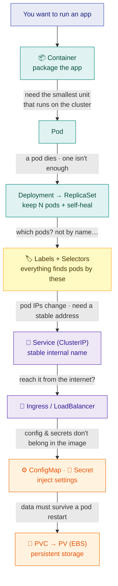
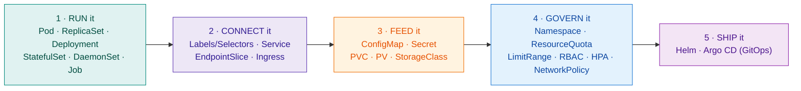
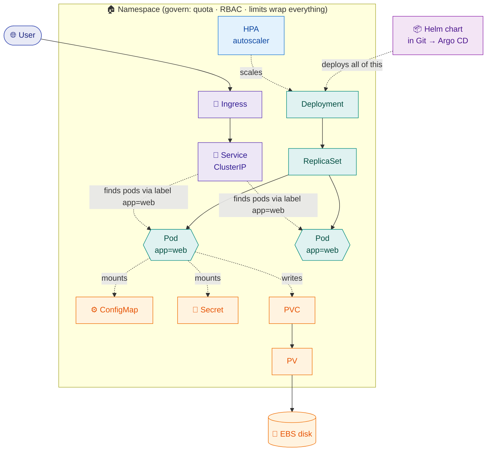
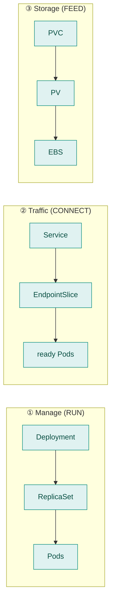

# 26 — Kubernetes Objects: How They All Connect

> **Core question:** You've met the objects one by one — Pod, Service, ConfigMap, PV, Ingress… and now they feel like *disconnected facts*. This page is the reset: **one idea, one map, five buckets.** Read it twice and the whole system clicks.

> **How to use:** Don't memorize. Just understand **the chain** and **the 5 buckets**. Everything else hangs off those two things.

---

## The one idea that connects everything

Kubernetes objects are **not random** — they form a **chain**:

!!! tip "The sentence that ends the confusion"
    **Every Kubernetes object exists to solve the problem the *previous* one created.**

Once you see the chain of problems → solutions, the whole thing stops being a pile of YAML and becomes *one logical system*.

> 🇮🇳 **Yaad rakho:** har object **pichhle object ki problem fix karta hai.** Random nahi — ek chain hai. Yehi samajh gaye to aadha Kubernetes clear.

---

## The chain — problem → object (read bottom-up: each arrow is a "why")



*This vertical chain **is** the core of Kubernetes. Everything else is a wrapper around it.*

---

## The 5 buckets — your mental filing cabinet

Every object fits in **exactly one** of five buckets. When you meet any object, just ask: *"which bucket?"*



| 🪣 Bucket | Question it answers | Objects |
|---|---|---|
| **1 · RUN** | *How do I run my app + keep it alive?* | Pod · ReplicaSet · **Deployment** · StatefulSet · DaemonSet · Job/CronJob |
| **2 · CONNECT** | *How is it found & reached?* | **Labels/Selectors** · Service · EndpointSlice · Ingress |
| **3 · FEED** | *How does it get config & data?* | ConfigMap · Secret · PVC · PV · StorageClass |
| **4 · GOVERN** | *How do I isolate, limit, secure, scale it?* | Namespace · ResourceQuota · LimitRange · RBAC/ServiceAccount · HPA · NetworkPolicy |
| **5 · SHIP** | *How do I package & deploy it?* | Helm/Charts · Argo CD (GitOps) |

> 🇮🇳 **Jab bhi koi object dekho, poocho: "ye kis bucket ka hai?"** RUN · CONNECT · FEED · GOVERN · SHIP. Bas — chaos khatam. Har cheez in 5 me se ek hai.

---

## 🗺️ The master map — everything, one picture

This is the whole system in one diagram. Colours = the 5 buckets.



**Read it as three flows:**
1. **Traffic (green→purple):** User → Ingress → Service → Pods *(Service finds pods by their `app=web` **label**)*.
2. **Management (green):** Deployment → ReplicaSet → Pods; HPA scales the Deployment.
3. **Data & config (orange):** Pods mount ConfigMap/Secret; the database Pod writes to PVC → PV → EBS.
4. **Everything** lives inside a **Namespace** (with quota/RBAC/limits) and is **shipped** by a Helm chart via Argo CD.

---

## The three ownership chains (who creates whom)

Three little chains you'll see constantly — memorize these and 90% of "what created this?" is answered:



- **Manage:** `Deployment → ReplicaSet → Pod` — Deployment does rolling updates/rollback; ReplicaSet keeps the count (self-heal).
- **Traffic:** `Service → EndpointSlice → Pod` — Service is the stable name; EndpointSlice is the live list of **ready** pods (via labels).
- **Storage:** `PVC → PV → EBS` — PVC is the claim, PV is the disk, EBS is the real cloud volume.

---

## Object-by-object — one line, with its bucket

| Object | 🪣 | In one line | Connects to |
|---|---|---|---|
| **Pod** | RUN | smallest unit; 1+ containers sharing IP & storage | owned by ReplicaSet |
| **ReplicaSet** | RUN | keeps N identical pods (self-heal) | owns Pods; owned by Deployment |
| **Deployment** | RUN | rolling updates + rollback over ReplicaSets | manages ReplicaSet |
| **StatefulSet** | RUN | stateful pods: stable names + own PVC each | owns Pods + PVCs |
| **DaemonSet** | RUN | one pod on every node (agents) | — |
| **Job / CronJob** | RUN | run-to-completion / scheduled | — |
| **Labels / Selectors** | CONNECT | tags on objects + how everything *finds* pods | the glue for all of below |
| **Service** | CONNECT | stable virtual IP; load-balances to pods by label | Pods (via EndpointSlice) |
| **EndpointSlice** | CONNECT | live list of a Service's **ready** pod IPs | Service ↔ Pods |
| **Ingress** | CONNECT | L7 HTTP router (host/path) + TLS, one entry | → Services |
| **ConfigMap** | FEED | non-secret config, injected as env/files | mounted by Pods |
| **Secret** | FEED | sensitive data (base64, *not* encrypted by default) | mounted by Pods |
| **PVC** | FEED | a *claim* for storage ("give me 10Gi") | binds to a PV |
| **PV** | FEED | the actual disk (backed by EBS/EFS) | bound to PVC |
| **StorageClass** | FEED | auto-provisions PVs on demand | creates PVs |
| **Namespace** | GOVERN | virtual cluster: name-scope + RBAC + quota | wraps objects |
| **ResourceQuota / LimitRange** | GOVERN | cap a namespace's total / set per-pod defaults | scopes a Namespace |
| **RBAC (Role/Binding) + ServiceAccount** | GOVERN | who/what can do what | grants API permissions |
| **HPA** | GOVERN | auto-scales pods on CPU/mem vs *requests* | scales a Deployment |
| **NetworkPolicy** | GOVERN | firewall: which pods may talk (by label) | selects Pods |
| **Helm / Chart** | SHIP | package many manifests + values per env | renders all objects |
| **Argo CD (Application)** | SHIP | GitOps: pulls from Git, syncs the cluster | deploys everything |

---

## A real app, fully wired (one walkthrough)

Say it out loud once and it all connects:

> *"A **Deployment** (RUN) runs 3 pods labelled `app=web` (CONNECT); a **Service** finds those pods by that label and gives a stable IP (CONNECT); an **Ingress** routes `shop.com` from the internet to that Service with TLS (CONNECT); the pods read settings from a **ConfigMap** and secrets from a **Secret** (FEED); the database pod keeps its data on a **PVC → PV → EBS** (FEED); all of it sits in one **Namespace** with **resource limits**, **RBAC**, and an **HPA** to scale on load (GOVERN); and the whole thing is a **Helm chart** deployed by **Argo CD** from Git (SHIP)."*

One sentence. Every object. All connected. 🎯

---

## When do you actually *need* each? (so you don't over-build)

Not every app needs every object — the senior skill is knowing what to **skip**:

- **Stateless app** (most microservices) → Deployment + Service + Ingress. **No PV, no hostPath.**
- **Add a database** → now you need a **PV** (and probably a StatefulSet).
- **Many HTTP services, one domain** → **Ingress** (not a LoadBalancer per service).
- **Small solo project** → the `default` **Namespace** is fine.
- **1–2 manifests, one env** → plain `kubectl apply` (skip **Helm**).

*(Full "need vs skip" table + Ingress-vs-LoadBalancer breakdown: [ch20 → Building blocks in a real app](20-confusions-and-tradeoffs.md#building-blocks-in-a-real-app-what-you-need-vs-what-you-can-skip).)*

---

## ⚡ The 20-second recall (this is all you must hold in your head)

```
THE IDEA:  every object solves the previous one's problem — it's a chain.
THE CHAIN: Container → Pod → Deployment → (Labels) → Service → Ingress → Config/Secret → PV
5 BUCKETS: RUN · CONNECT · FEED · GOVERN · SHIP  — every object is in exactly one.
3 CHAINS:  Deployment→ReplicaSet→Pod · Service→EndpointSlice→Pod · PVC→PV→EBS
ASK:       "which bucket is this object?" — and the confusion is gone.
```

> 🇮🇳 **Bas do cheez yaad rakho:** (1) *har object pichhle ki problem fix karta — chain hai.* (2) *5 buckets: RUN · CONNECT · FEED · GOVERN · SHIP.* Inhe pakad lo, baaki apne aap jud jaayega. 😊

---

*Deeper on any single object → [M4 Kubernetes Core](05-M4-kubernetes-core.md) · [M9 Advanced Internals](11-M9-advanced-k8s-internals.md) · [ch20 Confusions](20-confusions-and-tradeoffs.md). This page is the map; those are the territory.*
