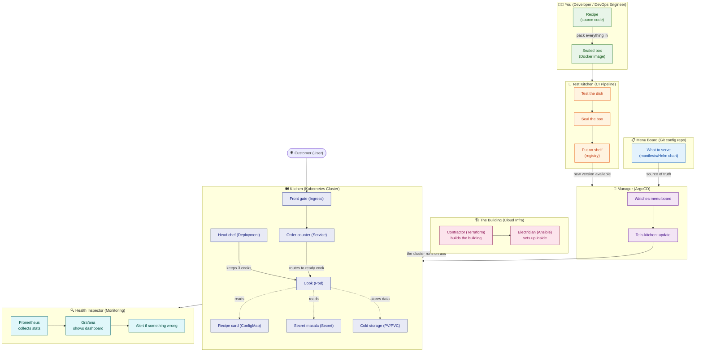
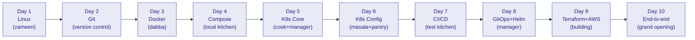
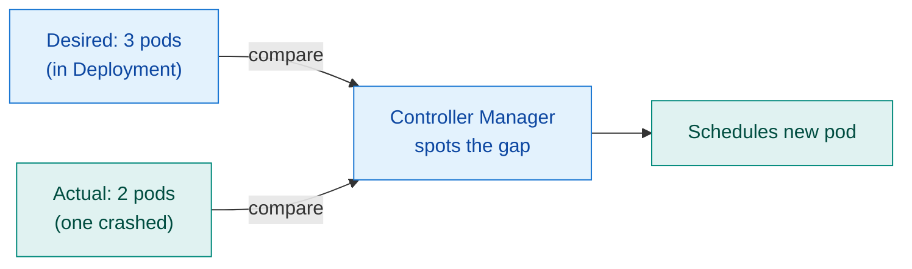
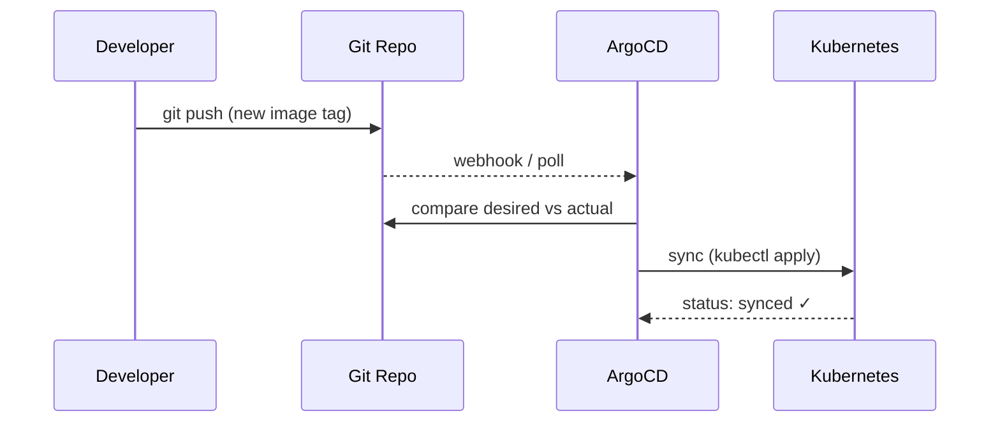
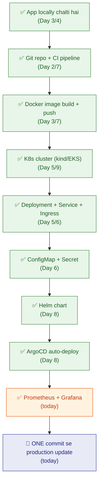

# 27 — The 10-Day Learning Plan: Everything Connected

> **Ye chapter kab padhen:** Jab sab cheez pata ho par jodd nahi paaye — ya shuru se ek solid mental map banana ho. Yahan ek hi analogy (restaurant) se poora DevOps connect hoga. Baaki chapters me depth hai; yahan sirf badi tasveer hai.

---

## The master idea: DevOps = ek restaurant chalana

Ek hi analogy. Har cheez isi mein fit hoti hai. Ek baar yeh picture ban gayi — baaki sab apne aap jud jaata hai.



### Restaurant reference card — pin this somewhere

| Restaurant | DevOps | Simple baat |
|---|---|---|
| **Recipe** | Source code | tum chef ho — dish banate ho |
| **Sealed box** | Docker image | recipe + saman andar, kahin bhi kholo |
| **Ready dish** | Running container | box chala → dish ready |
| **Cook** | Pod | ek dish banata; thak gaya → replace |
| **Head chef** | Deployment | hamesha 3 cooks duty pe; ek gaya → naya lao |
| **Name badge** | Label | head chef badge se pehchanta `app=web` |
| **Order counter** | Service (ClusterIP) | customer counter pe order deta, kisi ek cook ko nahi |
| **Front gate + host** | Ingress | bahar se aaya customer sahi counter pe |
| **Recipe card** | ConfigMap | non-secret settings (DB host, port) |
| **Secret masala** | Secret | password, API key — andar rakho |
| **Cold storage** | PV / PVC | customer data permanent; cook badle to bhi safe |
| **Menu board** | Git config repo | "kya serve karna hai" lika hua |
| **Manager** | ArgoCD (GitOps) | menu board dekh ke kitchen adjust — tum haath nahi lagate |
| **Test kitchen** | CI pipeline | nayi recipe test → box seal → shelf |
| **Building contractor** | Terraform | cloud building banata (servers, networking) |
| **Electrician / plumber** | Ansible | building ke andar setup karta (packages, config) |
| **Health inspector** | Prometheus + Grafana | kitna bik raha, kahan der — alert bhejta |
| **VIP section / wall** | Namespace | ek restaurant ke andar alag sections; quota bhi |
| **Section capacity** | ResourceQuota / LimitRange | VIP section 10 tables max — zyada nahi |
| **Extra cooks auto** | HPA | rush hour → auto-hire; quiet → let go |
| **Packaged meal deal** | Helm chart | ek bundle mein sab kuch (cook + counter + gate) |

---

## The 5-question formula — kisi bhi tool ko samajhna

Jab bhi koi nayi cheez aaye — Docker, Helm, ArgoCD, kuch bhi — yahi 5 sawaal isi order mein poocho:

| # | Sawaal | Matlab | Example (Docker) |
|---|---|---|---|
| 1 | **WHY** | bina iske kya problem thi? | *"mere pe chalta, server pe nahi"* |
| 2 | **WHAT** | ek line mein hai kya? | app ko sealed box mein pack karna |
| 3 | **HOW** | kaam kaise karta? | Dockerfile → `docker build` → image; `docker run` → container |
| 4 | **WHERE** | kahan chalta? | image banti CI/laptop pe; chalti kisi bhi machine pe |
| 5 | **WHEN** | kab use karoon, kab nahi? | app package karni ho → haan; ek chhoti bash script → zaroori nahi |

> 🇮🇳 **Tip:** Nayi cheez mein phans gaye? Yahi 5 sawaal likhlo kahin. Answer aate aate sab clear ho jaata hai.

---

## 10-day learning map



Har din ek concept, haath se karo (terminal kholke), aur poochho *"ye restaurant mein kaun hai?"*

---

## Day 1 — Linux: the ground everything runs on

**Restaurant mein:** Linux woh **zameen** hai jis par poori building (cloud server) khadi hai. Bina zameen ke kuch nahi.

**WHY:** Har server — AWS EC2, Docker container, Kubernetes node — andar se Linux hai. Isse pata ho to koi bhi cheez troubleshoot kar sakte ho.

**WHAT:** Command-line operating system. GUI nahi — sirf terminal.

**HOW:** Commands se kaam karte hain. Mains hain:

```bash
# Jagah dhundhna
pwd           # main kahan hoon
ls -la        # kya hai yahan
cd /var/log   # wahan jao
find / -name "*.conf" 2>/dev/null   # file dhundhna

# Files padhna / likhna
cat file.txt
less file.txt        # bada file — q se exit
tail -f app.log      # live logs dekhna (bahut kaam aata hai!)

# Processes
ps aux               # sab processes
top / htop           # live CPU/memory
kill -9 <PID>        # process band karo

# Network
curl http://example.com          # HTTP request
ss -tlnp                         # kaunse port sun rahe
ping google.com                  # connectivity check

# System health (ye 4 din bhi kaam aate hain)
top          → CPU / load
df -h        → disk space
free -h      → RAM
journalctl -u nginx --since "1h ago"  → logs
```

**WHERE:** Ye commands kisi bhi Linux machine pe chalti hain — local VM, Docker container, AWS EC2.

**WHEN:** Kuch bhi kaam nahi kar raha — yahan se shuru karo. Troubleshooting ka pehla qadam hamesha Linux hai.

**Aaj ka kaam (30 min):**
1. Terminal kholo (Windows: WSL; Mac: iTerm2)
2. `ls`, `cd`, `cat`, `tail -f` karo
3. `top` kholo — CPU aur memory dekho
4. Ek nayi file banao, kuch likhlo, padhlo

!!! tip "Restaurant connection"
    Linux = kitchen ki zameen. Electricity (CPU), paani (memory), shelf space (disk) — sab yahan se control hota hai.

---

## Day 2 — Git: recipe version control

**Restaurant mein:** Git woh **recipe book** hai jahan har change ka record hota hai. Koi bhi galti ki to pichhla version wapas la sakte ho.

**WHY:** Bina Git ke: ek hi file 10 log badal rahe → conflict → kuch lost. Git se: har change tracked, koi bhi version wapas.

**WHAT:** Distributed version control system. Code ka history rakhta hai.

**HOW:**

```
Workflow (tin jagah):
  Working Directory  →  Staging Area  →  Local Repo  →  Remote (GitHub)
  (files edit karo)     (git add)        (git commit)    (git push)
```

```bash
# Setup (ek baar)
git config --global user.name "Gaurav"
git config --global user.email "gaurav@example.com"

# Daily workflow
git init                          # nayi repo
git clone <url>                   # existing repo copy
git status                        # kya badla
git add file.txt                  # stage karo
git add .                         # sab stage karo
git commit -m "feat: add login"   # save with message
git push origin main              # GitHub pe bhejo

# Branches (features alag rakhna)
git checkout -b feature/login     # nayi branch
git merge feature/login           # merge back
git log --oneline                 # history dekho
```

**Commit message format** (isse follow karo hamesha):

```
<type>: <kya kiya>

Types: feat · fix · docs · refactor · test · chore
```

**WHERE:** Local laptop + remote GitHub/GitLab. CI/CD pipeline bhi yehin se trigger hoti hai.

**WHEN:** Koi bhi code change karo → commit karo. Hamesha. Ek line ka fix bhi.

**Aaj ka kaam:**
1. `git init my-app` → ek file banao → commit karo
2. Branch banao → kuch badlo → merge karo
3. GitHub pe repo banao → push karo

!!! tip "Restaurant connection"
    Git = recipe book ka master copy. Branch = "nayi dish experiment karna" — safe rehte ho. PR = head chef ko dikhaana before menu mein add karo.

---

## Day 3 — Docker: the sealed box

**Restaurant mein:** Docker woh **sealed dabba** hai jismein dish (app) + sab ingredients (dependencies) ek saath band hain. Kahin bhi kholo — same dish niklegi.

**WHY:** "Mere pe chalta tha" problem. Har developer ke laptop ka environment alag → server pe fail. Docker: ek hi environment har jagah.

**WHAT:** Containerization tool. App ko ek portable, isolated unit mein pack karta hai.

**HOW:**

```
Dockerfile  →  docker build  →  Image  →  docker run  →  Container
(recipe)        (dabbe mein       (sealed     (kholo)        (ready dish)
                 pack karo)        dabba)
```

**Dockerfile example (Flask app):**

```dockerfile
FROM python:3.11-slim          # base image (pre-made dabba)
WORKDIR /app                   # working folder
COPY requirements.txt .        # copy dependencies list
RUN pip install -r requirements.txt   # install
COPY . .                       # copy code
EXPOSE 5000                    # port
CMD ["python", "app.py"]       # start command
```

```bash
# Build + run
docker build -t my-app:v1 .          # image banao
docker run -p 8080:5000 my-app:v1    # chalao (port map karo)
docker ps                             # running containers
docker logs <container_id>           # logs dekho
docker exec -it <id> sh              # andar ghuso (debug)
docker stop <id>                     # band karo

# Image manage
docker images                        # list
docker push registry/my-app:v1      # registry pe bhejo
docker pull nginx                    # ready image lo
```

**Key ideas:**

| Concept | Matlab |
|---|---|
| **Image** | sealed dabba — read-only blueprint |
| **Container** | chala hua dabba — running instance |
| **Registry** | shelf — images store hoti hain (DockerHub, ECR) |
| **Layer** | har `RUN` ek layer — cache se fast rebuild |

**WHERE:** Image banti hai CI machine / laptop pe. Chalti hai kahin bhi (local, server, K8s).

**WHEN:** App ko package karna ho. Short script/DB → usually zaroori nahi.

**Aaj ka kaam:**
1. Python/Node app → Dockerfile likho
2. `docker build` → `docker run` → browser mein dekho
3. `docker exec` se andar ghuso → files dekho

---

## Day 4 — Docker Compose: chhoti local kitchen

**Restaurant mein:** Compose = poori **chhoti kitchen locally** chalana — cook (app), cold storage (DB), aur sab cheez ek saath, ek command se.

**WHY:** Real app mein sirf ek container nahi hota — app + DB + cache + queue. Sab manually chalana mushkil. Compose: ek file, ek command.

**WHAT:** Multiple containers ko ek saath define + chalane ka tool. Sirf **local development** ke liye (production mein Kubernetes hai).

**HOW:**

```yaml
# docker-compose.yml
services:
  web:
    build: .               # Dockerfile se build
    ports:
      - "8080:5000"
    environment:
      - DB_HOST=db         # service name use karo — DNS automatic
    depends_on:
      - db

  db:
    image: postgres:15
    environment:
      - POSTGRES_PASSWORD=secret
    volumes:
      - pgdata:/var/lib/postgresql/data   # data persist karo

volumes:
  pgdata:
```

```bash
docker-compose up -d        # sab start karo (background)
docker-compose ps           # status
docker-compose logs web     # ek service ke logs
docker-compose down         # sab band karo
docker-compose down -v      # + volumes bhi hata do
```

**WHERE:** Sirf local laptop / dev environment.

**WHEN:** Local mein multiple services saath chalani hon. Production mein Kubernetes.

**Aaj ka kaam:**
1. Web app + PostgreSQL compose file banao
2. `docker-compose up` → app browser mein check karo
3. DB ko data daalo → `down` → `up` → data wapas hai? (volumes ka test)

!!! tip "Compose vs Kubernetes"
    Compose = local kitchen practice. Kubernetes = real commercial kitchen. Concepts same hain, scale alag hai.

---

## Day 5 — Kubernetes Core: cook, manager, counter

**Restaurant mein:**
- **Pod** = ek cook
- **Deployment** = head chef (hamesha N cooks pe nazar, ek gaya → naya laao)
- **Service** = order counter (customer cook se nahi — counter se baat karta)
- **Label** = name badge (counter badge se pehchanta)

**WHY:** Docker container ek machine pe chalta. Production mein: multiple machines, failures, scaling. Kubernetes: sab handle karta hai automatically.

**WHAT:** Container orchestration platform. Containers ko run, heal, scale, connect karta hai.

**HOW:**

```
                   ┌─────────────────────────────────┐
  Git / CI  ─────► │         kubectl apply           │
                   │                                  │
                   │  Deployment ──► ReplicaSet ──►  Pod  Pod  Pod
                   │                                  │
                   │  Service (ClusterIP)             │
                   │     └─────finds pods by label────┘
                   │                                  │
                   │  Ingress ─────► Service          │
                   └─────────────────────────────────┘
```

**Core YAML (Deployment + Service):**

```yaml
# deployment.yaml
apiVersion: apps/v1
kind: Deployment
metadata:
  name: web
spec:
  replicas: 3                    # 3 cooks
  selector:
    matchLabels:
      app: web                   # yahi badge dhundhta hai
  template:
    metadata:
      labels:
        app: web                 # badge lagao
    spec:
      containers:
      - name: web
        image: my-app:v1
        ports:
        - containerPort: 5000

---
# service.yaml
apiVersion: v1
kind: Service
metadata:
  name: web-svc
spec:
  selector:
    app: web                     # badge se pods dhundho
  ports:
  - port: 80
    targetPort: 5000
```

**Daily kubectl commands:**

```bash
kubectl get pods                    # cooks ki status
kubectl get deployments             # head chefs
kubectl get services                # counters
kubectl describe pod <name>         # detail + events
kubectl logs <pod>                  # logs
kubectl exec -it <pod> -- sh        # andar ghuso
kubectl apply -f deployment.yaml    # deploy / update
kubectl delete -f deployment.yaml   # hata do
kubectl scale deployment web --replicas=5   # scale up
kubectl rollout undo deployment web         # rollback
```

**The self-healing loop:**



**WHERE:** Kubernetes cluster — local ke liye `kind`, production ke liye AWS EKS / GKE.

**WHEN:** Multiple services, auto-scaling, self-healing chahiye. Single container → Docker Compose theek hai.

**Aaj ka kaam:**
1. `kind create cluster` → cluster locally
2. App deploy karo (Deployment + Service)
3. Ek pod `kubectl delete pod` se hata do → khud wapas aata hai dekho
4. `kubectl scale` se replicas badhao

---

## Day 6 — K8s Config + Storage + Ingress

**Restaurant mein:**
- **ConfigMap** = recipe card (non-secret settings)
- **Secret** = secret masala (passwords, API keys)
- **PVC/PV** = cold storage (data permanent)
- **Ingress** = front gate + host (bahar se andar)

**WHY after Day 5:** App chal rahi hai — par config image mein hardcoded hai (galat!), data pod restart pe gayab ho jaata hai, aur bahar se access nahi ho sakti.

**WHAT each does:**

```
ConfigMap  ──mount──► Pod (env variables ya file)
Secret     ──mount──► Pod (sensitive values)
PVC ──bind──► PV ──backed by──► EBS disk
Ingress ──routes──► Service ──► Pods
```

**ConfigMap + Secret:**

```yaml
# configmap.yaml
apiVersion: v1
kind: ConfigMap
metadata:
  name: app-config
data:
  DB_HOST: "postgres-svc"
  APP_ENV: "production"

---
# secret.yaml
apiVersion: v1
kind: Secret
metadata:
  name: app-secret
type: Opaque
data:
  DB_PASSWORD: c2VjcmV0MTIz   # base64 encoded (echo -n "secret123" | base64)
```

```yaml
# Pod spec mein inject karo:
env:
- name: DB_HOST
  valueFrom:
    configMapKeyRef:
      name: app-config
      key: DB_HOST
- name: DB_PASSWORD
  valueFrom:
    secretKeyRef:
      name: app-secret
      key: DB_PASSWORD
```

**PVC (storage claim):**

```yaml
apiVersion: v1
kind: PersistentVolumeClaim
metadata:
  name: db-pvc
spec:
  accessModes:
    - ReadWriteOnce
  resources:
    requests:
      storage: 10Gi
  storageClassName: gp3   # AWS EBS

# StatefulSet pod mein:
volumeMounts:
- name: data
  mountPath: /var/lib/postgresql/data
volumes:
- name: data
  persistentVolumeClaim:
    claimName: db-pvc
```

**Ingress (HTTP routing):**

```yaml
apiVersion: networking.k8s.io/v1
kind: Ingress
metadata:
  name: web-ingress
  annotations:
    nginx.ingress.kubernetes.io/rewrite-target: /
spec:
  rules:
  - host: myapp.example.com
    http:
      paths:
      - path: /
        pathType: Prefix
        backend:
          service:
            name: web-svc
            port:
              number: 80
```

**WHERE:**
- ConfigMap/Secret → cluster mein, pod mein mount hote hain
- PVC/PV → cluster + actual cloud disk (EBS)
- Ingress → cluster mein; bahar ka traffic andar laata hai

**WHEN:**
- **ConfigMap** → hamesha, hardcoded config replace karo
- **Secret** → koi bhi sensitive value (kabhi image mein mat daalo!)
- **PVC** → database ya koi bhi stateful app
- **Ingress** → production mein multiple services HTTP pe chahiye

**Aaj ka kaam:**
1. App ki config ConfigMap mein nikalo
2. Password Secret mein daalo
3. `kind` pe local Ingress setup karo

---

## Day 7 — CI/CD: the test kitchen pipeline

**Restaurant mein:** CI/CD = **test kitchen process**. Nayi recipe (code) aate hi: taste test → adjust → seal karke shelf pe rakh do. Automatic — chef ko baaki kuch nahi karna.

**WHY:** Bina CI/CD: har developer haath se test karo, haath se build karo, haath se deploy karo. Galti hogi. CI/CD: push karo → baaki sab automatic.

**WHAT:** CI (Continuous Integration) = test + build automatic. CD (Continuous Delivery/Deployment) = deploy bhi automatic.

**HOW — GitHub Actions:**

```
Trigger: git push to main
    │
    ▼
Job: Test
    │  - checkout code
    │  - run unit tests
    │  - lint check
    ▼
Job: Build & Push (only if tests pass)
    │  - docker build
    │  - docker push to ECR/DockerHub
    ▼
Job: Deploy (only if build passes)
       - kubectl apply (or update image tag)
       - verify rollout
```

**Simple GitHub Actions workflow:**

```yaml
# .github/workflows/deploy.yml
name: CI/CD Pipeline

on:
  push:
    branches: [main]

jobs:
  test:
    runs-on: ubuntu-latest
    steps:
      - uses: actions/checkout@v4
      - name: Run tests
        run: |
          pip install -r requirements.txt
          pytest tests/

  build-push:
    needs: test
    runs-on: ubuntu-latest
    steps:
      - uses: actions/checkout@v4
      - name: Build Docker image
        run: docker build -t my-app:${{ github.sha }} .
      - name: Push to registry
        run: |
          docker login -u ${{ secrets.DOCKER_USER }} -p ${{ secrets.DOCKER_TOKEN }}
          docker push my-app:${{ github.sha }}

  deploy:
    needs: build-push
    runs-on: ubuntu-latest
    steps:
      - name: Update image tag
        run: |
          # Update the image tag in your config repo
          # ArgoCD will pick this up automatically
          git clone https://github.com/you/config-repo
          cd config-repo
          sed -i "s|image: my-app:.*|image: my-app:${{ github.sha }}|" deploy.yaml
          git commit -am "chore: update image to ${{ github.sha }}"
          git push
```

**Branch strategy:**

```
feature/* ──PR──► main ──► staging ──► production
                    │          │              │
                  test      deploy         deploy
                  only      staging        production
```

**WHERE:**
- CI runner = GitHub ka managed machine (Ubuntu, auto-provisioned)
- Code + secrets = GitHub mein
- Image = DockerHub / AWS ECR pe push hoti

**WHEN:** Koi bhi production app. Single script → zaroori nahi. Team mein ek bhi aur banda ho → CI zaroori hai.

**Aaj ka kaam:**
1. Repo mein `.github/workflows/ci.yml` banao
2. Test step daalo (simple `echo "tests passed"` bhi chalega)
3. Build step daalo — image banao
4. GitHub Actions tab mein run dekho

---

## Day 8 — GitOps + Helm: menu board manager

**Restaurant mein:**
- **Helm** = **packaged meal deal** — ek bundle mein poora restaurant setup (cook + counter + gate + config)
- **ArgoCD** = **manager jo menu board dekh ke kitchen auto-adjust karta hai** — tum kitchen ko haath nahi lagate

**WHY:**

| Bina GitOps | GitOps ke saath |
|---|---|
| `kubectl apply` manually | Git mein change → ArgoCD auto-deploy |
| "kaun ne kya deploy kiya?" pata nahi | Git history = poora audit trail |
| Rollback = ek aur manual step | Rollback = `git revert` |

**WHAT:**
- **Helm:** K8s manifests ka package manager (npm jaisa, par K8s ke liye)
- **ArgoCD:** GitOps controller — Git repo ko cluster ka source of truth maanta hai

**HOW — Helm:**

```
Chart structure:
my-app/
├── Chart.yaml          # metadata (name, version)
├── values.yaml         # default values (override per env)
└── templates/
    ├── deployment.yaml  # {{ .Values.replicas }} aise variables
    ├── service.yaml
    └── ingress.yaml
```

```bash
helm install my-app ./my-app              # deploy
helm upgrade my-app ./my-app -f prod-values.yaml   # update
helm rollback my-app 1                    # rollback to version 1
helm list                                 # deployed charts
helm template ./my-app                   # rendered YAML dekho (debug)
```

**HOW — ArgoCD:**

```yaml
# ArgoCD Application
apiVersion: argoproj.io/v1alpha1
kind: Application
metadata:
  name: my-app
  namespace: argocd
spec:
  project: default
  source:
    repoURL: https://github.com/you/config-repo
    targetRevision: HEAD
    path: k8s/my-app          # is folder ke manifests
  destination:
    server: https://kubernetes.default.svc
    namespace: production
  syncPolicy:
    automated:
      selfHeal: true           # koi haath se change kare → revert
      prune: true              # Git se hata do → cluster se bhi
```

**The GitOps loop:**



**WHERE:** ArgoCD cluster ke andar chalta hai. Git repo = source of truth (GitHub pe).

**WHEN:** Multiple environments (dev/staging/prod), team work, audit trail chahiye → GitOps. Solo ek-bar deploy → plain `kubectl apply` theek hai.

**Aaj ka kaam:**
1. `helm create my-app` → Helm chart banao
2. Values file se `dev` aur `prod` config alag karo
3. ArgoCD install karo (`kind` pe) → apni app connect karo
4. Git mein change karo → ArgoCD auto-sync dekho

---

## Day 9 — Terraform + AWS: building banao

**Restaurant mein:** Terraform = **building contractor**. Zameen kharidna, building banana, bijli connection — sab contractor ka kaam. Ansible = **electrician/plumber** — building ke andar setup karna.

**WHY:** Manually AWS console se servers banana = slow, error-prone, reproducible nahi. Terraform: ek file mein sab define karo → ek command se poora infra ready.

**WHAT:**
- **Terraform:** Infrastructure as Code — AWS resources define karo, `terraform apply` se bana do
- **Ansible:** Configuration management — servers pe software install karo, config karo

**HOW — Terraform:**

```hcl
# main.tf — EKS cluster banana
terraform {
  required_providers {
    aws = { source = "hashicorp/aws", version = "~> 5.0" }
  }
}

provider "aws" {
  region = "ap-south-1"   # Mumbai
}

# VPC
module "vpc" {
  source  = "terraform-aws-modules/vpc/aws"
  version = "~> 5.0"
  name    = "my-vpc"
  cidr    = "10.0.0.0/16"
  azs     = ["ap-south-1a", "ap-south-1b"]
  private_subnets = ["10.0.1.0/24", "10.0.2.0/24"]
  public_subnets  = ["10.0.101.0/24", "10.0.102.0/24"]
  enable_nat_gateway = true
}

# EKS Cluster
module "eks" {
  source  = "terraform-aws-modules/eks/aws"
  version = "~> 20.0"
  cluster_name    = "my-cluster"
  cluster_version = "1.29"
  vpc_id          = module.vpc.vpc_id
  subnet_ids      = module.vpc.private_subnets
  eks_managed_node_groups = {
    main = {
      min_size     = 1
      max_size     = 5
      desired_size = 2
      instance_types = ["t3.medium"]
    }
  }
}
```

```bash
terraform init      # plugins download karo
terraform plan      # kya banega — preview (HAMESHA pehle)
terraform apply     # banao (confirm karo)
terraform destroy   # sab hata do
terraform output    # outputs dekho (cluster endpoint, etc)
```

**Terraform state:**

```
terraform.tfstate = notebook jisme likha hai "maine kya banaya"
→ kabhi delete mat karo
→ remote backend (S3) mein rakho — team ke liye
```

**Environment strategy:**

```
environments/
├── dev/
│   ├── main.tf
│   └── terraform.tfvars    # instance_type = "t3.small"
├── staging/
│   └── terraform.tfvars    # instance_type = "t3.medium"
└── prod/
    └── terraform.tfvars    # instance_type = "t3.large", min_size = 3
```

**HOW — Ansible (quick):**

```yaml
# playbook.yml
- hosts: web_servers
  become: yes
  tasks:
  - name: Install nginx
    apt:
      name: nginx
      state: present
  - name: Start nginx
    service:
      name: nginx
      state: started
      enabled: yes
```

```bash
ansible-playbook -i inventory.ini playbook.yml
```

**WHERE:** Terraform kisi bhi machine se chalta hai (laptop, CI) — AWS pe resources banata hai. State S3 mein remote rakho.

**WHEN:** Koi bhi cloud infra → Terraform. Server ke andar configuration (packages, files) → Ansible. Kubernetes pe kuch deploy karna → Helm/ArgoCD (Terraform se nahi).

**Aaj ka kaam:**
1. AWS free tier account (agar nahi hai)
2. Terraform se ek simple S3 bucket banao → verify → destroy
3. EKS ya EC2 plan dekho (`terraform plan`)

---

## Day 10 — End-to-end: grand opening

**Restaurant mein:** Aaj poora restaurant kholta hai — contractor ne building banayi (Terraform), electrician ne setup kiya (Ansible), kitchen ready hai (Kubernetes), cooks trained hain (Pods), pipeline automated hai (CI/CD), manager nazar rakh raha hai (ArgoCD), inspector duty pe hai (Prometheus). **Grand opening!**

**Aaj ka goal:** Ek real app zero se production tak deploy karo, har step aap khud karo.

### The grand opening checklist



### Basic monitoring setup (Prometheus + Grafana)

```bash
# Helm se install karo
helm repo add prometheus-community https://prometheus-community.github.io/helm-charts
helm install kube-prom prometheus-community/kube-prometheus-stack -n monitoring --create-namespace

# Grafana access karo
kubectl port-forward -n monitoring svc/kube-prom-grafana 3000:80
# Browser: http://localhost:3000 (admin/prom-operator)
```

**4 dashboards jo hamesha kaam aate hain:**

| Dashboard | Dekho kya |
|---|---|
| **K8s / Compute Resources** | CPU/Memory per pod |
| **K8s / Networking** | Traffic per service |
| **Node Exporter** | Node health (disk, network) |
| **Argo CD** | Sync status |

### The final flow — ek commit se deployment

```bash
# 1. Code change karo
git checkout -b fix/login-bug
# ... code fix ...
git commit -m "fix: resolve login timeout issue"
git push origin fix/login-bug

# 2. PR banao → merge to main
# GitHub pe PR open karo → approve → merge

# 3. CI/CD runs automatic (Day 7)
# Tests ✓ → Build image ✓ → Push to registry ✓ → Update image tag in config repo ✓

# 4. ArgoCD auto-syncs (Day 8)
# Config repo mein change detected → kubectl apply → rolling update → done

# 5. Monitor (Grafana)
# Pod restart count, error rate, latency — sab normal hai?
```

**Yahi hai ek professional DevOps engineer ka daily routine.** Push karo → pipeline chale → ArgoCD deploy kare → Grafana check karo. Sab connected.

### Aaj ka real project idea (jo actually karo)

**Simple web app + database + monitoring:**

```
Flask app (Python)  ─── Dockerfile  ─── GitHub Actions ──► DockerHub
        │                                                         │
        ▼                                                         ▼
  PostgreSQL DB  ──── Docker Compose (local test)         K8s Deployment
        │                                                         │
        ▼                                                         ▼
   ConfigMap/Secret (config)                          Service + Ingress
   PVC (data storage)                                 ArgoCD (auto-sync)
   Namespace (isolation)                              Prometheus (metrics)
```

Ye ek simple app hai — par isme Day 1 se Day 10 ki har cheez use hogi.

---

## Aage kya? (Day 11+)

10 din baad ye sab haath mein hoga:

| Kya | Kab kaam aayega |
|---|---|
| **Linux troubleshooting** | Kuch bhi kaam nahi kare → yahan se shuru |
| **Git workflow** | Har daily change |
| **Docker** | Har app package karna |
| **K8s basics** | Har production deployment |
| **CI/CD** | Har code push |
| **GitOps** | Har production change |
| **Terraform** | Nayi environment banana |
| **Monitoring** | Kuch issue aaye → Grafana first |

**10-din ke baad recommend karo:**
1. **Capstone I** → [URL Shortener](12-capstone-url-shortener.md) — ek real app build karo
2. **Capstone II** → [MicroShop](13-capstone-microshop.md) — microservices
3. **Production Gauntlet** → [ShopFast build](24-production-gauntlet-build.md) + [Chaos engineering](25-production-gauntlet-chaos.md) — real production experience

---

## Quick reference: the restaurant in 30 seconds

```
ZAMEEN:    Linux  →  har server pe hai
RECIPE:    Git    →  code ka history
DABBA:     Docker →  app portable banao
KITCHEN:   Docker Compose → local mein sab saath
COOK:      Pod    →  running app
MANAGER:   Deployment → cooks manage karo
COUNTER:   Service → stable address
GATE:      Ingress → bahar se andar
MASALA:    ConfigMap/Secret → config alag rakho
PANTRY:    PVC/PV → data permanent
MENU:      Git config repo → kya deploy hoga
MANAGER:   ArgoCD → menu dekh ke auto-update
TEST KIT:  CI/CD  → code push se sab automatic
BUILDING:  Terraform → cloud infra banana
INSPECTOR: Prometheus/Grafana → sab theek hai?
```

> 🇮🇳 **Final baat:** Confusion tab hoti hai jab cheez alag-alag yaad hoti hain. Ek hi restaurant ki picture mein sab fit karo — fir koi bhi cheez alien nahi lagegi. Ye 10 din ek platform banana hai — uske upar production baad mein build hogi. Shuru karo, haath se karo, aur restaurant ki analogy se poocho: *"ye kaun hai?"* 😊

---

*Connected pages: [K8s Objects Map](26-k8s-objects-map.md) · [The Connected System](09-connected-system.md) · [M4 K8s Core](05-M4-kubernetes-core.md) · [M9 Advanced Internals](11-M9-advanced-k8s-internals.md) · [Confusions & Trade-offs](20-confusions-and-tradeoffs.md)*
