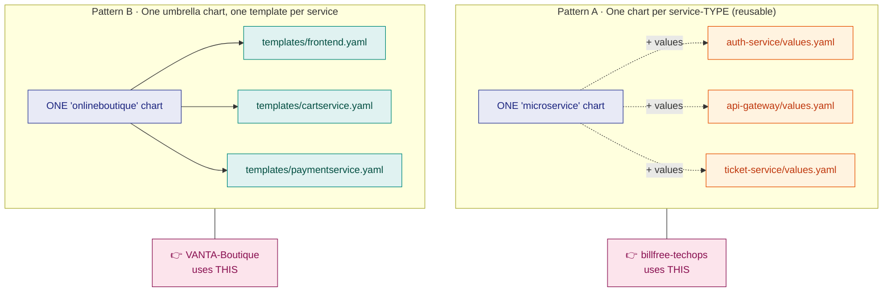
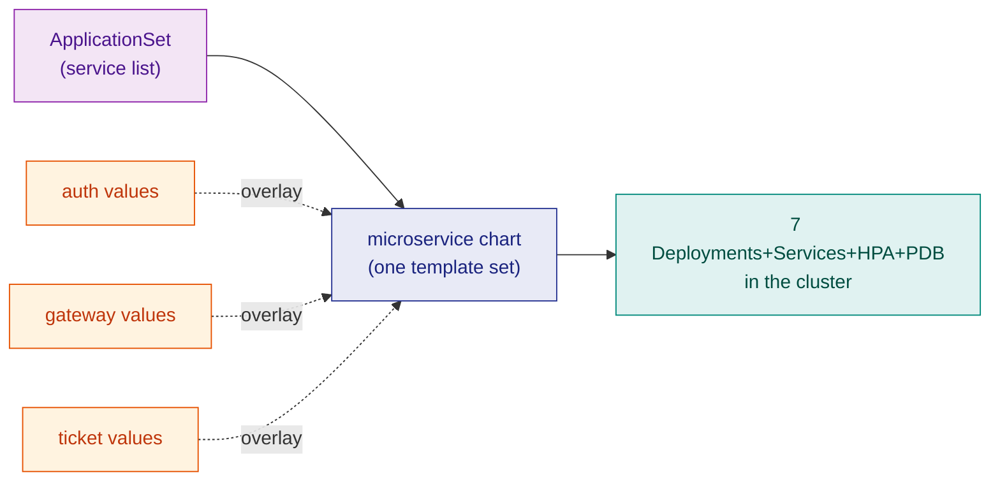
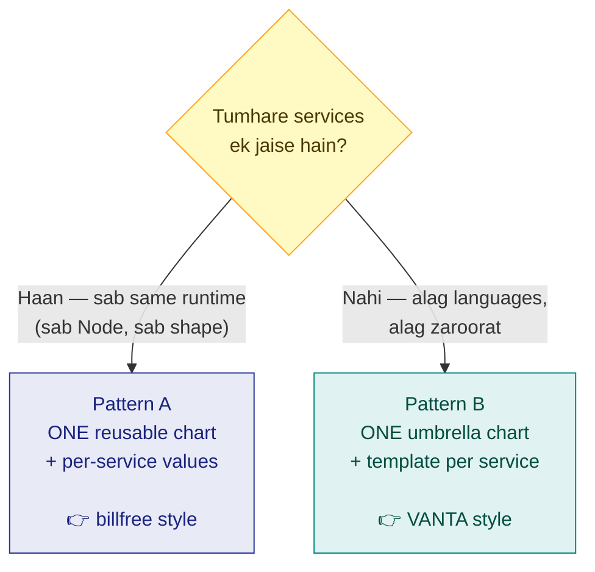
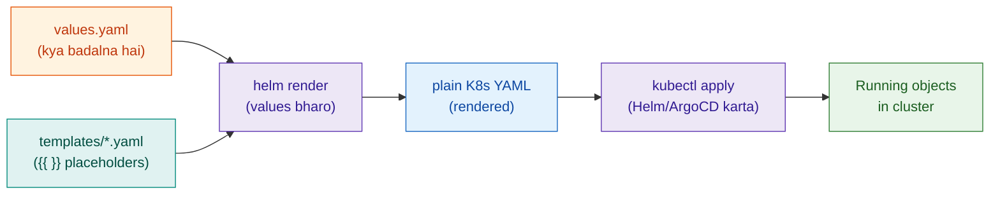

# 28 — Helm in the Real World: Your Two Projects

> **Ye chapter kis liye:** Whiteboard pe tumne boxes banaye — frontend (Service + ConfigMap + Deployment), backend (Service + Secret + StatefulSet) — aur poocha *"Helm me ye YAML kaise banti hai?"* Answer tumhare hi do repos me pada hai. **VANTA-Boutique** aur **billfree-techops** — dono me Helm chart hai, aur dono Helm ke **do alag fundamental patterns** dikhate hain. Ye chapter unhi ko cheer-phaad ke samjhaata hai.

> **10-day plan connection:** Ye [Day 8 (GitOps + Helm)](27-10-day-plan.md#day-8-gitops-helm-menu-board-manager) ka real-world extension hai.

---

## Pehle: whiteboard → Helm ka ek line me sach

Tumne jo box banaya:

```
┌─── frontend ───┐      ┌─── backend ────┐
│   Service      │      │   Service      │
│   ConfigMap    │      │   Secret       │
│   Deployment   │      │   StatefulSet  │
│     └─ App     │      │     └─ Database│
└────────────────┘      └────────────────┘
```

**Helm in boxes ko banata nahi — ye "kya" hai woh wahi rehta hai.** Helm sirf teen kaam karta hai:

1. In YAML ko ek **folder (chart)** me pack karta hai
2. Values (image, replicas, config) ko ek **`values.yaml`** me bahar nikaal deta hai
3. Ek command se poora bundle deploy/upgrade/rollback karta hai

> 🇮🇳 **Yaad rakho:** Helm YAML ka **structure wahi rakhta** — Service, ConfigMap, Deployment, Secret, StatefulSet. Bas unhe **template banake, values bahar nikaal ke, ek package** bana deta. Kubernetes ko farq nahi padta ki tumne haath se likha ya Helm ne render kiya — dono se same object banta hai.

---

## Helm ke do patterns — aur tumhare paas dono hain

Yahi wo cheez hai jo confusion khatam kar deti hai. Helm charts do tarah se organize hote hain:



| | **Pattern A — Reusable chart** | **Pattern B — Umbrella chart** |
|---|---|---|
| **Kaun** | `billfree-techops` | `VANTA-Boutique` |
| **Idea** | 1 chart, N services (values se badalte) | 1 chart, har service ka apna template file |
| **Kab best** | services **ek jaise** hain (sab Node/Fastify) | services **alag-alag** hain (Go, Python, Java, Redis…) |
| **Naya service add** | ek `values.yaml` file → done | ek naya `templates/x.yaml` likho |
| **DRY?** | Bahut (ek hi template sabke liye) | Kam (har service repeat) |
| **Real-world naam** | "library / reusable chart" | "monolithic / app-of-services chart" |

Dono sahi hain — bas **use-case alag**. Chalo dono ko andar se dekhte hain.

---

## Pattern A — billfree-techops: ek reusable chart, N services

Ye **modern best-practice** hai jab tumhare saare microservices ek jaise ho (same runtime, same shape). billfree ke 7 services (auth, gateway, ticket, analytics, calllog, report, web) sab Node/Fastify hain → **ek hi chart** sabko chalata hai.

### Folder structure (real)

```
deploy/
├── charts/
│   └── microservice/              ← ⭐ EK reusable chart (sabke liye)
│       ├── Chart.yaml
│       ├── values.yaml            ← safe defaults (har service inherit karta)
│       └── templates/
│           ├── _helpers.tpl       ← naam + labels ka logic (DRY)
│           ├── deployment.yaml
│           ├── service.yaml
│           ├── hpa.yaml           ← auto-scaling
│           ├── ingress.yaml
│           ├── pdb.yaml           ← PodDisruptionBudget
│           ├── servicemonitor.yaml   ← Prometheus scrape
│           └── prometheusrule.yaml   ← alerts (RED method)
│
├── apps/                          ← per-service VALUES (chart nahi!)
│   ├── auth-service/values.yaml
│   ├── api-gateway/values.yaml
│   ├── ticket-service/values.yaml
│   └── …                          ← har service = sirf ek values file
│
└── envs/
    └── dev/applicationset.yaml    ← ArgoCD: sabhi services loop karke deploy
```

**Mental model:** `charts/microservice/` = ek **cookie-cutter (saancha)**. `apps/<service>/values.yaml` = us saanche me kaunsa dough (image, config). Ek saancha, 7 cookies. 🍪

### Chart = ek box; values = uska content

Tumhare whiteboard ka **frontend box** = ek service. billfree me woh ban jaata hai: `deploy/apps/web/values.yaml` + shared `microservice` chart. Box ke andar Service + Deployment + (config via envFrom Secret) — sab chart ke templates se aate hain.

### Template kaise values se juda hai (real code)

`templates/deployment.yaml` (chart) me hardcoded kuch nahi — sab `.Values` se:

```yaml
# deploy/charts/microservice/templates/deployment.yaml (excerpt)
spec:
  {{- if not .Values.autoscaling.enabled }}
  replicas: {{ .Values.replicaCount }}        # 👈 values se
  {{- end }}
  ...
  containers:
    - name: {{ include "microservice.name" . }}
      image: "{{ .Values.image.repository }}:{{ .Values.image.tag }}"   # 👈 values se
      {{- with .Values.envFrom }}
      envFrom:
        {{- toYaml . | nindent 12 }}           # 👈 Secret yahan inject hota hai
      {{- end }}
```

Aur `auth-service/values.yaml` sirf **differences** deta hai — baaki chart defaults se:

```yaml
# deploy/apps/auth-service/values.yaml (real)
nameOverride: auth-service
image:
  repository: ghcr.io/grvtech1/billfree-techops/auth-service
  tag: "48b3805d…"
replicaCount: 2
env:
  - name: SERVICE_NAME
    value: auth-service
envFrom:
  - secretRef:
      name: billfree-app-secrets      # 👈 whiteboard ka "Secret" — yahin juda
autoscaling:
  minReplicas: 2
  maxReplicas: 4
```

> 🇮🇳 **Yehi magic hai:** `values.yaml` sirf **jo alag hai** wo batata hai (naam, image, secret, scale). Baaki 90% (security context, probes, PDB, service, HPA structure) chart ke defaults se automatically aa jaata. Ek jagah fix karo → saare 7 services ko mil jaata. **Yehi DRY hai.**

### `_helpers.tpl` — chhupi hui super-power

Ye file **repeat hone wala logic** ek jagah rakhti hai. Jaise naam aur labels:

```yaml
# har template isko call karta hai — ek jagah define, sab jagah use
{{- define "microservice.labels" -}}
app.kubernetes.io/name: {{ include "microservice.name" . }}
app.kubernetes.io/instance: {{ .Release.Name }}
app.kubernetes.io/part-of: billfree-techops
{{- end -}}
```

Deployment, Service, HPA, PDB — sab `{{- include "microservice.labels" . }}` bulate hain. **Labels ka format badalna ho? Ek jagah badlo, sab update.** (Restaurant: ek hi "name-badge printer" — sab cooks ke badge same format me.)

### ArgoCD ApplicationSet — ek chart se 7 apps

Ye pattern ka **taj** hai. Ek file me service list, ArgoCD har ek ke liye ek Application bana deta:

```yaml
# deploy/envs/dev/applicationset.yaml (real, trimmed)
generators:
  - list:
      elements:
        - service: api-gateway
        - service: auth-service
        - service: ticket-service
        # …
template:
  spec:
    sources:
      - path: deploy/charts/microservice        # 👈 same chart har baar
        helm:
          releaseName: "{{.service}}"
          valueFiles:
            - $values/deploy/apps/{{.service}}/values.yaml   # base
            - $values/deploy/envs/dev/values.yaml            # dev overlay (last wins)
```

**Flow ek line me:** ArgoCD service-list pe loop → har service ke liye `microservice` chart lo → us service ki `values.yaml` + dev overlay lagao → cluster me deploy. **7 services, 1 chart, 0 duplication.**



---

## Pattern B — VANTA-Boutique: ek umbrella chart, template per service

VANTA (Google Online Boutique) ke 12 services **alag-alag languages** me hain (Go, C#, Python, Java, Node). Ek generic template inhe fit nahi kar sakta — isliye **har service ka apna template file**, sab ek chart me.

### Folder structure (real)

```
helm-chart/
├── Chart.yaml                      ← name: onlineboutique
├── values.yaml                     ← ⭐ EK bada values file, sab services ke toggle
└── templates/
    ├── _common.yaml                ← shared NetworkPolicy/AuthorizationPolicy
    ├── frontend.yaml               ← frontend ka SA+Deployment+Service (ek file me)
    ├── cartservice.yaml            ← cart ka sab kuch
    ├── paymentservice.yaml
    ├── productcatalogservice.yaml
    ├── recommendationservice.yaml
    ├── shippingservice.yaml
    └── … (har service ka ek file)
```

**Mental model:** ek **thali** jisme har service ek alag katori hai. Ek hi thali (chart), par har dish ka apna container (template).

### Ek service template (real)

`templates/frontend.yaml` me ek `if` gate se poora service on/off hota hai:

```yaml
# helm-chart/templates/frontend.yaml (excerpt)
{{- if .Values.frontend.create }}          # 👈 toggle from values
...
apiVersion: apps/v1
kind: Deployment
metadata:
  name: {{ .Values.frontend.name }}         # 👈 values se
spec:
  template:
    spec:
      containers:
        - name: server
          image: {{ .Values.images.repository }}/{{ .Values.frontend.name }}:{{ .Values.images.tag | default .Chart.AppVersion }}
          securityContext:
            readOnlyRootFilesystem: true
            capabilities:
              drop: [ALL]
{{- end }}
```

Aur `values.yaml` me ek jagah se saare services control:

```yaml
# helm-chart/values.yaml (shape)
images:
  repository: us-central1-docker.pkg.dev/google-samples/microservices-demo
  tag: ""
frontend:
  create: true          # 👈 chahiye to true, nahi to false
  name: frontend
cartservice:
  create: true
  name: cartservice
securityContext:
  enable: true
networkPolicies:
  create: false         # ek switch → sab services ki policy on/off
```

> 🇮🇳 **Difference dekha?** billfree me **ek template, N values files**. VANTA me **N templates, ek values file**. Dono me `values` hi asli control hai — bas organize alag.

---

## Side-by-side — kab kaunsa pattern?



| Sawaal | Pattern A (billfree) | Pattern B (VANTA) |
|---|---|---|
| **Services same shape?** | ✅ zaroori | ❌ zaroorat nahi |
| **Naya service** | 1 values file | 1 template file |
| **Ek change sabme** | 1 jagah (chart) | har template me |
| **Learning curve** | thoda zyada (helpers, ApplicationSet) | seedha (dekho aur samjho) |
| **Best for** | homogeneous microservices | fixed heterogeneous set |
| **Scale** | 50 services? easy | 50 templates? painful |

**Senior judgement:** naya greenfield microservices platform bana rahe ho jahan services ek jaise honge → **Pattern A**. Ek fixed demo/product jisme services bahut alag hain → **Pattern B** theek hai.

---

## Hands-on — apne hi charts render karke dekho

Deploy karne se pehle **render** karke dekho ki actual YAML kya banega (kuch break nahi hota — sirf print):

```bash
# ── billfree (Pattern A): auth-service ke liye render ──
cd billfree-techops
helm template auth-service deploy/charts/microservice \
  -f deploy/apps/auth-service/values.yaml
# → poori Deployment + Service + HPA + PDB + ServiceMonitor + PrometheusRule dikhegi

# ── VANTA (Pattern B): poora boutique render ──
cd VANTA-Boutique/helm-chart
helm template onlineboutique . | head -60
# → saare 12 services ke objects

# ── lint (galti pakdo deploy se pehle) ──
helm lint deploy/charts/microservice

# ── actually deploy (agar cluster hai) ──
helm install auth-service deploy/charts/microservice \
  -f deploy/apps/auth-service/values.yaml -n billfree-dev --create-namespace

# ── update (nayi image tag) ──
helm upgrade auth-service deploy/charts/microservice \
  -f deploy/apps/auth-service/values.yaml --set image.tag=NEW_SHA

# ── kuch toota? ek second me wapas ──
helm rollback auth-service 1

# ── kya deployed hai ──
helm list -n billfree-dev
```

> 💡 **`helm template` = tumhara best dost.** Deploy se pehle hamesha render karke dekho — "values sahi jagah gaye?" YAML aankhon se verify karo. Confusion 90% yahin khatam ho jaati hai.

---

## The values → template → cluster flow (dono patterns ka core)

Chahe A ho ya B — asli mental model ye hai:



**Kubernetes ko Helm ka pata bhi nahi.** Helm ka kaam sirf `values + templates` → `plain YAML` render karna hai. Uske baad wahi purana `kubectl apply`. Isliye tumhara whiteboard box (Service/ConfigMap/Deployment/Secret/StatefulSet) **bilkul waise ka waisa** cluster me banta — Helm sirf usse likhne ka **smart tareeka** hai.

---

## Whiteboard mapping — final connection

Tumhara box, dono patterns me:

| Whiteboard box | billfree (Pattern A) | VANTA (Pattern B) |
|---|---|---|
| **frontend → Deployment** | `microservice/templates/deployment.yaml` + `apps/web/values.yaml` | `templates/frontend.yaml` |
| **frontend → Service** | `microservice/templates/service.yaml` | `templates/frontend.yaml` (same file) |
| **ConfigMap** | `envFrom` / `env` in values | per-service template me env |
| **backend → Secret** | `envFrom: secretRef: billfree-app-secrets` | Google Secret Manager / values |
| **backend → StatefulSet + DB** | (billfree DB = managed Postgres, in-cluster nahi) | `cartservice` → Redis; catalog data | 

> 🇮🇳 **Note:** billfree me database **cluster ke bahar** (managed Postgres) hai — isliye StatefulSet nahi, sirf `secretRef` se connection string. VANTA me cart ka Redis in-cluster hai. **Yehi senior call hai** — DB in-cluster (StatefulSet+PV) ya managed (bahar)? Zyada real-world me managed DB choose hota hai (backup/failover cloud sambhalta).

---

## 20-second recall

```
HELM = YAML ka structure wahi, bas: template banao + values bahar + ek package.
2 PATTERNS:
  A) ONE reusable chart + N values files   → billfree (services same shape)
  B) ONE umbrella chart + template/service → VANTA  (services alag)
CORE FLOW: values + templates → helm render → plain YAML → kubectl apply → cluster
VERIFY: `helm template` se render karke dekho (deploy se pehle).
K8s ko Helm ka pata nahi — object wahi banta jaise haath se likha ho.
```

> 🇮🇳 **Ek line:** Helm tumhare Service/ConfigMap/Deployment/Secret/StatefulSet ko banata nahi — sirf unhe **template + values + package** me smart tareeke se likhta hai, taaki ek chart se har environment aur har service ban jaye. billfree "ek saancha, N cookies"; VANTA "ek thali, N katori". 😊

---

*Connected: [10-Day Plan · Day 8 (Helm)](27-10-day-plan.md#day-8-gitops-helm-menu-board-manager) · [K8s Objects Map](26-k8s-objects-map.md) · [The Connected System](09-connected-system.md) · [M7 GitOps](08-M7-gitops.md)*
