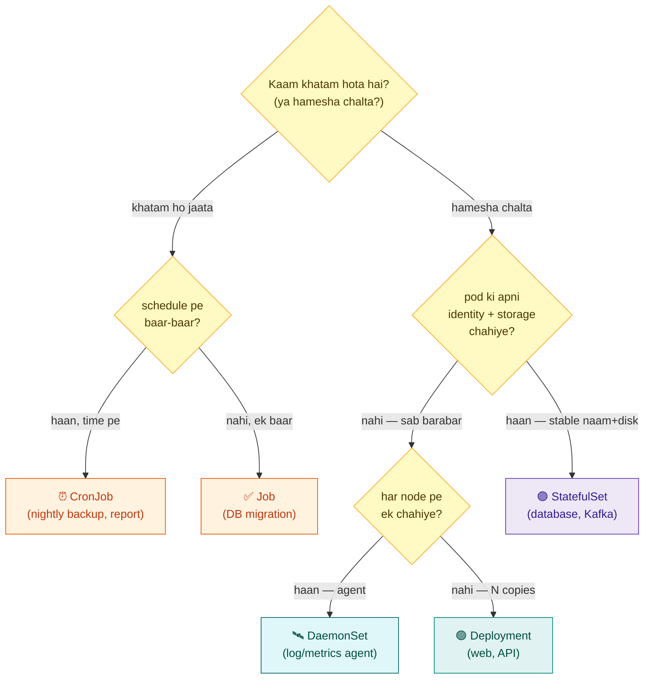
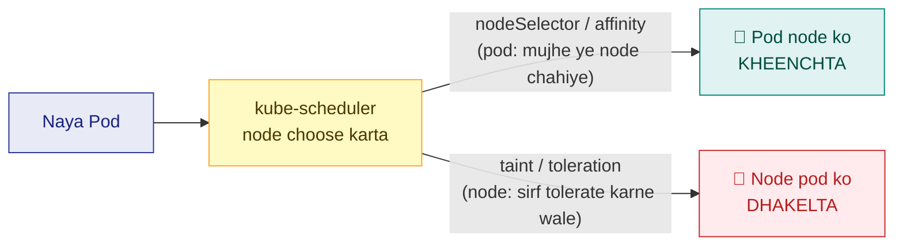
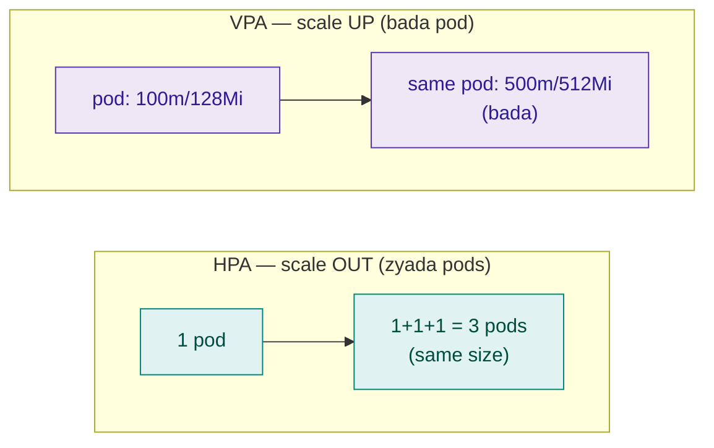
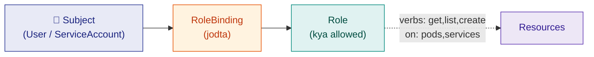
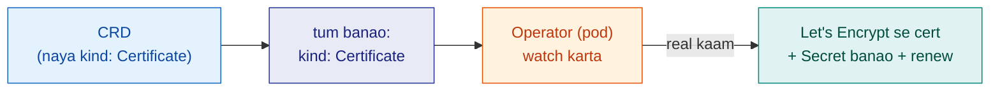
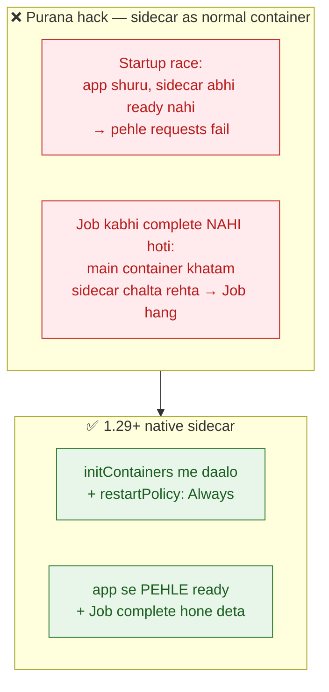
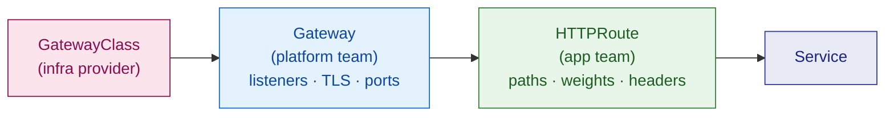

# 30 — Kubernetes Complete Reference: Workloads, Scheduling & Cluster Ops

> **Ye chapter kis liye:** Tumne objects *connect* karna seekha ([ch26](26-k8s-objects-map.md)) aur Helm *chalाना* ([ch28](28-helm-real-projects.md)). Ab woh **baaki surface** jo har K8s syllabus/interview/CKA mein aata hai — **Workloads (sab 6), Scheduling (kahan pod chale), Cluster Ops (RBAC/CRD/upgrade), aur Security tightening** — ek jagah, tumhare style mein: analogy + real project + haath se + recall.
>
> **Kyun ye chapter:** Ek "one-shot" video sirf inhe *mention* karta hai. Yahan har ek ka **why→what→how→when + tumhare billfree/VANTA se example + lab** hai. Isse tum sirf complete nahi — **deep aur confident** ho jaoge.

---

# Part A — Workloads: cheez chalane ke 6 tareeke

Har workload controller ek hi sawaal ka jawab hai: **"tumhara kaam kaisa hai?"** Kaam ki shakl se controller khud choose ho jaata hai.



> 🇮🇳 **Ek line se choose karo:** hamesha chalta + sab barabar → **Deployment**. + apna disk/naam → **StatefulSet**. har node pe ek → **DaemonSet**. ek baar chalke ruk jao → **Job**. time pe → **CronJob**.

## The 6, ek table mein

| Controller | Restaurant analogy | Kaam | Real example (tumhara) |
|---|---|---|---|
| **Deployment** | permanent interchangeable cooks | stateless, N identical, self-heal | billfree `auth-service`, VANTA `frontend` |
| **StatefulSet** | cook with own locker + fixed naam | stateful, stable identity + PVC | Postgres, Redis, Kafka |
| **DaemonSet** | har floor pe ek safai-wala | har node pe exactly ek | log agent, CNI, node-exporter |
| **ReplicaSet** | shift-supervisor (count rakhta) | N pods maintain (Deployment ke andar) | Deployment khud banata |
| **Job** | ek party ka kaam wala | run-to-completion, restart nahi | DB migration (billfree `migrate`) |
| **CronJob** | roz subah aane wala baker | schedule pe Job banata | nightly backup, report |

---

## A1 · Deployment (stateless) — sabse common

**WHY:** zyadatar apps (web/API) ki state bahar (DB/Redis) hoti — pods **interchangeable** hote. Inhe manage + heal + scale + rolling-update chahiye.

**Behaviour:** random naam (`auth-7d4b-xk2p`), koi personal storage nahi, koi bhi pod koi bhi request, freely scale, parallel start.

```yaml
apiVersion: apps/v1
kind: Deployment
metadata: { name: auth-service }
spec:
  replicas: 3
  strategy:
    type: RollingUpdate
    rollingUpdate: { maxUnavailable: 0, maxSurge: 1 }   # zero-downtime
  selector: { matchLabels: { app: auth-service } }
  template:
    metadata: { labels: { app: auth-service } }
    spec:
      containers:
      - name: auth
        image: ghcr.io/grvtech1/billfree-techops/auth-service:v1
```

> **billfree connection:** iska pura reusable Helm template `deploy/charts/microservice/templates/deployment.yaml` hai — 7 services usi se chalte ([ch28](28-helm-real-projects.md)).

## A2 · StatefulSet (stateful) — databases ke liye

**WHY:** database pods ko **stable naam** (`db-0` = primary, `db-1` = replica) + **apna permanent disk** chahiye. Random naam/shared disk = data corruption.

**Signature feature:** `volumeClaimTemplates` → har pod ko apna PVC (`data-db-0`, `data-db-1`). Ordered start (0→1→2), headless Service se stable DNS (`db-0.svc.ns`).

```yaml
apiVersion: apps/v1
kind: StatefulSet
metadata: { name: postgres }
spec:
  serviceName: postgres-headless      # clusterIP: None → stable per-pod DNS
  replicas: 3
  selector: { matchLabels: { app: postgres } }
  template:
    metadata: { labels: { app: postgres } }
    spec:
      containers:
      - name: postgres
        image: postgres:15
        volumeMounts: [{ name: data, mountPath: /var/lib/postgresql/data }]
  volumeClaimTemplates:               # 👈 har pod ko apna PVC
  - metadata: { name: data }
    spec:
      accessModes: ["ReadWriteOnce"]
      resources: { requests: { storage: 20Gi } }
```

> ⭐ **Senior call (interview gold) — trade-off, na ki "hamesha X":**
>
> | | **Self-managed StatefulSet** | **Managed (RDS/Cloud SQL)** |
> |---|---|---|
> | Control | poora | seemित |
> | Backup/failover/patch | **tum khud** | AWS sambhalta |
> | Cost | compute+disk | premium |
> | Kab | full control / cost-sensitive / showcase | zyadatar prod (ops-bojh kam) |
>
> **billfree = real self-managed example:** `deploy/platform/postgres.yaml` mein **Postgres StatefulSet** (replicas:1, `volumeClaimTemplates` 5Gi, `postgres:16-alpine`, `pg_isready` probes) — deliberately in-cluster, StatefulSet skill dikhane ko. Comment tak kehta *"heavier-duty ke liye CloudNativePG operator swap karo"*. Interview mein bolo: *"managed default hai (kam overhead), par maine in-cluster StatefulSet jaan-boojh ke chalaya control + StatefulSet mastery ke liye — trade-off ye hai ki backups/failover ki zimmedari meri."*

## A3 · DaemonSet — har node pe ek

**WHY:** kuch cheezein **har machine (node) pe** chahiye — log collector, metrics agent, network plugin (CNI), security scanner. Manually har node pe pod dalna galat. DaemonSet **automatically har node pe exactly ek** pod rakhta — naya node aaya to usme bhi apne aap.

**Restaurant:** har floor (node) pe ek **safai-wala** (agent). Naya floor khula → wahan bhi ek safai-wala apne aap.

```yaml
apiVersion: apps/v1
kind: DaemonSet
metadata: { name: node-exporter }
spec:
  selector: { matchLabels: { app: node-exporter } }
  template:
    metadata: { labels: { app: node-exporter } }
    spec:
      tolerations:                    # 👈 control-plane nodes pe bhi chale (taint tolerate)
      - operator: Exists
      containers:
      - name: node-exporter
        image: prom/node-exporter:latest
        ports: [{ containerPort: 9100 }]
```

| Kab DaemonSet | Real example |
|---|---|
| Node metrics chahiye | Prometheus **node-exporter** |
| Har pod ke logs chahiye | Fluent Bit / Promtail / Filebeat |
| Network plugin | Calico / Cilium (CNI) |
| Node security | Falco, image scanners |

> 🇮🇳 **Deployment vs DaemonSet:** Deployment kehta *"3 copies chahiye (kahin bhi)"*. DaemonSet kehta *"har node pe 1 chahiye"*. Node count badal jaye to DaemonSet count khud adjust.

## A4 · ReplicaSet — Deployment ka chhupa engine

**Tum ye seedhe kabhi nahi likhoge.** Deployment andar-andar ReplicaSet banata — ReplicaSet ka ek hi kaam: **"N pods hamesha chalein"** (self-heal count). Deployment iske upar **rolling update + rollback** deta (naya RS banata, purana scale-down).

```
Deployment (rolling update/rollback)
   └── ReplicaSet (N pods maintain — self-heal)
          └── Pods
```

> **Yaad rakho:** self-heal (count) = ReplicaSet ka kaam. Rolling update/rollback = Deployment ka. Tum Deployment likho — RS free milta.

## A5 · Job — ek baar ka kaam

**WHY:** kuch kaam **ek baar** chalke khatam — migration, backup, batch. Deployment galat (khatam hone pe restart = loop). Job pod **exit 0 pe `Completed`**, restart nahi.

```yaml
apiVersion: batch/v1
kind: Job
metadata: { name: db-migrate }
spec:
  backoffLimit: 4               # fail → 4 retry, phir haar
  activeDeadlineSeconds: 600    # 10 min se zyada → kill (hang protection)
  ttlSecondsAfterFinished: 300  # done ke 5 min baad pod auto-delete
  template:
    spec:
      restartPolicy: Never       # 👈 Job: Never/OnFailure (Always allowed NAHI)
      containers:
      - name: migrate
        image: ghcr.io/grvtech1/billfree-techops/migrate:latest
        command: ["npm","run","migrate"]
```

- `completions: 5` → 5 baar successfully chale
- `parallelism: 2` → ek saath 2 pods (batch tez)

> **billfree = real Job example:** `deploy/platform/migrate-job.yaml` ek asli DB-migration **Job** hai — `restartPolicy: Never`, `backoffLimit: 5`, `ttlSecondsAfterFinished: 600`, `runAsNonRoot`, `DATABASE_URL` secret se. Aur ek **clever nuance** (interview gold): ye ArgoCD **`PostSync` hook** hai, **PreSync nahi** — kyunki PreSync Postgres banne se *pehle* chalega aur `postgres` host resolve na hone se **deadlock** ho jaayega. Migration idempotent hai (`schema_migrations` track), isliye re-run safe.

## A6 · CronJob — schedule pe Job

**WHY:** kaam **time pe repeat** — nightly backup, weekly report, cleanup. CronJob khud kaam nahi karta — **schedule pe Job banata** (Linux cron jaisa).

```yaml
apiVersion: batch/v1
kind: CronJob
metadata: { name: nightly-backup }
spec:
  schedule: "0 2 * * *"              # roz 2am (min hr dom mon dow)
  concurrencyPolicy: Forbid         # pichhla chal raha → naya mat chalao
  startingDeadlineSeconds: 300
  successfulJobsHistoryLimit: 3
  jobTemplate:
    spec:
      template:
        spec:
          restartPolicy: OnFailure
          containers:
          - name: backup
            image: postgres:15
            command: ["sh","-c","pg_dump $DB_URL | gzip | aws s3 cp - s3://backups/$(date +%F).sql.gz"]
```

**Cron syntax:** `"0 2 * * *"` = roz 2am · `"*/15 * * * *"` = har 15 min · `"0 1 * * 0"` = har Sunday 1am.

> ⚠️ **Interview trap — `concurrencyPolicy`:** backup 3 ghante leta par schedule hourly → `Forbid` na ho to overlap (DB overload). `Forbid` = pichhla khatam tak naya nahi. `Replace` = purana kill. `Allow` = overlap OK (default).

**4 real use cases:** DB migration (Job) · nightly reports (CronJob) · DB backup (CronJob) · purane data cleanup (CronJob).

---

## 🧪 Lab A — saare workloads kind pe

```bash
# Job — ek baar chalke Completed
kubectl create job hello --image=busybox -- echo "migration done"
kubectl get pods            # STATUS: Completed (restart NAHI)
kubectl logs job/hello

# CronJob — har minute (test ke liye)
kubectl create cronjob ping --image=busybox --schedule="*/1 * * * *" -- echo "tick"
kubectl get cronjob,jobs -w   # har minute naya Job

# DaemonSet — count = node count
kubectl get nodes             # kitne nodes?
kubectl get daemonset -A      # kube-proxy/CNI already DaemonSet hain — count = nodes

# Deployment vs StatefulSet naam ka farak
kubectl create deployment web --image=nginx --replicas=3
kubectl get pods -l app=web   # random naam: web-xxxx-yyyy
# (StatefulSet ke pods hote: web-0, web-1, web-2)
```

**Recall (bina dekhe):** 6 workloads + har ek "kab". Job ka `restartPolicy`? DaemonSet count kis se? StatefulSet ka signature field?

---

# Part B — Scheduling: pod **kahan** chalega

Default: scheduler **koi bhi fit node** choose kar leta. Par kabhi tumhe **control** chahiye — *"ye GPU node pe hi chale"*, *"ye do pods alag nodes pe"*, *"is node pe sirf special pods"*. Ye Part uske 4 tools deta.



> 🇮🇳 **Poori scheduling do dishaon mein:** **Affinity/nodeSelector = Pod node ko kheenchta** ("mujhe ye node chahiye"). **Taint = Node pod ko dhakelta** ("sirf tolerate karne wale aao"). Ye ek line yaad rakho — 90% confusion khatam.

## B1 · nodeSelector — sabse simple

Node pe label lagao, pod mein bolo *"is label wale node pe hi"*.

```bash
kubectl label node worker-1 disktype=ssd     # node pe label
```
```yaml
spec:
  nodeSelector:
    disktype: ssd        # 👈 sirf ssd node pe
```

Simple par **rigid** — exact match ya kuch nahi.

## B2 · Node Affinity — flexible nodeSelector

Zyada control: "chahiye" (hard) vs "preferably" (soft), aur operators (`In`, `NotIn`, `Exists`).

```yaml
spec:
  affinity:
    nodeAffinity:
      requiredDuringSchedulingIgnoredDuringExecution:   # HARD — warna schedule nahi
        nodeSelectorTerms:
        - matchExpressions:
          - { key: disktype, operator: In, values: [ssd, nvme] }
      preferredDuringSchedulingIgnoredDuringExecution:  # SOFT — koshish karo
      - weight: 100
        preference:
          matchExpressions:
          - { key: zone, operator: In, values: [ap-south-1a] }
```

- **required** = zaroori (na mile to `Pending`)
- **preferred** = try karo (na mile to bhi chal jaayega)

## B3 · Pod Affinity / Anti-affinity — pods ko saath/alag

Node se nahi — **doosre pods** se relation:

- **podAffinity** = "us pod ke paas rakho" (jaise cache ke paas app — latency kam)
- **podAntiAffinity** = "us pod se door rakho" (jaise 3 DB replicas **alag nodes** pe — ek node gire to sab na gire)

```yaml
# HA: 3 replicas ko alag nodes pe faila do
affinity:
  podAntiAffinity:
    requiredDuringSchedulingIgnoredDuringExecution:
    - labelSelector:
        matchLabels: { app: postgres }
      topologyKey: kubernetes.io/hostname     # 👈 "hostname alag ho" = alag node
```

> 🇮🇳 **Real use:** production mein 3 replicas ek hi node pe aa jayein aur woh node gire → poora down. **podAntiAffinity** se force karo "alag nodes pe" → ek node gire, baaki chalein. Yehi HA (high availability) hai.

## B4 · Taints & Tolerations — node ka bouncer 🚪

**Ulta concept:** upar wale (affinity) mein **pod** node choose karta. Taint mein **node** decide karta *"mere paas sirf khaas pod aayenge"*.

**Bouncer analogy:** node pe **taint** = club ke bahar bouncer. Normal pod (guest) andar nahi ja sakta. Sirf jis pod ke paas **toleration** (VIP pass) hai woh andar.

```bash
# Node pe taint lagao — ab normal pods yahan nahi aayenge
kubectl taint nodes gpu-node dedicated=gpu:NoSchedule
```
```yaml
# Sirf ye pod us node pe ja sakta (VIP pass)
spec:
  tolerations:
  - key: dedicated
    operator: Equal
    value: gpu
    effect: NoSchedule
```

**3 taint effects:**

| Effect | Matlab |
|---|---|
| `NoSchedule` | naye pods nahi (jo hain rahenge) |
| `PreferNoSchedule` | koshish karo mat bhejo (soft) |
| `NoExecute` | naye nahi + **jo hain unhe bhi nikaalo** |

**Kahan dikhta rozana:** control-plane nodes pe by-default taint hota (`node-role.kubernetes.io/control-plane:NoSchedule`) — isliye tumhare app pods master pe nahi jaate. DaemonSet (jaise node-exporter) us par bhi chale isliye `tolerations: [{operator: Exists}]` lagta (Lab A daekha).

> ⭐ **Taint vs Affinity — ek line:** **Taint = node kehta "door raho" (repel).** **Affinity = pod kehta "wahan jaana hai" (attract).** Dedicated GPU node chahiye to **dono** lagao: taint (baaki sab bhagao) + toleration/affinity (GPU pod ko bhejo).

## B5 · VPA vs HPA — up vs out

Dono autoscale karte, par **ulta**:



| | **HPA** (Horizontal) | **VPA** (Vertical) |
|---|---|---|
| Kya badhata | **pod count** (2→10) | **pod size** (CPU/mem requests) |
| Restaurant | aur cooks bulao | ek cook ko bada stove do |
| Best for | stateless web/API (traffic spike) | jinhe scale-out mushkil (DB, JVM) |
| Metric | CPU/mem/custom vs requests | usage history |
| Catch | app stateless hona chahiye | pod **restart** karta size badalne ko |

> ⚠️ **HPA + VPA ek saath CPU/mem pe = conflict** (dono replicas/size ladenge). VPA sirf requests-recommendation mode mein, ya HPA custom metric pe. **billfree HPA use karta** (`autoscaling.enabled`, CPU 70% — [ch28](28-helm-real-projects.md)). VPA tab jab sahi size hi na pata ho.

---

## 🧪 Lab B — scheduling haath se

```bash
# Taint lagao → normal pod Pending
kubectl taint nodes <node> demo=true:NoSchedule
kubectl run test --image=nginx
kubectl get pod test          # Pending! (koi node tolerate nahi karta)
kubectl describe pod test | grep -A3 Events   # "untolerated taint" dikhega

# Toleration do → schedule ho jaata
kubectl delete pod test
cat <<'EOF' | kubectl apply -f -
apiVersion: v1
kind: Pod
metadata: { name: test }
spec:
  tolerations: [{ key: demo, operator: Equal, value: "true", effect: NoSchedule }]
  containers: [{ name: c, image: nginx }]
EOF
kubectl get pod test          # Running ✓

# cleanup
kubectl taint nodes <node> demo=true:NoSchedule-   # taint hatao (trailing -)
```

**Recall:** Taint vs Affinity ka farak 1 line? 3 taint effects? podAntiAffinity kis liye? HPA vs VPA?

---

# Part C — Cluster Ops (jo seniors karte)

## C1 · RBAC — kaun kya kar sakta

**WHY:** cluster mein har banda/service sab kuch nahi kar sakta. Dev sirf apne namespace mein, CI sirf deploy, ArgoCD sab jagah. **RBAC** ye "kaun kya" decide karta.

**4 pieces:**



| Piece | Kya | Scope |
|---|---|---|
| **Role** | permissions ka set (verbs × resources) | ek namespace |
| **ClusterRole** | wahi, par poore cluster mein | cluster-wide |
| **RoleBinding** | Role ko subject se jodta | ek namespace |
| **ClusterRoleBinding** | ClusterRole ko subject se | cluster-wide |
| **ServiceAccount** | pod ki identity (app ke liye "user") | namespace |

```yaml
# Role: is namespace mein pods read kar sakte
apiVersion: rbac.authorization.k8s.io/v1
kind: Role
metadata: { namespace: billfree-dev, name: pod-reader }
rules:
- apiGroups: [""]
  resources: ["pods"]
  verbs: ["get", "list", "watch"]      # sirf read (create/delete NAHI)
---
# Binding: developer ko woh Role do
kind: RoleBinding
metadata: { namespace: billfree-dev, name: read-pods }
subjects:
- kind: User
  name: gaurav
roleRef: { kind: Role, name: pod-reader, apiGroup: rbac.authorization.k8s.io }
```

> 🇮🇳 **Least privilege:** har kisi ko utna hi do jitna chahiye. CI ko `create deployment` do, `delete namespace` nahi. **ServiceAccount** app ke liye — pod ko sirf woh API access jitni zaroori (jaise ArgoCD ko sync ke liye).

```bash
# "Main ye kar sakta hoon?" — RBAC test
kubectl auth can-i create deployments -n billfree-dev
kubectl auth can-i delete nodes --as=gaurav      # kisi aur ke roop mein check
```

## C2 · CRDs & Operators — K8s ko extend karna

**WHY:** K8s ke built-in objects (Pod, Service…) kaafi nahi jab tumhe **apna** object chahiye — jaise `Certificate`, `Application` (ArgoCD), `PrometheusRule`. **CRD** naya object-type add karta; **Operator** us object ko manage karne ka dimaag.

**CRD (Custom Resource Definition):** K8s API mein ek **naya kind** register karo. Iske baad `kubectl get certificates` chalega jaise built-in ho.

**Operator:** ek pod jo us custom object ko **watch** karta aur real kaam karta. Jaise:
- **cert-manager** → `Certificate` CRD dekhta → Let's Encrypt se cert le aata, auto-renew
- **ArgoCD** → `Application` CRD dekhta → Git se sync karta
- **Prometheus Operator** → `ServiceMonitor`/`PrometheusRule` CRD → scrape config banata



> 🇮🇳 **Ek line:** CRD = **naya object-type** (naya "kind"). Operator = us object ko **chalane wala dimaag** (ek pod jo watch karke kaam karta). Tumne dono use kiye hain — billfree ke `ServiceMonitor`/`PrometheusRule` **CRDs** hain (Prometheus Operator), aur ArgoCD `Application` ek CRD hai. **Restaurant:** CRD = menu mein nayi dish-category add karna; Operator = us dish ka specialist chef.

```bash
kubectl get crds                          # cluster ke saare custom types
kubectl get crds | grep -E "argo|cert|monitoring"   # tumhare operators ke
kubectl api-resources | grep -v "true"    # kaunse cluster-scoped
```

## C3 · Cluster Upgrade & version skew

**WHY:** K8s har ~4 mahine nayi version. Security patch + features ke liye upgrade zaroori. Par **galat order** = downtime.

**Sahi order (yaad rakho):**

```
1. Control plane pehle   (apiserver → controller → scheduler)
2. Phir nodes (kubelet)  — ek-ek karke: drain → upgrade → uncordon
3. Ek minor version at a time (1.28 → 1.29 → 1.30, jump NAHI)
```

**Version skew rule:** kubelet (node) apiserver se **zyada nayi nahi** ho sakti, aur ~2 minor peeche tak chal sakti. Isliye **control plane pehle**.

```bash
# Node safely upgrade karne ka flow
kubectl drain worker-1 --ignore-daemonsets --delete-emptydir-data  # pods hatao
# ... us node pe kubelet/kubeadm upgrade ...
kubectl uncordon worker-1        # wapas schedulable
kubectl get nodes                # VERSION column check
```

> ⚠️ **`drain` = node khaali karo** (pods doosre nodes pe shift, PDB respect karte hue). Isliye [PDB](28-helm-real-projects.md) (billfree chart mein `minAvailable: 1`) matter karta — upgrade ke waqt service down na ho.
>
> **Managed (EKS/GKE) mein:** ye zyadatar cloud karta — tum bas version choose karte, node-groups rolling-replace ho jaate. **billfree/VANTA EKS** pe isiliye ye asaan.

---

# Part D — Security tightening (unke "Security" section ka jawab)

## D1 · Pod Security Standards (PSS)

**WHY:** by-default pod bahut kuch kar sakta — root chalna, host access, privileged. Ek hacked container poore node ko khatra. **PSS** namespace-level policy jo restrict karti.

**3 levels:**

| Level | Matlab | Kab |
|---|---|---|
| **privileged** | sab allowed (koi restriction nahi) | trusted system workloads |
| **baseline** | known-bad block (host access, privileged) | zyadatar apps |
| **restricted** | sabse tight (non-root, no-privesc, drop caps) | 🎯 production target |

```yaml
# Namespace pe PSS enforce karo (label se)
apiVersion: v1
kind: Namespace
metadata:
  name: billfree-prod
  labels:
    pod-security.kubernetes.io/enforce: restricted   # block agar tootey
    pod-security.kubernetes.io/warn: restricted       # warning bhi
```

> **billfree already tight hai:** chart ke `securityContext` mein `runAsNonRoot: true`, `readOnlyRootFilesystem: true`, `capabilities: drop [ALL]` — yehi **restricted** profile pass karne ke liye chahiye ([ch28](28-helm-real-projects.md) mein dekha). Namespace pe `restricted` enforce karo → koi galti se privileged pod na daale.

## D2 · Secrets — base64 ≠ encryption

**Sabse bada misconception.** K8s Secret **base64** hai — jo **encoding hai, encryption NAHI**. Koi bhi `base64 -d` se padh le.

```bash
kubectl get secret app-secret -o jsonpath='{.data.password}' | base64 -d   # plain text!
```

**Teen level ki safety (badhte hue):**

| Level | Kya | Effort |
|---|---|---|
| **1. RBAC** | Secret read karne ki permission kam do | zaroori minimum |
| **2. Encryption at rest** | etcd mein secrets encrypted store (`EncryptionConfiguration`) | apiserver config |
| **3. External secrets** | Vault / AWS Secrets Manager / Sealed Secrets — K8s ke bahar | best for prod |

```yaml
# apiserver EncryptionConfiguration (etcd mein encrypted store)
apiVersion: apiserver.config.k8s.io/v1
kind: EncryptionConfiguration
resources:
- resources: ["secrets"]
  providers:
  - aescbc: { keys: [{ name: key1, secret: <base64-32byte-key> }] }
  - identity: {}
```

> 🇮🇳 **Prod best-practice:** Secret Git mein kabhi nahi. Options: **Sealed Secrets** (encrypted Git mein safe), **External Secrets Operator** (Vault/AWS se pull), ya cloud KMS. **billfree** `billfree-app-secrets` use karta (`secretRef`) — isse External Secrets se feed karo, hardcode kabhi nahi.

## D3 · Image scanning

Deploy se pehle image mein **known vulnerabilities (CVE)** check karo. **Trivy** standard:

```bash
trivy image ghcr.io/grvtech1/billfree-techops/auth-service:v1
# HIGH/CRITICAL CVEs list → fix (base image update / patch)
```

CI mein daalo (fail on CRITICAL) — [ch7 CI/CD](07-M6-cicd.md) ka part.

---

---

# Part E — Modern K8s: jo daily chahiye par kahin nahi milta

Ye Part woh 5 cheezein hai jo **roz kaam aati hain**, interview mein aati hain, par zyadatar courses mein hoti hi nahi. Har ek ka apna real trigger hai.

---

## E1 · `kubectl debug` — jab container mein shell hi nahi hai

**Trigger:** Tumne security best-practice follow ki — **distroless/slim image** ([ch04 Docker](04-M3-docker.md) mein yahi recommend hai). Ab production mein debug karna hai:

```bash
$ kubectl exec -it auth-service-7d4b-xk2p -- sh
error: exec: "sh": executable file not found in $PATH
```

**Shell hai hi nahi.** Distroless image mein sirf tumhari app binary hoti — koi `sh`, `bash`, `ls`, `curl`, kuch nahi. Yehi to point tha (attack surface kam). Par ab debug kaise?

!!! danger "Ye loop bahut logo ka band nahi hota"
    Distroless use karo (sahi) → shell gayab → `kubectl exec` fail → log frustrate hoke **shell wapas image mein daal dete hain** (galat, security wapas kamzor). Sahi jawab: **image mat badlo — debugging tools alag se attach karo.**

**Solution — ephemeral containers.** Ek temporary container **usi pod ke andar** attach karo, jo tumhare tools laata hai — bina pod restart kiye, bina image badle.

```bash
# ek debug container attach karo (busybox = tools)
kubectl debug -it auth-service-7d4b-xk2p --image=busybox --target=auth-service

# ab tum usi pod ke andar ho, tumhare tools ke saath:
  ps aux              # target ke processes dikhte (--target se process namespace share)
  wget -qO- localhost:8080/healthz
  cat /proc/1/environ
```

**Restaurant analogy:** Cook ke paas apne auzaar nahi hain (distroless). Tum use naye auzaar nahi de sakte (image immutable). Toh tum **apna toolbox lekar usi kitchen mein ghus jaate ho** — cook wahi rehta, kaam chalta rehta, aur tum jaanch kar lete ho.

**Teen modes (yaad rakho):**

| Kya karna hai | Command | Kab |
|---|---|---|
| **Chalte pod mein** tools attach | `kubectl debug -it POD --image=busybox --target=CONTAINER` | distroless debug, live pod |
| **Pod ki copy** banao (badalke) | `kubectl debug POD --copy-to=debug-pod --image=busybox` | crashing pod — original chhedna nahi |
| **Node** pe debug (host access) | `kubectl debug node/NODE-1 -it --image=busybox` | node-level issue (disk, network) |

```bash
# CrashLoopBackOff pod — copy banao command badalke (original chalta rahe)
kubectl debug auth-service-7d4b-xk2p --copy-to=auth-debug \
  --set-image='*=busybox' -- sleep 1d
kubectl exec -it auth-debug -- sh     # ab aaram se dekho
```

> ⚠️ **`--target` bhoolna** = sabse common galti. Uske bina debug container **apne** namespace mein chalta — target ke processes nahi dikhenge. `--target=<container-name>` se process namespace share hota.

> 🇮🇳 **Ek line:** `kubectl exec` tab kaam karta jab image mein shell ho. **Distroless mein `kubectl debug` hi ekmatra rasta hai** — tools alag container se aate, image chhedni nahi padti.

---

## E2 · Native sidecars (K8s 1.29+) — purana hack ab theek ho gaya

**Sidecar kya:** ek helper container jo main app ke **saath** chalta — log shipper, proxy, metrics agent.

**Purana tareeka (aur uski do bimariyan):** sidecar ko normal container ki tarah `containers:` mein daalte the. Do problems:



**Naya (native) sidecar** — `initContainers` mein, par `restartPolicy: Always` ke saath:

```yaml
spec:
  initContainers:
    - name: log-shipper
      image: fluent-bit:latest
      restartPolicy: Always      # 👈 YEHI ise sidecar banata (init nahi)
      # ye app se PEHLE start hoga, ready hoga, aur SAATH chalta rahega
  containers:
    - name: app
      image: my-app:v1
```

**Woh ek line kya karti hai:**

| Bina `restartPolicy: Always` | Ke saath |
|---|---|
| normal **init container** — chalta, khatam, phir app | **sidecar** — chalta, ready hota, **saath chalta rehta** |
| app ke baad khatam | app ke baad **band ho jaata** (Job complete ho sakti) |

**Do problems jo ye solve karta:**
1. **Startup order** — sidecar (proxy/log-shipper) **app se pehle** ready. Pehle requests ab fail nahi hoti.
2. **Job completion** — pehle: main container khatam, sidecar chalta raha → **Job kabhi Complete nahi hoti** (classic bug). Ab: main khatam → sidecar apne aap band → Job Complete ✅

> 💡 **billfree connection:** Tumhara `migrate` Job ([ch30 A5](#a5-job-ek-baar-ka-kaam)) — agar usme koi sidecar (metrics/log agent) hota purane tareeke se, to woh Job **kabhi complete nahi hoti**. Native sidecar isi ko fix karta hai.

> 🇮🇳 **Ek line:** Sidecar ab `initContainers` mein `restartPolicy: Always` ke saath likhte hain — isse woh **app se pehle ready** hota aur **Job ko complete hone deta** hai. Purana tareeka (normal container) dono cheezein tod deta tha.

---

## E3 · Requests/limits ke numbers *kaise chunte hain*

QoS, OOMKill, throttling — sab [ch30 se pehle](05-M4-kubernetes-core.md) cover hai. Par asli sawaal: **"256Mi hi kyun likha? 512 kyun nahi?"** Ye methodology kahin nahi milti.

!!! danger "Galat tareeke (jo sab karte hain)"
    - **Guess** — "512Mi theek lagta hai" 🎲
    - **Copy-paste** — doosri service se utha liya
    - **Bahut bada** — "safe rahenge" → **cluster ka paisa barbaad**, kam pods fit hote
    - **Requests = Limits hamesha** — Guaranteed QoS milta, par utilization gir jaata

### Sahi procedure — 4 steps

```
1. OBSERVE   → real usage measure karo (guess mat karo)
2. REQUESTS  → typical usage (p50–p95) + thoda headroom
3. LIMITS    → peak usage × safety factor
4. ITERATE   → production data se adjust karo
```

**Step 1 — Measure (deploy karke dekho):**
```bash
# live usage
kubectl top pod -l app=auth-service --containers

# Prometheus se sach (p95 over 7 days) — ye asli data hai
# memory: quantile_over_time(0.95, container_memory_working_set_bytes[7d])
# cpu:    quantile_over_time(0.95, rate(container_cpu_usage_seconds_total[5m])[7d:])
```

**Step 2/3 — Numbers nikalo:**

| Resource | Requests | Limits | Kyun |
|---|---|---|---|
| **Memory** | p95 usage × **1.2** | requests × **2** | memory **compressible nahi** — limit paar = instant OOMKill. Headroom chahiye |
| **CPU** | p50–p95 usage | requests × **2–4** *(ya set hi mat karo)* | CPU **compressible** hai — limit paar = sirf throttle (kill nahi) |

> ⭐ **Senior nuance (interview gold):** Bahut senior log **CPU limit set hi nahi karte** — sirf requests. Kyun? CPU throttling latency ko chupke se maar deti hai, jabki spare CPU waise bhi bekaar padi hoti. **Memory limit hamesha set karo** (warna ek leaky pod poore node ko le doobega). *"Requests for scheduling, memory-limits for safety, CPU-limits usually not."*

**Step 4 — Tumhare billfree ka real case:**

```yaml
# deploy/apps/auth-service/values.yaml — jo abhi hai
resources:
  requests: { cpu: 50m,  memory: 96Mi }
  limits:   { cpu: 500m, memory: 256Mi }
```
Aur observed usage tha **254Mi** — yaani limit ka **99%**. Formula lagao: p95 (254Mi) × 1.2 ≈ **300Mi requests**, limits ≈ **600Mi**. Jo 256Mi tha wo **p95 se bhi kam** tha — isiliye OOMKill hua ([platform simulator INC-2891](../platform/) ka pura incident yahi tha).

> 🇮🇳 **Ek line:** Numbers **maapo, guess mat karo**. Memory: p95 × 1.2 (requests), × 2 (limits). CPU: p50–p95 requests, limit aksar chhodo hi. Aur **deploy karke dobara dekho** — pehla number hamesha andaza hota hai.

---

## E4 · `imagePullSecrets` — private registry

**Trigger:** `ImagePullBackOff`, par error `manifest unknown` nahi — `unauthorized` hai. Matlab image hai, par cluster ko **dekhne ki ijazat nahi**.

```bash
kubectl describe pod my-app-xyz | grep -A3 Events
#   Failed to pull image "ghcr.io/myorg/app:v1": unauthorized
```

**Fix — registry credential ek Secret ki tarah:**

```bash
# 1. docker-registry type ka secret banao
kubectl create secret docker-registry ghcr-creds \
  --docker-server=ghcr.io \
  --docker-username=grvtech1 \
  --docker-password=$GITHUB_TOKEN \
  -n billfree

# 2. pod ko batao ise use karna hai
```
```yaml
spec:
  imagePullSecrets:
    - name: ghcr-creds        # 👈 yehi line
  containers:
    - name: app
      image: ghcr.io/myorg/app:v1
```

**Ya har pod mein likhne ke bajaye — ServiceAccount pe ek baar** (behtar):
```bash
kubectl patch serviceaccount default -n billfree \
  -p '{"imagePullSecrets":[{"name":"ghcr-creds"}]}'
# ab us namespace ke saare pods ko automatically mil jaayega
```

> **billfree connection:** Chart mein `imagePullSecrets: []` field already hai ([values.yaml](28-helm-real-projects.md)) — private registry pe jaate hi bas usme naam daalna hota hai.

**ImagePullBackOff ka decoder (ye yaad rakho):**

| Error | Matlab | Fix |
|---|---|---|
| `manifest unknown` | tag **exist hi nahi** karta | CI check karo (image push hui?) — [INC-2904](../platform/) |
| `unauthorized` / `denied` | **credentials** problem | `imagePullSecrets` |
| `i/o timeout` | **network/egress** blocked | NetworkPolicy / firewall |

---

## E5 · Gateway API — Ingress ka successor

**Kya:** Kubernetes ka **naya official** traffic-routing standard. Ingress ab feature-frozen hai — naye features Gateway API mein aa rahe.

**Ingress ki problem:** sab kuch **annotations** mein thunsa hota tha:
```yaml
annotations:
  nginx.ingress.kubernetes.io/rewrite-target: /
  nginx.ingress.kubernetes.io/canary: "true"       # non-standard!
  nginx.ingress.kubernetes.io/canary-weight: "10"  # har controller ka apna
```
Har ingress-controller ke apne annotations → **portable nahi**, type-safe nahi.

**Gateway API** in cheezon ko **proper API fields** banata, aur role split karta:



```yaml
# canary — ab annotation nahi, asli API field
apiVersion: gateway.networking.k8s.io/v1
kind: HTTPRoute
metadata: { name: auth-route }
spec:
  parentRefs: [{ name: prod-gateway }]
  rules:
    - matches: [{ path: { type: PathPrefix, value: /auth } }]
      backendRefs:
        - { name: auth-service, port: 80, weight: 90 }   # 90% purana
        - { name: auth-canary,  port: 80, weight: 10 }   # 10% naya
```

| | **Ingress** | **Gateway API** |
|---|---|---|
| Status | feature-frozen | active development |
| Traffic splitting | controller annotations | **built-in `weight`** |
| Roles | sab ek object mein | **split** (infra / platform / app team) |
| Protocols | HTTP(S) mostly | HTTP · gRPC · TCP · UDP |
| Kab use karo | aaj kaam kar raha hai to rehne do | **naya setup**, ya canary/multi-team chahiye |

> 🇮🇳 **Interview answer:** *"Ingress feature-frozen hai; Gateway API successor hai. Do bade fayde — traffic splitting annotation ke bajaye **asli API field** hai (canary asaan), aur **role separation** hai: platform team Gateway banati (TLS/listeners), app team HTTPRoute (paths/weights). Purana Ingress chal raha ho to migrate ki jaldi nahi — par naya banate waqt Gateway API dekho."*

---

## 🎯 Part E recall drill

1. Distroless image, `kubectl exec -- sh` fail — ab kya? *(kubectl debug + ephemeral container)*
2. `kubectl debug` mein `--target` kyun zaroori? *(process namespace share — warna target dikhta hi nahi)*
3. Native sidecar kaise likhte? *(initContainers + `restartPolicy: Always`)*
4. Purana sidecar Job ke saath kya todta tha? *(Job kabhi Complete nahi hoti thi)*
5. Memory requests ka formula? *(p95 × 1.2; limits ≈ requests × 2)*
6. CPU limit aksar set kyun nahi karte? *(throttling latency maarti; CPU compressible hai)*
7. `unauthorized` vs `manifest unknown` — farak? *(creds vs tag exist nahi)*
8. Gateway API ke 2 bade fayde? *(built-in traffic weight; role separation)*

> **Pass = 6/8.**

---

## 🎯 Complete recall drill (bina dekhe bolo)

**Workloads:**
1. 6 workloads + har ek "kab"?
2. StatefulSet ka signature field? *(volumeClaimTemplates)*
3. Job ka `restartPolicy`? *(Never/OnFailure)*
4. DaemonSet count kis se? *(node count)*

**Scheduling:**
5. Taint vs Affinity — ek line? *(node repel vs pod attract)*
6. 3 taint effects? *(NoSchedule/PreferNoSchedule/NoExecute)*
7. podAntiAffinity kis liye? *(replicas alag nodes — HA)*
8. HPA vs VPA? *(out/count vs up/size)*

**Cluster Ops:**
9. RBAC ke 4 pieces? *(Role/ClusterRole/RoleBinding/**ClusterRoleBinding** — ServiceAccount alag hai: wo **identity** hai jise bind karte ho, RBAC object nahi)*
10. CRD vs Operator? *(naya kind vs use chalane wala pod)*
11. Upgrade order? *(control-plane → nodes, ek minor at a time)*

**Security:**
12. Secret encrypted hai? *(Nahi — base64; RBAC + encryption-at-rest + external chahiye)*
13. PSS ka prod target? *(restricted)*

> **Pass = 10/13 bina dekhe.** Ye aa gaya → tum kisi bhi "K8s one-shot" se **complete AND deep** ho. 💪

---

## 20-second recall

```
WORKLOADS: Deployment(stateless) · StatefulSet(stateful+PVC) · DaemonSet(per-node)
           · ReplicaSet(count) · Job(once) · CronJob(scheduled)
SCHEDULING: Affinity/nodeSelector = pod node ko KHEENCHTA
            Taint/Toleration = node pod ko DHAKELTA (bouncer + VIP pass)
            HPA = zyada pods (out) · VPA = bada pod (up)
CLUSTER OPS: RBAC(kaun kya) · CRD(naya kind)+Operator(dimaag) · upgrade: CP→nodes
SECURITY: PSS restricted · Secret = base64 (NOT encrypted) → RBAC+at-rest+external
MODERN:   kubectl debug (distroless = no shell) · native sidecar (init + restartPolicy:Always)
          requests = p95x1.2 (measure!) · imagePullSecrets (unauthorized) · Gateway API > Ingress
```

> 🇮🇳 **Ek line:** Ye chapter woh "baaki surface" hai jo ek video sirf naam-le ke chhod deta — yahan har ek ka **why + real example + haath se**. Ab tum sirf syllabus-complete nahi, **samajh ke confident** ho. 😊

---

*Connected: [K8s Objects Map](26-k8s-objects-map.md) · [M4 K8s Core](05-M4-kubernetes-core.md) · [M9 Internals](11-M9-advanced-k8s-internals.md) · [Helm Real World](28-helm-real-projects.md) · [Confidence Sprint](29-confidence-sprint.md) · [Incident Playbook](23-production-incident-playbook.md)*
