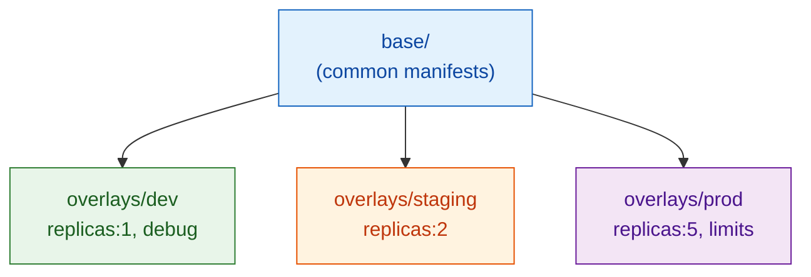
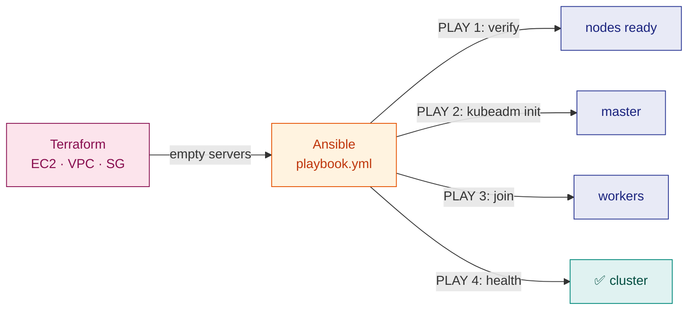

# 32 — Lab B: VANTA-Boutique, End to End

> **Kya banega:** Ek **12-service microservices store** (Google Online Boutique base) — local kind se lekar self-managed AWS cluster + Ansible + chaos engineering tak. Ye lab tumhare **apne repo** (`VANTA-Boutique`) pe chalta hai.
>
> **⏱️ Time:** ~3h guided + 40min **Solo Run** · **🎚️ Level:** Intermediate → Senior · **📋 Pehle:** [Lab A · BillFree](31-lab-billfree.md) · [Terraform](02-M1-terraform.md) · [Ansible](03-M2-ansible.md)

!!! tip "Lab A vs Lab B — kyun dono?"
    **Lab A (BillFree)** = ek reusable Helm chart, 7 same-shape services, managed-style GitOps.
    **Lab B (VANTA)** = 12 **alag-alag language** services (Go, C#, Python, Java, Node), **Kustomize** overlays, **self-managed** kubeadm cluster (Ansible se), aur **chaos engineering**. Dono milke poora spectrum cover karte.

!!! danger "🚗 DRIVER MODE — Lab A wale hi rules"
    **Round 1 (guided):** Parts 1–7 commands ke saath — samajhne ke liye. Har command se pehle 5 second: *"ye kya karegi?"*
    **Round 2 (SOLO):** [Solo Run](#solo-run-graduation) — commands nahi, sirf goals. **Round 2 hi asli lab hai.**
    Jo command Lab A mein chala chuke ho (`kubectl get/describe/logs`, `helm`, `git`…) — **yahan bina dekhe** likho. Har boss/chaos ke baad 3-line RCA (symptom → cause → fix).

---

## The journey — ek nazar mein

```mermaid
flowchart LR
  P1["1 · Git\nbranch → PR"]:::a
  P2["2 · kind\n12 services local"]:::b
  P3["3 · Kustomize\ndev/staging/prod"]:::c
  P4["4 · Build + load\nsource → kind"]:::d
  P5["5 · Self-managed\nTerraform + Ansible"]:::e
  P6["6 · GitOps\nArgoCD"]:::f
  P7["7 · Chaos\nbreak & fix"]:::g
  P1 --> P2 --> P3 --> P4 --> P5 --> P6 --> P7
  classDef a fill:#e8f5e9,stroke:#2e7d32,color:#1b5e20
  classDef b fill:#fff3e0,stroke:#e65100,color:#bf360c
  classDef c fill:#e3f2fd,stroke:#1565c0,color:#0d47a1
  classDef d fill:#f3e5f5,stroke:#6a1b9a,color:#4a148c
  classDef e fill:#fce4ec,stroke:#880e4f,color:#880e4f
  classDef f fill:#ede7f6,stroke:#5e35b1,color:#311b92
  classDef g fill:#e0f7fa,stroke:#006064,color:#004d40
```



---

## Part 1 · Git — branch → PR (quick, Lab A jaisa)

```bash
git clone https://github.com/grvtech1/VANTA-Boutique.git
cd VANTA-Boutique
ls
# src/  helm-chart/  kustomize/  kubernetes-manifests/  terraform/  ansible/
# argocd/  istio-manifests/  scripts/  kind-local.yaml  skaffold.yaml

git checkout -b feat/lab-run
echo "Lab run: $(date +%F)" >> NOTES.md
git add NOTES.md
git commit -m "docs: lab run note"
git push -u origin feat/lab-run
gh pr create --title "docs: lab note" --body "Lab practice" --base main
gh pr merge --squash --delete-branch
git checkout main && git pull
```

> 🇮🇳 Git workflow dono repos mein **identical** hai — branch → add → commit → push → PR → merge. Ye muscle memory ban jaani chahiye.

---

## Part 2 · Local run — 12 services kind pe (ek command)

**Mental model:** VANTA ka README exact commands deta hai. Ek local kind cluster jisme NodePort `30080` → host `8888` map hai (`kind-local.yaml`).

### 2.1 — Cluster + deploy

```bash
# 1. Local cluster (kind-local.yaml: NodePort 30080 → host 8888)
kind create cluster --config kind-local.yaml
cat kind-local.yaml                  # name: boutique, port mapping dekho

# 2. Dev overlay deploy (saare 12 services + Redis)
kubectl apply -k kustomize/overlays/dev

# 3. Sab Ready hone ka wait
kubectl wait --for=condition=ready pod --all --timeout=300s
kubectl get pods                     # 12 services + redis-cart
```

### 2.2 — Store kholo

```bash
# Option A — NodePort (kind-local.yaml se mapped)
# browser: http://localhost:8888

# Option B — port-forward (zyada robust)
kubectl port-forward --address 0.0.0.0 svc/frontend-external 8088:80
# browser: http://localhost:8088
```

Ab tum **real chalti hui microservices store** dekh rahe ho — frontend, cart, checkout, payment, shipping, recommendation, ad, currency — sab alag pods.

### 2.3 — Microservices communication dekho

```bash
kubectl get svc                      # har service ka apna ClusterIP
kubectl get pods -o wide             # kaunsa pod kis node pe

# pod-to-pod DNS (ek pod se doosre ko call)
kubectl exec deploy/frontend -- wget -qO- cartservice:7070 2>&1 | head
# → services service-name se ek doosre ko dhoondte (labels + Service)

# frontend kis-kis service ko call karta?
kubectl exec deploy/frontend -- env | grep _ADDR
# PRODUCT_CATALOG_SERVICE_ADDR, CART_SERVICE_ADDR, ...
```

> 💡 **Ye microservices ka dil hai:** har service ek Deployment, ek Service. Frontend baaki ko **service-name se** (DNS) call karta — IP se nahi. Yehi [ch26 ka Service→label→pod](26-k8s-objects-map.md) live.

**🧠 Recall:** 12 services kaise communicate karte? · NodePort vs port-forward? · Service DNS kya deta?

---

## Part 3 · Kustomize — dev/staging/prod (Helm ka bhai)

**Mental model:** VANTA **Kustomize** use karta (Helm nahi, deploy ke liye). Kustomize = **base + overlays** — ek base manifest, aur har env uske upar **patches** lagata. Templating nahi — **patching**.



```bash
ls kustomize/overlays/               # dev · staging · prod
cat kustomize/overlays/dev/kustomization.yaml

# render dekho (helm template jaisa — apply se pehle)
kubectl kustomize kustomize/overlays/dev | head -40
kubectl kustomize kustomize/overlays/dev | grep -c "kind: Deployment"

# teeno env ka farak dekho
for env in dev staging prod; do
  echo "=== $env ==="
  kubectl kustomize kustomize/overlays/$env | grep -A1 "replicas:" | head -4
done
```

### Kustomize vs Helm (interview favourite)

| | **Kustomize** (VANTA) | **Helm** (BillFree) |
|---|---|---|
| Kaise | base + **patches** (overlays) | **templates** + values |
| Syntax | pure YAML, koi `{{ }}` nahi | Go templating |
| Built into | `kubectl -k` | alag tool |
| Best | simple env differences | complex packaging, sharing |

> 🇮🇳 **Ek line:** Kustomize kehta *"ye base lo, is env ke liye ye patch lagao"* (koi variable nahi — direct YAML overlay). Helm kehta *"ye template lo, values bharo"*. Dono ek hi problem (multi-env) do tareeko se solve karte.

**🧠 Recall:** base vs overlay? · Kustomize vs Helm ek line? · `kubectl -k` kya karta?

---

## Part 4 · Build from source → kind (custom image)

**Mental model:** Ab ek service ko **source se** build karke apne cluster mein daalo (registry ke bina — `kind load`).

```bash
# 2 services source se build
docker build -t reviewsservice:dev src/reviewsservice
docker build -t frontend:dev      src/frontend

# kind cluster mein load (registry ki zaroorat nahi!)
kind load docker-image reviewsservice:dev frontend:dev --name boutique

# deployment ko nayi image batao
kubectl set image deployment/reviewsservice server=reviewsservice:dev
kubectl set image deployment/frontend       server=frontend:dev
kubectl rollout status deployment/frontend
```

> 💡 **`kind load` ka jaadu:** normally image ko registry pe push karna padta, phir cluster pull karta. Local dev mein `kind load` seedhe cluster ke andar image daal deta — fast iteration.

**🧠 Recall:** `kind load` kyun (registry ke bina)? · `kubectl set image` kya karta?

---

## Part 5 · Self-managed cluster — Terraform + Ansible (VANTA ka USP)

**Mental model:** Yahan VANTA BillFree se **alag** hai. BillFree cloud-init use karta (cattle). VANTA **Ansible** use karta — nodes ko **pets** ki tarah manage karta, aur ek real kubeadm cluster khud banata. ([Kyun: ch03 Ansible decision guide](03-M2-ansible.md#when-do-you-actually-need-ansible-the-decision-guide))



### 5.1 — Infra (Terraform) — plan pehle, HAMESHA

```bash
cd terraform
cat main.tf network.tf compute.tf    # kya banega padho
terraform init
terraform plan                       # preview — kuch banta NAHI (safe)
# terraform apply                    # ⚠️ AWS bill start — sirf jab ready
terraform output                     # master/worker IPs
```

### 5.2 — Cluster (Ansible) — 4 plays

```bash
cd ../ansible
cat inventory.yml                    # masters + workers (Terraform output se)
cat playbook.yml | grep -E "name:|hosts:"   # 4 plays

# preview (--check = Ansible ka 'plan')
ansible-playbook -i inventory.yml playbook.yml --check

# actually run (kubeadm cluster ban jaata)
ansible-playbook -i inventory.yml playbook.yml
# PLAY 1: verify nodes → PLAY 2: kubeadm init master →
# PLAY 3: workers join → PLAY 4: cluster health

# compliance/audit (alag playbook — Ansible ka pet-management strength)
ansible-playbook -i inventory.yml audit-playbook.yml
```

### 5.3 — Deploy on the real cluster

```bash
export KUBECONFIG=./kubeconfig       # Ansible ne fetch kiya
kubectl get nodes                    # master + workers Ready
kubectl apply -k ../kustomize/overlays/prod
```

> ⭐ **Interview gold:** *"VANTA self-managed hai — Terraform ne servers banaye, Ansible ne kubeadm se cluster banaya (4 ordered plays), aur ek alag audit-playbook compliance check karta. Ye tab jab nodes ko control chahiye (pets). BillFree cloud-init se karta kyunki uske nodes cattle hain."*

**🧠 Recall:** Terraform vs Ansible kaun kya? · 4 plays kya? · `--check` kya? · pets vs cattle?

---

## Part 6 · GitOps — ArgoCD (VANTA ke scripts se)

VANTA ke paas ready scripts hain:

```bash
cd ..
cat scripts/setup-argocd.sh          # ArgoCD install (master pe, timeout-safe)
bash scripts/setup-argocd.sh

# ArgoCD Application (argocd/ folder)
ls argocd/
kubectl apply -f argocd/             # apps connect

kubectl get applications -n argocd
bash scripts/sync-app.sh             # manual sync trigger

# extras VANTA provide karta:
bash scripts/setup-hpa.sh            # autoscaling
bash scripts/setup-rbac.sh           # RBAC
bash scripts/setup-pod-security.sh   # PSS
```

> 💡 Ye scripts [ch30 ke concepts](30-k8s-complete-reference.md) ko automate karte — HPA, RBAC, Pod Security Standards. Har script khol ke padho: *"ye kaunsa K8s object bana raha?"*

**🧠 Recall:** ArgoCD ka kaam? · HPA/RBAC/PSS kya karte?

---

## Part 7 · Chaos engineering — break & fix (VANTA ki jaan)

**Mental model:** Ab tak sab banaya. Ab **jaan-boojh ke todo** aur fix karo — yahi asli SRE confidence deta. VANTA ke paas poore chaos scripts hain.

```bash
ls scripts/ | grep -E "chaos|failover|fix|diagnose|rescue"
# chaos-engineering.sh · failover-lab.sh · fix-k8s-master.sh
# diagnose-master.sh · rescue-k8s.sh · restart-kubelet.sh
```

### 7.1 — Pod kill (self-heal proof)

```bash
kubectl delete pod -l app=frontend   # frontend maar do
kubectl get pods -w                  # khud wapas (ReplicaSet)
```

### 7.2 — Node failure (failover lab)

```bash
cat scripts/failover-lab.sh          # kya karta padho
bash scripts/prepare-failover.sh
bash scripts/failover-lab.sh         # ek node giraake dekho pods shift karte
kubectl get pods -o wide -w          # doosre node pe reschedule
```

### 7.3 — Guided chaos suite

```bash
bash scripts/chaos-engineering.sh    # menu-driven: pod/node/network/resource
# har scenario: break → observe → diagnose → fix
```

### 7.4 — Diagnose + rescue (jab master toota)

```bash
bash scripts/diagnose-master.sh      # control-plane health check
bash scripts/rescue-k8s.sh           # recovery steps
bash scripts/restart-kubelet.sh      # kubelet restart
```

> ⭐ **Ye interview mein sona hai:** *"Maine node failure simulate kiya, pods doosre node pe reschedule hote dekhe, control-plane diagnose kiya, aur recover kiya."* Ye woh **war stories** hain jo 2.5-saal experience *dikhati* hain. (Aur [platform simulator](../platform/) mein bhi ye incidents khel sakte ho.)

**🧠 Recall:** self-heal kaun karta? · node gire to pods kahan jaate? · diagnose ka order?

### Cleanup

```bash
kind delete cluster --name boutique
# AWS: terraform destroy (bill band karo!)
cd terraform && terraform destroy
```

---

## SOLO RUN (graduation) 🎓

!!! danger "Commands nahi milenge. Fresh cluster, sirf goals — yehi confidence ka test hai."
    `kind delete cluster --name boutique` se shuru. **Bolte hue karo** (ya record) — "ab main X kyunki Y." Target: **≤ 40 min, max 2 jhaank** (upar dekhna = jhaank, count karo).

- [ ] **S1.** kind cluster **VANTA ke config se** banao (port mapping wala) — bolo mapping kya karti hai
- [ ] **S2.** **dev overlay** deploy karo; saare pods Ready; store **browser mein** kholo
- [ ] **S3.** frontend pod se cartservice ko **DNS naam se** call karke prove karo service discovery chalti hai
- [ ] **S4.** frontend ko **source se** build karo (`:dev2` tag), cluster mein **bina registry ke** daalo, deployment pe chadhao, rollout complete dikhao
- [ ] **S5.** **Break:** frontend Service ka selector bigado → store tootna chahiye → endpoints se **prove** karo kyun → fix ([sim ka INC-2915](../platform/) yaad hai?)
- [ ] **S6.** **Chaos:** ek pod maaro (self-heal dikhna), phir frontend ka memory limit itna girao ki **OOMKilled 137** aaye → `Reason:` field padho → theek karo
- [ ] **S7.** staging vs prod overlay ka **render diff** nikaalo — bolo prod mein kya alag hai aur kyun
- [ ] **S8.** Cleanup — cluster delete

**Definition of Done:** 8/8 ✓, ≤2 jhaank, aur ye 3 **bina dekhe** bolo:
1. Kustomize overlay ne base ko *kaise* badla bina base chhue?
2. `kind load` registry ki jagah kya karta hai?
3. Exit 137 dono baar aa sakta hai — OOM *aur* probe-kill. Farak kis field se pata chala?

> Dono Solo Runs (A + B) pass? **Ab tumhare paas "maine kiya hai" wali kahaniyan hain, "maine padha hai" wali nahi.** [Interview Bank](14-interview-bank.md) kholo aur inhi runs ko STAR stories mein likho.

---

## Extension Track — jab core ho jaye (M11–M18) 🗺️

!!! note "Honest scope: ye resume-candy pehle NAHI. Core (dono labs + Solo Runs) pehle — phir ye, ek-ek karke."
    | Kya | Kyun / kab | Kahan se shuru |
    |---|---|---|
    | **Service mesh (Istio)** | Pod-to-pod mTLS, traffic-split, retries — jab services 10+ aur security/canary chahiye | Repo mein **`istio-manifests/` already hai** — wahi kholo · [ch15 M12](15-roadmap-M11-M18.md) |
    | **Kafka / RabbitMQ** | Sync HTTP → async events (order-placed → email/analytics) — jab coupling dard de | [ch15 M13](15-roadmap-M11-M18.md) |
    | **Argo Rollouts** | Canary/blue-green **automated analysis ke saath** — jab har deploy pe dil dhadakta ho | [ch20 deployment strategies](20-confusions-and-tradeoffs.md) → Rollouts |
    | **Karpenter / Cluster Autoscaler** | Nodes ka auto-scale — jab Pending pods roz ka dard ho | [ch15 M17](15-roadmap-M11-M18.md) |
    | **OpenTelemetry + Jaeger/Tempo** | Distributed tracing — "kaunsi service slow hai" ka exact jawab | [ch10 traces section](10-M8-observability-sre.md) |
    | **Backstage (IDP)** | Developer portal + golden paths — jab teams 3+ aur "kaise deploy karun" roz puchha jaye | [ch15 M18](15-roadmap-M11-M18.md) |
    | **Crossplane** | Infra bhi K8s CRDs se (Terraform ka GitOps cousin) | [ch15 M17](15-roadmap-M11-M18.md) |
    | **Falco / OPA** | Runtime security + admission policies (Kyverno ka bada bhai) | [ch15 M16](15-roadmap-M11-M18.md) |

---

## 🎯 Full lab recall (bina dekhe)

1. VANTA ke 12 services aapas mein kaise baat karte? (Service DNS)
2. Kustomize base vs overlay?
3. Kustomize vs Helm — ek line?
4. `kind load` kyun (registry ke bina)?
5. Terraform vs Ansible — kaun kya banata?
6. Ansible ke 4 plays?
7. Node gire to pods ka kya hota?
8. VANTA self-managed kyun, BillFree cloud-init kyun? (pets vs cattle)

> **Pass = 6/8.** Ye kar liya → tumne ek **self-managed multi-language microservices platform** poora chalaya, aur toda-fixed. 💪

---

## Lab A + Lab B — poora spectrum

| Aspect | 🅰️ BillFree | 🅱️ VANTA |
|---|---|---|
| Services | 7 same-shape (Node) | 12 multi-language |
| Deploy tool | **Helm** (1 reusable chart) | **Kustomize** (base+overlays) |
| Cluster | managed-style (cloud-init) | **self-managed** (Ansible kubeadm) |
| Config mgmt | cloud-init (cattle) | **Ansible** (pets) + audit |
| Extra | GitOps app-of-apps | **chaos engineering** suite |
| Sikhata | reusable chart + GitOps | multi-lang + self-managed + chaos |

> *"Dono milke poora DevOps hai — ek scale-up ka clean GitOps, doosra self-managed rigor + chaos. Git → build → package → deploy → GitOps → break & fix. **Ye do labs = ek engineer ka poora muscle memory.**"*

---

*Connected: [Lab A · BillFree](31-lab-billfree.md) · [Ansible decision guide](03-M2-ansible.md) · [K8s Complete Reference](30-k8s-complete-reference.md) · [Chaos (Gauntlet)](25-production-gauntlet-chaos.md) · [The Production Simulator](../platform/)*
