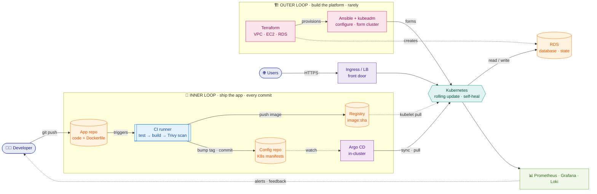
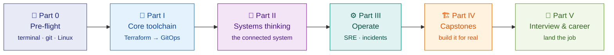

Free · open source · zero to job-ready

# The DevOps Engineer's Handbook

Stop collecting tutorials. <strong>Build the mental model</strong>, run the labs, break production on purpose — and walk into the interview able to <strong>explain the whole stack</strong>.

[:material-console: Enter the simulator](platform/){ .md-button .md-button--primary }
[:material-rocket-launch: Start from zero](00a-preflight.md){ .md-button }
[:material-map: See the curriculum](00-INDEX.md){ .md-button }

  
<b>32</b>Chapters

  
<b>190</b>Flashcards

  
<b>26</b>Real incidents

  
<b>12</b>Chaos drills

  
<b>2</b>Capstones

  
<b>₹0</b>Cost

---

## How all of DevOps fits together

The whole handbook hangs off **one mental model — two reconciliation loops that meet at the Kubernetes cluster.** The **outer loop** builds the platform (Terraform *provisions*; Ansible + kubeadm *configure the nodes and form the cluster*) — rarely, carefully. The **inner loop** ships the app on every commit (App repo → CI → registry → config repo → Argo CD → rolling update). Git is the shared source of truth, **CI never touches the cluster** (it only writes to Git; Argo *pulls*), the database lives **outside** the cluster, and observability closes the loop back to you.

*Two loops, one cluster. **Outer** = build the platform (Pets, rare). **Inner** = ship the app (Cattle, every commit). Git is the shared brain; CI writes to Git and Argo pulls — so CI never holds cluster credentials; the RDS state lives outside the cluster; observability feeds back to the developer.*

> 🇮🇳 **Hinglish intuition:** *Do loop hain — **bahar wala** (Terraform/Ansible) neev + cluster banata (kabhi-kabhi), **andar wala** (App repo→CI→Argo) app rozana bhejta. Dono cluster pe milte hain. Git = sach ka source; CI cluster ko **chhoota nahi** (sirf Git likhta, Argo pull karta); database cluster ke **bahar**; observability wapas feedback deti.* Poora course isi picture ke around hai.

---

## Who this is for

-   :material-swap-horizontal-bold:{ .lg .middle } &nbsp; **Career switchers**

    ---

    Moving into DevOps / SRE / Cloud and tired of scattered tutorials? This is one structured path, start to finish.

-   :material-code-braces:{ .lg .middle } &nbsp; **Developers**

    ---

    You deploy your own code and want to stop being scared of infrastructure, pipelines, and clusters.

-   :material-school:{ .lg .middle } &nbsp; **Students & grads**

    ---

    Preparing for a first role that touches CI/CD, containers, or cloud — with **zero prior knowledge assumed**.

-   :material-lightbulb-on:{ .lg .middle } &nbsp; **The "I still don't get *why*" crowd**

    ---

    You've watched the videos but can't explain how the tools fit. This gives you the **mental model**, not just commands.

---

## Why this handbook is different

-   :material-sitemap:{ .lg .middle } &nbsp; **Systems thinking, not a tool tour**

    ---

    The **2 loops · 8 bridges · 5 golden threads** model is introduced early and referenced in every chapter. Tools are answers to problems, not checklist items.

-   :material-brain:{ .lg .middle } &nbsp; **Built to be remembered**

    ---

    Per-chapter recall gates, hidden quiz answers, ~190 flashcards, and a spaced-review schedule — *padho ek baar, yaad rahe lifetime.*

-   :material-hammer-wrench:{ .lg .middle } &nbsp; **Hands-on throughout**

    ---

    Real labs, real configs, real war-stories. Command cheat-sheets you run with a terminal open. Two full capstone projects.

-   :material-fire:{ .lg .middle } &nbsp; **Production-real**

    ---

    A 26-scenario [**Incident Playbook**](23-production-incident-playbook.md): what actually breaks in prod, and the exact commands to fix it — symptom → diagnose → fix → prevent.

-   :material-account-tie:{ .lg .middle } &nbsp; **Interview & job ready**

    ---

    A 100+ question interview bank, X-vs-Y confusion-busters, resume bullets, a portfolio checklist, and a job-ready self-audit.

-   :material-earth:{ .lg .middle } &nbsp; **Hinglish intuition** 🇮🇳

    ---

    Key ideas reinforced with Hindi/Hinglish memory hooks so abstract concepts snap into place and *stick*.

---

## Your learning journey

**Zero prior knowledge assumed.** Part 0 starts at *"what is a terminal, what is YAML, what is an HTTP request."*

---

## ▶ Start here

-   :material-numeric-0-box:{ .lg .middle } &nbsp; **New to the terminal, Git, or cloud?**

    ---

    Begin at Pre-flight — it covers everything you need before touching any DevOps tool.

    [:octicons-arrow-right-24: 00a — Pre-flight](00a-preflight.md)

-   :material-fast-forward:{ .lg .middle } &nbsp; **Already comfortable with the basics?**

    ---

    Skim the curriculum spine to orient, then dive into Foundations.

    [:octicons-arrow-right-24: Curriculum index](00-INDEX.md)

-   :material-eye:{ .lg .middle } &nbsp; **Just want to browse?**

    ---

    Read *The Connected System*. If its mental model clicks, you'll love the rest.

    [:octicons-arrow-right-24: The connected system](09-connected-system.md)

---

## 🆓 The free, no-credit-card path

Almost everything runs **locally** with [`kind`](https://kind.sigs.k8s.io/) (Kubernetes-in-Docker) — no cloud account needed for Parts 0–IV. An AWS Free Tier account is only for the *optional* cloud capstone, and costs are negligible if you tear resources down promptly. **Nobody is blocked by cost.**

---

## Curriculum at a glance

-   **🛫 Part 0 — Pre-flight**

    ---

    [00a · Terminal, YAML, Git, HTTP, networking](00a-preflight.md) ·
    [00b · Toolchain & AWS setup](00b-setup-runbook.md) ·
    [21 · Linux toolkit](21-linux-toolkit.md)

-   **🧰 Part I — Core toolchain**

    ---

    [01 · Foundations](01-M0-foundations.md) ·
    [02 · Terraform](02-M1-terraform.md) ·
    [03 · Ansible](03-M2-ansible.md) ·
    [04 · Docker](04-M3-docker.md) ·
    [05 · Kubernetes](05-M4-kubernetes-core.md) ·
    [06 · Sizing & cost](06-M5-sizing-and-cost.md) ·
    [07 · CI/CD](07-M6-cicd.md) ·
    [08 · GitOps](08-M7-gitops.md)

-   **🧭 Part II — Systems thinking**

    ---

    [09 · The connected system](09-connected-system.md) ·
    [19 · Follow one commit (hands-on CI/CD)](19-cicd-hands-on-flow.md)

-   **⚙️ Part III — Operate**

    ---

    [10 · Observability & SRE](10-M8-observability-sre.md) ·
    [11 · Advanced K8s internals](11-M9-advanced-k8s-internals.md) ·
    [23 · Production incident playbook](23-production-incident-playbook.md)

-   **🏗️ Part IV — Capstones**

    ---

    [12 · URL Shortener](12-capstone-url-shortener.md) ·
    [13 · MicroShop (microservices)](13-capstone-microshop.md)

-   **🎯 Part V — Interview & career**

    ---

    [14 · Interview bank](14-interview-bank.md) ·
    [20 · Confusions & trade-offs](20-confusions-and-tradeoffs.md) ·
    [22 · Command cheat-sheets](22-command-cheatsheets.md) ·
    [15 · Roadmap](15-roadmap-M11-M18.md) ·
    [16 · Appendix](16-reference-appendix.md) ·
    [17 · Flashcards](17-flashcards.md) ·
    [18 · Job-ready](18-career-job-ready.md)

-   **🔥 Part VI — The Production Gauntlet**

    ---

    [24 · Build the real system](24-production-gauntlet-build.md) ·
    [25 · Chaos engineering — break & fix](25-production-gauntlet-chaos.md)

---

## Use it in three modes (rotate all three)

=== "🧠 Understand"

    Read the chapter, follow the lab, and grasp the **why** — not just the command. Each Part I–III chapter follows the same skeleton, so you always know where to look.

=== "🔁 Recall"

    Hit the recall gate at the top of each chapter and the self-check quiz at the end (answers hidden — expand to reveal). Then run the [flashcard deck](17-flashcards.md) on a spaced schedule.

=== "🎯 Interview"

    Work the [interview bank](14-interview-bank.md) cold, use the [X-vs-Y confusion-busters](20-confusions-and-tradeoffs.md) for the traps, and rehearse the [incident playbook](23-production-incident-playbook.md) out loud.

**Pace:** ~12 weeks part-time (1–2 hrs/day) or ~6 weeks full-time — laid out week-by-week in the [Study Plan](study-plan.md). Track completions in [Progress](progress.md).

---

## What you'll be able to do by the end

-   :material-draw:{ .lg .middle } &nbsp; **Draw the whole stack**

    ---

    Explain how code travels laptop → CI → containers → Kubernetes → production, and where observability fits.

-   :material-cloud-upload:{ .lg .middle } &nbsp; **Deploy end-to-end**

    ---

    Dockerfile → Helm/Kustomize → GitOps pipeline → a live, observable service with zero-downtime rollouts.

-   :material-bug-check:{ .lg .middle } &nbsp; **Debug real incidents**

    ---

    Use metrics, logs, and traces together; roll back safely; run a blameless post-mortem.

-   :material-account-check:{ .lg .middle } &nbsp; **Ace the interview**

    ---

    Confident across Terraform, Docker, Kubernetes, CI/CD, GitOps, observability, and systems design.

→ Full job-ready checklist: [**18 — Career & Job-Ready**](18-career-job-ready.md)

---

## License & provenance

Consolidated from ~20 personal study docs, lab notes, and interview-prep notes — all preserved in [`_source-archive/`](https://github.com/grvtech1/devops-handbook/tree/main/_source-archive). Published in the hope it saves the next learner weeks of hunting for the right mental model.

**License:** [CC BY 4.0](https://github.com/grvtech1/devops-handbook/blob/main/LICENSE) — free to use, share, and adapt with attribution. **Contributions welcome** — found a typo or a concept that could be clearer? Open an issue or PR. 🙏
